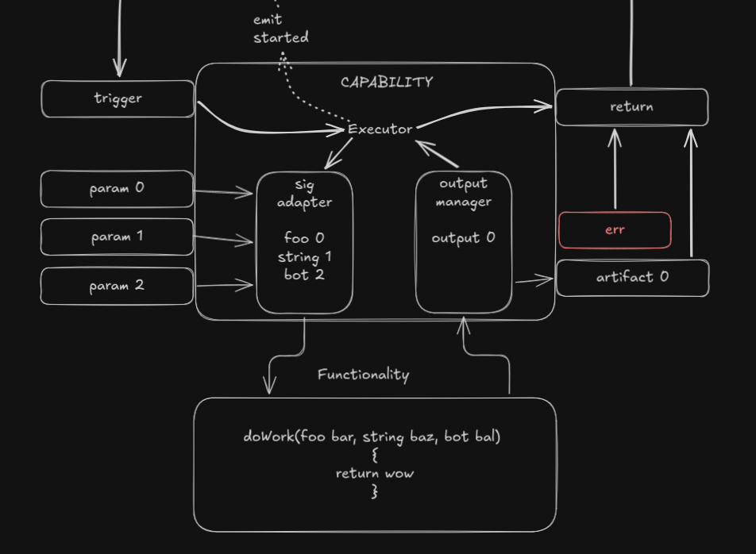

# Capability 



A capability is a domain-owned contract for one typed unit of behavior.
It is the durable boundary between domain functionality and orchestration.
In HTN language, it is closest to an atomic task, but the durable abstraction here is the contract, not the executor internals.

Capability execution should be stateless with respect to durable task artifacts.
Capabilities do not own artifact persistence, retry history, or task-scoped run records.
Those belong above the capability boundary.

Examples include `merkle_traversal`, `context_generate_prepare`, `provider_execute_chat`, and `context_generate_finalize`.
To surface that functionality to task compilation and later control execution, the domain publishes an explicit capability contract with stable identity, scope, bindings, inputs, outputs, and effects.

The concrete capability still lives under the owning domain, such as `context`.
The common shape described here gives `capability`, `task`, and `control` one shared vocabulary.

## Contract Shape

The first slice should treat a capability contract as a declarative record.
That record should be rich enough for graph compilation and simple enough to stay above function-signature details.

```rust
struct CapabilityTypeContract {
    capability_type_id: CapabilityTypeId,
    capability_version: CapabilityVersion,
    owning_domain: DomainId,
    scope_contract: ScopeContract,
    binding_contract: Vec<BindingSpec>,
    input_contract: Vec<InputSlotSpec>,
    output_contract: Vec<OutputSlotSpec>,
    effect_contract: Vec<EffectSpec>,
    execution_contract: ExecutionContract,
}
```

### Identity

- `capability_type_id`
- `capability_version`
- `owning_domain`

Identity must be stable across compiled tasks and execution records.
Versioning belongs on the contract, not buried in implementation details.

### Scope Contract

- `scope_kind`
- `scope_ref`
- scope validation rules
- optional scope fan-out policy

Scope tells orchestration where the capability is valid.
Examples include workspace, node, thread, turn, frame, or Merkle tree scope.

### Binding Contract

- required named bindings
- binding value kind such as literal, config ref, policy ref, agent ref, or provider ref
- validation rules
- whether the binding affects deterministic identity

Bindings cover non-artifact inputs that still matter to execution and compiled task identity.
Examples include provider choice, agent choice, generation policy, and traversal strategy.

### Input Contract

- input slot id
- accepted artifact type ids
- artifact schema version range
- required or optional
- one or many cardinality

Input slots are how upstream outputs become downstream requirements.
This is the part task compilation and later control execution use for artifact handoff validation.

### Output Contract

- output slot id
- artifact type id
- artifact schema version
- guaranteed or conditional

Output slots are explicit produced artifacts.
They replace hidden return-shape assumptions.

### Effect Contract

- effect kind such as read, write, append, emit, or acquire
- effect target such as active head, frame store, workflow state, or telemetry bus
- exclusivity rule when ordering matters without artifact flow

Not every dependency is an artifact dependency.
For score 5 and 4 runtime capabilities, effect metadata is what lets task compilation and later control ordering reason about writes such as `FrameWrite`, `HeadSet`, and `WorkflowStateWrite` without leaking storage internals into the graph.

### Execution Contract

- execution class such as inline, queued, or session-scoped
- completion semantics
- retry class
- cancellation support when relevant

This section describes execution-facing behavior at the contract level.
It should not expose adapter internals or transport details.

## Task Hooks

The contract must give `task` clear hooks in both directions:

- task-to-capability ingress through named input slots and named bindings
- capability-to-task egress through named output slots and declared effects

That means task compilation should be able to answer these questions without reading domain internals:

- which task init values may satisfy capability inputs
- which upstream artifact outputs may satisfy capability inputs
- which outputs become reusable artifacts for downstream capability instances
- which effects require ordering even when no artifact handoff exists

The current `BoundCapabilityInstance` projection in [Capabilities by domain](by_domain.md) is the right instance-level shape for that handoff.
The important rule is that task binds the contract through slot wiring and binding values.
It does not bind to helper functions, storage structs, or provider adapters.

## Invocation Boundary

The design needs one more layer between a bound capability instance and the underlying domain function chain.

That layer is the invocation boundary:

- `task` or another caller should send one unified invocation payload
- the domain-owned runtime object should hold the static and bound capability state
- the sig adapter should resolve invocation payload values into internal function arguments

This keeps the split clean:

- bound instance owns static scope, wiring, and chosen bindings
- invocation payload owns dynamic supplied values for one call
- sig adapter owns internal argument shaping
- underlying functionality stays private to the domain

### Runtime Initialization

Capability runtime initialization should happen from a bound capability instance plus domain services.
This is not a task graph concern.
It is the moment when the domain turns a published contract into an executable runtime object.
The durable initialization package remains structured data only.
Any live service objects stay behind the domain boundary.

Recommended shape:

```rust
struct CapabilityRuntimeInit {
    capability_instance_id: CapabilityInstanceId,
    capability_type_id: CapabilityTypeId,
    capability_version: CapabilityVersion,
    scope_ref: ScopeRef,
    scope_kind: ScopeKind,
    binding_values: Vec<BindingValue>,
    input_contract: Vec<InputSlotSpec>,
    output_contract: Vec<OutputSlotSpec>,
    effect_contract: Vec<EffectSpec>,
    execution_contract: ExecutionContract,
}
```

This initialization package should be enough for the domain to build:

- a capability runtime object
- a sig adapter configured for that capability instance
- any domain-local helper objects needed behind the boundary

### Unified Invocation Payload

The caller should not send internal function arguments.
The caller should send a payload package keyed by the published capability surface.

Recommended shape:

```rust
struct CapabilityInvocationPayload {
    invocation_id: CapabilityInvocationId,
    capability_instance_id: CapabilityInstanceId,
    supplied_inputs: Vec<SuppliedInputValue>,
    upstream_lineage: Option<UpstreamLineage>,
    execution_context: CapabilityExecutionContext,
}

struct SuppliedInputValue {
    slot_id: InputSlotId,
    source: InputValueSource,
    value: SuppliedValueRef,
}

enum InputValueSource {
    InitPayload,
    ArtifactHandoff,
}
```

The important property is that `supplied_inputs` are still external values.
They are not the eventual domain function arguments.
They are also not process-local object references.

Field ownership is intentionally split:

- `capability_instance_id` comes from task compilation
- `invocation_id` comes from task runtime when one attempt is materialized
- `supplied_inputs` come from task payload assembly over init data and artifact repo data
- `upstream_lineage` is assembled by task and may be enriched by control
- `execution_context` is primarily runtime dispatch context contributed by control and task

### Sig Adapter Role

The sig adapter should consume:

- the initialized runtime object
- the bound input contract for the capability instance
- the invocation payload for one call

And it should produce:

- validated slot satisfaction
- resolved internal argument values for the underlying function chain
- a domain-local call plan when one capability wraps several internal steps

Recommended posture:

```rust
struct SigAdapterInput {
    runtime_init: CapabilityRuntimeInit,
    invocation: CapabilityInvocationPayload,
}

struct SigAdapterOutput {
    resolved_arguments: Vec<ResolvedArgumentValue>,
    invocation_metadata: InvocationMetadata,
}
```

`task` should never construct `ResolvedArgumentValue`.
That is domain-private.
Those resolved arguments may include process-local helpers or service objects, but only inside the domain runtime.

### Why This Fits The Capability Model

This split preserves the two different kinds of input the picture distinguishes:

- external artifact supply and init supply
- internal function argument management

The first kind is task-facing and uniform.
The second kind is domain-facing and capability-specific.

That is the right abstraction line for the first slice.

## Observability And Logging

Capability should align to the current application observability model:

- structured telemetry events for execution facts
- structured `tracing` logs for operator diagnostics

Capability does not own durable artifact truth or task progression truth.
That means capability events should describe one atomic invocation and any domain-specific execution stages inside it.
Task remains the owner of durable invocation records and artifact persistence.

### Capability Event Role

Capability runtime should emit atomic execution facts that fit inside the shared telemetry envelope:

```rust
struct ProgressEvent {
    ts: String,
    session: String,
    seq: u64,
    event_type: String,
    data: serde_json::Value,
}
```

These events should be useful for progress rendering, operator inspection, and cross-domain debugging.
They should not be the authoritative persistence layer for artifacts, retries, or readiness.

### Capability Event Families

The base capability event family should be small:

- `capability_invocation_started`
- `capability_invocation_completed`
- `capability_invocation_failed`

Domains may add more specific inner-stage events when they expose meaningful execution boundaries.
The provider path already shows this shape with events such as:

- `provider_request_sent`
- `provider_response_received`
- `provider_request_failed`

That is the right model.
The generic capability family gives task and control a uniform cross-domain view, while domain-specific events expose deeper timing and failure detail where useful.

### What Capability Events Should Carry

Capability event payloads should carry:

- `task_id` and `task_run_id` when the invocation happens inside a task
- `capability_instance_id`
- `capability_type_id`
- `invocation_id`
- `attempt_index` when available
- `duration_ms` for completion or failure events
- normalized failure summary when execution fails

Capability events may also carry domain-specific summary fields such as message count, provider name, or output artifact count.
They should not carry full prompt bodies, full artifact bodies, or process-local helper details.

### Logging Posture

Capability logs should use structured `tracing` fields and stay focused on diagnostics at the capability boundary.

Recommended level posture:

- `info` for invocation start and completion boundaries
- `debug` for slot satisfaction summaries, sig adapter decisions, and compact output-shaping summaries
- `warn` for recoverable anomalies such as conditional output omission or degraded fallback
- `error` for invocation failure or output validation failure

Capability logs should prefer identifiers and compact counts over raw payload bodies.
When a log line needs to correlate with task records, it should include stable fields such as `capability_instance_id`, `invocation_id`, `task_run_id`, and `capability_type_id`.

Capability logs should never become the only record of invocation success or failure.
If a fact matters to reducers, progress views, retry reasoning, or audit, it belongs in telemetry or durable task records, not only in logs.

## Appropriate Abstraction Level

The contract should describe what orchestration must know, not how the domain code is implemented.

- good level: typed scope, typed bindings, typed input slots, typed output slots, declared effects
- too low: raw function signatures, adapter helper objects, storage structs, transport handles
- too high: one vague `run` shape that hides artifact compatibility and ordering rules

For the first slice, score 5 and 4 capabilities should converge on this one shared shape.
That gives task compilation and later control execution one uniform model for the runtime critical path without forcing lower-value admin capabilities into the same maturity level on day one.

## Publication Rule

Not every useful domain operation should be published as a first-slice task-facing capability.

Publish a task-facing capability when the behavior:

- has inputs and outputs that are meaningful to `task`
- has an effect boundary that `control` may need to order
- may be scheduled independently from neighboring behavior
- is stable enough to serve as a durable cross-domain contract

Keep behavior internal when it is only:

- a helper step inside one atomic seam
- provider or storage setup behind another capability
- metadata shaping with no separate scheduling value
- compatibility glue for old entry paths

This is the main guardrail against overfitting capability publication to current code layout.
For the first slice, the task-facing surface should stay closer to durable atomic seams than to every helper step on the current runtime path.

## Runtime Note

Concepts such as trigger, payload manager, function adapter, and output manager can still exist as implementation helpers inside a domain.
They should not be the durable contract surface consumed by task compilation or control.

## See Also

- [Capabilities by domain](by_domain.md) — section-per-domain sketch of future `src/<domain>/capability.rs` surfaces
- [Workspace Resolve Node Id](workspace_resolve_node_id/README.md) — structured task-facing target resolution contract
- [Merkle Traversal](../../completed/capability_refactor/merkle_traversal/README.md) — structured traversal contract and emitted batch artifact examples
- [Context Generate Prepare](context_generate_prepare/README.md) — structured preparation inputs and provider-request outputs
- [Provider Execute Chat](provider_execute_chat/README.md) — structured provider execution inputs and normalized result outputs
- [Context Generate Finalize](context_generate_finalize/README.md) — structured finalization inputs and generated artifact outputs
- [Domain Architecture](../domain_architecture.md) — current module boundary direction for capability and task
- [Control Design](../../control/README.md) — higher-order owner of plan and graph execution
