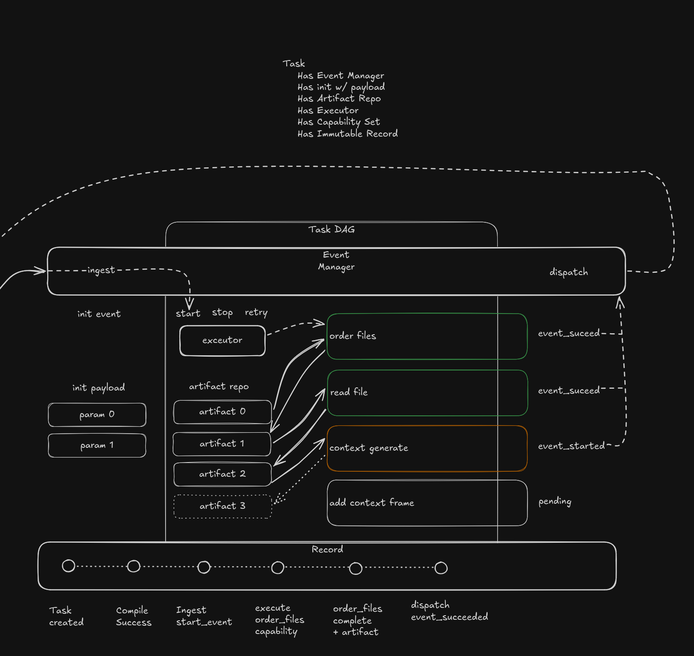

# Task Design

Date: 2026-04-04
Status: active
Scope: task owned persistence, artifact repo behavior, and runtime boundary above atomic capabilities




## Intent

Define what `task` owns once capability contracts are in place and artifacts become the durable handoff language.

The key decision is:

- capability is a stateless, non-persistent execution boundary
- task owns durable artifact persistence and task-scoped execution records
- task owns task-local execution progression through one compiled task
- control owns task-network orchestration, repair decisions, and retry intent

This keeps the abstraction line clean.
Capabilities execute against structured inputs and produce structured outputs.
Tasks preserve those inputs and outputs durably across invocations, retries, and replay.

For the current docs-writer interregnum, also see [Docs Writer Projection Audit](docs_writer_projection_audit.md) and [Task Expansion Plan](task_expansion_plan.md).

## Core Position

`task` is not a second orchestrator.
It should not own ready sets, dispatch order, continuation, or repair state.

`task` does own:

- compiled capability graph structure
- task-scoped artifact repo
- initial input persistence
- emitted artifact persistence
- capability invocation records
- task-local attempt lineage for capability runs
- task-local artifact lookup for downstream slot satisfaction
- one task-local executor that advances capability execution inside the task

That means task is the durable data plane for capability execution, while control is the durable coordination plane.

## Task Creation Boundary

Task initialization should be split into two distinct stages:

1. compile time
   - create and validate the compiled task graph
2. run creation time
   - create one live task instance with seed artifacts and execution records

This split matters because graph construction errors and runtime initialization errors are different classes of failure.

### Compile Time

Compile time consumes authored task input plus the capability catalog.
Its job is to produce a valid `CompiledTaskRecord` or a compile error.

Compile time should:

- load and normalize the authored task definition
- resolve capability type ids through the capability catalog
- create bound capability instances
- derive dependency edges from declared inputs, outputs, and effect rules
- validate slot compatibility
- validate required bindings
- validate that required init-supplied inputs are satisfiable
- emit one locked compiled task record

If any of those steps fail, live task creation should not begin.

### Run Creation Time

Run creation time starts only after compilation succeeds.

Its job is to create one live task instance from:

- one `CompiledTaskRecord`
- one task initialization payload
- one empty or newly created task-scoped artifact repo
- one initial task event or execution request from control

Run creation should:

- create a stable `task_run_id`
- create the task artifact repo
- persist initialization artifacts into that repo
- create initial invocation and attempt lineage state
- construct one `TaskExecutor` for that live task instance

## Graph Creation And Error Boundary

The graph should be created at compile time, not at first execution.

That means:

- dependency edges are part of the compiled task record
- capability instance identities are fixed before execution begins
- slot compatibility errors are compile errors
- missing required seed inputs are compile-time or run-creation validation errors depending on what is missing

Use this split:

- compile error
  - the task definition is invalid or unsatisfiable in principle
- run creation error
  - the compiled task is valid, but required external initialization data was not supplied for this run
- invocation error
  - one specific capability run failed after the task was created successfully

This keeps task creation honest and avoids hiding graph problems inside live execution.

## Required Task Initialization Payload

A live task instance should require one structured initialization payload.

Recommended shape:

```rust
struct TaskInitializationPayload {
    task_id: TaskId,
    compiled_task_ref: CompiledTaskRef,
    init_artifacts: Vec<InitArtifactValue>,
    task_run_context: TaskRunContext,
}

struct InitArtifactValue {
    slot_id: TaskInitSlotId,
    artifact_type_id: ArtifactTypeId,
    schema_version: SchemaVersion,
    content: serde_json::Value,
}
```

The important point is that task initialization payload is structured data only.
It is the seed material for the artifact repo, not an in-process object bundle.

## Seed Artifacts

The task initialization payload should provide the external data needed before any capability output exists.

These are seed artifacts.

Typical seed artifact families include:

- user supplied target selector
- workspace or run policy input
- operator supplied configuration refs
- initial observation context from outside the task
- explicitly supplied replay or force posture

For the first capability in a task chain, seed artifacts are what later become `supplied_inputs`.
The task executor retrieves them from the artifact repo and injects them into capability invocation payloads.

## What A Task Needs To Be Created

At minimum, a live task needs:

- a compiled task graph
- a valid task initialization payload
- an artifact repo created for that task run
- a capability catalog compatible with the compiled task
- control intent to create or start the task run

If any of these are missing, the task should not transition into execution.

## Docs Writer Example

For a docs writer style task, creation would look like:

1. compile the task definition into:
   - `WorkspaceResolveNodeId`
   - `MerkleTraversal`
   - one or more generation capability regions
   - dependency edges based on declared artifact requirements
2. create the live task run with seed artifacts such as:
   - `target_selector`
   - optional traversal strategy override
   - optional force posture
3. persist those seed artifacts into the task artifact repo
4. let the task executor resolve the first ready capability from that repo state

The key point is that the first capability does not get external values directly from control.
It gets them through task-owned seed artifacts.

## Artifact Repo

Every compiled task instance should have an `ArtifactRepo`.

The repo is the task-owned durable store for:

- task initialization inputs
- artifacts emitted by capability invocations
- summaries needed for downstream wiring
- failure outputs when a capability run does not emit its normal outputs

The repo is the bridge between:

- structured external data at task start
- structured artifacts emitted across capability runs
- structured invocation payloads for later capability calls

### Artifact Repo Rules

- artifact repo is task scoped
- artifact repo persists structured data only
- artifact repo never stores process-local object references
- artifact repo records producer lineage for every emitted artifact
- artifact repo supports lookup by artifact id, producer invocation, output slot, and consumer input slot compatibility
- artifact repo is append oriented
- replacement or supersession should be recorded explicitly, not hidden by mutation

### Minimum Artifact Families

The first slice should support these artifact families:

- initialization input artifacts
- capability output artifacts
- observation summary artifacts
- effect summary artifacts
- failure summary artifacts when execution does not emit normal outputs

## Ownership Split

### Capability owns

- published contract shape
- runtime initialization from bound instance plus domain services
- sig adapter resolution from task-facing payload into internal arguments
- atomic domain execution
- raw output shaping into declared artifacts and effects

### Task owns

- compiled capability graph record
- artifact repo and artifact persistence semantics
- task-local readiness evaluation over compiled graph plus artifact repo
- task-local capability triggering
- invocation payload assembly from initial inputs and upstream artifacts
- invocation record persistence
- emitted artifact persistence
- attempt history within task scope
- stable lineage between artifacts, invocations, and capability instances

### Control owns

- task-network dispatch
- task-network ordering across tasks
- retry intent
- repair and continuation
- task network state

This means control may decide that another attempt should happen, while task performs that attempt inside task scope and preserves its records.

## Task Executor

Each live task instance should have one `TaskExecutor`.

`TaskExecutor` is the task-local orchestrator that propels task progress.
It does not do domain work itself.
It selects and triggers capabilities inside one task by operating over:

- the compiled capability graph
- the task artifact repo
- the task invocation history
- control supplied retry or dispatch intent

### Task Executor Owns

- selecting next ready capability instances inside one task
- assembling capability invocation payloads
- triggering capability runtime execution
- recording invocation start and completion
- persisting emitted artifacts
- reevaluating task-local readiness after new artifacts land

### Task Executor Does Not Own

- provider transport internals
- prompt rendering
- frame persistence internals
- task-network state
- repair policy
- cross-task scheduling

So the executor is an orchestrator, but only at task scope.
It is not the higher-order control layer.

## Invocation And Persistence Flow

The first slice flow should be:

1. control dispatches one task instance for execution or continuation
2. task executor selects one or more ready capability instances inside that task
3. task executor loads the bound capability instance data and relevant artifact repo entries
4. task executor initializes or reacquires capability runtime objects from bound static data
5. task executor assembles one `CapabilityInvocationPayload` per selected capability invocation
6. capability runtime resolves that payload through the sig adapter
7. capability executes and returns structured outputs, effects, or failure summary
8. task executor persists invocation records and emitted artifacts into the artifact repo
9. task executor reevaluates task-local readiness
10. control consumes emitted task events and decides what happens next at task-network scope

This preserves the key boundary:

- capability does not own durable output storage
- task does not own internal function execution

## Retry Model

Capability failure does not imply capability-owned retry.

Instead:

- capability returns structured failure output
- task persists that failure as part of invocation history
- control decides whether retry, resequencing, repair, or stop is appropriate
- task executes the chosen retry inside task scope by creating the next invocation attempt

Retry may be expressed in more than one way:

- re-invoke the same capability instance with a new invocation id
- create a new capability instance record inside the same task when duplication is useful
- recompile or modify task structure at a higher control boundary

The important rule is that the artifact repo remains task-owned across these choices.
That repo is what preserves continuity between attempts.

This yields a clean split:

- control decides that retry should occur
- task executor executes the retry path and records the resulting attempt lineage
- capability executes one atomic invocation only

## Event Posture

Task should emit structured execution events through the existing application telemetry path.
The current application already uses one append-only event envelope with stable metadata and typed payload data.
Task design should align to that shape rather than inventing a second event transport.

Recommended envelope:

```rust
struct ProgressEvent {
    ts: String,
    session: String,
    seq: u64,
    event_type: String,
    data: serde_json::Value,
}
```

For task, those events are durable execution facts for reduction and operator inspection.
They are not the source of truth for artifact existence or invocation history.
The artifact repo and invocation records remain authoritative.

### Task Event Families

The first task event family should stay aligned with control:

- `task_requested`
- `task_started`
- `task_progressed`
- `task_blocked`
- `task_artifact_emitted`
- `task_succeeded`
- `task_failed`
- `task_cancelled`

Task executor is the producer for these events inside one live task run.
Control consumes them to drive task-network state.

### What Task Events Should Carry

Task event payloads should carry stable structured identifiers and summary fields such as:

- `task_id`
- `task_run_id`
- `capability_instance_id` when one capability invocation is involved
- `invocation_id` when one concrete attempt is involved
- `artifact_id` and `artifact_type_id` for emitted artifact facts
- `attempt_index`
- `ready_count`, `running_count`, or `blocked_reason` when state changes need explanation
- `duration_ms` and normalized error summary when execution finishes

These payloads should point to durable task records.
They should not duplicate full artifact bodies, prompt bodies, or provider payloads.

### Task Event Timing

Task should emit events at these boundaries:

- when a task run is created from a compiled task plus initialization payload
- when task execution begins or resumes
- when one or more capability invocations are released from the ready set
- when new artifacts are durably persisted into the artifact repo
- when task readiness changes from running to blocked, or from blocked to ready
- when the task reaches terminal success, failure, or cancellation

This gives control enough information to reduce task-network state without forcing control to inspect task internals directly.

### Example Task Event

```json
{
  "ts": "2026-04-04T22:31:14.118Z",
  "session": "sess_01JQZZR6N5AQ8J4VMEQ9Z2X4PH",
  "seq": 41,
  "type": "task_artifact_emitted",
  "data": {
    "task_id": "task_docs_writer",
    "task_run_id": "taskrun_01JQZZR0P7QAXA7MEV2F7H0J2M",
    "capability_instance_id": "capinst_ctx_finalize_pkg_a",
    "invocation_id": "invk_01JQZZR62SE0V2WX6R8FJ9K71T",
    "artifact_id": "artifact_readme_summary_pkg_a",
    "artifact_type_id": "readme_summary",
    "attempt_index": 1
  }
}
```

## Logging Posture

Task should use structured `tracing` logs for operator diagnostics and local debugging.
Those logs should complement telemetry events, not replace them.

Use this split:

- telemetry events for durable execution facts that reducers and progress views may consume
- invocation records and artifact repo state for durable task truth
- logs for human diagnostics, timing clues, and unexpected conditions

Recommended level posture:

- `info` for task start, resume, block, completion, and cancellation boundaries
- `debug` for ready-set recomputation summaries, artifact match decisions, and invocation assembly details
- `warn` for recoverable anomalies such as duplicate artifact emission attempts or partially satisfiable inputs
- `error` for terminal task failures or persistence failures

Task logs should prefer stable identifiers over large payload bodies.
Log lines should carry fields such as `task_run_id`, `task_id`, `capability_instance_id`, `invocation_id`, and `artifact_id` so operators can join logs back to telemetry and durable records.

Task logs should not include full prompt bodies, artifact bodies, or provider response content by default.
If a deeper dump is ever needed, it should be explicitly gated behind a higher debug posture and redaction rules.

## Recommended Task Records

The first slice task domain should define durable records similar to:

```rust
struct CompiledTaskRecord {
    task_id: TaskId,
    task_version: TaskVersion,
    capability_instances: Vec<BoundCapabilityInstance>,
    dependency_edges: Vec<TaskDependencyEdge>,
    artifact_repo_ref: ArtifactRepoRef,
}

struct ArtifactRepoRecord {
    repo_id: ArtifactRepoId,
    artifacts: Vec<ArtifactRecord>,
    artifact_links: Vec<ArtifactLinkRecord>,
}

struct CapabilityInvocationRecord {
    invocation_id: CapabilityInvocationId,
    capability_instance_id: CapabilityInstanceId,
    supplied_inputs: Vec<SuppliedInputRecord>,
    emitted_artifacts: Vec<ArtifactId>,
    failure_summary: Option<FailureSummaryArtifact>,
    attempt_index: u32,
}
```

The exact Rust shapes can change.
The ownership line should not.

One useful execution-facing shape would be:

```rust
struct TaskExecutor {
    task_id: TaskId,
    artifact_repo_ref: ArtifactRepoRef,
    compiled_task_ref: CompiledTaskRef,
}
```

The important point is not the exact type.
It is that one task-local execution agent advances capability progress without absorbing domain execution concerns.

## Relation To Invocation Payload

Task should assemble invocation payloads only from:

- bound capability instance data
- task initialization data
- artifact repo entries
- control supplied execution context and lineage

Task should not assemble:

- raw function arguments
- service handles
- clients
- storage objects

Those remain inside capability runtime initialization and sig adapter resolution.

## Ownership Of Invocation Fields

The invocation payload contains several fields that should not all be treated the same way.
Their ownership is split across compile time, task runtime, and control runtime.

### `capability_instance_id`

Owner:

- task compilation

Meaning:

- stable identity of one bound capability instance inside the compiled task graph

Rule:

- generated when the compiled task record is created
- persisted as part of the compiled task structure
- reused across multiple invocation attempts for the same capability instance unless control explicitly chooses duplication

### `invocation_id`

Owner:

- task runtime

Meaning:

- stable identity of one concrete capability invocation attempt

Rule:

- generated when task materializes one invocation payload for execution
- unique per attempt
- persisted in the capability invocation record and linked to all emitted artifacts
- a retry should usually get a fresh `invocation_id`

### `supplied_inputs`

Owner:

- task runtime

Meaning:

- concrete structured values selected for this one invocation

Rule:

- assembled from task init artifacts and artifact repo entries
- validated against the bound input contract before dispatch
- never contain raw object pointers or service handles

### `upstream_lineage`

Owner:

- task runtime assembles it
- control runtime contributes orchestration lineage fields when available

Meaning:

- the structured explanation of where this invocation sits in task and control execution history

Rule:

- task should always be able to provide task-local lineage such as `task_id`, `task_run_id`, prior artifact producer lineage, and attempt lineage
- control may add higher-order dispatch context such as batch index, ready-set release index, repair scope, or continuation lineage
- capability consumes it as context only and does not own or define it

### `execution_context`

Owner:

- control runtime defines dispatch context
- task runtime materializes task-local execution details into the payload

Meaning:

- ephemeral execution metadata for this one call

Rule:

- should include values such as attempt count, trace id, deadline, cancellation key, and dispatch priority when relevant
- should not become the durable source of artifact lineage
- may be partially persisted in invocation records when useful for audit, but its primary role is execution-time context

## Practical Assembly Rule

In practice, the assembly split should be:

1. compiler creates `capability_instance_id`
2. task executor creates `invocation_id`
3. task executor loads and injects `supplied_inputs` from the artifact repo
4. task executor assembles task-local `upstream_lineage`
5. control runtime contributes dispatch-facing `upstream_lineage` fields and `execution_context`
6. task executor emits the final invocation payload to the capability runtime

This means the answer to "does task generate these" is:

- yes for `invocation_id`
- yes for the task-local portion of `upstream_lineage`
- yes for `supplied_inputs`
- no for `capability_instance_id`, which comes from compilation
- partially for `execution_context`, which is shared with control

## Consequences

- replay becomes straightforward because task has the durable input and output record
- retries can use the same or a fresh capability runtime without changing the task boundary
- capabilities remain easy to test because they accept structured invocation payloads
- task fixtures become realistic because they include artifact repo state, not in-process helpers
- provider, context, and traversal domains stay free to change internal helper objects without breaking task persistence

## Read With

- [Capability Model](../capability/README.md)
- [Capabilities By Domain](../capability/by_domain.md)
- [Docs Writer Package](docs_writer_package.md)
- [Task Control Boundary](../task_control_boundary.md)
- [Domain Architecture](../domain_architecture.md)
- [Control Design](../../control/README.md)
- [Task Network](../../control/task_network.md)
