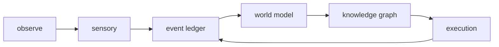

# Cognitive Architecture

Date: 2026-04-22
Status: active
Scope: full loop design for sensory, world model, execution, and shared temporal coordination

## Thesis

This area defines the system as an open-world loop rather than a task-only executor.

The durable positions are:

- the full world model is never fully known
- observation is continuous and diff-native
- the world model integrates observations into temporal graph and belief views
- execution acts against the current world model and republishes outcomes
- events are the shared temporal substrate across all concerns

## Boundary

`cognitive_architecture` is not a replacement for `goals`, `control`, `task`, `capability`, or `provider`.

This area does own:

- the cross-domain loop definition
- the sensory and world-model seams that do not yet have durable homes
- the world-model requirement that action be grounded in current belief
- the event requirements needed for genuine multi-process coordination

## Crate Routing

`CRATE.md` files map design ownership to the multi-crate code direction.

- [Core Crate](core/CRATE.md)
  root `meld` orchestration, CLI, config, context and provider adapters, compatibility, and runtime wiring
- [Events Crate](events/CRATE.md)
  `meld-events` event ledger, append, replay, sequence, and reference contracts
- [World Model Crate](world_state/CRATE.md)
  `meld-world-model` graph, anchors, provenance, belief, and planner-facing views
- [Execution Crate](execution/CRATE.md)
  `meld-execution` planning, control, task, capability, workflow, and provider execution

## Durable Structure

- [Crate Split Implementation Plan](PLAN.md)
  phased implementation order, gates, and dependency closure for the crate split
- [Observe Merge Push](observe_merge_push.md)
  founding prompt and response index
- [Microarchitecture Assessment By Domain](microarchitecture_assessment_by_domain.md)
  domain impact review for separating events, world model, and execution responsibilities
- [Knowledge Graph ECS Decision Memo](world_state/belief/knowledge_graph_ecs_decision_memo.md)
  ECS evaluation for curation internals, migration cost, and recommendation
- [Sensory Domain](sensory/README.md)
  continuous observation and diff publication
- [Sensory Substrate](sensory/substrate.md)
  stream compilation, lowering, and promotion in `sensory`
- [World Model Domain](world_state/README.md)
  canonical current belief, graph projection, and world-model ownership
- [World Model Graph](world_state/graph/README.md)
  current anchor selection, lineage, provenance, and graph walk
- [Temporal Fact Graph](world_state/graph/temporal_fact_graph.md)
  canonical graph model for the graph layer and event-driven materialization
- [Graph Implementation Plan](world_state/graph/implementation_plan.md)
  phased implementation path for contracts, reducers, indexes, and planner-facing graph reads
- [Workspace FS Graph Transition Requirements](world_state/graph/workspace_fs_transition_requirements.md)
  compatibility requirements, code touchpoints, and phased lift of `workspace_fs` into graph inputs
- [Branch Federation Substrate](world_state/graph/branch_federation_substrate.md)
  canonical branch abstraction, workspace as the first branch kind, and implementation plan for federation
- [Root Federation Runtime](world_state/graph/root_federation_runtime.md)
  runtime discovery, safe migration, and user trigger flow for pre existing workspace roots
- [World Model Belief](world_state/belief/README.md)
  confidence, revision, contradiction, and settlement over current anchors
- [Belief Microarchitecture](world_state/belief/microarchitecture.md)
  event, world model, and execution boundaries for belief
- [Fact To Belief](world_state/belief/fact_to_belief.md)
  transition from event facts and graph anchors into evidence, belief revision, and planner view
- [Comparator Model](world_state/belief/comparator_model.md)
  Bayesian comparators, rule comparators, semantic settlement, and missing comparator policy
- [Belief Substrate](world_state/belief/substrate.md)
  event-driven curation runtime, leases, recovery, staleness, and storm handling
- [Curation In Belief](world_state/belief/curation.md)
  merge activity and natural runtime inside `world_state/belief`
- [Knowledge Graph ECS Decision Memo](world_state/belief/knowledge_graph_ecs_decision_memo.md)
  ECS evaluation for curation internals, migration cost, and recommendation
- [Execution Domain](execution/README.md)
  world-model-aware action aligned with current execution design
- [Execution Substrate](execution/substrate.md)
  planning and deliberate action substrate for `execution`
- [Execution Control](execution/control/README.md)
  control as the coordination layer inside `execution`
- [Execution Planning](execution/control/planning/README.md)
  HTN, planning, repair, and synthesis inside `execution`
- [Events Design](events/README.md)
  shared event architecture, replay, sequencing, and telemetry refactor path
- [Further Research Prompts](further_research_prompts.md)
  research queue for unresolved questions

## Read Order

1. [Observe Merge Push](observe_merge_push.md)
2. [Microarchitecture Assessment By Domain](microarchitecture_assessment_by_domain.md)
3. [Crate Split Implementation Plan](PLAN.md)
4. [Knowledge Graph ECS Decision Memo](world_state/belief/knowledge_graph_ecs_decision_memo.md)
5. [Sensory Domain](sensory/README.md)
6. [Sensory Substrate](sensory/substrate.md)
7. [World Model Domain](world_state/README.md)
8. [World Model Graph](world_state/graph/README.md)
9. [Temporal Fact Graph](world_state/graph/temporal_fact_graph.md)
10. [Graph Implementation Plan](world_state/graph/implementation_plan.md)
11. [Workspace FS Graph Transition Requirements](world_state/graph/workspace_fs_transition_requirements.md)
12. [Branch Federation Substrate](world_state/graph/branch_federation_substrate.md)
13. [Root Federation Runtime](world_state/graph/root_federation_runtime.md)
14. [World Model Belief](world_state/belief/README.md)
15. [Belief Microarchitecture](world_state/belief/microarchitecture.md)
16. [Fact To Belief](world_state/belief/fact_to_belief.md)
17. [Comparator Model](world_state/belief/comparator_model.md)
18. [Belief Substrate](world_state/belief/substrate.md)
19. [Curation In Belief](world_state/belief/curation.md)
20. [Knowledge Graph ECS Decision Memo](world_state/belief/knowledge_graph_ecs_decision_memo.md)
21. [Execution Domain](execution/README.md)
22. [Execution Substrate](execution/substrate.md)
23. [Execution Control](execution/control/README.md)
24. [Execution Planning](execution/control/planning/README.md)
25. [Events Design](events/README.md)
26. [Further Research Prompts](further_research_prompts.md)

## Read With

- [Execution Control](execution/control/README.md)
- [Events Design](events/README.md)
- [Multi-Domain Event Ledger](events/multi_domain_spine.md)
- [Bayesian Evaluation Example](execution/examples/bayesian_evaluation.md)
- [Synthesis Overview](execution/control/synthesis/README.md)
- [Goals](../goals/README.md)
