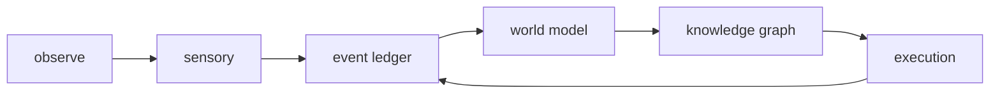

# Cognitive Architecture

Date: 2026-04-22
Status: active
Scope: canonical declarative design intent for meld across sensory, world model, execution, and shared temporal coordination

## Canonical Role

This directory is the canonical declarative design intent for meld.

It states what the system is meant to become, the durable domain boundaries, and the contracts that implementation plans and code should converge toward. Other design areas may hold implementation sequencing, completed historical specs, experiments, or compatibility notes, but they should defer to this directory when they conflict with current architecture intent.

Use this directory to answer these questions:

- what domains exist
- what each domain owns
- what contracts cross domain boundaries
- what runtime loop the product is intended to express
- which crate owns each durable concern

Use [Implementation Plan](../plan/README.md) for readiness, dependency order, and active build sequencing.

## Thesis

This area defines meld as an open-world loop rather than a task-only executor.

```mermaid
flowchart LR
    O[observe] --> S[sensory]
    S --> P[event ledger]
    P --> W[world model]
    W --> K[knowledge graph]
    K --> E[execution]
    E --> P
```

The durable positions are:

- the full world model is never fully known
- durable user intent seeds the world model agent that carries it, rather than forming a separate layer above agents
- observation is continuous and diff-native
- the world model integrates observations into temporal graph and belief views
- execution acts against the current world model and republishes outcomes
- events are the shared temporal substrate across all concerns

## Boundary

`design/cognitive_architecture` is not a replacement for `goals`, `control`, `task`, `capability`, or `provider`.

This area does own:

- the cross-domain loop definition
- the sensory and world-model seams that do not yet have durable homes
- the world-model requirement that action be grounded in current belief
- the event requirements needed for genuine multi-process coordination

This area does not own implementation schedule, migration execution, or historical completion records. Those belong under `design/plan` and `design/completed`.

The declarative application layer is defined separately in [Persistent Domain Stewardship](../persistent_domain_stewardship/README.md). Cognitive architecture defines how the runtime operates; stewardship packages declare what bounded domain, mandate, evidence, actions, outcomes, and authority are loaded into it.

## Crate Routing

`CRATE.md` files map design ownership to the multi-crate code direction.

- [Core Crate](core/CRATE.md)
  root `meld` orchestration, CLI, config, context and provider adapters, compatibility, and runtime wiring
- [Events Crate](events/CRATE.md)
  `meld-events` event ledger, append, replay, sequence, and reference contracts
- [Lang Crate](meld-lang/CRATE.md)
  `meld-lang` shared proposition language for goals, operators, compositions, and world state between world model and execution
- [World Model Crate](world_model/CRATE.md)
  `meld-world-model` graph, anchors, provenance, belief, and planner-facing views
- [Execution Crate](execution/CRATE.md)
  `meld-execution` planning, control, task, capability, workflow, and provider execution

## Durable Structure

- [Implementation Plan](../plan/README.md)
  readiness, phased implementation order, gates, and dependency closure for the cognitive architecture
- [Observe Merge Push](observe_merge_push.md)
  founding prompt and response index
- [Microarchitecture Assessment By Domain](../completed/world_state/microarchitecture_assessment_by_domain.md)
  domain impact review for separating events, world model, and execution responsibilities
- [Sensory Domain](sensory/README.md)
  continuous observation and diff publication
- [Sensory Substrate](sensory/substrate.md)
  stream compilation, lowering, and promotion in `sensory`
- [World Model Domain](world_model/README.md)
  five-layer world model ownership across graph, belief, causality, regimes, and planner-facing reads on top of upstream events
- [World Model Graph](world_model/graph/README.md)
  current anchors, lineage, provenance, traversal, branch-scoped reads, and graph surface consumed by upper world model layers
- [World Model Belief](world_model/belief/README.md)
  confidence, revision, contradiction, and settlement over current anchors
- [Causal Layer](world_model/causation/README.md)
  mechanism, intervention, confounding, and counterfactual semantics above belief
- [Regime Layer](world_model/regime/README.md)
  changepoints, recurring modes, mixture prediction, and structural stress
- [World Model Planner](world_model/planner/README.md)
  planner-facing world model projection with a strict boundary to execution authority
- [Directive Grounding](world_model/agent/directive_grounding.md)
  translation from maintained intent and trusted scope into concrete belief questions
- [World Model Strategy](world_model/strategy/README.md)
  bounded reusable and novel candidate construction before Goal admission
- [Belief Microarchitecture](world_model/belief/microarchitecture.md)
  event, world model, and execution boundaries for belief
- [Fact To Belief](world_model/belief/fact_to_belief.md)
  transition from event facts and graph anchors into evidence, belief revision, and planner view
- [Comparator Model](world_model/belief/comparator_model.md)
  Bayesian comparators, rule comparators, semantic settlement, and missing comparator policy
- [Belief Substrate](world_model/belief/substrate.md)
  event-driven curation runtime, leases, recovery, staleness, and storm handling
- [Curation In Belief](world_model/belief/curation.md)
  merge activity and natural runtime inside `world_model/belief`
- [Execution Domain](execution/README.md)
  world-model-aware action aligned with current execution design
- [Execution Planning](execution/planning/README.md)
  HTN, planning, repair, and synthesis inside `execution`
- [Lang Domain](meld-lang/README.md)
  shared typed substrate for propositions, goals, operators, and compositions consumed by both world model and execution
- [Events Design](events/README.md)
  shared event architecture, replay, sequencing, and telemetry refactor path
- [Further Research Prompts](../completed/world_state/further_research_prompts.md)
  research queue for unresolved questions

## Read Order

1. [Observe Merge Push](observe_merge_push.md)
2. [Microarchitecture Assessment By Domain](../completed/world_state/microarchitecture_assessment_by_domain.md)
3. [Implementation Plan](../plan/README.md)
4. [Sensory Domain](sensory/README.md)
5. [Sensory Substrate](sensory/substrate.md)
6. [World Model Domain](world_model/README.md)
7. [World Model Graph](world_model/graph/README.md)
8. [World Model Belief](world_model/belief/README.md)
9. [Causal Layer](world_model/causation/README.md)
10. [Regime Layer](world_model/regime/README.md)
11. [World Model Planner](world_model/planner/README.md)
12. [World Model Agent](world_model/agent/README.md)
13. [Directive Grounding](world_model/agent/directive_grounding.md)
14. [World Model Strategy](world_model/strategy/README.md)
15. [Belief Microarchitecture](world_model/belief/microarchitecture.md)
16. [Fact To Belief](world_model/belief/fact_to_belief.md)
17. [Comparator Model](world_model/belief/comparator_model.md)
18. [Belief Substrate](world_model/belief/substrate.md)
19. [Curation In Belief](world_model/belief/curation.md)
20. [Lang Domain](meld-lang/README.md)
21. [Execution Domain](execution/README.md)
22. [Execution Planning](execution/planning/README.md)
23. [Events Design](events/README.md)
24. [Further Research Prompts](../completed/world_state/further_research_prompts.md)

## Read With

- [Persistent Domain Stewardship](../persistent_domain_stewardship/README.md)
- [Execution Planning](execution/planning/README.md)
- [Events Design](events/README.md)
- [Multi-Domain Event Ledger](events/multi_domain_spine.md)
- [Bayesian Evaluation Example](execution/examples/bayesian_evaluation.md)
- [Synthesis Overview](execution/synthesis/README.md)
- [Goals](execution/goals/README.md)
