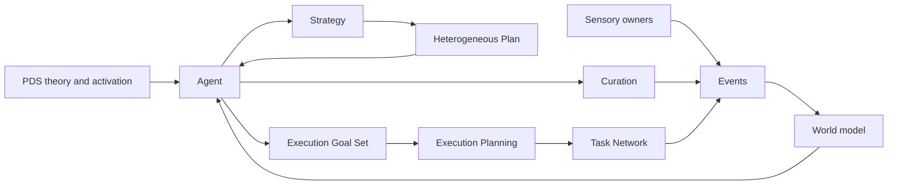

# Meld Cognitive Architecture

This directory is the canonical design specification for Meld cognition. It states what the system shall be without reference to implementation state, delivery sequence, migration, historical decisions, or contingent code structure.

## Architectural Thesis

Meld continuously reconciles an Agent directive with its admitted understanding of the world. Product theory gives an Agent its standing purpose and semantic resources. Sensory owners publish observations. The world model admits evidence, settles beliefs, traverses relevant knowledge, curates epistemic structure, and constructs causal Plans. Agent authority decides what may proceed. Execution coheres complete executable work and realizes it through one Task Network. Events preserve the durable facts that allow every participant to continue from shared history.

A Strategy Plan may contain both executable and epistemic means. A complete Task changes the external or computational world through Capabilities. A bounded Epistemic Operation changes shared knowledge through Curation. These products remain distinct because they have different authorities, effects, and consumers.

## Sacred Seams

Semantic owners prove the meaning of products they create. Receivers validate transport shape and protect only the state, authority, effects, idempotency, concurrency, and storage they own. A receiver does not reconstruct or revalidate the private reasoning of its producer.

Strategy does not know the Task Network. Execution does not know Strategy Plans, beliefs, candidate graphs, or Epistemic Operations. Traversal reads graph knowledge but does not author it. Curation authors graph knowledge but does not settle belief or perform external work. Events carry durable records but do not impose domain grammar.

## Canonical Domains

[Persistent Domain Stewardship](persistent_domain_stewardship.md) productizes Meld through theory packages, assignments, activations, and Agent genesis.

[Sensory](sensory/README.md) observes owner-defined external state and publishes typed facts.

[Events](events/README.md) provides the neutral append and replay spine.

[World Model](world_model/README.md) owns epistemic admission, belief, traversal, curation, causal context, Strategy Plan construction, and Agent reconciliation.

[Execution](execution/README.md) accepts authorized Goal-attributed Tasks, coheres them across the Goal Set, and realizes them through one Task Network.

[Meld Language](meld-lang/README.md) provides permissive shared nouns and verbs without enforcing another domain's grammar.

[Runtime Lifecycle](runtime_lifecycle_and_quiescence.md) realizes one exact activation generation and connects durable producers to durable consumers.

[Core Composition](core/CRATE.md) assembles these owners without absorbing their semantics.

## Canonical Flow

```mermaid
flowchart LR
    PDS[PDS theory and activation] --> AG[Agent]
    S[Sensory owners] --> EV[Events]
    EV --> WM[World model]
    WM --> AG
    AG --> ST[Strategy]
    ST --> PL[Heterogeneous Plan]
    PL --> AG
    AG --> CU[Curation]
    CU --> EV
    AG --> GS[Execution Goal Set]
    GS --> EP[Execution Planning]
    EP --> TN[Task Network]
    TN --> EV
```

The flow is continuous reconciliation rather than a finite workflow. New admitted knowledge may cause Agent reassessment, Plan reconstruction, new epistemic authorship, new executable work, suspension, or satisfaction.
