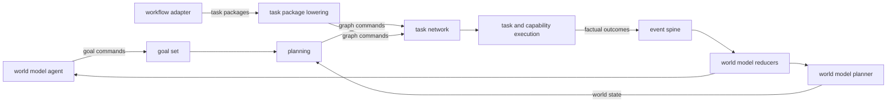

# Execution Integration Contracts

Date: 2026-06-02
Status: active
Scope: cross-domain contracts that complete the execution architecture

## Purpose

The execution domain joins goals, planning, task networks, tasks, capabilities, workflow compatibility, and runtime continuation. This document defines the contracts that connect those concerns to the world model and event spine.

## Contract Map

| Contract | Upstream authority | Execution responsibility | Downstream authority |
| --- | --- | --- | --- |
| goal authority | world model agent | durable goal set and lifecycle | planning loop |
| planning pipeline | goal set and world state | method selection and graph lowering | task network command boundary |
| world model read | world model planner | pure proposition evaluation | planning decisions |
| outcome publication | task and capability execution | factual lifecycle events | event spine and world model reducers |
| workflow compatibility | workflow profile and command input | task package lowering | ordinary execution contracts |

## Goal Authority Contract

Goals are typed propositions in `meld-lang`. Execution owns the durable goal set, lifecycle state, priority, satisfaction evidence references, and public curation API. The world model agent owns normative judgment and uses that API to add, modify, remove, suspend, resume, and satisfy goals.

The planning loop reacts to accepted goal state without interpreting why an agent changed it. The world model agent evaluates perspective-scoped belief against its normative framework without decomposing tasks or dispatching capabilities.

Goal satisfaction is evidence-backed. Any source may produce the evidence that changes belief, but the authorized agent records the satisfaction decision through the goal command boundary.

See [Goals](goals/README.md), [Lang Goals And Methods](../meld-lang/goals_and_methods.md), and [World Model Agent](../world_model/agent/README.md).

## Planning Pipeline Contract

`meld-lang` owns the shared planning substrate:

- `Goal` and `Proposition` for desired state
- `Method` for trigger, preconditions, composition, effects, cost, and preference
- `Composition` for step and edge graphs
- `Operator` for executable state transitions
- unification, substitution, validation, and world state evaluation

Execution owns method catalog loading and indexing, search orchestration, recursive decomposition, conditional dependency evaluation, graph repair, shared task reuse, and transition cost policy.

Planning produces commands for the task network command boundary. It does not mutate task network storage directly. Control flow remains graph structure through dependency edges and multi-dependency nodes.

See [Planning Pipeline](planning/planning_pipeline.md) and [Task Network](task_network.md).

## World Model Read Contract

The world model planner projects its internal graph, belief, causation, regime, and perspective state into `WorldState`. The projection contains ground `Proposition` values that execution can evaluate without importing world model internals.

Execution uses the shared language operations as its read contract:

- `evaluate` distinguishes satisfied, unsatisfied, and indeterminate propositions
- `WorldState::gap` returns unsatisfied and indeterminate sub-propositions
- `WorldState::query` performs pattern matching with variable binding

Indeterminate state represents missing knowledge and can justify an observation task. Unsatisfied state represents a known mismatch and can justify an action task. Planning policy chooses the response while the world model retains authority over the projected facts.

See [World Model Planner](../world_model/planner/README.md) and [World State And Evaluation](../meld-lang/world_state.md).

## Outcome Publication Contract

Execution maps task-local lifecycle aliases into canonical event types and publishes them through the canonical event authority:

- `execution.task.requested`
- `execution.task.started`
- `execution.task.progressed`
- `execution.task.succeeded`
- `execution.task.failed`
- `execution.task.blocked`
- `execution.task.artifact_emitted`
- `execution.task.cancelled`

Each event carries enough identity, lineage, attempt, task, capability, artifact, and failure detail for deterministic replay and belief revision. Publication is idempotent and follows accepted task network state.

Execution reports what happened. It does not assign epistemic meaning to an outcome. World model reducers consume factual events and derive claims, evidence, and belief revisions under world model policy.

Planning may apply `Effect` values to a projected `WorldState` to compare possible outcomes. That forward projection is not an assertion that the corresponding real-world outcome occurred.

See [Events Design](../events/README.md) and [Multi-Domain Event Ledger](../events/multi_domain_spine.md).

## Workflow Compatibility Contract

Workflow profiles are user-facing execution specifications. A workflow adapter preserves profile identity, turn structure, gate rules, retry rules, prompt references, and output normalization while lowering executable work into task packages and task network commands.

Workflow compatibility obeys the same execution authorities:

- the task network command boundary is the single writer for task graph and lifecycle state
- provider calls pass through capability execution contracts
- prompt and artifact reads pass through execution-owned ports
- task outcomes publish through the canonical event authority
- durable continuation state uses execution runtime contracts

A direct workflow executor is a compatibility adapter, not a second planning or task-network authority. It must preserve observable workflow behavior and produce the same factual outcome contract as task-package execution.

## Contract Composition

Every cross-domain call uses a public contract owned by the consuming domain or by the shared event and language substrates. No participant reaches into another domain's internal modules or storage.

## Read With

- [Execution Domain](README.md)
- [Goals](goals/README.md)
- [Execution Planning](planning/README.md)
- [Task Network](task_network.md)
- [Planning Pipeline](planning/planning_pipeline.md)
- [Synthesis Overview](synthesis/README.md)
- [Lang Domain](../meld-lang/README.md)
- [Lang Requirements](../meld-lang/requirements.md)
- [World Model Planner](../world_model/planner/README.md)
- [Events Design](../events/README.md)
