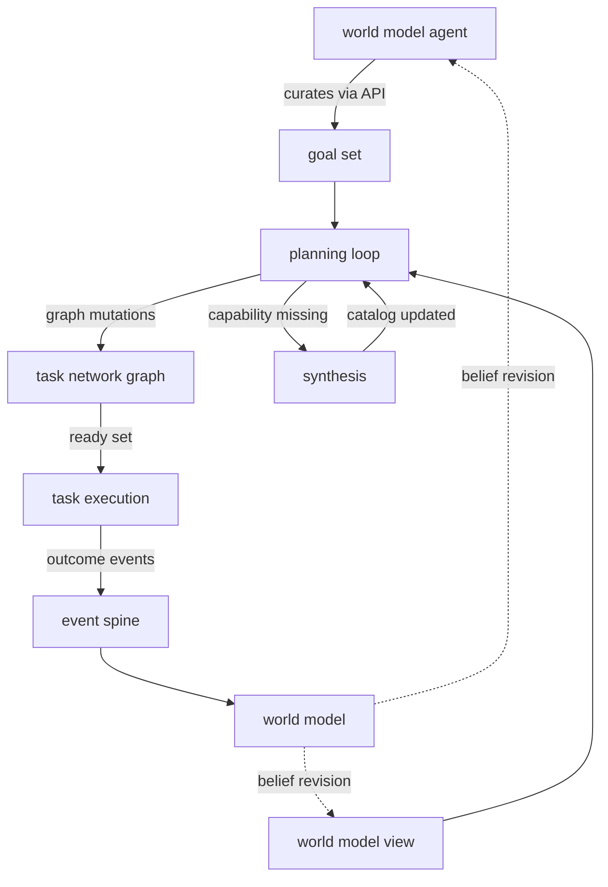

# Execution Domain

Date: 2026-05-09
Status: active
Scope: world-model-aware action through goal-directed planning, task network execution, and outcome publication

## Thesis

Execution is the system's push layer. It reads the world model and acts to change the world.

The world model agent curates a goal set — desired belief states — through execution's public API. The planning loop reads that goal set and the world model view, then maintains a task network graph that closes the gap between current belief and desired state. The task network executes tasks in parallel, governed by dependency structure. Outcomes publish back through the event spine for belief revision.

The foundational pattern is graphs-lower-graphs:

```
Capability      atomic executable contract
    ↑ composed into graph
Task            graph of Capabilities (compiled, dependency-ordered, parallel by default)
    ↑ composed into graph
Task Network    graph of Tasks (the plan, dependency-ordered, parallel by default)
```

At each level, the execution model is identical: compute the ready set, dispatch, receive events, update state.

## Boundary

`execution` owns:

- the goal set — desired belief states as data, with a public curation API consumed by world model agents
- the planning loop — continuous plan construction reading goal set and world model view
- the task network graph — shared execution substrate across all goals, parallel by dependency
- dispatch through task and capability execution
- publication of outcomes, failures, and learned facts back into events
- synthesis escalation when the current capability catalog cannot satisfy a goal
- workflow runtime as compatibility layer where cognitive subsystems are not yet built

`goals` owns the goal set data structure, lifecycle state machine, and curation API.
`planning` owns HTN decomposition, graph mutations, cost-aware plan transitions, guard and observation semantics.
`synthesis` owns runtime capability growth.
`task` and `capability` own compiled execution units and atomic contracts.
The world model agent owns normative judgment — deciding which goals should exist — and curates the goal set through execution's public API.
The world model owns graph and belief views that execution reads through subscribed views.

## Architecture



## Documents

### Core

- [Goals](goals/README.md)
  normative layer — desired belief states, lifecycle, curation API, satisfaction checking
- [Execution Planning](planning/README.md)
  planning loop, HTN decomposition, guard and observation semantics
- [Planning Pipeline](planning/planning_pipeline.md)
  graphs-lower-graphs execution model: planning loop + task network, connected by graph mutations
- [Task Network](task_network.md)
  stateful orchestration over compiled tasks, event-driven dispatch

### Supporting

- [Synthesis Overview](synthesis/README.md)
  runtime capability growth when the catalog cannot satisfy a goal
- [Execution Crate](CRATE.md)
  `meld-execution` crate boundary, owned modules, workflow runtime, task/capability authority

### Open Gaps

- [Execution Gaps](GAPS.md)
  open contracts and undefined seams — world model read interface, outcome publication, workflow integration

### Examples

- [Examples](examples/) — concrete capability designs (git_diff_summary, bayesian_evaluation, ast_change_impact)

### Research

- [Research](research/) — HTN/GOAP research, system evaluations, and reference implementations

## Read With

- [Observe Merge Push](../observe_merge_push.md)
- [World Model Domain](../world_model/README.md)
- [World Model Agent](../world_model/agent/README.md)
- [World Model Planner](../world_model/planner/README.md)
- [World Model Belief](../world_model/belief/README.md)
- [Events Domain](../events/README.md)
