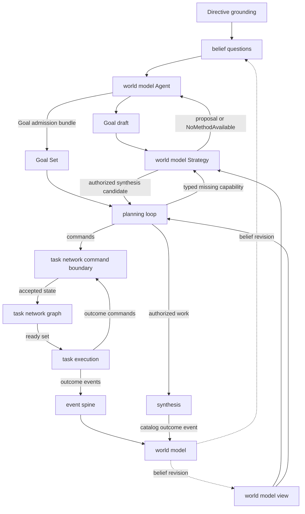

# Execution Domain

Date: 2026-07-23
Status: active
Scope: world-model-aware action through goal-directed planning, task network execution, and outcome publication

## Thesis

Execution is the system's push layer. It reads the world model and acts to change the world.

Execution begins when it accepts a Goal admission bundle containing a Goal and at least one Agent-authorized Strategy candidate. Planning realizes one authorized candidate against current operational state. The task network executes the resulting work. Outcomes return through events for world-model reconciliation.

The task network is a single writer event sourced aggregate. Its command boundary serializes graph mutation sets, dispatch claims, task outcomes, artifact availability, and publication marks into one accepted revision stream.

Seed agents are trusted genesis state created by init or configuration. After seed agents exist, additional agents are created through ordinary execution goals curated by authorized agents. Execution owns the agent initialization workflow and runs the required tasks and capabilities. The agent's seed configuration carries the user intent that justifies its responsibility while execution performs the operational work.

The foundational pattern is graphs-lower-graphs:

```
Capability      atomic executable contract
    ↑ composed into graph
Task            graph of Capabilities, compiled and dependency ordered
    ↑ composed into graph
Task Network    graph of Tasks, the plan and dependency ordered
```

At each level, the execution model is identical: compute the ready set, dispatch, receive events, update state.

## Boundary

`execution` owns:

- the Goal Set — admitted desired belief states as lifecycle data, with public admission and curation APIs
- agent initialization workflows requested by seed config or curated `CreateAgent` goals
- the planning loop — continuous operational realization of Agent-authorized Strategy decisions
- the task network graph — shared execution substrate across all goals, parallel by dependency
- the task network command boundary — single writer authority for graph and lifecycle state
- dispatch through task and capability execution
- publication of outcomes, failures, and learned facts back into events
- realization of Strategy-authorized synthesis candidates
- workflow runtime as compatibility layer where cognitive subsystems are not yet built

`goals` owns admission, the Goal Set, and Goal lifecycle.
`planning` owns concrete candidate applicability, authorized alternative selection, operational binding, capability resolution, graph mutation proposals, task-network command construction, cost-aware plan transitions, guard semantics, and observation realization.
`synthesis` owns runtime capability growth.
`task` and `capability` own compiled execution units and atomic contracts.
The world-model Agent owns Goal drafts and authorization.
World-model Strategy owns candidate Composition construction.
The world model owns graph and belief views that execution reads as `WorldState` — a set of ground propositions in the shared language [`meld-lang`](../meld-lang/README.md).
`meld-lang` owns the shared typed substrate: `Proposition`, `Goal`, `Operator`, `Composition`, `WorldState`, `Effect`, `Method`, and all pure evaluation operations. Execution depends on `meld-lang` for all planning types.

## Architecture


```mermaid
flowchart TD
    DG[Directive grounding] --> BQ[belief questions]
    BQ --> AG[world model Agent]
    AG --> GD[Goal draft]
    GD --> ST[world model Strategy]
    WMV[world model view] --> ST
    ST -->|proposal or NoMethodAvailable| AG
    AG -->|Goal admission bundle| GS[Goal Set]
    GS --> PL[planning loop]
    WMV --> PL
    PL -->|commands| TNC[task network command boundary]
    TNC -->|accepted state| TN[task network graph]
    TN -->|ready set| EX[task execution]
    EX -->|outcome commands| TNC
    EX -->|outcome events| SP[event spine]
    SP --> WM[world model]
    WM -.->|belief revision| WMV
    WM -.->|belief revision| BQ
    PL -->|typed missing capability| ST
    ST -->|authorized synthesis candidate| PL
    PL -->|authorized work| SY[synthesis]
    SY -->|catalog outcome event| WM
```

## Documents

### Core

- [Goals](goals/README.md)
  normative layer — desired belief states, lifecycle, curation API, satisfaction checking
- [Agent Genesis And Activation](../world_model/agent/genesis_and_activation.md)
  seed agent authority, runtime activation, and initialization capability work
- [Execution Planning](planning/README.md)
  concrete candidate realization, guard and observation semantics
- [Planning Pipeline](planning/planning_pipeline.md)
  graphs-lower-graphs execution model: planning loop and task network, connected by commands
- [Task Network](task_network.md)
  stateful orchestration over compiled tasks, command acceptance, and event-driven dispatch
- [Task Initialization](task_initialization.md)
  seed artifacts, data flow materialization, and validation authority before task dispatch
- [Failure Signal](failure_signal.md)
  failure as signal: the retry versus terminal boundary and the single belief-visible outcome per unit of work

### Supporting

- [Synthesis Overview](synthesis/README.md)
  runtime capability growth through explicitly authorized Strategy work
- [Execution Crate](CRATE.md)
  `meld-execution` crate boundary, owned modules, workflow runtime, task/capability authority

### Open Gaps

- [Execution Gaps](GAPS.md)
  open contracts and undefined seams — world model read interface, outcome publication, workflow integration

### Examples

- [Examples](examples/) — concrete capability designs for git diff summary, bayesian evaluation, and ast change impact

### Research

- [Research](research/) — HTN/GOAP research, system evaluations, and reference implementations

## Read With

- [Observe Merge Push](../observe_merge_push.md)
- [Lang Domain](../meld-lang/README.md)
- [World Model Domain](../world_model/README.md)
- [World Model Agent](../world_model/agent/README.md)
- [World Model Planner](../world_model/planner/README.md)
- [World Model Strategy](../world_model/strategy/README.md)
- [World Model Belief](../world_model/belief/README.md)
- [Events Domain](../events/README.md)
