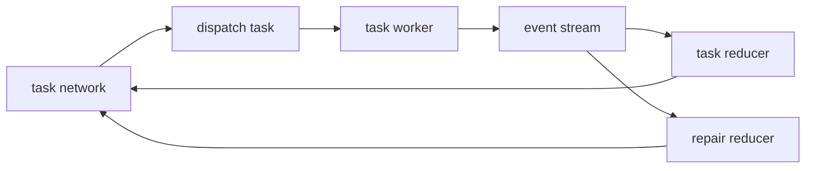

# Task Network

Date: 2026-03-28
Status: active
Scope: task network concerns for state, events, dispatch, repair, and plan modification

The model is cleaner with three layers:

- `capability`
  atomic executable contract
- `task`
  compiled graph of chained capabilities
- `task_network`
  stateful orchestrator over tasks

This means `plan` should contain only `task`.
One capability can still become one task.
That keeps `plan` reasoning uniform.

## Core position

`task_network` is the stateful orchestrator.
`task` is a compiled artifact.
`task` should not own orchestration state.

Task state should exist only as network owned projection.
That means:

- task definitions stay immutable
- task instances are derived from network state
- workers emit events only
- reducers update task network state

This makes parallel execution easier to reason about.
It also isolates repair and resume to one owner.

## Start with events

The design should start from `event`, then decompose into state reducers and dispatch behavior.

The first event families are:

- `event::task`
- `event::repair`

`event::task::state` is owned by the `task_network`.
`event::repair::state` is also owned by the `task_network`.

Tasks do not mutate network state directly.
Tasks emit events.
The network consumes events and updates its own state.

## Event flow



## `event::task`

The first task event set should be:

- `task_requested`
- `task_started`
- `task_progressed`
- `task_succeeded`
- `task_failed`
- `task_blocked`
- `task_artifact_emitted`
- `task_cancelled`

These events should be enough to derive:

- active task set
- ready task set
- blocked task set
- failed task set
- completed task set
- artifact availability
- join readiness
- branch readiness

## `event::repair`

The first repair event set should be:

- `repair_requested`
- `repair_applied`

This first pass is intentionally small.
The network should decide whether repair is needed, then record that it has been applied.

These events should be enough to derive:

- active repair scope
- repaired task set
- plan version lineage
- reuse versus replacement decision

## Ordered event path

The first pass event path can be viewed as one ordered family:

- `task_requested`
- `task_started`
- `task_progressed`
- `task_succeeded`
- `task_failed`
- `task_blocked`
- `task_artifact_emitted`
- `task_cancelled`
- `repair_requested`
- `repair_applied`

This is not a strict linear lifecycle for every task.
It is the first bounded event vocabulary that the network must understand.

These events should use the canonical spine envelope:

```rust
struct SpineEvent {
    ts: String,
    session: String,
    seq: u64,
    domain_id: String,
    stream_id: String,
    event_type: String,
    content_hash: Option<String>,
    data: serde_json::Value,
}
```

For the first landing, `domain_id` should be `execution` and `stream_id` should usually be `task_run_id`.
That keeps task-network reduction aligned with the first real spine rather than the older telemetry-only shape.

## State ownership

The `task_network` should own:

- task execution state
- repair state
- dispatch state
- ordering state
- join and branch state
- continuation state
- plan version state

`task` should own none of that.
`task` should carry compiled structure, typed task contracts, and task-scoped artifact persistence.
The distinction is important:

- `task_network` owns orchestration state
- `task_network` decides retry and repair intent
- `task` owns task-local artifact repo and invocation history records
- `task` executes the resulting retry path inside task scope

## Plan

`plan` contains only tasks.

That implies:

- `plan::create`
- `plan::read`
- `plan::update`
- `plan::delete`

`plan` should not reason directly about capabilities.
Capabilities remain inside `task`.

This makes plan modification cleaner because every operation stays at one semantic level.

## Repair

Repair is function, not yet full goal language.

For the control layer, repair means:

- modify plan for a reason
- preserve as much valid work as possible
- keep task network state coherent

The core repair function is:

- `plan::modify`

The reason may be blocked work, failed work, stale assumptions, operator input, or new observations.
The exact goal language above repair is not defined yet.

## Goal note

Repair clearly points to a higher layer.

`goal` is the missing answer to why `plan::modify` should happen.
That goal layer should sit above control.
For now, control should treat repair as requested intent and apply `plan::modify` when network rules permit it.

## Dispatch model

The first pass should be event driven.

Recommended posture:

- append only event log
- one reducer per task network instance
- deterministic reduction order
- parallel task workers allowed
- task workers emit events only
- task network owns all state transitions

This gives event driven orchestration without spreading state across workers.

## Future Task Executor Note

One likely next refinement is a task-local executor that responds to task-network stimuli rather than being treated as an undifferentiated worker shell.

In that future shape:

- the task network emits task-scoped execution intent such as start, stop, retry, continue, or cancel
- the task-local executor consumes that intent for one active task
- the task-local executor advances capability progress inside the task
- the task-local executor emits task events back to the task network

This keeps the split clean:

- task network owns event reduction, dispatch intent, repair intent, and continuation state
- task-local executor owns capability triggering and artifact-driven progression inside one task

That refinement should make the eventual event model clearer without changing the current ownership line.

## Compiler as runtime work

Treating task compilation as runtime work is plausible, but it should not be first pass.

Useful future direction:

- task compiler can become a task or capability later
- complexity scoring can gate when runtime compilation is allowed
- plan generation can become part of network behavior after the base model is proven

First pass should keep task compilation outside the live event loop.

## Boundaries that matter

Two internal boundaries are already clear:

- `event::task`
  network owned task lifecycle state
- `event::repair`
  network owned repair lifecycle state

This gives a simpler decomposition for future docs:

- dispatch
- task reducer
- repair reducer
- plan modification rules
- plan version lineage

## Weak points

- event ordering must stay deterministic
- duplicate event handling must be idempotent
- repair scope can become unclear without explicit plan version lineage
- cancellation semantics need sharper rules
- goal language above control is still unresolved

## What should change in the design set

- shift control language toward `task` and `task_network`
- treat `task_network` as the primary stateful control artifact
- treat repair as `plan::modify`
- add a goals layer above control
- keep capabilities atomic and inside tasks
