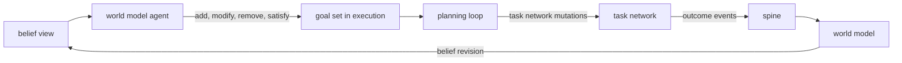

# Goals

Date: 2026-05-08
Status: active
Scope: goal model bridging world-model belief and execution planning

## Thesis

Goals are the normative layer. Beliefs describe what the system thinks is true. Goals describe what the system wants to be true. The gap between a current belief and a desired state is what creates the need for action.

Goals live inside execution because they are execution's data — the planning loop reads them, the task network works toward them, and execution owns their lifecycle state machine. But execution does not decide which goals should exist. That is the world model agent's concern.

## Ownership Split

### Execution owns the Goal Set

The Goal Set is a data structure inside execution. It holds the current goals, their lifecycle state, their priority, and their satisfaction criteria. Execution exposes a public curation API over this set:

- **add**: propose a new goal with desired state, priority, and satisfaction criteria
- **modify**: adjust priority, cost ceiling, or preemption policy of an existing goal
- **remove**: abandon a goal (with reason)
- **satisfy**: mark a goal as satisfied (with evidence)
- **suspend / resume**: hold or release a goal
- **read**: query the current goal set (active, proposed, satisfied, all)

The planning loop reads the active goal set and the world model view, then maintains the task network. Execution is indifferent to *why* a goal was added, removed, or reprioritized. It reacts to the current set.

### World Model Agent curates the Goal Set

The world model agent is the decision-maker. It reads its perspective-scoped belief views, evaluates them against its normative framework, and issues goal mutations through execution's public API.

The agent decides:
- "Tests are failing with high confidence — add a goal to make tests pass"
- "Documentation freshness has decayed below threshold — add an observation goal to verify, then potentially an action goal"
- "Regime shifted to incident response — remove the documentation goal, elevate the stability goal"
- "The desired belief state is now achieved — satisfy the goal"
- "This belief divergence is too minor to warrant action — do nothing"

The normative judgment — "this matters, act on it" vs "this is tolerable, ignore it" — lives in the agent. The agent's normative framework (what states it cares about, what thresholds trigger action, what priorities apply) is agent-specific. Different agents curating different goal sets is the "En Masse and At Will" pattern applied to execution.

### Why this split

Execution should not understand regime shifts, belief divergence semantics, or observation-needed signals. Those are world-model concerns. Execution should understand "here is a goal, achieve it" and "this goal is no longer relevant, clean up."

The world model should not decompose tasks, dispatch capabilities, or manage plan transitions. Those are execution concerns. The world model should understand "here is what I believe, here is what I want to be true, here is the API to say so."

The Goal Set API is the contract boundary. It is narrow enough that neither domain imports the other's internals, and stable enough that both sides can evolve independently.

## The Belief–Goal Bridge

The world model agent is the active entity in this bridge. It evaluates beliefs and curates goals.



The cycle closes through the spine. Execution outcomes become facts. Facts become evidence. Evidence revises belief. The world model agent evaluates revised belief against its normative framework and curates the goal set. The planning loop reacts to the updated goal set.

The world model agent is the only entity that crosses the boundary. It reads beliefs (its own domain) and curates goals (execution's domain, through the public API). No other component needs to span both.

## World Model Knowledge of Active Goals

The world model agent has read access to the goal set. This is not just operational bookkeeping — it is epistemically valuable.

### Prediction

If the world model knows "we are actively trying to make tests pass," it can:

- **predict expected evidence**: test-related artifacts will be produced, test status will change
- **weight incoming evidence**: don't treat test instability as surprising while the system is actively modifying tests
- **detect anomalies**: "we have been working toward this goal for N cycles without belief movement" — the plan may be ineffective
- **anticipate state transitions**: downstream beliefs that depend on test status can be flagged as likely to change

This connects to the belief layer's "bidirectional inference where higher-level beliefs can predict expected evidence." Active goals are the strongest predictor of what evidence to expect, because they describe what the system is intentionally trying to make true.

### Informing the normative framework

Knowledge of active goals helps the agent avoid redundant goal generation. If a goal to fix tests already exists and is active, the agent does not need to generate another one when the next test failure observation arrives. The agent's normative evaluation includes "is someone already working on this?"

### Satisfaction from any source

Because the world model agent evaluates satisfaction (by comparing belief against the goal's desired state), goals can be satisfied by any means:

- The system's own execution fixed the tests → belief revises → agent satisfies the goal
- A human fixed the tests independently → sensory observation → belief revises → agent satisfies the goal
- The tests started passing due to an unrelated change → same path

Execution never needs to determine *how* satisfaction occurred. The world model agent detects it through belief and calls the satisfy API. Execution sees "goal satisfied" and cleans up.

## Goal Representation

A goal is a proposition about desired world-model state, scoped to an agent's perspective.

```
Goal {
    goal_id: GoalId,
    agent_id: AgentId,
    desired_state: DesiredState,
    source: GoalSource,
    lifecycle: GoalLifecycle,
    priority: GoalPriority,
    satisfaction: SatisfactionCriteria,
}
```

### Desired state

The desired state is expressed as a condition over belief views. The system can never know the actual world state (foundational assumption from observe-merge-push). It can only know what it believes. Therefore goals are conditions on belief:

```
DesiredState {
    subject: DomainObjectRef,
    predicate: BeliefPredicate,
}
```

A `BeliefPredicate` is a condition over the `BeliefView` fields for a given subject. Examples:

- "test_suite passes with confidence ≥ 0.9" — checks posterior and confidence
- "documentation for module X is current" — checks freshness and posterior
- "build artifact exists and is valid" — checks status and posterior
- "uncertainty about API compatibility is below threshold" — checks uncertainty

The predicate does not name tasks, capabilities, or methods. It names a desired belief state. The planning loop determines how to achieve it.

### Goal source

Goals originate from different triggers. The source is metadata recorded by the world model agent when it curates the goal set — it explains why the goal exists for audit and explanation, but execution does not branch on it.

```
enum GoalSource {
    BeliefDivergence {
        belief_key: BeliefKey,
        observed_state: BeliefSummary,
        trigger_condition: BeliefPredicate,
    },
    UserDirected {
        directive: UserDirective,
    },
    Maintenance {
        invariant: BeliefPredicate,
        monitoring_policy: MonitoringPolicy,
    },
    GoalDecomposition {
        parent_goal_id: GoalId,
    },
}
```

**Belief divergence**: the agent detected that current belief diverges from a desired state. The trigger condition records what belief state caused the agent to add this goal.

**User directed**: a user or external system asserted a desired state directly. The world model agent translates the user directive into a goal with a belief predicate and adds it to the goal set.

**Maintenance**: the agent holds a standing invariant and monitors belief continuously. When the invariant is violated, the agent reactivates the goal. The monitoring policy defines how frequently and at what threshold the agent checks.

**Goal decomposition**: the agent (or the planning loop, through the agent) decomposed a parent goal into sub-goals. Each sub-goal has its own desired state and satisfaction criteria.

### Goal lifecycle

```
enum GoalLifecycle {
    Proposed,
    Active,
    Suspended { reason: SuspensionReason },
    Satisfied { evidence: SatisfactionEvidence },
    Abandoned { reason: AbandonmentReason },
    Superseded { by: GoalId },
}
```

**Proposed**: goal exists but has not been committed to. The planning loop has not yet incorporated it. Proposed goals may be evaluated for cost and priority before the agent activates them.

**Active**: the planning loop is maintaining task network state toward this goal.

**Suspended**: the goal is valid but cannot be pursued right now. The agent suspends goals when: insufficient belief to plan (observation needed first), resource contention with higher-priority goals, or dependency on another goal's completion.

**Satisfied**: the desired belief state has been achieved. The world model agent marks this through the satisfy API when it detects that belief now matches the desired state. Maintenance goals may transition back to active if the agent later detects invariant violation.

**Abandoned**: the goal is no longer relevant. The agent removes goals when: user cancels, regime shift invalidates premises, or goal is superseded.

**Superseded**: replaced by a more specific or better-informed goal. The agent adds the new goal and supersedes the old one.

Lifecycle transitions are initiated by the world model agent (through the curation API) except for one case: the planning loop may propose suspension when it determines that a goal cannot be planned against with the current capability catalog (triggering synthesis). Even then, the suspension is communicated back to the agent for confirmation.

### Goal priority

```
GoalPriority {
    urgency: UrgencyLevel,
    importance: ImportanceLevel,
    cost_ceiling: Option<CostEstimate>,
    preemption_policy: PreemptionPolicy,
}
```

**Urgency**: how time-sensitive is the goal? Set by the agent based on belief context.

**Importance**: how much does this goal matter relative to other goals? Set by the agent based on its normative framework.

**Cost ceiling**: optional upper bound on effort. If the planning loop estimates cost exceeds the ceiling, it signals the agent, which may adjust the ceiling, suspend, or abandon.

**Preemption policy**: what happens when this goal conflicts with other active goals? The agent sets this based on its priority framework. Execution's cost-aware plan transition logic respects preemption policy when rebalancing the task network.

## Satisfaction Checking

Satisfaction checking is owned by the world model agent because it requires evaluating belief.

```
SatisfactionCriteria {
    predicate: BeliefPredicate,
    confidence_threshold: f64,
    freshness_requirement: Option<FreshnessRequirement>,
    stability_requirement: Option<StabilityRequirement>,
}
```

The agent evaluates satisfaction continuously and marks goals satisfied through the API when:

1. The belief predicate evaluates to true against the current belief view
2. The belief's confidence meets or exceeds the confidence threshold
3. If a freshness requirement exists, the belief is sufficiently recent
4. If a stability requirement exists, the belief has been stable for the required duration (not oscillating)

The stability requirement prevents premature satisfaction. If tests pass once but have been flaky, the goal "tests pass reliably" is not satisfied until the belief is stable.

Execution does not evaluate beliefs. It receives "goal satisfied" through the API and responds by cleaning up associated task network state.

## Belief Interaction Patterns

In each pattern below, the world model agent is the active decision-maker. "Belief generates a goal" is shorthand for "the agent detects a belief state and decides to add a goal."

### Pattern 1: Agent detects divergence, adds action goal

```
agent reads: tests_pass = false (confidence: 0.95)
agent's normative framework: tests_pass = true is a maintenance invariant
→ agent adds goal: make tests pass (via curation API)
→ execution's planning loop decomposes into tasks
```

### Pattern 2: Agent detects uncertainty, adds observation goal

```
agent reads: api_compatible = unknown (uncertainty: high, freshness: stale)
agent's normative framework: api_compatible is a precondition for an active goal
→ agent adds observation goal: determine API compatibility (via curation API)
→ execution's planning loop emits observation tasks
→ observation result → belief revision → agent re-evaluates, may add action goal
```

### Pattern 3: Agent detects satisfaction, marks goal satisfied

```
agent reads: tests_pass = true (confidence: 0.95, freshness: current, stable: true)
active goal: tests_pass = true (confidence: ≥ 0.9)
→ satisfaction criteria met
→ agent marks goal satisfied (via curation API)
→ execution cleans up associated task network state
```

Satisfaction can occur through execution (the system fixed the tests) or through external action (someone else fixed the tests). The agent detects it the same way — through belief revision.

### Pattern 4: Agent detects regime shift, curates goal set

```
agent reads: regime shifted from "development" to "incident response"
active goals: [improve_docs, fix_flaky_test]
new belief: production system degraded (confidence: 0.9)
→ agent suspends improve_docs and fix_flaky_test
→ agent adds restore_production (importance: critical, urgency: immediate)
→ execution's planning loop rebalances task network via cost-aware transitions
```

Execution does not understand regime shifts. It sees: two goals suspended, one goal added with high priority. It reacts accordingly.

### Pattern 5: Agent monitors maintenance invariant, reactivates goal

```
agent's maintenance invariant: tests_pass = true
agent reads: tests_pass = true → marks goal satisfied, continues monitoring
... later ...
agent reads: tests_pass = false (new evidence)
→ agent reactivates goal (via curation API)
→ execution's planning loop re-engages
```

Maintenance invariants live in the agent's normative framework, not in the goal set. The goal set reflects the current state of commitment. The agent creates and satisfies goals as belief moves relative to its invariants.

## Relationship to Agent

The agent is one entity with two faces:

- **World model face**: owns perspective, evidence policy, trust profile, observation scope, regime sensitivity. Produces scoped belief views. Evaluates beliefs against its normative framework.
- **Execution face**: curates the goal set through the public API. The goal set is the agent's operational identity in execution — what it is trying to change about the world.

In a multi-agent system, each agent has its own normative framework and its own goal set. Two agents observing the same repository may curate different goals because they have different perspectives, different priorities, or different tolerance thresholds for divergence.

The agent's normative framework — what states it cares about, what thresholds trigger action, how it prioritizes — is the agent-specific policy that the earlier design called "goal generation policy." This lives in the world model agent definition, not in execution.

## Relationship to Planning

The planning loop reads the active goal set and the world model view. It does not know or care who curated the goals. Its contract is:

- **input**: active goals (desired belief states) + world model view (current belief states)
- **process**: compute gap, HTN decompose, maintain task network
- **output**: task network mutations

When the goal set changes (agent adds, removes, or reprioritizes goals), the planning loop re-evaluates. This is the same cost-aware transition logic used for any plan change — the planning loop weighs the benefit of adapting the task network against the switching cost.

## Goal Decomposition

Some goals are too abstract to plan against directly. The agent may decompose a goal into sub-goals before adding them to the goal set, or the planning loop may signal that a goal needs decomposition (it cannot find methods to address it directly).

```
goal: "repository is well-documented"
  sub-goal: "API documentation is current" (belief: api_docs_freshness)
  sub-goal: "README reflects current architecture" (belief: readme_accuracy)
  sub-goal: "examples compile and run" (belief: examples_validity)
```

Each sub-goal is a separate entry in the goal set with its own desired state, satisfaction criteria, and lifecycle. The parent goal tracks its children. The agent satisfies the parent when all children are satisfied.

Goal decomposition is the agent's concern (deciding what to want). Task decomposition is the planning loop's concern (deciding what to do). The two are related but distinct — a goal decomposition may not map 1:1 to an HTN decomposition.

## Resolving the GAPS.md Tension

GAPS.md identified a tension: goals as world-state propositions vs goals as operational triggers.

The resolution: goals are propositions about desired belief states, owned as data by execution. Operational triggers (task failure, belief divergence, regime shift) are events that cause the world model agent to curate the goal set. The agent is the translator between "something changed in belief" and "this goal should now exist/change/retire."

Repair becomes: a task fails, the planning loop signals the failure, the agent evaluates whether the threatened goal is still worth pursuing and whether the plan should change. If yes, execution's planning loop handles it through HTN lineage and task network mutations. If the agent decides the goal is no longer worth the cost, it abandons it. The decision is the agent's. The mechanics are execution's.

## What This Design Does Not Cover

### Agent normative framework

The agent's normative framework — what it cares about, what thresholds trigger action, how it prioritizes — is defined as cost-benefit evaluation over belief. The framework reduces to: which belief keys the agent watches (subscription filter), and what regime-scoped priors it carries for a cost-benefit comparison on each concern class. Divergence thresholds, tolerance, and priority are derived from cost and value beliefs rather than configured separately. See [Goal Curation](../../world_model/agent/goal_curation.md) for the full mechanism.

Residual gaps in the normative framework:

- cost-benefit comparator specification (factors, weights, decision boundary)
- value measurement methodology (how to measure downstream value of goal achievement)
- subscription filter design (static vs learned concern declarations)

### Goal conflict resolution

When multiple goals compete for resources or have contradictory desired states, the agent must resolve the conflict before (or while) curating the goal set. Priority and preemption policy provide mechanisms, but the resolution strategy is not fully specified.

### Multi-agent goal coordination

When multiple agents curate overlapping goal sets (shared resources, complementary or conflicting objectives), coordination is needed. The shared graph substrate and perspective-scoped beliefs provide the foundation, but the coordination protocol is not designed.

### Goal learning

Can the agent learn which goals are productive from outcomes? Can it refine its normative framework based on which goals led to successful belief revision? This connects to the belief layer's calibration mechanisms but is not addressed here.

## Read With

- [Execution Domain](../README.md)
- [Execution Gaps](../GAPS.md)
- [Planning Pipeline](../planning/planning_pipeline.md)
- [Task Network](../task_network.md)
- [World Model Belief](../../world_model/belief/README.md)
- [Fact To Belief](../../world_model/belief/fact_to_belief.md)
- [World Model Agent](../../world_model/agent/README.md)
- [World Model Planner](../../world_model/planner/README.md)
- [Goal Curation](../../world_model/agent/goal_curation.md)
- [Observe Merge Push](../../observe_merge_push.md)
