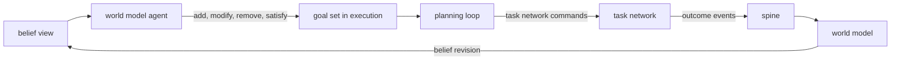

# Goals

Date: 2026-06-02
Status: active
Scope: goal model bridging world-model belief and execution planning

## Thesis

Goals are the normative layer. Beliefs describe what the system thinks is true. Goals describe what the system wants to be true. The gap between a current belief and a desired state is what creates the need for action.

Goals live inside execution because they are execution's data — the planning loop reads them, the task network works toward them, and execution owns their lifecycle state machine. But execution does not decide which goals should exist. That is the world model agent's concern.

## Ownership Split

### Execution owns the Goal Set

The Goal Set is a data structure inside execution. It holds the current goals, their lifecycle state, their priority, and their satisfaction criteria. Execution exposes a public curation API over this set:

- **add**: propose a new goal with desired state, priority, and satisfaction criteria
- **modify**: adjust priority or cost ceiling of an existing goal
- **remove**: abandon a goal and record the reason
- **satisfy**: mark a goal as satisfied and record the evidence
- **suspend / resume**: hold or release a goal
- **read**: query active, proposed, satisfied, or all goals

The planning loop reads the active goal set and the world model view, then maintains the task network. Execution is indifferent to *why* a goal was added, removed, or reprioritized. It reacts to the current set.

### World Model Agent curates the Goal Set

The world model agent is the decision-maker. It reads its perspective-scoped belief views, evaluates them against its normative framework, and issues goal mutations through execution's public API.

The agent decides:
- "Tests are failing with high confidence — add a goal to make tests pass"
- "Documentation freshness has decayed below threshold — add an observation goal to verify, then potentially an action goal"
- "Regime shifted to incident response — remove the documentation goal, elevate the stability goal"
- "The desired belief state is now achieved — satisfy the goal"
- "This belief divergence is too minor to warrant action — do nothing"

The normative judgment — "this matters, act on it" versus "this is tolerable, ignore it" — lives in the agent. Its framework defines relevant states, action thresholds, and priorities. Different agents curating different goal sets is the "En Masse and At Will" pattern applied to execution.

### Seed Agents And Agent Creation Goals

The first agents cannot be created by goal curation because no agent exists yet.

Seed agents are trusted genesis state created by init or loaded from configuration. They provide the first curation authority.

After seed agents exist, new agent creation is represented as an ordinary goal. An authorized existing agent may add a `CreateAgent` goal when a separate concern needs its own perspective, policy, and subscriptions.

Execution owns the initialization workflow for that goal. The workflow runs tasks and capabilities that create the durable agent record, bind the perspective, register belief keys, bind subscriptions, request first observations, and verify readiness.

The newly arrived agent may then satisfy or provide satisfaction evidence for the `CreateAgent` goal that requested it.

Restarting an existing agent is not a `CreateAgent` goal. Runtime startup hydrates durable agent records into runtime watchers and subscriptions. Repair goals may be created only if activation fails.

### Why this split

Execution should not understand regime shifts, belief divergence semantics, or observation-needed signals. Those are world-model concerns. Execution should understand "here is a goal, achieve it" and "this goal is no longer relevant, clean up."

The world model should not decompose tasks, dispatch capabilities, or manage plan transitions. Those are execution concerns. The world model should understand "here is what I believe, here is what I want to be true, here is the API to say so."

The Goal Set API is the contract boundary. It is narrow enough that neither domain imports the other's internals, and stable enough that both sides can evolve independently.

## The Belief–Goal Bridge

The world model agent is the active entity in this bridge. It evaluates beliefs and curates goals.


```mermaid
flowchart LR
    BV[belief view] --> AG[world model agent]
    AG -->|add, modify, remove, satisfy| GS[goal set in execution]
    GS --> PL[planning loop]
    PL -->|task network commands| TN[task network]
    TN -->|outcome events| SP[spine]
    SP --> WM[world model]
    WM -->|belief revision| BV
```

The cycle closes through the spine. Execution outcomes become facts. Facts become evidence. Evidence revises belief. The world model agent evaluates revised belief against its normative framework and curates the goal set. The planning loop reacts to the updated goal set.

The world model agent is the only entity that crosses the boundary. It reads beliefs from its own domain and curates goals in execution through the public API. No other component needs to span both.

## World Model Knowledge of Active Goals

The world model agent has read access to the goal set. This is not just operational bookkeeping — it is epistemically valuable.

### Prediction

If the world model knows "we are actively trying to make tests pass," it can:

- **predict expected evidence**: test-related artifacts will be produced, test status will change
- **weight incoming evidence**: don't treat test instability as surprising while the system is actively modifying tests
- **detect anomalies**: "we have been working toward this goal for N cycles without belief movement" — the plan may be ineffective
- **anticipate state transitions**: downstream beliefs that depend on test status can be flagged as likely to change

This connects to the belief layer's "bidirectional inference where higher-level beliefs can predict expected evidence." Active goals are the strongest predictor of what evidence to expect, because they describe what the system is intentionally trying to make true.

### Informing the normative framework

Knowledge of active goals helps the agent avoid redundant goal generation. If an active test-fixing goal is present, the agent does not generate another one when the next test failure observation arrives. The agent's normative evaluation includes whether work is already in progress.

### Satisfaction from any source

Because the world model agent evaluates satisfaction by comparing belief against the goal's desired state, goals can be satisfied by any means:

- The system's own execution fixed the tests → belief revises → agent satisfies the goal
- A human fixed the tests independently → sensory observation → belief revises → agent satisfies the goal
- The tests started passing due to an unrelated change → same path

Execution never needs to determine *how* satisfaction occurred. The world model agent detects it through belief and calls the satisfy API. Execution sees "goal satisfied" and cleans up.

## Goal Representation

A goal is a proposition about desired world-model state, scoped to an agent's perspective.

The concrete `Goal` type is defined in [`meld-lang`](../../meld-lang/goals_and_methods.md), the shared proposition language between world model and execution. The world model agent constructs goals using `meld-lang` types. Planning may evaluate them mechanically, and the agent owns satisfaction curation. The shared language eliminates the need for execution to interpret semantic intent.

```
Goal {
    goal_id: String,
    agent_id: String,
    target: Proposition,           // from meld-lang — what should hold
    source: GoalSource,            // from meld-lang — why this goal exists
    priority: GoalPriority,        // from meld-lang — urgency and cost ceiling
    lifecycle: GoalLifecycle,      // from meld-lang — proposed/active/satisfied/...
}
```

### Desired state

The desired state is a `Proposition` in the shared language. Under the foundational assumption from observe-merge-push, the system can never know the actual world state. It can only know what it believes. Therefore goals are propositions about belief:

```
// In meld-lang terms:
Proposition::Holds {
    subject: Term::Object(node_ref),
    dimension: Term::Dimension("docs_freshness"),
    condition: Condition::Above(Term::Literal(Literal::Number(0.7))),
}
```

Desired state uses `Proposition::Holds` in the shared language that both world model and execution speak natively. Belief predicates use `Proposition`. Domain object subjects use `Term::Object`. Confidence thresholds use `Condition::Above`.

Examples in the shared language:

- "test_suite passes with confidence ≥ 0.9" → `Holds { subject: test_suite, dimension: "test_status", condition: Above(0.9) }`
- "documentation for module X is current" → `Holds { subject: module_x, dimension: "docs_freshness", condition: Within(Duration::days(7)) }`
- "build artifact exists and is valid" → `Exists { scope: build_target, artifact_type: "build_artifact" }`
- "uncertainty about API compatibility is below threshold" → `Holds { subject: api_ref, dimension: "api_compatibility", condition: Above(0.8) }`

The proposition does not name tasks, capabilities, or methods. It names a desired belief state. The planning loop determines how to achieve it through method matching and composition construction.

### Goal source

Goals originate from different triggers. The source is metadata recorded by the world model agent when it curates the goal set — it explains why the goal exists for audit and explanation, but execution does not branch on it.

The concrete `GoalSource` type is defined in [`meld-lang`](../../meld-lang/goals_and_methods.md). It carries string descriptions for provenance and audit. Execution reads the source for lineage tracking and explanation only — it does not interpret the source to decide how to plan.

```
enum GoalSource {
    BeliefDivergence {
        dimension: String,           // which belief dimension diverged
        observed: String,            // what the agent saw
        desired: String,             // what the agent wants
    },
    UserDirected {
        directive: String,           // lineage summary, not durable directive state
    },
    Maintenance {
        invariant_description: String,  // standing invariant
    },
    Decomposed {
        parent_goal_id: String,      // the parent goal this was derived from
    },
}
```

**Belief divergence**: the agent detected that current belief diverges from a desired state. The dimension and observed/desired fields are descriptive strings for audit — the actual desired state is the goal's `target` proposition.

**User directed**: user or external system intent enters as a directive on the responsible agent. The agent translates that intent into a goal with a `Proposition` target and adds it to the goal set. User input enters the same cost-benefit evaluation pathway as high-weight value evidence, not as a bypass. See [Goal Curation](../../world_model/agent/goal_curation.md).

**Maintenance**: the agent holds a standing invariant and monitors belief continuously. When the invariant is violated, the agent reactivates the goal. Maintenance goals may cycle between `Active` and `Satisfied` as belief moves relative to the invariant.

**Decomposed**: the agent or the planning loop acting through the agent decomposed a parent goal into sub-goals. Each sub-goal has its own target proposition and lifecycle. The parent goal tracks its children. The `Decomposed` source records this relationship.

### Goal lifecycle

The concrete `GoalLifecycle` type is defined in [`meld-lang`](../../meld-lang/goals_and_methods.md).

```
enum GoalLifecycle {
    Proposed,
    Active,
    Suspended { reason: String },
    Satisfied { at_seq: u64 },
    Abandoned { reason: String },
}
```

**Proposed**: goal exists but has not been committed to. The planning loop has not yet incorporated it. Proposed goals may be evaluated for cost and priority before the agent activates them.

**Active**: the planning loop is maintaining task network state toward this goal.

**Suspended**: the goal is valid but cannot be pursued right now. The agent suspends goals for insufficient belief, resource contention with higher-priority goals, or dependency on another goal's completion.

**Satisfied**: the goal's target proposition holds in the world state. The world model agent curates satisfaction when `evaluate(world_state, goal.target)` returns `EvalResult::Satisfied`, and execution persists the transition only through its public satisfy API. The `at_seq` field records the event sequence number at which satisfaction was confirmed. Maintenance goals may cycle back to `Active` if the agent later detects invariant violation.

**Abandoned**: the goal is no longer relevant. The agent removes goals when: user cancels, regime shift invalidates premises, or cost exceeds remaining value.

Supersession is an `Abandoned` reason that names the replacement goal, not a distinct lifecycle state.

Lifecycle transitions are initiated by the world model agent and persisted by execution through public goal APIs. Planning may observe that a target is satisfied, but it does not own the `Active` to `Satisfied` lifecycle mutation. The planning loop may also propose suspension when it determines that a goal cannot be planned against with the current capability catalog. Even then, the suspension is communicated back to the agent for confirmation.

### Goal priority

The concrete `GoalPriority` type is defined in [`meld-lang`](../../meld-lang/goals_and_methods.md).

```
GoalPriority {
    urgency: u32,
    cost_ceiling: Option<CostEstimate>,
}
```

**Urgency**: lower number means higher urgency. Zero is most urgent. The agent derives urgency from belief context and the value-to-cost ratio defined by [Goal Curation](../../world_model/agent/goal_curation.md). Importance is expressed through this urgency ordering.

**Cost ceiling**: optional upper bound on effort expressed as a `CostEstimate` across time, money, and provider call dimensions. If the planning loop estimates that a composition's aggregated cost exceeds the ceiling on any dimension, it rejects that composition and signals the agent. The agent may adjust the ceiling, suspend, or abandon.

`GoalPriority` does not carry a separate preemption policy. Preemption derives from urgency ordering and cost-aware plan transition rules.

## Satisfaction Checking

With `meld-lang`, satisfaction observation becomes mechanical. Planning may evaluate `goal.target` against the current `WorldState` using the three-valued `evaluate()` function. The world model agent owns satisfaction curation, and execution persists lifecycle state only through its public satisfy API.

```rust
match evaluate(&world_state, &goal.target) {
    EvalResult::Satisfied => {
        // Goal target holds. Report this through agent satisfaction curation.
    }
    EvalResult::Unsatisfied { gap } => {
        // World model asserted values, but they don't meet the condition.
        // Plan action to close the gap.
    }
    EvalResult::Indeterminate { missing } => {
        // World model hasn't asserted anything about these dimensions.
        // Plan observation to gather evidence.
    }
}
```

The `Proposition` target carries satisfaction criteria directly. Confidence thresholds use `Condition::Above`. Freshness requirements use `Condition::Within` on a freshness dimension. Stability uses a separate dimension projected by the world model.

The satisfaction boundary is split by ownership:

- **Planning** may mechanically observe `EvalResult::Satisfied` while planning or validating task effects.
- **The world model agent** reviews active agent-owned goals against the current projected `WorldState` and emits a satisfaction mutation only for `EvalResult::Satisfied`.
- **Execution** persists the lifecycle transition only through its public satisfy API.
- **`meld_lang::evaluate`** remains pure and does not own lifecycle transitions.

Satisfaction from any source remains: the system's own execution, external action, or unrelated changes all produce belief revisions that the world model projects into `WorldState`. The agent curation path detects satisfaction from that projection and execution records the lifecycle change.

## Belief Interaction Patterns

In each pattern below, the world model agent is the active decision-maker. "Belief generates a goal" is shorthand for "the agent detects a belief state and decides to add a goal."

### Pattern 1: Agent detects divergence, adds action goal

```
agent reads: tests_pass = false (confidence: 0.95)
agent's normative framework: tests_pass = true is a maintenance invariant
→ agent adds goal: make tests pass (via curation API)
→ execution's planning loop decomposes into tasks
```

### Pattern 2: Agent detects uncertainty, adds observation goal

```
agent reads: api_compatible = unknown (uncertainty: high, freshness: stale)
agent's normative framework: api_compatible is a precondition for an active goal
→ agent adds observation goal: determine API compatibility (via curation API)
→ execution's planning loop emits observation tasks
→ observation result → belief revision → agent re-evaluates, may add action goal
```

### Pattern 3: Agent detects satisfaction, marks goal satisfied

```
agent reads: tests_pass = true (confidence: 0.95, freshness: current, stable: true)
active goal: tests_pass = true (confidence: ≥ 0.9)
→ satisfaction criteria met
→ agent marks goal satisfied (via curation API)
→ execution cleans up associated task network state
```

Satisfaction can occur through execution or external action. The agent detects both through belief revision.

### Pattern 4: Agent detects regime shift, curates goal set

```
agent reads: regime shifted from "development" to "incident response"
active goals: [improve_docs, fix_flaky_test]
new belief: production system degraded (confidence: 0.9)
→ agent suspends improve_docs and fix_flaky_test
→ agent adds restore_production (importance: critical, urgency: immediate)
→ execution's planning loop rebalances task network via cost-aware transitions
```

Execution does not understand regime shifts. It sees: two goals suspended, one goal added with high priority. It reacts accordingly.

### Pattern 5: Agent monitors maintenance invariant, reactivates goal

```
agent's maintenance invariant: tests_pass = true
agent reads: tests_pass = true → marks goal satisfied, continues monitoring
... later ...
agent reads: tests_pass = false (new evidence)
→ agent reactivates goal (via curation API)
→ execution's planning loop re-engages
```

Maintenance invariants live in the agent's normative framework, not in the goal set. The goal set reflects the current state of commitment. The agent creates and satisfies goals as belief moves relative to its invariants.

## Relationship to Agent

The agent is one entity with two faces:

- **World model face**: owns perspective, evidence policy, trust profile, observation scope, regime sensitivity. Produces scoped belief views. Evaluates beliefs against its normative framework.
- **Execution face**: curates the goal set through the public API. The goal set is the agent's operational identity in execution — what it is trying to change about the world.

In a multi-agent system, each agent has its own normative framework and its own goal set. Two agents observing the same repository may curate different goals because they have different perspectives, different priorities, or different tolerance thresholds for divergence.

The agent's normative framework defines relevant states, action thresholds, and priority policy. This lives in the world model agent definition, not in execution.

## Relationship to Planning

The planning loop reads the active goal set and the world model view. It does not know or care who curated the goals. Its contract is:

- **input**: active goals as desired belief states plus world model view as current belief states
- **process**: compute gap, HTN decompose, maintain task network
- **output**: task network commands carrying mutation sets

When the goal set changes because an agent adds, removes, or reprioritizes goals, the planning loop re-evaluates. This is the same cost-aware transition logic used for any plan change — the planning loop weighs the benefit of adapting the task network against the switching cost.

## Goal Decomposition

Some goals are too abstract to plan against directly. The agent may decompose a goal into sub-goals before adding them to the goal set, or the planning loop may signal that no method addresses it directly.

```
goal: "repository is well-documented"
  sub-goal: "API documentation is current" (belief: api_docs_freshness)
  sub-goal: "README reflects current architecture" (belief: readme_accuracy)
  sub-goal: "examples compile and run" (belief: examples_validity)
```

Each sub-goal is a separate entry in the goal set with its own desired state, satisfaction criteria, and lifecycle. The parent goal tracks its children. The agent satisfies the parent when all children are satisfied.

Goal decomposition is the agent's decision about what to want. Task decomposition is the planning loop's decision about what to do. The two are related but distinct, and a goal decomposition may not map one-to-one to an HTN decomposition.

## Goal And Trigger Distinction

Goals are propositions about desired belief states and are owned as data by execution. Operational triggers are belief evaluations made by the world model agent that result in goal set mutations.

The world model agent translates belief changes into goal commands. Task failure, belief divergence, and regime shift can prompt curation, but they do not become goal records unless the agent issues an accepted mutation.

Repair follows the same authority split. A task failure enters the planning loop, and the agent evaluates whether the threatened goal remains worth pursuing. Execution uses HTN lineage and task network commands when the goal remains active. The agent abandons a goal that is no longer worth its cost. The decision is the agent's and the mechanics are execution's.

## Goal Policy Boundaries

The agent's normative framework owns watched belief keys, regime-scoped priors, cost-benefit comparison, tolerance, and urgency selection. See [Goal Curation](../../world_model/agent/goal_curation.md) for the full mechanism.

Authorized agents resolve contradictory desired states through goal curation. Execution applies accepted goal commands and deterministic resource policy without choosing which semantic objective should prevail.

Agents with overlapping concerns retain perspective-scoped belief and goal identity. Coordination enters execution through authorized goal commands and shared task equivalence rules rather than direct mutation of another agent's goal state.

## Read With

- [Execution Domain](../README.md)
- [Execution Integration Contracts](../GAPS.md)
- [Planning Pipeline](../planning/planning_pipeline.md)
- [Task Network](../task_network.md)
- [Lang Domain](../../meld-lang/README.md)
- [Lang Goals and Methods](../../meld-lang/goals_and_methods.md)
- [Lang World State and Evaluation](../../meld-lang/world_state.md)
- [World Model Belief](../../world_model/belief/README.md)
- [Fact To Belief](../../world_model/belief/fact_to_belief.md)
- [World Model Agent](../../world_model/agent/README.md)
- [World Model Planner](../../world_model/planner/README.md)
- [Goal Curation](../../world_model/agent/goal_curation.md)
- [Observe Merge Push](../../observe_merge_push.md)
