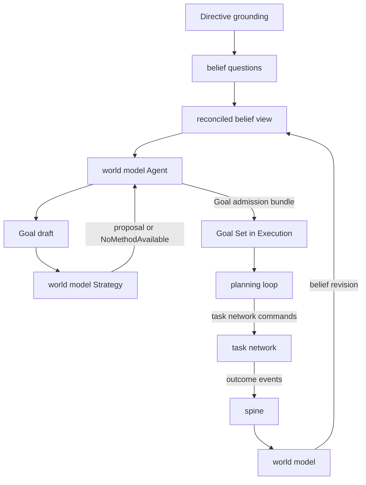

# Goals

Date: 2026-07-23
Status: active
Scope: goal model bridging world-model belief and execution planning

## Thesis

Beliefs describe what Meld thinks is true. Goals describe what Meld is authorized to make true.

A proposed desired state begins as a Goal draft in the world model. It becomes an Execution Goal only after Strategy produces at least one eligible theory of action and the Agent authorizes both together.

| Record | Meaning | Owner |
|---|---|---|
| Goal draft | a desired state being considered | world-model Agent |
| Strategy decision | authorized theories of action for that desired state | world-model Strategy under Agent authority |
| Admitted Goal | desired state accepted into operational lifecycle | Execution |

## Ownership Split

### Execution owns the Goal Set

The Goal Set is a data structure inside execution. It holds admitted Goals, their lifecycle state, their priority, and their satisfaction criteria. Execution exposes a public admission and curation API:

- **admit**: accept an Agent-authorized Goal with a nonempty Strategy inventory
- **modify**: adjust priority, cost ceiling, or preemption policy of an existing goal
- **remove**: abandon a goal (with reason)
- **satisfy**: mark a goal as satisfied (with evidence)
- **suspend / resume**: hold or release a goal
- **read**: query active, suspended, satisfied, abandoned, or all admitted Goals

Initial admission rejects an empty or mismatched Strategy inventory. Execution Planning reads the active Goal set, authorized Strategy inventory, and live operational state, then maintains the task network. Execution remains indifferent to why a Goal was admitted, removed, or reprioritized.

### World Model Agent owns desired state

Directive grounding establishes concrete belief questions. The Agent reads their reconciled belief views and decides whether divergence warrants action.

Before admission, the Agent may draft a new desired state, tolerate the divergence, or decide that an existing Goal already covers it. After admission, the Agent may modify priority, suspend, resume, satisfy, or abandon the Goal.

The judgment that a state matters lives in the Agent. Strategy answers a separate question: which theories of action could change it.

If bounded Strategy construction produces no eligible reusable or novel candidate, `NoMethodAvailable` is emitted and the draft remains outside Execution.

### Seed Agents And Agent Creation Goals

The first agents cannot be created by goal curation because no agent exists yet.

Seed agents are trusted genesis state created by init or loaded from configuration. They provide the first curation authority.

After seed agents exist, new agent creation is represented as an ordinary goal. An authorized existing Agent may draft a `CreateAgent` goal when a separate concern needs its own perspective, policy, and subscriptions. That Goal enters Execution only with an authorized initialization Strategy.

Execution owns the initialization workflow for that goal. The workflow runs tasks and capabilities that create the durable agent record, bind the perspective, register belief keys, bind subscriptions, request first observations, and verify readiness.

The newly arrived agent may then satisfy or provide satisfaction evidence for the `CreateAgent` goal that requested it.

Restarting an existing agent is not a `CreateAgent` goal. Runtime startup hydrates durable agent records into runtime watchers and subscriptions. Repair goals may be created only if activation fails.

### Why this split

Execution should not interpret why a belief matters or invent a theory of action. It needs only the admitted Goal, authorized candidate inventory, and current operational state.

The world model should not dispatch capabilities or manage live task transitions. Strategy constructs semantic candidates. Execution realizes them.

The Goal admission and lifecycle API is the contract boundary. It is narrow enough that neither domain imports the other's internals.

## The Belief–Goal Bridge

The Agent is the decision-maker in this bridge.


```mermaid
flowchart TD
    DR[Directive grounding] --> BQ[belief questions]
    BQ --> BV[reconciled belief view]
    BV --> AG[world model Agent]
    AG --> GD[Goal draft]
    GD --> ST[world model Strategy]
    ST -->|proposal or NoMethodAvailable| AG
    AG -->|Goal admission bundle| GS[Goal Set in Execution]
    GS --> PL[planning loop]
    PL -->|task network commands| TN[task network]
    TN -->|outcome events| SP[spine]
    SP --> WM[world model]
    WM -->|belief revision| BV
```

The cycle closes through the spine. Execution outcomes become facts. Facts become evidence. Evidence revises belief. The Agent evaluates revised belief, drafts desired state, and judges Strategy proposals. Execution Planning reacts only after Goal admission.

Explicit typed contracts cross the boundary. Initial admission carries the Goal and immutable authorized inventory together. Later Agent curation mutates Goal lifecycle through the public API. Outcomes return through events.

## World Model Knowledge of Active Goals

The world model agent has read access to the goal set. This is not just operational bookkeeping — it is epistemically valuable.

### Prediction

If the world model knows "we are actively trying to make tests pass," it can:

- **predict expected evidence**: test-related artifacts will be produced, test status will change
- **weight incoming evidence**: don't treat test instability as surprising while the system is actively modifying tests
- **detect anomalies**: "we have been working toward this goal for N cycles without belief movement" — the plan may be ineffective
- **anticipate state transitions**: downstream beliefs that depend on test status can be flagged as likely to change

This connects to the belief layer's "bidirectional inference where higher-level beliefs can predict expected evidence." Active goals are the strongest predictor of what evidence to expect, because they describe what the system is intentionally trying to make true.

### Informing the normative framework

Knowledge of active goals helps the agent avoid redundant goal generation. If a goal to fix tests already exists and is active, the agent does not need to generate another one when the next test failure observation arrives. The agent's normative evaluation includes "is someone already working on this?"

### Satisfaction from any source

Because the world model agent evaluates satisfaction (by comparing belief against the goal's desired state), goals can be satisfied by any means:

- The system's own execution fixed the tests → belief revises → agent satisfies the goal
- A human fixed the tests independently → sensory observation → belief revises → agent satisfies the goal
- The tests started passing due to an unrelated change → same path

Execution never needs to determine *how* satisfaction occurred. The world model agent detects it through belief and calls the satisfy API. Execution sees "goal satisfied" and cleans up.

## Goal Representation

A goal is a proposition about desired world-model state, scoped to an agent's perspective.

The concrete `Goal` type is defined in [`meld-lang`](../../meld-lang/goals_and_methods.md), the shared proposition language between world model and execution. The world model agent constructs goals using `meld-lang` types. Planning may evaluate them mechanically, and the agent owns satisfaction curation. The shared language eliminates the need for execution to interpret semantic intent.

```
Goal {
    goal_id: String,
    agent_id: String,
    target: Proposition,           // from meld-lang — what should hold
    source: GoalSource,            // from meld-lang — why this goal exists
    priority: GoalPriority,        // from meld-lang — urgency and cost ceiling
    lifecycle: GoalLifecycle,      // from meld-lang — proposed/active/satisfied/...
}
```

### Desired state

The desired state is a `Proposition` in the shared language. The system can never know the actual world state (foundational assumption from observe-merge-push). It can only know what it believes. Therefore goals are propositions about belief:

```
// In meld-lang terms:
Proposition::Holds {
    subject: Term::Object(node_ref),
    dimension: Term::Dimension("docs_freshness"),
    condition: Condition::Above(Term::Literal(Literal::Number(0.7))),
}
```

The prior design used `DesiredState { subject, predicate: BeliefPredicate }` as a bespoke type. This is now subsumed by `Proposition::Holds`, which serves the same role but uses the shared language that both world model and execution speak natively. `BeliefPredicate` becomes `Proposition`. `DomainObjectRef` subjects become `Term::Object`. Confidence thresholds become `Condition::Above`.

Examples in the shared language:

- "test_suite passes with confidence ≥ 0.9" → `Holds { subject: test_suite, dimension: "test_status", condition: Above(0.9) }`
- "documentation for module X is current" → `Holds { subject: module_x, dimension: "docs_freshness", condition: Within(Duration::days(7)) }`
- "build artifact exists and is valid" → `Exists { scope: build_target, artifact_type: "build_artifact" }`
- "uncertainty about API compatibility is below threshold" → `Holds { subject: api_ref, dimension: "api_compatibility", condition: Above(0.8) }`

The proposition does not name tasks, capabilities, or Methods. It names a desired belief state. The Agent first holds it in a Goal draft. Strategy constructs semantic candidates and the Agent authorizes admission. Execution Planning realizes that decision.

### Goal source

Goals originate from different triggers. The source is metadata recorded by the world model Agent when it constructs the Goal draft. It explains why the Goal exists for audit and explanation, but Execution does not branch on it.

The concrete `GoalSource` type is defined in [`meld-lang`](../../meld-lang/goals_and_methods.md). It carries string descriptions for provenance and audit. Execution reads the source for lineage tracking and explanation only — it does not interpret the source to decide how to plan.

```
enum GoalSource {
    BeliefDivergence {
        dimension: String,           // which belief dimension diverged
        observed: String,            // what the agent saw
        desired: String,             // what the agent wants
    },
    UserDirected {
        directive: String,           // lineage summary, not durable directive state
    },
    Maintenance {
        invariant_description: String,  // standing invariant
    },
    Decomposed {
        parent_goal_id: String,      // the parent goal this was derived from
    },
}
```

**Belief divergence**: the agent detected that current belief diverges from a desired state. The dimension and observed/desired fields are descriptive strings for audit — the actual desired state is the goal's `target` proposition.

**User directed**: user or external system intent enters as a Directive on the responsible Agent. Directive grounding establishes the relevant belief questions. The Agent may then translate unacceptable divergence into a Goal draft. User input enters the same cost-benefit evaluation pathway as high-weight value evidence, not as a bypass. See [Directive Grounding](../../world_model/agent/directive_grounding.md) and [Goal Curation](../../world_model/agent/goal_curation.md).

**Maintenance**: the agent holds a standing invariant and monitors belief continuously. When the invariant is violated, the agent reactivates the goal. Maintenance goals may cycle between `Active` and `Satisfied` as belief moves relative to the invariant.

**Decomposed**: the Agent curated a parent Goal into separately authorized subgoals. Each subgoal has its own target proposition and lifecycle. Internal Strategy obligations and Composition subgoal steps are not Goal-set entries unless Agent curation creates them.

### Goal lifecycle

The concrete `GoalLifecycle` type is defined in [`meld-lang`](../../meld-lang/goals_and_methods.md).

```
enum GoalLifecycle {
    Proposed,
    Active,
    Suspended { reason: String },
    Satisfied { at_seq: u64 },
    Abandoned { reason: String },
}
```

**Proposed**: the `meld-lang` Goal value is held in a world-model Goal draft and has not entered the Execution Goal Set.

**Active**: Execution accepted the Goal admission bundle and its nonempty authorized Strategy inventory. The Goal is eligible for operational work.

**Suspended**: the Goal remains valid but the Agent has explicitly paused pursuit. Missing evidence or no useful action does not suspend it. The Goal remains `Active` while its Strategy association becomes quiescent.

**Satisfied**: the goal's target proposition holds in the world state. The world model agent curates satisfaction when `evaluate(world_state, goal.target)` returns `EvalResult::Satisfied`, and execution persists the transition only through its public satisfy API. The `at_seq` field records the event sequence number at which satisfaction was confirmed. Maintenance goals may cycle back to `Active` if the agent later detects invariant violation.

**Abandoned**: the goal is no longer relevant. The agent removes goals when: user cancels, regime shift invalidates premises, or cost exceeds remaining value.

The prior `Superseded { by: GoalId }` variant is absorbed into `Abandoned` — supersession is an abandonment reason, not a distinct lifecycle state.

Lifecycle transitions are initiated by the world model Agent and persisted by Execution through public Goal APIs. Planning may observe that a target appears satisfied or that no candidate is currently realizable, but it does not own satisfaction or suspension mutations.

Execution validates current Goal lifecycle before committing or dispatching work. Work for an inactive Goal must not begin.

### Goal priority

The concrete `GoalPriority` type is defined in [`meld-lang`](../../meld-lang/goals_and_methods.md).

```
GoalPriority {
    urgency: u32,
    cost_ceiling: Option<CostEstimate>,
}
```

**Urgency**: lower number = higher urgency. 0 is most urgent. Set by the agent based on belief context — the value-to-cost ratio from the agent's cost-benefit evaluation (see [Goal Curation](../../world_model/agent/goal_curation.md)) determines the urgency level. This replaces the prior separate `urgency`/`importance` fields — importance is now expressed through urgency ordering, which is itself derived from the agent's cost-benefit posterior.

**Cost ceiling**: optional upper bound on effort expressed as a `CostEstimate`. Strategy uses it when constructing the candidate. Execution rechecks current operational cost and rejects a candidate that no longer fits. The Agent may adjust the ceiling, suspend, or abandon.

The prior `preemption_policy` field is deferred. Preemption behavior will be derived from urgency ordering and cost-aware plan transition logic as those mechanisms mature.

## Satisfaction Checking

With `meld-lang`, satisfaction observation becomes mechanical. Planning may evaluate `goal.target` against the current `WorldState` using the three-valued `evaluate()` function. The world model agent owns satisfaction curation, and execution persists lifecycle state only through its public satisfy API.

```rust
match evaluate(&world_state, &goal.target) {
    EvalResult::Satisfied => {
        // Goal target holds. Report this through agent satisfaction curation.
    }
    EvalResult::Unsatisfied { gap } => {
        // World model asserted values, but they don't meet the condition.
        // Plan action to close the gap.
    }
    EvalResult::Indeterminate { missing } => {
        // World model hasn't asserted anything about these dimensions.
        // Plan observation to gather evidence.
    }
}
```

The prior `SatisfactionCriteria` type (predicate, confidence_threshold, freshness_requirement, stability_requirement) is subsumed by the `Proposition` target itself. Confidence thresholds become `Condition::Above`. Freshness requirements become `Condition::Within` on a freshness dimension. Stability requirements become a separate dimension the world model projects when it has sufficient history.

The satisfaction boundary is split by ownership:

- **Planning** may mechanically observe `EvalResult::Satisfied` while planning or validating task effects.
- **The world model agent** reviews active agent-owned goals against the current projected `WorldState` and emits a satisfaction mutation only for `EvalResult::Satisfied`.
- **Execution** persists the lifecycle transition only through its public satisfy API.
- **`meld_lang::evaluate`** remains pure and does not own lifecycle transitions.

Satisfaction from any source remains: the system's own execution, external action, or unrelated changes all produce belief revisions that the world model projects into `WorldState`. The agent curation path detects satisfaction from that projection and execution records the lifecycle change.

## Belief Interaction Patterns

In each pattern below, the world model Agent is the active decision-maker. "Belief generates a Goal" is shorthand for the Agent detecting a belief state, drafting desired reality, and admitting it only after Strategy construction succeeds.

### Pattern 1: Agent detects divergence and admits action Goal

```
agent reads: tests_pass = false (confidence: 0.95)
agent's normative framework: tests_pass = true is a maintenance invariant
→ Agent drafts Goal: make tests pass
→ Strategy proposes reusable or novel candidates
→ Agent authorizes Goal and nonempty candidate inventory
→ Execution admits Goal
→ Execution Planning realizes it as tasks
```

### Pattern 2: Agent detects uncertainty and admits observation Goal

```
agent reads: api_compatible = unknown (uncertainty: high, freshness: stale)
agent's normative framework: api_compatible is a precondition for an active goal
→ Agent drafts observation Goal: determine API compatibility
→ Strategy proposes observation work and the Agent authorizes it
→ Execution admits Goal with the authorized candidate
→ Execution Planning realizes the observation tasks
→ observation result → belief revision → agent re-evaluates, may add action goal
```

### Pattern 3: Agent detects satisfaction, marks goal satisfied

```
agent reads: tests_pass = true (confidence: 0.95, freshness: current, stable: true)
active goal: tests_pass = true (confidence: ≥ 0.9)
→ satisfaction criteria met
→ agent marks goal satisfied (via curation API)
→ execution cleans up associated task network state
```

Satisfaction can occur through execution (the system fixed the tests) or through external action (someone else fixed the tests). The agent detects it the same way — through belief revision.

### Pattern 4: Agent detects regime shift, curates goal set

```
agent reads: regime shifted from "development" to "incident response"
active goals: [improve_docs, fix_flaky_test]
new belief: production system degraded (confidence: 0.9)
→ agent suspends improve_docs and fix_flaky_test
→ Agent drafts restore_production
→ Strategy construction and Agent authorization admit it with candidates
→ execution's planning loop rebalances task network via cost-aware transitions
```

Execution does not understand regime shifts. It sees: two goals suspended, one goal added with high priority. It reacts accordingly.

### Pattern 5: Agent monitors maintenance invariant, reactivates goal

```
agent's maintenance invariant: tests_pass = true
agent reads: tests_pass = true → marks goal satisfied, continues monitoring
... later ...
agent reads: tests_pass = false (new evidence)
→ agent reactivates goal (via curation API)
→ execution's planning loop re-engages
```

Maintenance invariants live in the agent's normative framework, not in the goal set. The goal set reflects the current state of commitment. The agent creates and satisfies goals as belief moves relative to its invariants.

## Relationship to Agent

The agent is one entity with two faces:

- **World model face**: owns perspective, evidence policy, trust profile, observation scope, regime sensitivity. Produces scoped belief views. Evaluates beliefs against its normative framework.
- **Execution face**: admits Goals with authorized Strategy inventories, then curates their lifecycle through the public API. The Goal Set is the Agent's operational identity in Execution.

In a multi-agent system, each agent has its own normative framework and its own goal set. Two agents observing the same repository may curate different goals because they have different perspectives, different priorities, or different tolerance thresholds for divergence.

The agent's normative framework — what states it cares about, what thresholds trigger action, how it prioritizes — is the agent-specific policy that the earlier design called "goal generation policy." This lives in the world model agent definition, not in execution.

## Relationship to Planning

Execution Planning reads active Goals, exact authorized Strategy inventories, world-model precondition views, and live operational state. Its contract is:

- **input**: active Goals, authorized concrete candidate Compositions with zero or more exact Method-instance derivations, world-state projection, and task-network state
- **process**: validate applicability, resolve capabilities, tune authorized operational choices, lower, and maintain the task network
- **output**: task network commands carrying mutation sets

When the Goal set or Strategy authorization changes, Execution Planning re-evaluates. It computes operational switching cost and applies only the exact Agent-authorized selection policy. Semantic benefit and risk come from referenced world-model projections.

## Goal Decomposition

Some Goal drafts are too abstract to ground directly. The Agent may curate them into separate drafts. Each draft must independently pass Strategy construction before admission. Strategy may also use internal obligations and fully authorized Composition subgoal paths without creating Goal lifecycle entries.

```
goal: "repository is well-documented"
  sub-goal: "API documentation is current" (belief: api_docs_freshness)
  sub-goal: "README reflects current architecture" (belief: readme_accuracy)
  sub-goal: "examples compile and run" (belief: examples_validity)
```

Each admitted subgoal is a separate entry in the Goal Set with its own desired state, satisfaction criteria, lifecycle, and authorized Strategy inventory. Child satisfaction may trigger parent reevaluation. The Agent satisfies the parent only when its own target evaluates as satisfied.

Goal decomposition is the Agent concern of deciding what desired states deserve independent lifecycle. Strategy decomposition constructs semantic theories of action and instantiates any reusable Method path. Execution decomposition is limited to realizing the authorized concrete Composition.

## Resolving the GAPS.md Tension

GAPS.md identified a tension: goals as world-state propositions vs goals as operational triggers.

The resolution: Goals are propositions about desired belief states. They begin as world-model drafts and become Execution lifecycle data only after Strategy construction and Agent authorization. Operational triggers cause the Agent to draft or later curate a Goal. The Agent is the translator between belief divergence and desired state. Strategy establishes viable means before initial admission.

Repair becomes: a task fails and Execution publishes the outcome. The Agent evaluates whether the threatened Goal remains worthwhile. Strategy determines whether a different semantic candidate is justified. Execution Planning may select another still-authorized alternative or mechanically transition to a newly authorized decision. The Agent owns intent, Strategy owns semantic approach, and Execution owns transition mechanics.

## What This Design Does Not Cover

### Agent normative framework

The agent's normative framework — what it cares about, what thresholds trigger action, how it prioritizes — is defined as cost-benefit evaluation over belief. The framework reduces to: which belief keys the agent watches (subscription filter), and what regime-scoped priors it carries for a cost-benefit comparison on each concern class. Divergence thresholds, tolerance, and priority are derived from cost and value beliefs rather than configured separately. See [Goal Curation](../../world_model/agent/goal_curation.md) for the full mechanism.

Residual gaps in the normative framework:

- cost-benefit comparator specification (factors, weights, decision boundary)
- value measurement methodology (how to measure downstream value of goal achievement)
- subscription filter design (static vs learned concern declarations)

### Goal conflict resolution

When multiple goals compete for resources or have contradictory desired states, the agent must resolve the conflict before (or while) curating the goal set. Priority and preemption policy provide mechanisms, but the resolution strategy is not fully specified.

### Multi-agent goal coordination

When multiple agents curate overlapping goal sets (shared resources, complementary or conflicting objectives), coordination is needed. The shared graph substrate and perspective-scoped beliefs provide the foundation, but the coordination protocol is not designed.

### Goal learning

Can the agent learn which goals are productive from outcomes? Can it refine its normative framework based on which goals led to successful belief revision? This connects to the belief layer's calibration mechanisms but is not addressed here.

## Read With

- [Execution Domain](../README.md)
- [Execution Gaps](../GAPS.md)
- [Planning Pipeline](../planning/planning_pipeline.md)
- [Task Network](../task_network.md)
- [Lang Domain](../../meld-lang/README.md)
- [Lang Goals and Methods](../../meld-lang/goals_and_methods.md)
- [Lang World State and Evaluation](../../meld-lang/world_state.md)
- [World Model Belief](../../world_model/belief/README.md)
- [World Model Strategy](../../world_model/strategy/README.md)
- [Fact To Belief](../../world_model/belief/fact_to_belief.md)
- [World Model Agent](../../world_model/agent/README.md)
- [World Model Planner](../../world_model/planner/README.md)
- [Goal Curation](../../world_model/agent/goal_curation.md)
- [Observe Merge Push](../../observe_merge_push.md)
