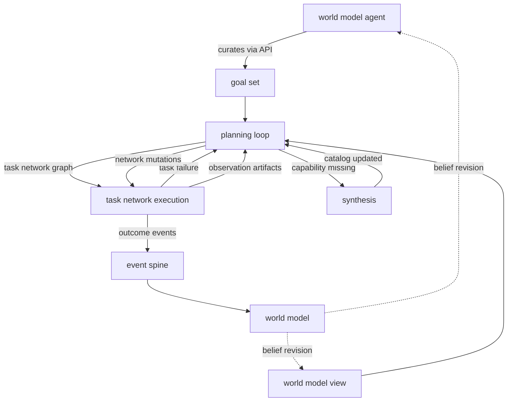

# Planning Pipeline

Date: 2026-05-05
Status: active
Scope: unified planning pipeline aligned to the graphs-lower-graphs execution model

## Foundational Pattern: Graphs Lower Graphs

The execution domain has one structural pattern that repeats at two levels:

```
Capability      atomic executable contract
    ↑ composed into graph
Task            graph of Capabilities (compiled, dependency-ordered, parallel by default)
    ↑ composed into graph
Task Network    graph of Tasks (the plan, dependency-ordered, parallel by default)
```

At each level, the execution model is identical:

1. compute the ready set — nodes whose dependencies are satisfied
2. dispatch ready nodes in parallel
3. receive completion events
4. update state (artifact availability, dependency satisfaction)
5. repeat until the graph is fully traversed

The task executor already implements this for capabilities within a task. The task network implements the same pattern for tasks within the network. The task network IS the plan — not a separate artifact compiled into a control program. HTN decomposition produces a task network graph directly.

## The Pipeline



Two concurrent processes connected by graph mutations, fed by a curated goal set:

- **world model agent**: evaluates beliefs against its normative framework, curates the goal set through execution's public API (add, modify, remove, satisfy)
- **planning loop**: continuous, reads goal set and world model view, maintains the task network graph, issues mutations when the goal set or belief changes
- **task network**: parallel, executes tasks, emits events, accepts graph mutations

The planning loop is indifferent to why goals change. It reacts to the current goal set and current belief. The world model agent owns the normative decisions (what to pursue, what to abandon, what to prioritize). The planning loop owns the operational decisions (how to achieve, when to switch plans, what the switching cost is).

## Vocabulary Alignment

The pipeline uses Meld's existing vocabulary. No new intermediate types.

| Meld concept | Role in pipeline |
|---|---|
| Capability | atomic operation — leaf node within a task graph |
| Task | compiled graph of capabilities — node within the task network |
| Task Network | graph of tasks — the plan, the executable structure |
| HTN Task Instance | abstract or concrete task in the decomposition tree |
| HTN Method Instance | chosen decomposition for an abstract task |
| HTN Lineage | preserved hierarchy explaining why each task exists |

The planning loop produces task network mutations. Not a separate "CompiledPlan" or "CompiledControlProgram." The task network graph is both the plan representation and the execution structure.

## Planning Loop

The planning loop is a continuous process that maintains the task network graph. It reads the goal set (curated by the world model agent) and subscribes to the world model view, then decomposes goals via HTN methods and issues mutations to the task network when the plan should change.

### Inputs

- **goal set**: desired belief states, curated by the world model agent through execution's public API
- **world model view**: current belief, uncertainty, freshness, preconditions (subscribed, not queried directly)
- **capability catalog**: available capabilities (compiled + synthesized)
- **method library**: available HTN decompositions
- **task network state**: what is currently running, completed, pending, failed

### HTN Decomposition

The planning loop uses HTN decomposition to convert goals into task graphs. Decomposition selects methods that break abstract tasks into sub-tasks, recursing until all leaves are concrete Tasks (compiled capability graphs).

The output of decomposition is a task network graph: tasks as nodes, dependency edges between them. Dependencies encode:

- **data flow**: task B needs an artifact that task A produces
- **ordering**: task B must follow task A (from HTN structure)
- **conditional**: task B should only execute if task A's output meets a condition (guard expression on the dependency edge)

```
TaskNetworkGraph {
    tasks: HashMap<TaskInstanceId, TaskEntry>,
    edges: Vec<TaskDependencyEdge>,
    lineage: HtnLineage,
}

TaskEntry {
    task_instance_id: TaskInstanceId,
    compiled_task: CompiledTaskRecord,
    init_artifacts: Vec<InitArtifact>,
    cost_estimate: CostEstimate,
}

TaskDependencyEdge {
    from: TaskInstanceId,
    to: TaskInstanceId,
    kind: DependencyKind,
}

enum DependencyKind {
    DataFlow { artifact_type: ArtifactTypeId },
    Ordering,
    Conditional { guard: GuardExpression },
}
```

### Control Flow Through Graph Structure

Control flow is encoded in graph structure. No separate compiled control program is needed. The task network graph itself encodes all control flow:

| Control concept | Graph equivalent |
|---|---|
| sequential dispatch | dependency edge (B depends on A) |
| parallel dispatch | independent nodes (no dependency path between them) |
| observation wait | a task whose output artifact is a dependency for downstream tasks |
| conditional branch | conditional dependency edge with guard expression |
| join barrier | a task with multiple incoming dependency edges (ready when all are satisfied) |
| loop | planning loop re-emits tasks into the network on the next iteration |

Branching deserves elaboration. When the planner cannot resolve a decision at planning time (insufficient belief), it emits:

1. an observation task that will produce a decision artifact
2. conditional dependency edges from the observation task to alternative downstream subtrees
3. guard expressions on those edges that evaluate the decision artifact

When the observation task completes and produces its artifact, the task network evaluates the conditional edges. Subtrees whose guards are not satisfied are pruned. Subtrees whose guards are satisfied become ready for dispatch.

This is the same `await_observation` + `branch` pattern from the control program design, expressed as graph structure rather than control nodes.

### Continuous Operation

The planning loop does not run once and stop. It continuously monitors:

- **goal set mutations**: the world model agent adds, removes, reprioritizes, or satisfies goals through the curation API
- **world model view changes**: belief invalidations, new observations (received through the subscribed view, not from the world model directly)
- **task network events**: task completions, failures, artifact production

When conditions change, the planning loop re-evaluates the current task network graph. It identifies which parts of the HTN tree are affected (which methods have preconditions that depend on the changed conditions) and re-decomposes only those subtrees.

The result is a set of task network mutations — not a new graph, but a delta against the existing graph.

## Task Network Mutations

The planning loop issues mutations to the task network. These are the operations the task network must support:

### inject

Add a task with its dependency edges. If dependencies are already satisfied (upstream tasks completed, artifacts available), the task enters the ready set immediately.

### cancel

Remove a task. If pending, remove from the graph. If running, issue graceful cancellation. Cancellation may require cleanup work — cleanup tasks are themselves injected into the network as normal tasks, with dependencies that ensure cleanup completes before replacement tasks begin.

### relink

Modify a task's dependency edges. A task's position in the graph changes (different upstream dependencies, different downstream consumers). The task itself is unchanged.

### preserve

Mark a completed task's artifacts as valid under the modified plan. When the planning loop re-decomposes a subtree, completed tasks that remain valid are preserved — their artifacts are relinked into the new dependency structure without re-execution.

### prune

Remove a conditional subtree whose guard was not satisfied. When an observation task completes and a branch is resolved, the unchosen subtrees are pruned from the graph.

## Cost-Aware Plan Transitions

Changing a running plan is not free. The planning loop must weigh the cost of switching against the benefit of the new plan.

### Switching costs

- **cleanup cost**: in-progress tasks that must be cancelled may require cleanup work (itself a set of tasks with cost estimates)
- **sunk cost**: completed work in the old plan that cannot be reused in the new plan is wasted effort
- **disruption cost**: the time to cancel, clean up, and inject new tasks delays progress toward the goal
- **risk cost**: the new plan is untested; the old plan had partial progress as evidence of viability

### How the planning loop uses cost

When the planning loop identifies that a belief change affects the current plan, it:

1. computes the new subtree (re-decomposition of the affected area)
2. computes the delta (what to cancel, inject, preserve)
3. estimates the switching cost (cleanup + sunk cost + disruption)
4. estimates the benefit (expected improvement in goal achievement given updated belief)
5. issues mutations only if benefit > switching cost

This is how the planner continuously assesses without necessarily breaking execution. Minor belief shifts that would produce marginal plan improvements are deferred. Major shifts (dependency broken, goal invalidated, regime change) override the cost threshold.

### Cleanup as planned work

When the planning loop decides to cancel in-progress tasks, it may need to inject cleanup tasks:

```
old plan:
  task_A (running) ──▶ task_B (pending) ──▶ task_C (pending)

new plan (method reselected):
  task_A_cleanup (new) ──▶ task_D (new) ──▶ task_E (new)

mutations:
  cancel: [task_A, task_B, task_C]
  inject: [task_A_cleanup, task_D, task_E]
  edge:   task_A_cleanup ──▶ task_D
```

Cleanup tasks are normal tasks. They have capabilities, dependencies, and cost estimates. The planning loop includes them in the switching cost calculation.

## HTN Lineage

The HTN lineage (task instances, method instances, parent links, method-child links) is preserved alongside the task network graph. It is not the execution structure — the graph is. It serves three purposes:

### Scoping plan changes

When a belief changes, the planning loop uses the lineage to identify which abstract task's preconditions are affected. It re-decomposes from that point in the tree, producing a subtree replacement. Only the affected subtree generates mutations.

### Explaining execution

Every task in the network maps back to a lineage path: this task exists because this method was chosen for this abstract task, which was decomposed from this parent task, which serves this goal. This is the "why" chain that audit and explanation need.

### Guiding method reselection

When a task fails and the planning loop re-evaluates, the lineage tells it which method was chosen and what alternatives exist. The planning loop can try a different method for the same abstract task — producing a new subtree that replaces the failed one.

## Synthesis Integration

When HTN decomposition reaches a task that requires a capability not in the catalog, the planning loop:

1. injects a `CapabilitySynthesisTask` into the task network
2. marks the blocked subtree as suspended (dependencies not yet satisfiable)
3. the synthesis task executes through the task network like any other task
4. synthesis completion updates the catalog
5. the planning loop re-evaluates the suspended subtree with the updated catalog
6. if the capability now exists, the subtree is unblocked and its tasks become ready

Synthesis is a task in the network, not a special-case pipeline. Graphs lower graphs — the synthesis task is itself a graph of capabilities.

## What Exists Today

### Fully implemented

- **task compiler** (`task/compiler.rs`, 508 lines): transforms TaskDefinition into CompiledTaskRecord
- **task executor** (`task/executor.rs`, 649 lines): executes a single task's capability graph — the lower level of the fractal
- **capability catalog** (`capability/catalog.rs`, 138 lines): versioned capability lookup
- **task events** (`task/events.rs`, 207 lines): task lifecycle event builders
- **readiness computation** (`task/readiness.rs`, 141 lines): computes ready capabilities within a task — the ready-set pattern at the lower level

### Designed but not implemented

- **HTN decomposition**: records defined (task instances, method instances, lineage), algorithm and method library not defined
- **guard expressions**: fully specified in [Guard Expression Semantics](guard_expression_semantics.md), applicable as conditional dependency edges
- **observation wait semantics**: fully specified in [Observation Wait Semantics](observation_wait_semantics.md), applicable as data-flow dependencies from observation tasks

### Not yet designed

- **task network graph executor**: the upper level of the fractal — walks a graph of tasks the same way the task executor walks a graph of capabilities
- **task network mutation operations**: inject, cancel, relink, preserve, prune
- **planning loop**: continuous operation, world-model reads, cost-aware mutation decisions
- **method library**: method definitions, preconditions, storage, query
- **switching cost model**: cleanup estimation, sunk cost calculation, benefit comparison
- **plan diffing**: identifying affected subtrees from belief changes, computing minimal mutations

## How The Existing Slices Map

| Design slice | Role in this model |
|---|---|
| `goals/` | goal set curated by world model agent, consumed by planning loop |
| `planning/htn/` | decomposition records and lineage — vocabulary for the planning loop |
| `planning/htn/lineage_model.md` | lineage preservation — used for scoping changes and guiding reselection |
| `planning/guard_expression_semantics.md` | conditional dependency edge evaluation (relocated from dissolved `program/`) |
| `planning/observation_wait_semantics.md` | data-flow dependency from observation tasks (relocated from dissolved `program/`) |
| `task_network.md` | the execution substrate — event-driven graph executor |
| `synthesis/` | tasks in the network, triggered by planning loop on missing capability |

## Relationship To Workflow Compatibility

Workflows currently short-circuit the planning loop entirely. The user-authored workflow profile IS the plan — a hand-specified task sequence.

In the graphs-lower-graphs model, workflow integration becomes clearer:

- a workflow profile lowers into a task network graph (task package lowering already bridges this)
- the graph is initially linear (tasks depend on their predecessor) because workflows are sequential
- as the planning loop matures, it can produce graphs with parallelism, branching, and observation points
- the task network executor handles both linear and complex graphs identically — the execution model doesn't change

The workflow executor's current role (advance through turns, evaluate gates, persist state) maps onto the task network graph executor's role (advance through the ready set, evaluate conditional edges, persist task network state). The existing workflow executor is a specialized instance of the general pattern.

## Open Gaps

### Method library

HTN decomposition has no domain knowledge without method definitions. A method definition should specify:

- preconditions over `WorldModelView`
- the set of sub-tasks introduced
- ordering and data-flow constraints between sub-tasks
- expected effects on world state
- cost estimate
- preference ordering among alternative methods for the same abstract task

### Task network graph executor

The upper level of the fractal is not implemented. It requires:

- graph-based ready-set computation (same pattern as task readiness but over tasks, not capabilities)
- conditional edge evaluation (guard expressions on dependency edges)
- mutation acceptance (inject, cancel, relink, preserve, prune)
- event reduction over the task graph (same pattern as task network event reduction)

### Switching cost model

Cost-aware plan transitions require cost estimates on tasks and a model for computing switching cost. This includes cleanup cost estimation, sunk cost of cancelled work, and benefit estimation of the new plan.

## Read With

- [Execution Domain](../README.md)
- [Execution Gaps](../GAPS.md)
- [Goals](../goals/README.md)
- [HTN Model](htn/README.md)
- [HTN Lineage Model](htn/lineage_model.md)
- [Task Network](../task_network.md)
- [Synthesis Overview](../synthesis/README.md)
- [Guard Expression Semantics](guard_expression_semantics.md)
- [Observation Wait Semantics](observation_wait_semantics.md)
- [World Model Planner](../../world_model/planner/README.md)
