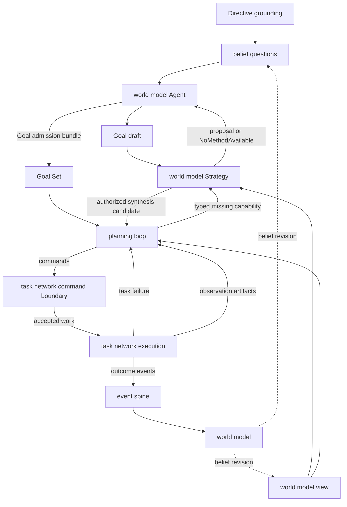

# Planning Pipeline

Date: 2026-07-23
Status: active
Scope: unified planning pipeline aligned to the graphs-lower-graphs execution model

## Foundational Pattern: Graphs Lower Graphs

The execution domain has one structural pattern that repeats at two levels:

```
Capability      atomic executable contract
    ↑ composed into graph
Task            graph of Capabilities, compiled and dependency ordered
    ↑ composed into graph
Task Network    graph of Tasks, the plan and dependency ordered
```

At each execution level, the operational model is identical:

1. compute the ready set — nodes whose dependencies are satisfied
2. dispatch ready nodes in parallel
3. receive completion events
4. update state with artifact availability and dependency satisfaction
5. repeat until the graph is fully traversed

The task executor already implements this for capabilities within a task. The task network implements the same pattern for tasks within the network. The task network is the accepted operational plan, not a separate control program. Upstream Strategy decisions remain semantic theories of action until Execution commits their realization.

## The Pipeline


```mermaid
flowchart TD
    DG[Directive grounding] --> BQ[belief questions]
    BQ --> AG[world model Agent]
    AG --> GD[Goal draft]
    GD --> ST[world model Strategy]
    WMV[world model view] --> ST
    ST -->|proposal or NoMethodAvailable| AG
    AG -->|Goal admission bundle| GS[Goal Set]
    GS --> PL[planning loop]
    WMV --> PL
    PL -->|commands| TN[task network command boundary]
    TN -->|accepted work| TE[task network execution]
    TE -->|outcome events| SP[event spine]
    SP --> WM[world model]
    WM -.->|belief revision| WMV
    WM -.->|belief revision| BQ

    TE -->|task failure| PL
    TE -->|observation artifacts| PL

    PL -->|typed missing capability| ST
    ST -->|authorized synthesis candidate| PL
```

Six cooperating concerns form the loop:

- **Directive grounding**: applies maintained PDS theory to trusted scope and instantiates concrete belief questions
- **world model Agent**: evaluates reconciled beliefs and constructs Goal drafts
- **world model Strategy**: constructs reusable and novel candidate Compositions before Goal admission
- **Directive Agent**: judges proposals and authorizes Goal admission with a nonempty Strategy inventory
- **planning loop**: continuous, reads authorized candidates and live operational state, maintains the intended task-network graph, issues commands when eligibility or operational state changes
- **task network**: parallel, executes tasks, emits events, accepts commands, and reduces accepted records into state

The planning loop is indifferent to why Goals or Strategy decisions change. The world model Agent owns what to pursue, tolerate, abandon, prioritize, and authorize. Strategy constructs semantically viable candidate proposals. The planning loop owns current applicability, operational selection within the authorized inventory, live-network tuning, plan transitions, and commitment.

## Vocabulary Alignment

The pipeline uses Meld's existing vocabulary. Execution may wrap raw language values when runtime context is required, but it does not create a second plan representation.

| Meld concept | Role in pipeline |
|---|---|
| Capability | atomic operation — leaf node within a task graph |
| Task | compiled graph of capabilities — node within the task network |
| Task Network | graph of tasks — the plan, the executable structure |
| Strategy Alternative | concrete semantic candidate; only the decision-selected subset is authorized |
| HTN Task Instance | abstract or concrete task in a reusable Method decomposition |
| HTN Method Instance | exact reusable Method provenance already instantiated by Strategy |
| HTN Lineage | preserved hierarchy explaining why each task exists |
| Execution Composition | execution owned wrapper around one concrete `Composition` plus stable identity and planning context |

The planning loop produces task-network commands carrying graph mutation sets. It does not produce a separate operational compiled plan. The accepted task-network graph is both the operational plan representation and the execution structure. Strategy decisions remain separate upstream semantic records.

## Planning Loop

The planning loop reads admitted Goals, their Agent-authorized candidate, world-model projections, capability state, and committed task-network state. It issues commands when the exact authorized candidate can be realized.

### Inputs

All planning loop inputs are expressed in the shared language [`meld-lang`](../../meld-lang/README.md):

- **Goal Set**: admitted desired belief states as `Proposition` targets. Every initial Goal arrived with one nonempty Agent authorization. See [Goals and Methods](../../meld-lang/goals_and_methods.md).
- **Strategy candidate**: the exact Method, bindings, Composition, action meaning, and evidence route authorized for the Goal. See [World Model Strategy](../../world_model/strategy/README.md).
- **world state**: `WorldState` — ground propositions published by the world model's planner-facing projection. The planning loop evaluates goals and preconditions against this. See [World State and Evaluation](../../meld-lang/world_state.md).
- **capability catalog**: available compiled and synthesized capabilities. Resolution queries from `Operator.resolution` match against registered `CapabilityTypeContract` values.
- **Method lineage**: the configured Method instantiated by Strategy into the concrete candidate. See [Goals and Methods](../../meld-lang/goals_and_methods.md).
- **task network state**: what is currently running, completed, pending, failed

### Authorized Composition Realization

Execution Planning realizes the exact authorized Strategy candidate:

1. Read the admitted Goal and settled authorization.
2. Reject stale or mismatched input lineage and world-frame requirements.
3. Apply only permitted operational bindings.
4. Evaluate current preconditions and resolve each Operator against the capability catalog.
5. Wrap the concrete Composition with authorization lineage, planning context, diagnostics, and resolution reports.
6. Lower the execution Composition into a task-network mutation set.
7. Submit the mutation set through existing task-network contracts.

Strategy performs Method matching and substitution before authorization, preserving exact Method revision, bindings, and resulting Composition meaning. Execution receives only the concrete Agent-authorized candidate. If it is no longer realizable, Execution reports typed rejection and creates no task-network mutation.

The output of execution composition lowering is a task network mutation set carried by a command. The mutation set contains tasks as nodes, dependency edges between them, lineage, and task init source plans. Dependencies encode:

- **data flow**: task B needs an artifact that task A produces and maps to `EdgeKind::DataFlow` in compositions
- **ordering**: task B must follow task A and maps to `EdgeKind::Ordering` in compositions
- **conditional**: task B should only execute if task A's output meets a condition and maps to `EdgeKind::Conditional` with guard expression
- **evidence admission**: task B waits until the owning world-model domain admits exact upstream content under the prospective artifact contract

```
TaskNetworkGraph {
    tasks: HashMap<TaskInstanceId, TaskEntry>,
    edges: Vec<TaskDependencyEdge>,
    lineage: HtnLineage,
}

TaskEntry {
    task_instance_id: TaskInstanceId,
    compiled_task: CompiledTaskRecord,
    init_artifacts: Vec<InitArtifact>,
    cost_estimate: CostEstimate,
}

TaskDependencyEdge {
    from: TaskInstanceId,
    to: TaskInstanceId,
    kind: DependencyKind,
}

enum DependencyKind {
    DataFlow { artifact_type: ArtifactTypeId },
    Ordering,
    Conditional { guard: GuardExpression },
}
```

Lowered output is submitted through an explicit task network command:

```rust
pub struct TaskNetworkCommandRequest {
    pub command_id: String,
    pub network_id: String,
    pub base_revision: u64,
    pub base_state_hash: String,
    pub read_preconditions: Vec<TaskNetworkReadPrecondition>,
    pub command: TaskNetworkCommand,
}

pub enum TaskNetworkCommand {
    ApplyMutationSet(TaskNetworkMutationSet),
    ClaimReadyTask(TaskNetworkDispatchRequest),
    RecordTaskOutcome(TaskNetworkDispatchOutcome),
    MarkPublication(TaskNetworkPublication),
}

pub struct TaskNetworkMutationSet {
    pub source_execution_composition_id: String,
    pub authorization_ref: String,
    pub mutations: Vec<TaskNetworkMutation>,
    pub lineage: HtnLineage,
    pub diagnostics: Vec<PlanningDiagnostic>,
}

pub enum TaskNetworkMutation {
    Inject(TaskInjectMutation),
    Cancel(TaskCancelMutation),
    Relink(TaskRelinkMutation),
    Preserve(TaskPreserveMutation),
    Prune(TaskPruneMutation),
}

pub struct TaskInjectMutation {
    pub task_instance_id: TaskInstanceId,
    pub compiled_task: CompiledTaskRecord,
    pub init_artifacts: Vec<InitArtifact>,
    pub incoming_edges: Vec<TaskNetworkDependencyEdge>,
    pub cost_estimate: CostEstimate,
}
```

Strategy-originated mutation commands preserve the admitted authorization and exact Goal, Method, Composition, and world-frame lineage. Existing task-network command identity and atomic acceptance rules remain authoritative for mutation replay.

Dispatch consumes the ready set after command acceptance. The execution composition does not carry task runtime state.

### All Or Nothing Lowering

Execution composition lowering is all or nothing for executable operator steps.

The lowerer inspects every concrete operator step in the composition. If any executable operator step cannot resolve to a capability contract, cannot compile into a task node, or references an invalid edge, the lowerer reports diagnostics and produces no executable graph mutation for that composition.

Recursive goal steps and conditional edges may be preserved as deferred diagnostics. They do not permit partial executable graph commit in the expanded execution slice.

This rule keeps the accepted task network graph coherent until plan diffing, preserve, relink, cancel, and prune mature.

### Task Init Sources

Lowering does not need the final runtime payload for every task.

For each task node, lowering records how required init slots will be satisfied.

Static source tasks can carry seed objects from goal context, target selectors, workflow triggers, or planner constants.

Data flow tasks carry source records that point to upstream task artifacts. Their final `TaskInitializationPayload` is materialized after upstream outcomes exist and before task execution.

The task network validates source records before dispatch. Materialization must match upstream task identity, artifact type, and schema version. The final payload must pass task initialization validation before a task executor is built.

### Control Flow Through Graph Structure

Control flow is encoded in graph structure. No separate compiled control program is needed. The task network graph itself encodes all control flow:

| Control concept | Graph equivalent |
|---|---|
| sequential dispatch | dependency edge from B to A |
| parallel dispatch | independent nodes with no dependency path between them |
| observation wait | a task whose output artifact is a dependency for downstream tasks |
| conditional branch | conditional dependency edge with guard expression |
| join barrier | a task with multiple incoming dependency edges |
| loop | planning loop re-emits tasks into the network on the next iteration |

Branching deserves elaboration. When an authorized Composition contains an observation-dependent branch, Execution realizes:

1. an observation task that will produce a decision artifact
2. conditional dependency edges from the observation task to alternative downstream subtrees
3. guard expressions on those edges that evaluate the decision artifact

When the observation task completes and produces its artifact, the task network evaluates the conditional edges. Subtrees whose guards are not satisfied are pruned. Subtrees whose guards are satisfied become ready for dispatch.

This is the same `await_observation` + `branch` pattern from the control program design, expressed as graph structure rather than control nodes.

### Continuous Operation

The planning loop does not run once and stop. It continuously monitors:

- **goal set mutations**: the world model agent adds, removes, reprioritizes, or satisfies goals through the curation API
- **world model view changes**: belief invalidations and new observations received through the subscribed view
- **task network events**: task completions, failures, artifact production

When conditions change, the planning loop re-evaluates the current task-network graph. For each active Goal, it calls `evaluate` to project whether the target appears satisfied, remains unsatisfied, or is indeterminate. It also rechecks Strategy validity, concrete candidate preconditions, capability resolution, and operational conflicts. Semantic invalidation returns to the Agent and Strategy loop. Operational changes produce only the necessary task-network delta.

The result is a task network command carrying a mutation set. It is not a new graph, but a delta against the existing graph.

## Task Network Mutation Sets

The planning loop issues commands that carry mutation sets to the task network. These are the graph operations the task network must support:

### inject

Add a task with its dependency edges. If dependencies are already satisfied through upstream task completion and artifact availability, the task enters the ready set immediately.

### cancel

Remove a task. If pending, remove from the graph. If running, issue graceful cancellation. Cancellation may require cleanup work — cleanup tasks are themselves injected into the network as normal tasks, with dependencies that ensure cleanup completes before replacement tasks begin.

### relink

Modify a task's dependency edges. A task's position in the graph changes through different upstream dependencies or downstream consumers. The task itself is unchanged.

### preserve

Mark a completed task's artifacts as valid under the modified operational plan. When an authorized replacement preserves exact reuse contracts, completed tasks that remain valid are relinked into the new dependency structure without re-execution.

### prune

Remove a conditional subtree whose guard was not satisfied. When an observation task completes and a branch is resolved, the unchosen subtrees are pruned from the graph.

## Cost-Aware Plan Transitions

Changing a running operational plan is not free. Execution Planning computes switching cost and applies the immutable Agent-authorized selection policy to world-model benefit and risk projections.

### Switching costs

- **cleanup cost**: in-progress tasks that must be cancelled may require cleanup work with its own cost estimates
- **sunk cost**: completed work in the old plan that cannot be reused in the new plan is wasted effort
- **disruption cost**: the time to cancel, clean up, and inject new tasks delays progress toward the goal
- **risk projection**: referenced world-model assessment supplied with each authorized alternative

### How the planning loop uses cost

When a new or still-valid authorized alternative may replace committed work, Execution Planning:

1. reads the exact authorized replacement Composition and transition contract
2. computes the operational delta of tasks to cancel, inject, relink, and preserve
3. estimates cleanup, sunk, and disruption cost
4. reads semantic benefit and risk from the referenced world-model projection
5. applies the immutable Agent-authorized selection policy
6. issues only the allowed mutations

Execution does not derive a new semantic subtree or estimate Goal benefit from raw belief. Missing authorization produces no transition. Authority revocation and every Goal transition that makes work ineligible block new dispatch immediately through the epoch fences.

### Cleanup as planned work

When an authorized transition requires cancellation, its transition contract may include cleanup work:

```
old plan:
  task_A (running) ──▶ task_B (pending) ──▶ task_C (pending)

new authorized realization:
  task_A_cleanup (new) ──▶ task_D (new) ──▶ task_E (new)

mutations:
  cancel: [task_A, task_B, task_C]
  inject: [task_A_cleanup, task_D, task_E]
  edge:   task_A_cleanup ──▶ task_D
```

Cleanup tasks are normal tasks. Strategy or a pre-authorized transition policy supplies their semantic topology. Execution includes their operational cost in the switching calculation and realizes them mechanically.

## HTN Lineage

Execution lineage records Strategy decision, candidate Composition, zero or more Method instances, task instances, parent links, and child links alongside the task-network graph. It is not the execution structure. The graph is the execution structure. Lineage serves three purposes:

### Scoping plan changes

When a relevant source changes, Execution uses lineage to identify affected operational work. Any new semantic meaning requires a new Agent authorization.

### Explaining execution

Every task in the network maps back through an accepted commitment to the Strategy decision, candidate Composition, exact Goal revision, optional reusable Method, and PDS lineage. This is the audit and explanation chain.

### Guiding candidate selection

When a task outcome changes current applicability, Execution may reject the admitted candidate. It must not choose another candidate without a new Agent authorization.

## Synthesis Integration

When realization reaches an authorized Operator with no matching capability, Execution emits a typed rejection. It does not inject synthesis automatically.

Synthesis is outside the minimal Strategy contract. Execution reports an unavailable realization rather than creating new semantic meaning.

## What Exists Today

### Fully implemented

- **task compiler**: `task/compiler.rs` transforms TaskDefinition into CompiledTaskRecord
- **task executor**: `task/executor.rs` executes a single task's capability graph at the lower level of the fractal
- **capability catalog**: `capability/catalog.rs` provides versioned capability lookup
- **task events**: `task/events.rs` builds task lifecycle events
- **readiness computation**: `task/readiness.rs` computes ready capabilities within a task
- **goal store**: `goals/` stores execution owned goals and lifecycle command outcomes
- **method library**: `planning/method_library.rs` loads and verifies serialized methods
- **planning runtime**: `planning/runtime.rs` turns one active goal and one projected world state into `ExecutionComposition`
- **expanded execution slice**: [Phase 8 Expanded Execution Slice](../../../plan/execution/task_network/PHASE8.md) lowers multi node compositions, materializes task init payloads, dispatches real task runs, and replays accepted graph state

### Designed but not fully implemented

- **exact subgoal realization**: later planning expands the concrete child Composition or Method invocation already resolved inside the authorized candidate
- **guard expressions**: fully specified in [Guard Expression Semantics](guard_expression_semantics.md), applicable as conditional dependency edges
- **observation wait semantics**: fully specified in [Observation Wait Semantics](observation_wait_semantics.md), applicable as data-flow dependencies from observation tasks
- **task network first slice**: specified in [Phase 7 Task Network Plan](../../../plan/execution/task_network/PLAN.md), covering one inject mutation, one ready task, one dispatch, and one publication handoff

### Deferred Beyond First Slice

- **planning loop**: continuous operation, world-model reads, cost-aware mutation proposal decisions
- **task network deepening**: recursive sub-goal lowering, cancel, relink, preserve, and prune
- **sensory runtime**: diff native observation remains deferred until task network deepening has the required runtime hooks
- **switching cost model**: cleanup estimation, sunk cost calculation, benefit comparison
- **plan diffing**: identifying affected subtrees from belief changes, computing minimal mutations

## How The Existing Slices Map

| Design slice | Role in this model |
|---|---|
| `goals/` | Goal admission and lifecycle store consumed by planning loop |
| `planning/htn/` | reusable Method realization records and compatibility lineage vocabulary |
| `planning/htn/lineage_model.md` | lineage preservation for scoped operational changes and Strategy ancestry |
| `planning/guard_expression_semantics.md` | conditional dependency edge evaluation relocated from dissolved `program/` |
| `planning/observation_wait_semantics.md` | data-flow dependency from observation tasks relocated from dissolved `program/` |
| `task_network.md` | the execution substrate — event-driven graph executor |
| `synthesis/` | task-network work realized only from an authorized synthesis candidate |

## Relationship To Workflow Compatibility

Workflows currently short-circuit the planning loop entirely. The user-authored workflow profile IS the plan — a hand-specified task sequence.

In the graphs-lower-graphs model, workflow integration becomes clearer:

- a workflow profile lowers into a task network graph through task package lowering
- the graph is initially linear because tasks depend on their predecessor in sequential workflows
- as the planning loop matures, it can produce graphs with parallelism, branching, and observation points
- the task network executor handles both linear and complex graphs identically — the execution model doesn't change

The workflow executor's current role maps onto the task network graph executor's role. Workflow advances through turns, evaluates gates, and persists state. Task network execution advances through the ready set, evaluates conditional edges, and persists task network state. The existing workflow executor is a specialized instance of the general pattern.

## Open Gaps

### Method Library Deepening

The first method library slice exists and supports serialized `meld-lang::Method` values. The `Method` type is defined in [`meld-lang`](../../meld-lang/goals_and_methods.md) with:

- `trigger`: a `Proposition` pattern with `Term::Variable` for unification against goals
- `preconditions`: `Vec<Proposition>` checked against `WorldState` after trigger unification
- `composition`: a `Composition` template with variable references substituted from bindings
- `net_effects`: `Vec<Effect>` for verifying settlement of the goal target without expanding the composition
- `cost`: `CostEstimate` for comparison and ceiling checks
- `preference`: ordering among alternative methods for the same goal

The Method type, matching operations, Method loading, verification, and the first `docs_freshness` fixture are implemented. They represent current configured-path compatibility. What remains:

- **method authoring**: concrete methods beyond docs freshness, such as test status and course generation
- **method library operations**: indexing by trigger shape and cache invalidation on file change
- **Method promotion**: whether generalized Strategy candidates can become verified reusable Methods, deferred

### Task Network Deepening

The Phase 7 and Phase 8 slices now cover inject mutation, reduced state, ready set computation, dispatch claim fencing, multi node graph execution, task init materialization, real task runtime bridge, durable publication handoff, and replay.

Later work still requires:

- conditional edge evaluation with guard expressions on dependency edges
- recursive sub-goal lowering
- cancel, relink, preserve, and prune mutation behavior
- task equivalence and shared-task reuse across goals

### Switching cost model

Cost-aware plan transitions require cost estimates on tasks and a model for computing switching cost. This includes cleanup cost estimation, sunk cost of cancelled work, and benefit estimation of the new plan.

## Read With

- [Execution Domain](../README.md)
- [Execution Gaps](../GAPS.md)
- [Goals](../goals/README.md)
- [HTN Model](htn/README.md)
- [HTN Lineage Model](htn/lineage_model.md)
- [Task Network](../task_network.md)
- [Synthesis Overview](../synthesis/README.md)
- [Guard Expression Semantics](guard_expression_semantics.md)
- [Observation Wait Semantics](observation_wait_semantics.md)
- [Lang Domain](../../meld-lang/README.md)
- [Lang Goals and Methods](../../meld-lang/goals_and_methods.md)
- [Lang Operators and Resolution](../../meld-lang/operators.md)
- [Lang Compositions](../../meld-lang/compositions.md)
- [Lang World State and Evaluation](../../meld-lang/world_state.md)
- [World Model Planner](../../world_model/planner/README.md)
