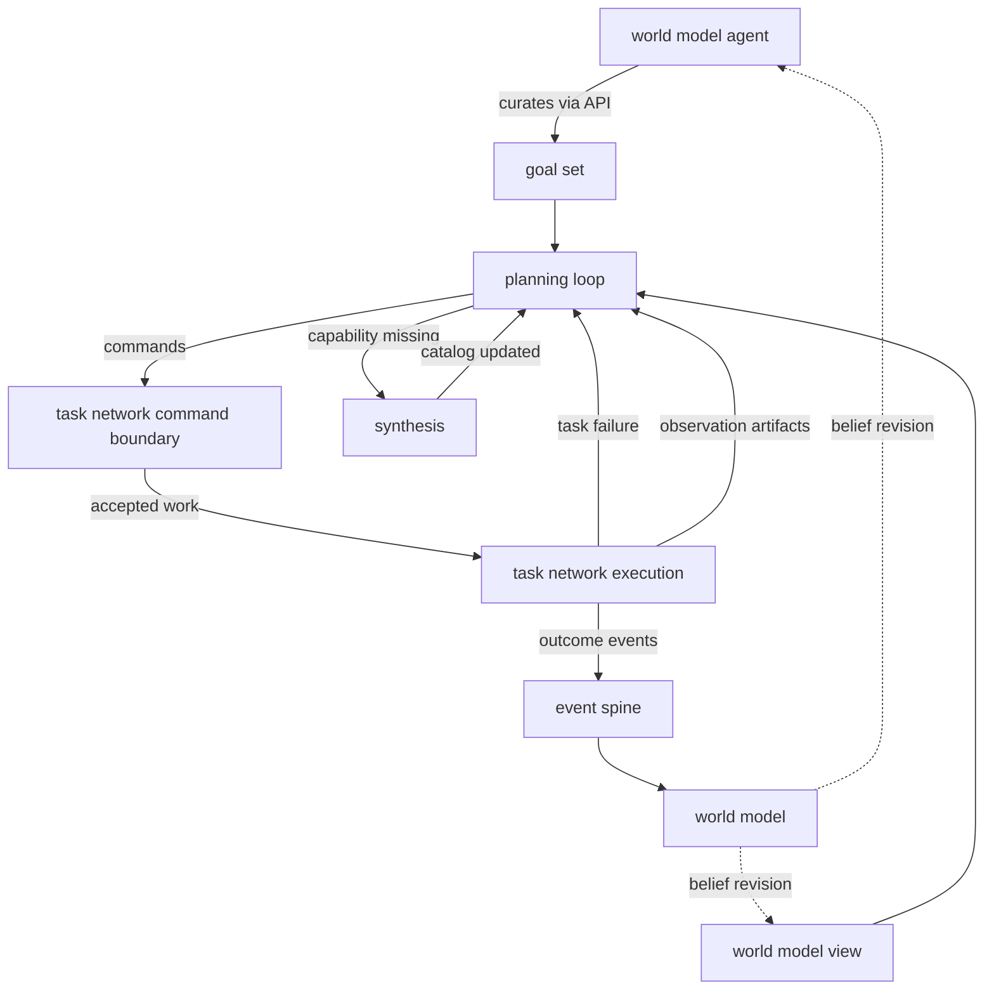

# Planning Pipeline

Date: 2026-06-02
Status: active
Scope: unified planning pipeline aligned to the graphs-lower-graphs execution model

## Foundational Pattern: Graphs Lower Graphs

The execution domain has one structural pattern that repeats at two levels:

```
Capability      atomic executable contract
    ↑ composed into graph
Task            graph of Capabilities, compiled and dependency ordered
    ↑ composed into graph
Task Network    graph of Tasks, the plan and dependency ordered
```

At each level, the execution model is identical:

1. compute the ready set — nodes whose dependencies are satisfied
2. dispatch ready nodes in parallel
3. receive completion events
4. update state with artifact availability and dependency satisfaction
5. repeat until the graph is fully traversed

The task executor already implements this for capabilities within a task. The task network implements the same pattern for tasks within the network. The task network IS the plan — not a separate artifact compiled into a control program. HTN decomposition produces a task network graph as its target shape.

## The Pipeline


```mermaid
flowchart TD
    AG[world model agent] -->|curates via API| GS[goal set]
    WMV[world model view] --> PL[planning loop]
    GS --> PL
    PL -->|commands| TN[task network command boundary]
    TN -->|accepted work| TE[task network execution]
    TE -->|outcome events| SP[event spine]
    SP --> WM[world model]
    WM -.->|belief revision| WMV
    WM -.->|belief revision| AG

    TE -->|task failure| PL
    TE -->|observation artifacts| PL

    PL -->|capability missing| SY[synthesis]
    SY -->|catalog updated| PL
```

Two concurrent processes connected by task network commands, fed by a curated goal set:

- **world model agent**: evaluates beliefs against its normative framework and curates the goal set through execution's public API
- **planning loop**: continuous, reads goal set and world model view, maintains the intended task network graph, issues commands when the goal set or belief changes
- **task network**: parallel, executes tasks, emits events, accepts commands, and reduces accepted records into state

The planning loop is indifferent to why goals change. It reacts to the current goal set and current belief. The world model agent owns the normative decisions about what to pursue, abandon, and prioritize. The planning loop owns the operational decisions about how to achieve goals, when to switch plans, and what the switching cost is.

## Vocabulary Alignment

The pipeline uses Meld's existing vocabulary. Execution may wrap raw language values when runtime context is required, but it does not create a second plan representation.

| Meld concept | Role in pipeline |
|---|---|
| Capability | atomic operation — leaf node within a task graph |
| Task | compiled graph of capabilities — node within the task network |
| Task Network | graph of tasks — the plan, the executable structure |
| HTN Task Instance | abstract or concrete task in the decomposition tree |
| HTN Method Instance | chosen decomposition for an abstract task |
| HTN Lineage | preserved hierarchy explaining why each task exists |
| Execution Composition | execution owned wrapper around one concrete `Composition` plus stable identity and planning context |

The planning loop produces task network commands carrying graph mutation sets. It does not produce a separate "CompiledPlan" or "CompiledControlProgram." The accepted task network graph is both the plan representation and the execution structure.

## Planning Loop

The planning loop is a continuous process that maintains an intended task network graph. It reads the goal set curated by the world model agent and subscribes to the world model view, then decomposes goals via HTN methods and issues commands to the task network when the plan should change.

### Inputs

All planning loop inputs are expressed in the shared language [`meld-lang`](../../meld-lang/README.md):

- **goal set**: `Vec<Goal>` — desired belief states as `Proposition` targets, curated by the world model agent through execution's public API. See [Goals and Methods](../../meld-lang/goals_and_methods.md).
- **world state**: `WorldState` — ground propositions published by the world model's planner-facing projection. The planning loop evaluates goals and preconditions against this. See [World State and Evaluation](../../meld-lang/world_state.md).
- **capability catalog**: available compiled and synthesized capabilities. Resolution queries from `Operator.resolution` match against registered `CapabilityTypeContract` values.
- **method library**: `Vec<Method>` — serialized HTN decompositions loaded at runtime. Methods match goals through pattern unification and produce `Composition` graphs. See [Goals and Methods](../../meld-lang/goals_and_methods.md).
- **task network state**: what is currently running, completed, pending, failed

### HTN Decomposition

The planning loop uses HTN decomposition to convert goals into task graphs. The core operation is method matching, defined in [`meld-lang`](../../meld-lang/goals_and_methods.md):

1. For each active `Goal`, `unify(method.trigger, goal.target)` finds matching methods
2. `substitute(method.composition, bindings)` produces a concrete `Composition`
3. Each `Operator` in the composition is resolved against the capability catalog through its `Resolution` query
4. The concrete composition is wrapped as an execution composition with validation, projected effects, selected method provenance, bindings, world frame provenance, diagnostics, and operator resolution reports
5. Execution composition lowering turns the concrete composition into task network mutation sets carried by commands

If no method matches, the planning loop may request LLM-assisted decomposition that constructs a `Composition` directly or report the goal as unachievable with the current catalog.

The output of execution composition lowering is a task network mutation set carried by a command. The mutation set contains tasks as nodes, dependency edges between them, lineage, and task init source plans. Dependencies encode:

- **data flow**: task B needs an artifact that task A produces and maps to `EdgeKind::DataFlow` in compositions
- **ordering**: task B must follow task A and maps to `EdgeKind::Ordering` in compositions
- **conditional**: task B should only execute if task A's output meets a condition and maps to `EdgeKind::Conditional` with guard expression

```
TaskNetworkGraph {
    tasks: HashMap<TaskInstanceId, TaskEntry>,
    edges: Vec<TaskDependencyEdge>,
    lineage: HtnLineage,
}

TaskEntry {
    task_instance_id: TaskInstanceId,
    compiled_task: CompiledTaskRecord,
    init_artifacts: Vec<InitArtifact>,
    cost_estimate: CostEstimate,
}

TaskDependencyEdge {
    from: TaskInstanceId,
    to: TaskInstanceId,
    kind: DependencyKind,
}

enum DependencyKind {
    DataFlow { artifact_type: ArtifactTypeId },
    Ordering,
    Conditional { guard: GuardExpression },
}
```

Lowered output is submitted through an explicit task network command:

```rust
pub struct TaskNetworkCommandRequest {
    pub command_id: String,
    pub network_id: String,
    pub base_revision: u64,
    pub base_state_hash: String,
    pub read_preconditions: Vec<TaskNetworkReadPrecondition>,
    pub command: TaskNetworkCommand,
}

pub enum TaskNetworkCommand {
    ApplyMutationSet(TaskNetworkMutationSet),
    ClaimReadyTask(TaskNetworkDispatchRequest),
    RecordTaskOutcome(TaskNetworkDispatchOutcome),
    MarkPublication(TaskNetworkPublication),
}

pub struct TaskNetworkMutationSet {
    pub source_execution_composition_id: String,
    pub mutations: Vec<TaskNetworkMutation>,
    pub lineage: HtnLineage,
    pub diagnostics: Vec<PlanningDiagnostic>,
}

pub enum TaskNetworkMutation {
    Inject(TaskInjectMutation),
    Cancel(TaskCancelMutation),
    Relink(TaskRelinkMutation),
    Preserve(TaskPreserveMutation),
    Prune(TaskPruneMutation),
}

pub struct TaskInjectMutation {
    pub task_instance_id: TaskInstanceId,
    pub compiled_task: CompiledTaskRecord,
    pub init_artifacts: Vec<InitArtifact>,
    pub incoming_edges: Vec<TaskNetworkDependencyEdge>,
    pub cost_estimate: CostEstimate,
}
```

Dispatch consumes the ready set after command acceptance. The execution composition does not carry task runtime state.

### All Or Nothing Lowering

Execution composition lowering is all or nothing for executable operator steps.

The lowerer inspects every concrete operator step in the composition. If any executable operator step cannot resolve to a capability contract, cannot compile into a task node, or references an invalid edge, the lowerer reports diagnostics and produces no executable graph mutation for that composition.

Recursive goal steps and conditional edges must lower completely into valid graph mutations. A lowerer that surfaces either construct as a diagnostic produces no executable graph mutation for that composition.

This rule keeps the accepted task network graph coherent across plan diffing, preserve, relink, cancel, and prune operations.

### Task Init Sources

Lowering does not need the final runtime payload for every task.

For each task node, lowering records how required init slots will be satisfied.

Static source tasks can carry seed objects from goal context, target selectors, workflow triggers, or planner constants.

Data flow tasks carry source records that point to upstream task artifacts. Their final `TaskInitializationPayload` is materialized after upstream outcomes exist and before task execution.

The task network validates source records before dispatch. Materialization must match upstream task identity, artifact type, and schema version. The final payload must pass task initialization validation before a task executor is built.

### Control Flow Through Graph Structure

Control flow is encoded in graph structure. No separate compiled control program is needed. The task network graph itself encodes all control flow:

| Control concept | Graph equivalent |
|---|---|
| sequential dispatch | dependency edge from B to A |
| parallel dispatch | independent nodes with no dependency path between them |
| observation wait | a task whose output artifact is a dependency for downstream tasks |
| conditional branch | conditional dependency edge with guard expression |
| join barrier | a task with multiple incoming dependency edges |
| loop | planning loop re-emits tasks into the network on the next iteration |

Branching deserves elaboration. When the planner cannot resolve a decision at planning time because belief is insufficient, it emits:

1. an observation task that will produce a decision artifact
2. conditional dependency edges from the observation task to alternative downstream subtrees
3. guard expressions on those edges that evaluate the decision artifact

When the observation task completes and produces its artifact, the task network evaluates the conditional edges. Subtrees whose guards are not satisfied are pruned. Subtrees whose guards are satisfied become ready for dispatch.

This is the same `await_observation` + `branch` pattern from the control program design, expressed as graph structure rather than control nodes.

### Continuous Operation

The planning loop does not run once and stop. It continuously monitors:

- **goal set mutations**: the world model agent adds, removes, reprioritizes, or satisfies goals through the curation API
- **world model view changes**: belief invalidations and new observations received through the subscribed view
- **task network events**: task completions, failures, artifact production

When conditions change, the planning loop re-evaluates the current task network graph. For each active goal, it calls `evaluate(&world_state, &goal.target)` to check whether the goal is now satisfied, still unsatisfied with a potentially different gap, or indeterminate and requiring observation. It identifies which parts of the HTN tree are affected. Method preconditions are re-evaluated against the updated `WorldState`, and only affected subtrees are re-decomposed.

The result is a task network command carrying a mutation set. It is not a new graph, but a delta against the existing graph.

## Task Network Mutation Sets

The planning loop issues commands that carry mutation sets to the task network. These are the graph operations the task network must support:

### inject

Add a task with its dependency edges. If dependencies are already satisfied through upstream task completion and artifact availability, the task enters the ready set immediately.

### cancel

Remove a task. If pending, remove from the graph. If running, issue graceful cancellation. Cancellation may require cleanup work — cleanup tasks are themselves injected into the network as normal tasks, with dependencies that ensure cleanup completes before replacement tasks begin.

### relink

Modify a task's dependency edges. A task's position in the graph changes through different upstream dependencies or downstream consumers. The task itself is unchanged.

### preserve

Mark a completed task's artifacts as valid under the modified plan. When the planning loop re-decomposes a subtree, completed tasks that remain valid are preserved — their artifacts are relinked into the new dependency structure without re-execution.

### prune

Remove a conditional subtree whose guard was not satisfied. When an observation task completes and a branch is resolved, the unchosen subtrees are pruned from the graph.

## Cost-Aware Plan Transitions

Changing a running plan is not free. The planning loop must weigh the cost of switching against the benefit of the new plan.

### Switching costs

- **cleanup cost**: in-progress tasks that must be cancelled may require cleanup work with its own cost estimates
- **sunk cost**: completed work in the old plan that cannot be reused in the new plan is wasted effort
- **disruption cost**: the time to cancel, clean up, and inject new tasks delays progress toward the goal
- **risk cost**: the new plan is untested; the old plan had partial progress as evidence of viability

### How the planning loop uses cost

When the planning loop identifies that a belief change affects the current plan, it:

1. computes the new subtree for the affected area
2. computes the delta of tasks to cancel, inject, and preserve
3. estimates the switching cost from cleanup, sunk cost, and disruption
4. estimates the expected improvement in goal achievement given updated belief
5. issues mutations only if benefit > switching cost

This is how the planner continuously assesses without necessarily breaking execution. Minor belief shifts that would produce marginal plan improvements are deferred. Major shifts such as broken dependencies, invalidated goals, and regime changes override the cost threshold.

### Cleanup as planned work

When the planning loop decides to cancel in-progress tasks, it may need to inject cleanup tasks:

```
old plan:
  task_A (running) ──▶ task_B (pending) ──▶ task_C (pending)

new plan (method reselected):
  task_A_cleanup (new) ──▶ task_D (new) ──▶ task_E (new)

mutations:
  cancel: [task_A, task_B, task_C]
  inject: [task_A_cleanup, task_D, task_E]
  edge:   task_A_cleanup ──▶ task_D
```

Cleanup tasks are normal tasks. They have capabilities, dependencies, and cost estimates. The planning loop includes them in the switching cost calculation.

## HTN Lineage

The HTN lineage records task instances, method instances, parent links, and method-child links alongside the task network graph. It is not the execution structure. The graph is the execution structure. Lineage serves three purposes:

### Scoping plan changes

When a belief changes, the planning loop uses the lineage to identify which abstract task's preconditions are affected. It re-decomposes from that point in the tree, producing a subtree replacement. Only the affected subtree generates mutations.

### Explaining execution

Every task in the network maps back to a lineage path: this task exists because this method was chosen for this abstract task, which was decomposed from this parent task, which serves this goal. This is the "why" chain that audit and explanation need.

### Guiding method reselection

When a task fails and the planning loop re-evaluates, the lineage tells it which method was chosen and what alternatives exist. The planning loop can try a different method for the same abstract task — producing a new subtree that replaces the failed one.

## Synthesis Integration

When HTN decomposition reaches a task that requires a capability not in the catalog, the planning loop:

1. injects a `CapabilitySynthesisTask` into the task network
2. marks the blocked subtree as suspended because dependencies are not yet satisfiable
3. the synthesis task executes through the task network like any other task
4. synthesis completion updates the catalog
5. the planning loop re-evaluates the suspended subtree with the updated catalog
6. if the capability now exists, the subtree is unblocked and its tasks become ready

Synthesis is a task in the network, not a special-case pipeline. Graphs lower graphs — the synthesis task is itself a graph of capabilities.

## Layer Responsibilities

- **task compiler**: transforms a task definition into a compiled task record
- **task executor**: executes one task capability graph at the lower level of the fractal
- **capability catalog**: provides versioned capability lookup
- **task events**: carry factual task lifecycle outcomes
- **readiness computation**: computes ready capabilities within a task
- **goal store**: stores execution-owned goals and lifecycle command outcomes
- **method library**: loads, indexes, and verifies serialized methods
- **planning runtime**: turns active goals and projected world state into execution compositions
- **HTN decomposition**: recursively lowers sub-goals while preserving method and task lineage
- **guard evaluation**: evaluates conditional dependency edges under [Guard Expression Semantics](guard_expression_semantics.md)
- **observation waiting**: models observation tasks as data-flow dependencies under [Observation Wait Semantics](observation_wait_semantics.md)
- **task network command boundary**: accepts graph mutation sets and lifecycle outcomes through one writer
- **task network runtime**: materializes task inputs, dispatches task runs, and replays accepted graph state
- **switching cost policy**: compares cleanup cost, sunk cost, disruption, and expected benefit
- **plan diffing**: identifies affected subtrees and constructs minimal mutation sets

## Contract Map

| Design slice | Role in this model |
|---|---|
| `goals/` | goal set curated by world model agent, consumed by planning loop |
| `planning/htn/` | decomposition records and lineage — vocabulary for the planning loop |
| `planning/htn/lineage_model.md` | lineage preservation — used for scoping changes and guiding reselection |
| `planning/guard_expression_semantics.md` | conditional dependency edge evaluation |
| `planning/observation_wait_semantics.md` | data-flow dependency from observation tasks |
| `task_network.md` | the execution substrate — event-driven graph executor |
| `synthesis/` | tasks in the network, triggered by planning loop on missing capability |

## Relationship To Workflow Compatibility

The compatibility workflow route may short-circuit the planning loop. On that route, the user-authored workflow profile is the hand-specified plan.

In the graphs-lower-graphs model, workflow integration becomes clearer:

- a workflow profile lowers into a task network graph through task package lowering
- sequential workflow turns produce a linear dependency graph
- workflow profiles may also produce graphs with parallelism, branching, and observation points
- the task network executor handles both linear and complex graphs identically — the execution model doesn't change

The workflow executor role maps onto the task network graph executor role. Workflow advances through turns, evaluates gates, and persists state. Task network execution advances through the ready set, evaluates conditional edges, and persists task network state. The workflow executor is a specialized instance of the general pattern.

## Detailed Contracts

### Method Library

The method library owns serialized `meld-lang::Method` values. The `Method` type is defined in [`meld-lang`](../../meld-lang/goals_and_methods.md) with:

- `trigger`: a `Proposition` pattern with `Term::Variable` for unification against goals
- `preconditions`: `Vec<Proposition>` checked against `WorldState` after trigger unification
- `composition`: a `Composition` template with variable references substituted from bindings
- `net_effects`: `Vec<Effect>` for verifying goal achievement without expanding the composition
- `cost`: `CostEstimate` for comparison and ceiling checks
- `preference`: ordering among alternative methods for the same goal

The library validates methods on load, indexes them by trigger shape, invalidates changed catalog entries, and returns deterministic candidate ordering for the same catalog state and query.

### Task Network

The task network contract covers mutation acceptance, reduced state, ready-set computation, dispatch claim fencing, multi-node graph execution, conditional edge evaluation, task input materialization, task runtime bridging, durable publication handoff, and replay.

Graph mutations include inject, cancel, relink, preserve, and prune. Recursive lowering preserves HTN lineage. Task equivalence permits shared-task reuse only when identity, inputs, scope, and lifecycle fencing match.

### Switching cost model

Cost-aware plan transitions require cost estimates on tasks and a model for computing switching cost. This includes cleanup cost estimation, sunk cost of cancelled work, and benefit estimation of the new plan.

## Read With

- [Execution Domain](../README.md)
- [Execution Integration Contracts](../GAPS.md)
- [Goals](../goals/README.md)
- [HTN Model](htn/README.md)
- [HTN Lineage Model](htn/lineage_model.md)
- [Task Network](../task_network.md)
- [Synthesis Overview](../synthesis/README.md)
- [Guard Expression Semantics](guard_expression_semantics.md)
- [Observation Wait Semantics](observation_wait_semantics.md)
- [Lang Domain](../../meld-lang/README.md)
- [Lang Goals and Methods](../../meld-lang/goals_and_methods.md)
- [Lang Operators and Resolution](../../meld-lang/operators.md)
- [Lang Compositions](../../meld-lang/compositions.md)
- [Lang World State and Evaluation](../../meld-lang/world_state.md)
- [World Model Planner](../../world_model/planner/README.md)
