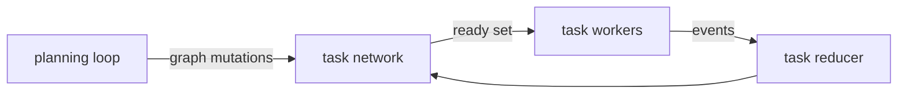

# Task Network

Date: 2026-05-09
Status: active
Scope: shared execution graph, event-driven dispatch, and graph mutation acceptance

## Core Position

The task network is the shared execution substrate for all goals. It is a single graph of tasks, dependency-ordered, parallel by default.

```
Capability      atomic executable contract
    ↑ composed into graph
Task            graph of Capabilities (compiled, dependency-ordered)
    ↑ composed into graph
Task Network    graph of Tasks (the plan, dependency-ordered)
```

The task network IS the plan. There is no separate plan artifact. Planning agents decompose goals into candidate subgraphs and commit them to the task network. The task network executes by computing the ready set and dispatching.

At each level, the execution model is identical: compute ready set, dispatch ready nodes, receive completion events, update state.

## Single Shared Graph

There is one task network graph across all goals and all agents. This is how the system discovers shared dependencies, avoids redundant work, and coordinates parallel execution.

When two goals independently require "run tests," both planning processes decompose into subgraphs that reference the same task. The commit phase detects the overlap. A shared task satisfies both dependency chains.

The graph is the coordination mechanism. No separate multi-goal coordination protocol is needed.

## Ownership

The task network owns:

- **task execution state**: pending, in-flight, completed, failed, cancelled per task instance
- **artifact availability**: which output artifacts exist and can satisfy downstream dependencies
- **dependency state**: which edges are satisfied, which are pending
- **ready set**: tasks whose dependencies are fully satisfied, available for dispatch
- **graph structure**: the current set of task nodes and dependency edges

The task network does NOT own:

- **goal state**: owned by the goal set in execution, curated by world model agents
- **plan decisions**: owned by planning agents that commit subgraphs to the network
- **task internals**: the capability graph within a task is owned by the task executor
- **normative judgment**: the decision of what to pursue is the world model agent's concern

## Event Model

The task network is event-driven. Workers emit events. Reducers update state. No worker mutates network state directly.



### Task events

- `task_requested` — task instance created in the graph
- `task_started` — task dispatched to a worker
- `task_progressed` — intermediate progress within a task
- `task_succeeded` — task completed, output artifacts available
- `task_failed` — task failed (retries exhausted at task level)
- `task_blocked` — task cannot proceed (dependency issue)
- `task_artifact_emitted` — output artifact produced (may occur before task_succeeded)
- `task_cancelled` — task removed from the graph (via cancel mutation)

These events derive:

- active task set (in-flight)
- ready task set (dependencies satisfied, not yet dispatched)
- completed task set (succeeded)
- failed task set
- artifact availability (for dependency satisfaction)

### Spine alignment

Events use the canonical spine envelope:

```rust
struct SpineEvent {
    ts: String,
    session: String,
    seq: u64,
    domain_id: String,
    stream_id: String,
    event_type: String,
    content_hash: Option<String>,
    data: serde_json::Value,
}
```

`domain_id` is `execution`. `stream_id` is typically the task instance ID.

## Graph Mutations

The task network accepts mutations from planning agents. These are the operations that modify the graph while execution is in progress:

| Mutation | Effect |
|---|---|
| **inject** | Add a task with dependency edges. If dependencies already satisfied, task enters ready set immediately. |
| **cancel** | Remove a task. If pending, remove from graph. If running, issue graceful cancellation. Cleanup tasks may be injected as normal tasks. |
| **relink** | Modify a task's dependency edges. Task position in graph changes; task itself is unchanged. |
| **preserve** | Mark a completed task's artifacts as valid under a modified plan. Artifacts relinked into new dependency structure without re-execution. |
| **prune** | Remove a conditional subtree whose guard was not satisfied. |

Mutations are the interface between planning and execution. The planning loop decides WHAT to mutate (based on goal evaluation, belief changes, cost analysis). The task network decides HOW to apply the mutation (state transitions, cleanup, ready-set recomputation).

## Ready Set Computation

The ready set is computed over the task graph the same way it is computed over the capability graph within a task:

For each task that is NOT completed and NOT in-flight:
1. All incoming dependency edges must be satisfied
2. For `DataFlow` edges: the upstream task must have produced the required artifact
3. For `Ordering` edges: the upstream task must be completed
4. For `Conditional` edges: the upstream task must be completed AND the guard expression must evaluate to true

Tasks whose dependencies are all satisfied enter the ready set and may be dispatched to workers.

This is the upper level of the fractal. `compute_ready_capability_instances` (implemented in `task/readiness.rs`) performs the identical computation at the lower level.

## Conditional Edge Evaluation

When an observation task completes, its output artifact is used to evaluate guard expressions on conditional dependency edges. See [Guard Expression Semantics](planning/guard_expression_semantics.md).

- Conditional edges whose guards are satisfied: downstream tasks become candidates for the ready set
- Conditional edges whose guards are not satisfied: downstream subtrees are pruned from the graph

## Dispatch Model

- Append-only event log
- One reducer per task network instance
- Deterministic reduction order
- Parallel task workers — multiple execution agents pulling from the ready set
- Task workers emit events only — no direct state mutation
- Task network owns all state transitions

Workers do not need to understand goals, plans, or graph structure. They receive a task, execute it, and emit events.

## Task Executor (Lower Fractal Level)

Each dispatched task is executed by a task executor that runs the internal capability graph:

- The task executor receives a `CompiledTaskRecord` and initialization artifacts
- It computes the ready set over capabilities (same algorithm, lower level)
- It dispatches ready capabilities, receives completion events, updates artifact state
- When all capabilities are complete, the task is complete
- The task executor emits `task_succeeded` (or `task_failed`) back to the task network

The task executor is implemented (`task/executor.rs`, 649 lines). It uses `compute_ready_capability_instances` (`task/readiness.rs`, 141 lines) for ready-set computation.

Task-internal retry remains in the task executor. Only when retries are exhausted does the failure propagate to the task network, where the planning loop handles it.

## State Ownership Split

| Concern | Owner |
|---|---|
| Task execution state (pending/running/completed/failed) | task network |
| Artifact availability across tasks | task network |
| Dependency satisfaction | task network |
| Graph structure (nodes + edges) | task network |
| Graph mutations (inject/cancel/relink/preserve/prune) | planning loop → task network |
| Capability execution within a task | task executor |
| Task-scoped artifact repo | task executor |
| Task-internal retry | task executor |
| Goal set curation | world model agent → goal set |
| Plan decomposition | planning agents |

## Weak Points

- Event ordering must stay deterministic
- Duplicate event handling must be idempotent
- Cancellation semantics need sharper rules (graceful shutdown, cleanup task injection)
- Task equivalence definition needed for shared-task detection across goals
- Resource model needed if providers have capacity limits
- Continuation/checkpoint model for durable resume needs design (deferred from dissolved runtime/)

## Read With

- [Execution Domain](README.md)
- [Planning Pipeline](planning/planning_pipeline.md)
- [Goals](goals/README.md)
- [Guard Expression Semantics](planning/guard_expression_semantics.md)
- [Observation Wait Semantics](planning/observation_wait_semantics.md)
- [Synthesis Overview](synthesis/README.md)
