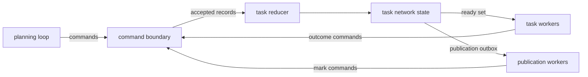

# Task Network

Date: 2026-06-02
Status: active
Scope: shared execution graph, command acceptance, event-driven dispatch, and graph mutation reduction

## Core Position

The task network is the shared execution substrate for all goals. It is a single graph of tasks, dependency-ordered, parallel by default.

```
Capability      atomic executable contract
    ↑ composed into graph
Task            graph of Capabilities, compiled and dependency ordered
    ↑ composed into graph
Task Network    graph of Tasks, the plan and dependency ordered
```

The task network IS the plan. There is no separate plan artifact. Planning agents decompose goals into candidate subgraphs and submit commands to commit them to the task network. The task network executes by computing the ready set and dispatching.

At each level, the execution model is identical: compute ready set, dispatch ready nodes, receive completion events, update state.

The authoritative task network is a single writer event sourced aggregate. Agents and workers submit commands. The task network reducer is the only writer to graph structure, task lifecycle state, dispatch claims, outcome records, artifact availability, and publication state.

## Single Shared Graph

There is one task network graph across all goals and all agents. This is how the system discovers shared dependencies, avoids redundant work, and coordinates parallel execution.

When two goals independently require "run tests," both planning processes decompose into subgraphs that reference the same task. The commit phase detects the overlap. A shared task satisfies both dependency chains.

The graph is the coordination mechanism. No separate multi-goal coordination protocol is needed.

## Ownership

The task network owns:

- **task execution state**: pending, in-flight, completed, failed, cancelled per task instance
- **artifact availability**: which output artifacts exist and can satisfy downstream dependencies
- **dependency state**: which edges are satisfied, which are pending
- **ready set**: tasks whose dependencies are fully satisfied, available for dispatch
- **graph structure**: the current set of task nodes and dependency edges
- **command acceptance**: validation, idempotency, conflict detection, and durable journal order
- **dispatch claims**: fenced claims that must match task outcomes
- **publication outbox**: durable handoff between task completion and event publication

The task network does NOT own:

- **goal state**: owned by the goal set in execution, curated by world model agents
- **plan decisions**: owned by planning agents that submit commands for subgraph commits
- **task internals**: the capability graph within a task is owned by the task executor
- **normative judgment**: the decision of what to pursue is the world model agent's concern

## Event Model

The task network is event-driven. Workers produce task events and submit outcome commands. Reducers update state. No worker mutates network state directly.


```mermaid
flowchart LR
    PL[planning loop] -->|commands| CB[command boundary]
    W[task workers] -->|outcome commands| CB
    PUB[publication workers] -->|mark commands| CB
    CB -->|accepted records| R[task reducer]
    R --> TN[task network state]
    TN -->|ready set| W
    TN -->|publication outbox| PUB
```

The command boundary serializes writes. Read models and ready set queries may run concurrently from committed revisions, but they do not author state.

### Task events

- `task_requested` — task instance created in the graph
- `task_started` — task dispatched to a worker
- `task_progressed` — intermediate progress within a task
- `task_succeeded` — task completed and output artifacts are available
- `task_failed` — task failed after task-level retries are exhausted
- `task_blocked` — task cannot proceed because a dependency issue remains
- `task_artifact_emitted` — output artifact produced before or during task completion
- `task_cancelled` — task removed from the graph by a cancel mutation

These events derive:

- active task set
- ready task set
- completed task set
- failed task set
- artifact availability for dependency satisfaction

### Spine alignment

Events use the canonical spine envelope:

```rust
struct SpineEvent {
    ts: String,
    session: String,
    seq: u64,
    domain_id: String,
    stream_id: String,
    event_type: String,
    content_hash: Option<String>,
    data: serde_json::Value,
}
```

`domain_id` is `execution`. `stream_id` is typically the task instance ID.

## Command Acceptance Model

The task network accepts commands from planning agents, task workers, publication workers, and recovery code. A command carries a command id, base revision, base state hash, typed read preconditions, and a payload.

The first payload families are:

- graph mutation set
- ready task claim request
- task outcome record
- publication mark

The task network revalidates commands against the latest committed state. Accepted commands enter one monotonic revision stream. Duplicate commands return the prior response. Commands whose preconditions no longer hold return typed conflicts.

Typed preconditions cover revision, state hash, node existence, node status, edge existence, artifact availability, path absence, current claim, and pending publication state.

## Graph Mutations

The task network accepts graph mutation sets through commands from planning agents. These are the operations that modify the graph while execution is in progress:

| Mutation | Effect |
|---|---|
| **inject** | Add a task with dependency edges. If dependencies already satisfied, task enters ready set immediately. |
| **cancel** | Remove a task. If pending, remove from graph. If running, issue graceful cancellation. Cleanup tasks may be injected as normal tasks. |
| **relink** | Modify a task's dependency edges. Task position in graph changes; task itself is unchanged. |
| **preserve** | Mark a completed task's artifacts as valid under a modified plan. Artifacts relinked into new dependency structure without re-execution. |
| **prune** | Remove a conditional subtree whose guard was not satisfied. |

Mutations are the graph delta interface between planning and execution. The planning loop decides what to propose based on goal evaluation, belief changes, and cost analysis. The task network decides how to accept or reject the command based on state transitions, cleanup rules, and ready set recomputation.

## Atomic Graph Commit

Task network mutation sets are accepted atomically. A command either commits every graph mutation in the set or commits none of them.

Lowering from an execution composition must not leave partial executable subgraphs in the authoritative task network. When one executable operator step cannot be lowered, the lowerer reports diagnostics and submits no executable graph changes for that composition.

Atomic commit keeps graph state coherent while plan diffing, preserve, relink, prune, and cancel are still maturing.

## Ready Set Computation

The ready set is computed over the task graph the same way it is computed over the capability graph within a task:

For each task that is NOT completed and NOT in-flight:
1. All incoming dependency edges must be satisfied
2. For `DataFlow` edges: the upstream task must have produced the required artifact
3. For `Ordering` edges: the upstream task must be completed
4. For `Conditional` edges: the upstream task must be completed AND the guard expression must evaluate to true

Tasks whose dependencies are all satisfied enter the ready set and may be dispatched to workers.

This is the upper level of the fractal. `compute_ready_capability_instances` performs the identical computation at the lower level in `task/readiness.rs`.

## Task Init Materialization

Each task node carries a compiled task graph and an initialization source plan for required init slots.

`TaskInitializationPayload` is the materialized task run envelope handed to the task executor. It is not the semantic authority for artifacts. The task network owns source validation and data flow materialization before dispatch.

There is no separate data flow task kind. A source task and a data flow task are both task nodes. The difference is when the final init artifacts become available.

- source task: required init artifacts are static seeds available before dispatch
- data flow task: one or more required init artifacts come from upstream task outcomes

Before task execution, the task network resolves each required init slot from its source plan. Static seeds are copied into the payload. Upstream artifact sources select accepted artifacts from named upstream tasks. Selection must match task identity, artifact type, and schema version.

If required init materialization fails, the task is not executable. Missing artifacts, ambiguous artifacts, schema mismatches, stale lifecycle epochs, and invalid provenance block dispatch with typed diagnostics.

See [Task Initialization](task_initialization.md).

## Conditional Edge Evaluation

When an observation task completes, its output artifact is used to evaluate guard expressions on conditional dependency edges. See [Guard Expression Semantics](planning/guard_expression_semantics.md).

- Conditional edges whose guards are satisfied: downstream tasks become candidates for the ready set
- Conditional edges whose guards are not satisfied: downstream subtrees are pruned from the graph

## Dispatch Model

- Append-only event log
- One reducer per task network instance
- Deterministic reduction order
- Parallel task workers pull from the ready set
- Task workers submit outcome commands only
- Dispatch claims are committed before task execution
- Task outcomes must name the current task lifecycle epoch, claim id, and claim revision
- Task network owns all state transitions

Workers do not need to understand goals, plans, or graph structure. They receive a task, execute it, and submit outcome commands built from task events.

## Task Executor Lower Fractal Level

Each dispatched task is executed by a task executor that runs the internal capability graph:

- The task executor receives a `CompiledTaskRecord` and initialization artifacts
- It computes the ready set over capabilities with the same lower level algorithm
- It dispatches ready capabilities, receives completion events, updates artifact state
- When all capabilities are complete, the task is complete
- The task executor emits `task_succeeded` or `task_failed` back to the task network

The task executor is implemented in `task/executor.rs`. It uses `compute_ready_capability_instances` from `task/readiness.rs` for ready-set computation.

Task-internal retry remains in the task executor. Only when retries are exhausted does the failure propagate to the task network, where the planning loop handles it.

## State Ownership Split

| Concern | Owner |
|---|---|
| Task execution state | task network |
| Artifact availability across tasks | task network |
| Dependency satisfaction | task network |
| Graph structure | task network |
| Command acceptance | task network |
| Graph mutations | planning loop → task network command boundary |
| Dispatch claims | task network |
| Outcome records | task network |
| Publication outbox | task network |
| Capability execution within a task | task executor |
| Task-scoped artifact repo | task executor |
| Task-internal retry | task executor |
| Goal set curation | world model agent → goal set |
| Plan decomposition | planning agents |

## Weak Points

- Event ordering must stay deterministic
- Duplicate event handling must be idempotent
- Cancellation semantics need sharper rules for graceful shutdown and cleanup task injection
- Task equivalence definition needed for shared-task detection across goals
- Resource model needed if providers have capacity limits
- Continuation and checkpoint model for durable resume needs design

## Read With

- [Execution Domain](README.md)
- [Planning Pipeline](planning/planning_pipeline.md)
- [Task Initialization](task_initialization.md)
- [Goals](goals/README.md)
- [Guard Expression Semantics](planning/guard_expression_semantics.md)
- [Observation Wait Semantics](planning/observation_wait_semantics.md)
- [Synthesis Overview](synthesis/README.md)
