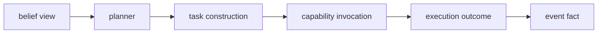

# Crate Boundary Assessment By Domain

Date: 2026-04-22
Status: active assessment
Scope: domain impact review for separating events, world model, execution, and root `meld`

## Concern

The cognitive architecture currently describes one loop across events, world model, belief, execution, and task machinery.
The concern is whether the current single crate hides a necessary split between durable event truth, modeled world truth, deliberate action, and product orchestration.
This assessment evaluates a crate boundary between `meld-events`, `meld-world-model`, `meld-execution`, and root `meld` without requiring separate binaries in the first move.

## In Scope

- define which domains belong in events, world model, execution, and root `meld`
- keep the world model focused on fact ingestion, graph anchors, evidence, belief revision, and belief views
- keep execution focused on goals, planning, task construction, capability invocation, provider execution, repair, and outcome publication
- preserve events as the durable contract between crates
- identify current integration, missing integration, and non integration by top level domain
- keep adapter domains separate from authoritative domain behavior

## Out Of Scope

- splitting binaries now
- adding network protocols now
- distributed sequencing
- moving domain truth into adapters
- making every domain integrate with belief or execution runtime
- replacing task and capability as the deliberate execution substrate
- replacing graph-shaped and spine-shaped public contracts with ECS internals

## Proposed Crates

`meld-events`

Owns append, replay, subscription, idempotent derived writes, sequencing, and cross-domain object references.

`meld-world-model`

Owns graph materialization, current anchors, evidence normalization, belief revision, belief views, calibration, and operator inspection projections.

`meld-execution`

Owns goal interpretation, planner policy, task construction, capability invocation, provider execution, repair, and outcome publication.

`meld`

Owns CLI, config loading, runtime wiring, compatibility, and product composition.

## Boundary Principle

The world model answers what is and how confident the system is.
Execution answers what to do.

The planner should consume belief views.
It should hydrate facts only after action selection, during task construction, audit, or evidence gathering.

## Domain Snapshot

Evidence date: 2026-04-21

Snapshot command:

```sh
find src -maxdepth 1 -type f -name '*.rs' -printf '%f\n' | sed 's/\.rs$//' | sort
```

Snapshot output:

```text
agent
api
branches
capability
cli
concurrency
config
context
control
error
events
heads
ignore
init
lib
logging
merkle_traversal
metadata
prompt_context
provider
session
store
task
telemetry
types
views
workflow
workspace
world_model
```

## Domain Assessment

| Domain | Needed Integration | Current Integration | Completeness | Evidence | Non Integration Rationale | Follow Up |
| --- | --- | --- | --- | --- | --- | --- |
| `agent` | own | Owns agent identity, profile, prompt, context access, and tooling, but not yet a planner microarchitecture over belief views | partial | [agent.rs](../../src/agent.rs), [Execution Domain](execution/README.md) | none | Define agent boundary as consumer of `BeliefView` and owner of action policy |
| `api` | adapter | Facade currently wires runtime state including graph runtime access | partial | [api.rs](../../src/api.rs) | none | Keep API as routing only for KG and agent contracts |
| `branches` | publish | Branches own branch identity, registration, scoped state, and federation metadata used by graph reads | complete | [branches.rs](../../src/branches.rs), [World Model Graph](world_model/graph/README.md), [Completed Branch Federation Substrate](../completed/world_state/graph/branch_federation_substrate.md) | none | Preserve branch provenance in KG public reads |
| `capability` | own | Capability contracts and invocation boundaries are already the atomic execution surface | complete | [capability.rs](../../src/capability.rs), [Execution Domain](execution/README.md) | none | Keep capability under agent execution, not KG internals |
| `cli` | adapter | CLI routes commands and formats output | partial | [cli.rs](../../src/cli.rs) | none | Add command surfaces only after KG and agent contracts exist |
| `concurrency` | own | Existing shared limits exist, but belief leases and assessment queues are not implemented | partial | [concurrency.rs](../../src/concurrency.rs), [Belief Substrate](world_model/belief/substrate.md) | none | Define lease and worker pool primitives for KG assessment |
| `config` | consume | Config owns provider, workflow, and runtime settings today | partial | [config.rs](../../src/config.rs) | none | Add config only for enabled boundaries, worker limits, and later process wiring |
| `context` | publish | Context publishes frames and heads into graph-readable events | partial | [context.rs](../../src/context.rs), [Graph Implementation Status](../completed/world_state/graph/implementation_plan.md) | none | Map context frames into evidence items where belief needs them |
| `control` | own | Control owns orchestration projection and task state reduction, but planner over belief views is not implemented | partial | [control.rs](../../src/control.rs), [Execution Domain](execution/README.md) | none | Keep control inside agent microarchitecture and consume planner decisions |
| `error` | adapter | Error types exist for current in-process API behavior | partial | [error.rs](../../src/error.rs) | none | Add stable boundary errors before external process split |
| `events` | own | Canonical event spine is implemented with append, replay, sequence, graph refs, and compatibility | complete | [events.rs](../../src/events.rs), [Completed Events](../completed/events/README.md) | none | Keep spine independent from KG and agent ownership |
| `heads` | none | Legacy head index remains compatibility support | not needed | [heads.rs](../../src/heads.rs) | KG should consume graph anchors rather than legacy heads directly | Retire behind compatibility only after parity tests |
| `ignore` | none | Ignore policy affects workspace file selection only | not needed | [ignore.rs](../../src/ignore.rs) | Microarchitecture boundary does not change ignored path truth | none |
| `init` | adapter | Init installs default workflow and prompt assets | not needed | [init.rs](../../src/init.rs) | No new binary or process assets are in scope | Reassess if separate process assets are introduced |
| `lib` | adapter | Crate exports all top level domains through one library surface | partial | [lib.rs](../../src/lib.rs) | none | Export explicit KG, spine, and agent contract modules when defined |
| `logging` | observe | Logging is diagnostic only | not needed | [logging.rs](../../src/logging.rs) | Logging should observe boundaries without owning them | Add structured diagnostics later if needed |
| `merkle_traversal` | consume | Merkle traversal is a capability and expansion source used by execution paths | complete | [merkle_traversal.rs](../../src/merkle_traversal.rs), [Task Network](execution/task_network.md) | none | Keep as agent-side capability input, not KG source truth |
| `metadata` | none | Metadata owns frame metadata schema and policy | not needed | [metadata.rs](../../src/metadata.rs) | Microarchitecture split does not require metadata behavior to move | Reassess if belief metadata records become frame metadata |
| `prompt_context` | none | Prompt context owns prompt and context artifacts | not needed | [prompt_context.rs](../../src/prompt_context.rs) | KG should not depend on prompt payload internals | none |
| `provider` | own | Provider owns model provider profiles, clients, registry, and execution bindings | complete | [provider.rs](../../src/provider.rs) | none | Keep provider under agent execution and semantic comparator adapters |
| `session` | observe | Session lifecycle is separated from durable event history | complete | [session.rs](../../src/session.rs), [Completed Events](../completed/events/README.md) | none | Preserve session as lifecycle only, not spine truth |
| `store` | own | Store owns persistence primitives, while domain stores remain domain-owned | partial | [store.rs](../../src/store.rs), [Storage Policy](../../governance/storage_policy.md) | none | Define KG storage trees without centralizing all domain truth |
| `task` | own | Task owns compiled task structure, task artifacts, events, runtime, and package behavior | complete | [task.rs](../../src/task.rs), [Execution Domain](execution/README.md) | none | Keep task under agent execution and publish outcome evidence to spine |
| `telemetry` | observe | Telemetry is downstream compatibility and reporting after events extraction | complete | [telemetry.rs](../../src/telemetry.rs), [Events Design](events/README.md) | none | Keep telemetry downstream of spine, KG, and agent |
| `types` | adapter | Shared root types exist, but cross-domain identity now lives in event contracts | partial | [types.rs](../../src/types.rs), [Multi-Domain Spine](events/multi_domain_spine.md) | none | Avoid moving `DomainObjectRef` out of events unless a broader crate surface demands it |
| `views` | consume | Views shape presentation reads | partial | [views.rs](../../src/views.rs) | none | Add belief and agent status views after KG and agent query contracts exist |
| `workflow` | publish | Workflow publishes graph-readable facts and consumes traversal for task output resolution | partial | [workflow.rs](../../src/workflow.rs), [Spine Graph Completion Review](../completed/world_state/graph/spine_graph_completion_plan.md) | none | Keep workflow in agent execution and publish outcomes as evidence |
| `workspace` | publish | Workspace scan and watch publish promoted structural facts | partial | [workspace.rs](../../src/workspace.rs), [Workspace FS Graph Transition Status](../completed/world_state/graph/workspace_fs_transition_requirements.md) | none | Add belief evidence mapping only where workspace facts affect belief keys |
| `world_model` | own | World model owns graph, legacy claims, projection, and query, but belief is not implemented | partial | [world_state.rs](../../src/world_state.rs), [Belief](world_model/belief/README.md) | none | Define KG boundary around graph, evidence, belief revision, and belief view API |

## Gaps And Follow Ups

1. Define public KG API contracts.
   The first contract should expose graph anchor reads, evidence reads, belief revisions, and planner-facing belief views.

2. Define public agent API contracts.
   The first contract should consume belief views, produce task construction requests, dispatch through task and capability, and publish outcomes to the spine.

3. Remove action language from KG-owned loops.
   KG docs should end at belief view publication.
   Agent docs should begin at belief view consumption.

4. Add belief identity as a graph-addressable object.
   A stable belief, belief revision, and evidence item should each have `DomainObjectRef` identity.

5. Define the process split seam without splitting binaries.
   Use in-process traits or facades now, but make the calls compatible with future process boundaries.

6. Define assessment leases in KG.
   Belief settlement needs per belief key leases, storm coalescing, stale detection, and recovery.

7. Keep adapters thin.
   CLI, API, views, telemetry, and logging should route or observe only.

## Non Integration Notes

`heads`

Legacy heads are compatibility support.
KG should build on graph anchors and traversal, not on direct head index access.

`ignore`

Ignore policy remains workspace-owned file selection behavior.
It does not need a KG or agent split integration.

`init`

No separate binary assets are being introduced in this assessment.
Init should stay out of the concern unless later process assets require bootstrap.

`logging`

Logging should observe microarchitecture boundaries but not define them.

`metadata`

Metadata policy should not become belief storage.
Belief records should live in `world_model` unless a later contract proves a metadata projection is required.

`prompt_context`

Prompt artifacts are agent execution inputs.
KG should not depend on prompt payload internals.

## Implementation Work Extract

Real implementation work appears in these domains:

- `events`
  preserve spine contract as independent substrate
- `world_model`
  define KG contracts for evidence, belief revisions, and belief views
- `control`
  consume belief views through planner policy
- `task`
  construct tasks after planner action selection
- `capability`
  remain atomic execution contracts
- `provider`
  remain agent-side external model execution
- `workspace`, `context`, `workflow`, and `branches`
  publish or expose facts that KG can reduce into evidence
- `concurrency` and `store`
  support KG leases, recovery, and materialized views
- `api`, `cli`, `views`, and `telemetry`
  expose and observe after authoritative contracts exist

## Recommendation

Do not split binaries now.

Do split the crate contract now.

The next design update should recast the belief core loop into two loops:




This gives the system compiler-enforced architecture boundaries while preserving the current one-binary implementation path.

## Read With

- [Assessment By Domain Policy](../../governance/assessment_by_domain_policy.md)
- [Core Crate](core/CRATE.md)
- [Events Crate](events/CRATE.md)
- [World Model Crate](world_model/CRATE.md)
- [Execution Crate](execution/CRATE.md)
- [Belief](world_model/belief/README.md)
- [Belief Microarchitecture](world_model/belief/microarchitecture.md)
- [Fact To Belief](world_model/belief/fact_to_belief.md)
- [Belief Substrate](world_model/belief/substrate.md)
- [Execution Domain](execution/README.md)
- [Events Domain](events/README.md)
- [Multi-Domain Event Ledger](events/multi_domain_spine.md)
