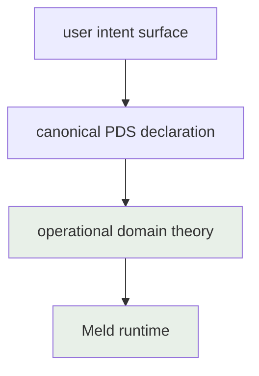

# Persistent Domain Stewardship

Date: 2026-07-30
Status: active
Scope: the canonical definition of Persistent Domain Stewardship at its settled layer — operational domain theory against the Meld runtime — and the layering discipline by which further layers canonicalize

## Thesis

Persistent Domain Stewardship is the program by which durable domain meaning reaches the Meld runtime as declarations rather than as code. Its final user-facing form is deliberately unsettled. Its development therefore proceeds by inversion: each layer of the design canonicalizes only against the layer beneath it, and the bottom layer is the written Meld runtime, whose physical requirements are concrete where the final requirements are hazy.

This document canonicalizes exactly one layer: what operational domain theory is, what the runtime requires of it, and the authority boundaries between theory and runtime. Everything above this layer — a profile language, a package compiler, activation records, an authoring surface — remains proposal-tier work in [Persistent Domain Stewardship Proposals](../persistent_domain_stewardship/README.md).

## The Layering Discipline

PDS design is continuous abstraction. The layer stack, from the ground up:

The rule: a layer canonicalizes only when the layer beneath it is real in code and its consumption contract is stated in binding terms. The theory-to-runtime layer is settled by this document. The declaration-to-theory layer canonicalizes next, against this foundation. The intent-to-declaration layer canonicalizes last.

A layer that is not yet canonical constrains nothing. Proposal-tier documents may explore any shape for the upper layers, but no runtime or theory contract may depend on an unsettled layer's vocabulary.

## Operational Domain Theory

Operational domain theory is the state-free meaning the runtime executes. It is the supplier half of the contract whose consumer half is stated by [Directive Grounding](world_model/agent/directive_grounding.md): PDS declares which questions and meanings can exist; grounding decides which apply; the runtime settles answers.

The theory kinds, derived by inversion from what the runtime consumes:

- Belief families: dimensions, evidence schemas, source mappings, comparator configuration, priors, planner projection, and family-declared semantics such as observationality and anchor coupling. The family owns its assessment semantics; the runtime never guesses them.
- Evidence routes: outcome-to-evidence mapping sets that interpret canonical event vocabulary into promoted evidence under one selected identity.
- Curation rules: threshold and posture declarations from which agents derive goal proposals.
- Planning theory: methods, available actions in the frozen affordance shape, and method-to-action realizations.
- Task packages: the bounded work declarations execution realizes.
- Maintained conditions and scope: the subject identities and conditions a stewardship expression is about.
- Authority and governance: which agent stewards which subject under which provider and escalation boundaries.

## Authority Boundaries

- Theory is selected by identity and installed by content-hash revision. A selection names theory; it never embeds theory bodies.
- Installed theory resolves per tick through its owning domain, and the resolved revision enters the lineage of everything it produces. Which theory produced which belief is answerable from durable records alone.
- Theory is state-free. It is never the source of truth for observations, anchors, belief revisions, decisions, goals, task state, or outcomes. The runtime is never the source of truth for domain meaning.
- The runtime consumes theory through domain contracts, not through runtime role identities. The runtime's internal role registry is not a stewardship schema.
- A missing or unloadable theory body leaves the dependent runtime a truthfully unresolved binding. The runtime never manufactures meaning to fill a theory gap.

## Naming

The word theory in Meld refers to operational domain theory as defined here and to nothing else. Strategy's theory of action — a viability judgment over a candidate plan — is a distinct concept and keeps its qualified name. A coherent installed set of theory bodies for one stewardship expression is a theory package; the compiled stewardship image proposed at the upper layers lowers into exactly this form, and the present hand-authored packages are its compatibility antecedent.

## Read With

- [Directive Grounding](world_model/agent/directive_grounding.md) — the consumer contract this layer supplies
- [Persistent Domain Stewardship Proposals](../persistent_domain_stewardship/README.md) — the unsettled upper layers
- [PDS Theory Runtime Layer Map](../plan/integration/pds_theory_runtime_layer.md) — the implementation-readiness map of this layer against the written runtime
