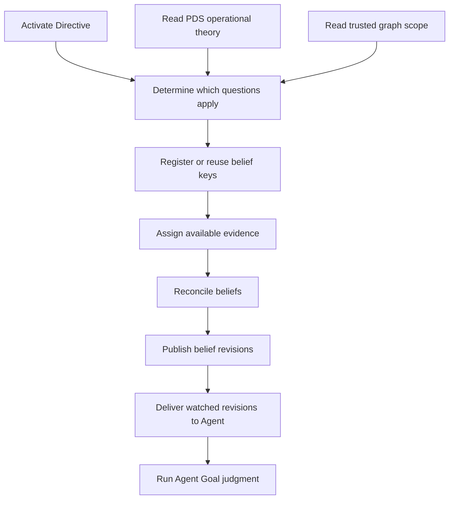

# Directive Grounding

Scope: translation from maintained intent and domain scope into concrete belief questions

## Thesis

A Directive is normative intent. It says what should be maintained. It is not itself a belief and it does not directly produce an Execution Goal.

Directive grounding answers a narrower question:

```text
Which belief questions must exist for this Directive,
given the objects that currently exist in its scope?
```

It combines an activated Directive, PDS operational domain theory, and a trusted graph scope. Its output is a set of concrete questions such as whether one folder has a README or whether that README is correct.

This happens before Agent Goal judgment. Goal judgment reacts to answers. It does not invent the questions that make a divergence visible.

## Ownership

| Concern | Responsibility |
|---|---|
| Directive Agent | authorizes the maintained intent, perspective, and scope |
| PDS | declares which kinds of questions and evidence are meaningful |
| Graph | supplies the current objects and relations |
| Directive grounding | decides which declared questions apply to which concrete objects |
| Belief | registers questions, admits evidence, assesses answers, and publishes revisions |

PDS may supply:

- domain objects and relations
- maintained conditions
- belief families and dimensions
- evidence routes
- comparators and outcome meaning
- authority and governance

Directive grounding does not settle any answer.

## Grounding product

One bounded grounding pass produces an `EpistemicObligationSet`. Despite the name, these are obligations to maintain questions, not obligations to execute work.

```text
EpistemicObligationSet
  grounding_ref
  directive_ref
  agent_ref
  pds_activation_ref
  graph_scope_ref
  obligation_refs
  input_revision
```

Each obligation identifies one concrete question.

```text
EpistemicObligation
  obligation_ref
  directive_ref
  subject_ref
  belief_family_ref
  dimension_ref
  perspective_ref
  scope_ref
  evidence_policy_ref
  comparator_ref
  source_rule_ref
```

The product contains no belief value. It only declares that one question should exist for one subject.

Belief registration turns each accepted obligation into a stable belief key or returns the matching existing key. An unassessed key remains an explicit unknown until admissible evidence is reconciled.

## Runtime flow



Independent subjects and questions may ground and reconcile independently. One pass processes finite scope and a finite number of questions. Later graph change may ground only the affected scope again.

Directive grounding does not silently dispatch active observation work. Existing sensory and graph evidence may be assigned immediately. When evidence is missing, Belief records an unassessed or observation-needed state. That revision may cause the Agent to draft an observation Goal, which must pass the same Strategy and admission gate as any other Goal.

## Relationship To Agent Goal Judgment

A belief question is singular and evaluable. It is not actionable by itself.

Agent Goal judgment reads a reconciled belief view, the Directive posture, active Goal summary, cost and value views, and regime context. It decides whether the observed divergence warrants a Goal.

```text
belief question
→ reconciled belief value
→ unacceptable divergence under Directive posture
→ Goal draft
```

The Goal remains Agent-owned desired state. Strategy constructs one immutable heterogeneous Plan against it. Agent judges the Plan, then routes each eligible complete Task to Execution and each eligible bounded Epistemic Operation to Curation. A Plan may close with epistemic work only or with no discharge product when admitted evidence already satisfies the Goal.

## Docs freshness grounding

For docs freshness, the Directive declares correct README files for every material folder in scope. The graph supplies concrete folders and containment relations. PDS supplies the belief families that make README existence, source coverage, correctness, and freshness meaningful.

Grounding instantiates those questions for each material folder. Reconciliation may then establish that a README is missing, correctness is unknown, evidence is stale, or the maintained condition already holds.

Bottom-up execution topology is not produced here. Directive grounding establishes what must be known. Strategy later decides which theory of action can change unacceptable belief divergence.

## Minimal grounding shape

One configured grounding rule for one PDS belief family over one bounded scope walk is a sufficient grounding mechanism. Grounding does not require a general rule language, a learned grounding policy, or a comprehensive lifecycle framework.

## Read with

- [World Model Agent](README.md)
- [Plan Progression](plan_progression.md)
- [Belief Model](../belief/README.md)
- [World Model Strategy](../strategy/README.md)
- [World Model Public Interface](../public_interface.md)
- [Persistent Domain Stewardship](../../persistent_domain_stewardship.md)
