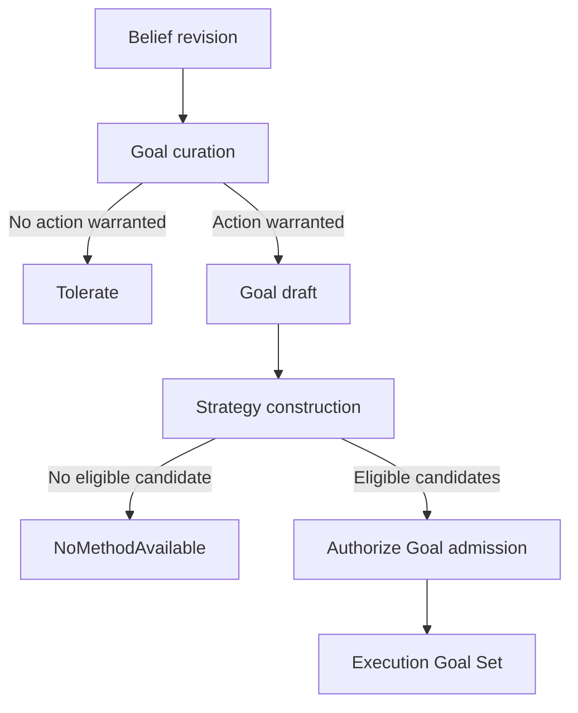

# Goal Curation

Date: 2026-07-23
Status: active
Scope: deciding whether reconciled belief divergence should become a Goal draft

## Thesis

Goal curation answers:

```text
Does this belief divergence matter enough to act on?
```

The Agent receives revisions for questions already created by [Directive Grounding](directive_grounding.md). It compares the current belief with its desired state, expected value, expected cost, and active commitments. Most revisions are tolerated. A revision that warrants action becomes a Goal draft.

A Goal draft is not yet an Execution Goal. Strategy must first produce at least one eligible candidate. The Agent then authorizes the Goal and candidate inventory together.



This is the final semantic filter before Strategy. It reduces many belief revisions to a much smaller number of Goal drafts.

## Cost-Benefit Evaluation

Goal generation uses a cost-benefit comparison. It applies the comparator pattern to action-worthiness rather than truth.

| Input | Question |
|---|---|
| State belief | How far is current belief from the desired state |
| Cost belief | What is action expected to cost |
| Value belief | What is restoring the desired state expected to improve |
| Inaction cost | What accumulates if Meld does nothing |
| Regime context | Which learned priors currently apply |

The result is:

```
evidence: divergence magnitude, cost posterior, value posterior, inaction accumulation
prior: whether acting on similar divergence was worthwhile
posterior: act or tolerate with confidence
→ if act: construct Goal draft
         and request bounded Strategy construction
→ if tolerate: absorb belief change
```

The "tolerate" outcome is the frequency reduction. Most belief changes don't cross the cost-benefit threshold. The goal layer fires less often than the belief layer.

## Cost Beliefs

Cost beliefs are derived from execution outcomes. When execution completes a task, it publishes outcome facts to the spine:

- elapsed time
- resource consumption (tokens, compute, etc.)
- success or failure
- retry count
- actual vs estimated cost

These outcome facts flow through the normal belief pipeline: spine → facts → evidence → belief revision. The result is a belief about execution cost for each class of action.

Cost beliefs calibrate over time. As execution gets cheaper (better tools, cached results, optimized capabilities), the cost posterior drops. As it gets more expensive, the posterior rises. Goal generation responds automatically — more goals pass the threshold when costs are low, fewer when costs are high.

## Value Beliefs

Value beliefs are derived from outcome correlation. When the agent acts on a divergence and the resulting belief revision produces downstream improvement, the value posterior strengthens. When acting produces no meaningful downstream change, the value posterior weakens.

Value beliefs require longer calibration windows than cost beliefs because the causal chain from goal → execution → outcome → downstream belief change is longer and noisier. Value beliefs should carry wider uncertainty initially and narrow as outcome data accumulates.

This is where goal curation connects to the causal layer. The question "does acting on this divergence actually produce downstream value?" is a causal question. The causal layer's intervention and outcome semantics can feed value belief assessment; simple outcome correlation is an acceptable starting basis.

## User Input as High-Weight Evidence

User-directed input is not a bypass of cost-benefit evaluation. It is high-weight evidence on the value side.

```
User says: "Fix the tests"
  → high-weight value evidence enters the cost-benefit comparator
  → posterior on "act" is overwhelming (user weight dominates cost)
  → goal generated through same mechanism
  → cost belief still computed and preserved
```

Cost data is preserved even for user-directed goals because:

- Cleanup needs cost estimation if the goal is later abandoned
- The system can surface cost to the user ("this will take approximately 45 minutes and X tokens")
- Future cost beliefs calibrate from all executions, including user-directed ones

The same mechanism handles all goal sources. `BeliefDivergence`, `UserDirected`, `Maintenance`, and `GoalDecomposition` sources are not different pathways — they are different evidence profiles entering the same cost-benefit comparator. User input is high-weight value evidence. Maintenance invariant violation is accumulating inaction cost. Belief divergence is the standard case.

## Regime Change and Prior Scoping

Learned priors become a burden when the landscape fundamentally shifts. If the agent learned cost-benefit priors during normal development, those priors are structurally wrong during incident response — not slightly wrong, but wrong in kind. The value of documentation goals drops to near zero. The value of stability goals spikes. Same cost-benefit comparators, completely different landscape.

The regime layer detects structural shifts. When a regime change is detected, the agent's cost-benefit comparators scope their priors to the new regime:

**If the regime has been seen before**: retrieve archived priors from the regime library. "During the last incident, stability goals had high value, documentation goals had near-zero value." Immediate recalibration without learning from scratch.

**If the regime is novel**: widen uncertainty on all cost-benefit priors. The agent becomes exploratory — less confident in act/tolerate decisions, more likely to generate observation goals rather than action goals. Prior narrowing resumes as new outcome data arrives under the new regime.

**When the regime ends**: archive the current regime's priors in the regime library. Old priors are preserved, not erased. When this regime recurs, calibrated priors are available.

This connects directly to the regime layer's existing concepts:

- `RegimeLibrary` indexes archived prior sets, including cost-benefit priors per concern class
- `RegimePosterior` informs which prior set is active
- `ChangepointState` triggers prior scoping transitions
- `RegimeEntryPrior` provides the starting prior when a new regime segment begins

## Belief Monitoring

The agent monitors beliefs through subscription to belief revision events. This is the "watching" mechanism at the belief→goal boundary.

### Subscription binding

The agent's subscriptions are bound during the bootstrap lifecycle. See [Agent Lifecycle](README.md#agent-lifecycle) and [Agent Genesis And Activation](genesis_and_activation.md).

For seed agents, trusted init or configuration supplies the initial directive, responsibility, and scope.

For spawned agents, an authorized existing agent curates a `CreateAgent` goal. Execution owns the initialization workflow. Capabilities invoke the world model's public interface to:

1. Survey existing beliefs and evidence channels for the agent's subject scope
2. Register the agent identity and perspective
3. Register belief keys for dimensions that should exist but don't
4. Bind subscriptions to each relevant belief key

Trusted seed configuration supplies the initial subscription filter. Directive grounding derives concrete belief questions from activated PDS theory and trusted graph scope, then binds the Agent to the resulting keys. See [Directive Grounding](directive_grounding.md) and [World Model Public Interface](../public_interface.md).

The subscription filter is the agent's definition of "what I care about." It does not define what to do about changes — the cost-benefit comparator handles that. It defines which changes reach the comparator at all.

### Event-driven evaluation

When a belief revision event arrives for a watched belief key:

1. Agent reads the updated belief view
2. Agent evaluates the cost-benefit comparator for that concern class
3. Agent checks the active goal set for redundancy and coherence
4. Agent constructs a Goal draft or absorbs the change
5. Strategy construction gates initial Execution admission

### Freshness-driven evaluation

The "nothing changed and that's a problem" case does not require a separate periodic sweep. The belief layer tracks freshness. When freshness decays past a belief's staleness threshold, the belief layer emits a freshness-decay revision. The agent watches this like any other belief revision.

This means even staleness-triggered goals go through the same cost-benefit evaluation. "Semantic context hasn't been checked in 4 hours" is evidence. The cost-benefit comparator decides whether that staleness warrants action given current cost and value beliefs.

### Active goal feedback

The agent reads the active goal set when evaluating. This provides:

- **Redundancy check**: if a goal already addresses this belief divergence, don't generate another
- **Progress monitoring**: if a goal has been active for N cycles without belief movement, evaluate whether to modify (adjust approach), escalate (raise priority), or abandon (cost exceeds remaining value)
- **Coherence check**: if the active goal set implies certain beliefs should be changing, flag incoherence when they aren't
- **Prediction**: active goals predict expected evidence. Evidence that matches predictions is less surprising. The agent can damp its response to expected belief changes from another agent's active execution

## The Decision Loop

The complete Agent decision loop is:

```
belief revision arrives
  → confirm the Agent watches this question
  → read state, cost, value, inaction, and regime views
  → read active goal set
  → compare act against tolerate
  → if tolerate: absorb the revision
  → if act:
      → avoid or update redundant active Goals
      → resolve material Goal conflicts
      → construct a ground meld-lang Goal draft
      → request bounded Strategy construction
      → if no candidate: emit NoMethodAvailable
      → otherwise: authorize and submit the Goal admission bundle
```

The Agent constructs Goal drafts at runtime using `meld-lang` types. No predefined goal variants are required. The Agent composes a desired proposition from its belief assessment. The urgency level is derived from the cost-benefit posterior. The cost ceiling is derived from the cost belief. See [Goals and Methods](../../meld-lang/goals_and_methods.md) for the concrete types and construction examples.

Goal curation answers whether acting is worthwhile and what desired state should be proposed. [World Model Strategy](../strategy/README.md) compares reusable and novel evidence-backed theories of action for that draft. The Agent admits the Goal only when at least one theory is eligible. Execution Planning then realizes only the authorized candidate inventory.

Satisfaction curation follows the same watching pattern. With `meld-lang`, planning may mechanically observe whether `goal.target` holds against `WorldState`, but the agent owns the decision to emit a satisfaction mutation:

```
belief revision event arrives
  → does this belief now satisfy an active goal's desired state?
  → the world model projects updated WorldState
  → the agent evaluates: evaluate(world_state, goal.target) == Satisfied?
  → if satisfied: agent emits a satisfaction mutation
  → execution persists lifecycle through the public satisfy API
```

Satisfaction can occur from any source, including the system's own execution, external action, or unrelated changes. The world model projects belief into `WorldState`. The agent curation path detects satisfaction from that projection. `meld_lang::evaluate` remains pure and does not own lifecycle transitions.

## Relationship to Comparator Model

The cost-benefit comparator is a new comparator family alongside the existing belief comparators (Bayesian, Rule, SemanticSettlement, Missing, MessagePassing, PredictiveResidual).

The distinction:

- **Belief comparators** answer: "what should be believed about the world?"
- **Cost-benefit comparators** answer: "should the agent act to change the world?"

The inputs differ. Belief comparators consume evidence about state. Cost-benefit comparators consume beliefs about state, cost, and value — they are comparators over comparator outputs. The mechanism is the same: prior + evidence → posterior with confidence and uncertainty.

The cost-benefit comparator should meet the same requirements as belief comparators:

- Deterministic replay over explicit inputs
- Inspectable posterior and decision
- Calibration from later outcomes
- Provenance over inputs and decision

## Cold Start

Before the system has execution history, cost beliefs are uninformed. Three sources provide initial priors:

1. **Capability contracts**: capabilities can declare estimated cost envelopes (time, tokens, resource class). These are weak priors but better than nothing.
2. **Explicit configuration**: an agent can be initialized with cost priors for its concern classes. These are manually set and should be marked as uncalibrated.
3. **Uninformative priors**: when no cost data exists, the comparator defaults to wide uncertainty. The practical effect is that the agent acts on strong divergences (where value clearly dominates uncertain cost) but abstains on marginal ones until cost data arrives.

Value beliefs are similarly cold at start. Until outcome data calibrates the value posterior, curation should default to acting on strong divergences with clear value signals, such as user-directed input or maintenance invariant violation, and deferring marginal ones.

## The Normative Framework, Reduced

The normative framework concepts discussed in the goal model reduce to cost-benefit posteriors:

| Normative concept | Realized as |
|---|---|
| Concern declaration | Subscription filter on belief keys |
| Divergence threshold | Cost-benefit posterior hasn't crossed decision boundary |
| Tolerance policy | Region where expected cost exceeds expected value — derived, not configured |
| Priority | Value-to-cost ratio — computed, not assigned |
| Regime sensitivity | Which prior set the cost-benefit comparator uses |
| Maintenance invariant | Concern with accumulating inaction cost |

The normative framework is the maintained conditions a Directive grounds, the resulting belief keys the Agent watches, and the regime-scoped priors it carries for cost-benefit comparison. That is a small, learnable, inspectable thing.

## What This Design Does Not Cover

### Cost-benefit comparator specification

The shape of the comparator is defined. The specific factors, weights, and decision boundary are out of scope here.

### Multi-agent goal coordination

When multiple agents' cost-benefit evaluations produce conflicting goals, coordination is needed. The shared task network provides structural coordination through shared dependencies. Normative coordination, deciding which agent's goals take priority when they conflict, is out of scope here.

### Value measurement methodology

Measuring the downstream value of goal achievement is out of scope here. The causal layer's intervention semantics are the foundation for rigorous value assessment.

### Subscription filter refinement

Seed configuration supplies the subscription filter at bootstrap, and subscription growth follows Directive grounding when graph scope or activated PDS theory changes. Learning which questions remain valuable is out of scope here.

## Read With

- [World Model Agent](README.md)
- [Directive Grounding](directive_grounding.md)
- [World Model Public Interface](../public_interface.md)
- [Comparator Model](../belief/comparator_model.md)
- [Goals](../../execution/goals/README.md)
- [Lang Domain](../../meld-lang/README.md)
- [Lang Goals and Methods](../../meld-lang/goals_and_methods.md)
- [Lang World State and Evaluation](../../meld-lang/world_state.md)
- [Regime Layer](../regime/README.md)
- [Belief](../belief/README.md)
- [World Model Strategy](../strategy/README.md)
- [Fact To Belief](../belief/fact_to_belief.md)
- [Observe Merge Push](../../observe_merge_push.md)
