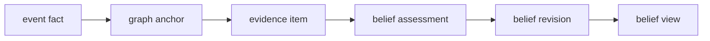

# World Model Belief

Date: 2026-04-30
Status: active
Scope: priors, posteriors, uncertainty, freshness, contradiction, hypotheses, and planner-facing belief views over the state graph

## Thesis

`world_model/belief` answers what should be believed about the graph, how uncertain that belief is, what evidence would change it, and which unresolved uncertainty matters for action.

The earlier belief design is not just implementation history. Its first-slice machinery is still useful: belief keys, evidence items, comparator contracts, revisions, leases, replay, and planner-facing views. What needs elevation is the role of belief in the larger world model architecture. Belief is not only "do we trust the current anchor." It is the generative inference layer over graph state, agent perspective, evidence reliability, hidden causes, and future-relevant uncertainty.

Graph tells the system what is current and reachable.
Belief tells the system what is credible, uncertain, stale, contradicted, predicted, or worth observing.

## Architecture Position

Belief sits between `graph` and the upper world-model layers.

It consumes:

- current anchors, lineage, provenance, object history, and graph walks from `graph`
- promoted observations, actions, outcomes, corrections, and derived facts from `events`
- execution outcomes and measurement artifacts as calibration evidence
- agent perspective, observation scope, and policy-relevant questions as belief context

It publishes:

- posterior belief views for planner-facing reads
- uncertainty, freshness, contradiction, and assessment state
- provenance summaries and hydration handles
- observation opportunities when uncertainty is decision-relevant
- belief and evidence signals that `causation` and `regime` can consume

Belief does not dispatch tasks, decide execution policy, own causal claims, or decide regime identity. It supplies the posterior state and uncertainty structure those layers need.

## What Remains Durable

These parts of the existing belief work remain active architecture:

- `BeliefKey` as stable identity for the question being assessed
- `EvidenceItem` as normalized input from facts, anchors, outcomes, or measurements
- `BeliefRevision` as append-only settlement over a bounded evidence window
- `BeliefView` as the planner-facing projection over current belief state
- comparator contracts for typed Bayesian, rule, semantic, and missing-comparator assessment
- replay from spine and graph materialization into evidence and revisions
- lease-based assessment and recovery for concurrent belief maintenance
- provenance over evidence, revision, and view publication

These are the implementation-shaped primitives that let the research architecture land incrementally.

## What Must Broaden

The research direction requires belief to grow beyond independent bottom-up anchor checks.

The broadened belief layer needs:

- priors and posterior distributions, not only confidence scores
- uncertainty and precision, including source reliability and conditional reliability
- surprise, freshness, decay, and stale-state semantics
- hypothesis sets over hidden causes, not only current graph anchors
- bidirectional inference where higher-level beliefs can predict expected evidence
- observation policy candidates when expected information gain justifies more evidence
- per-agent belief ownership and perspective-scoped belief views
- calibration from later outcomes and regime-aware prior selection

This does not mean adopting one research framework wholesale. Predictive coding, active inference, Bayesian comparators, and factor-graph message passing are inference tools inside the belief layer. The public contract should remain shaped belief records and views.

## Layer Boundary

`belief` owns:

- belief keys, belief identity, and perspective-scoped belief ownership
- evidence normalization and attachment to beliefs
- priors, posteriors, uncertainty, precision, and freshness
- contradiction handling and unresolved-conflict state
- supersession as belief revision
- hypothesis sets over hidden causes or latent state
- calibration from later outcomes
- break pressure, continuation pressure, and regime mismatch signals carried on belief state
- observation opportunity and expected information gain summaries
- planner-facing belief views

`graph` owns current anchors, traversal, lineage, provenance bundles, branch presence, and hydration handles.
`events` owns durable fact order, append, replay, and cross-domain graph attachment.
`causation` owns mechanism claims, intervention semantics, effect estimates, and counterfactual answers.
`regime` owns changepoints, run length, regime identity, break versus continuation semantics, and mixture prediction under structural uncertainty.
`execution` owns planning, task construction, dispatch, side effects, and outcome publication.

## Belief Loop

The first operational loop remains event-driven and replayable:

The broader loop adds prediction, observation policy, and calibration:

The two loops stay coupled through belief views and event facts. `world_model` does not dispatch tasks, and execution does not settle beliefs by scanning raw facts during planning.

## Research Alignment

Active inference maps cleanly onto the current domain split if it is used as guidance, not doctrine:

- event ingress and execution egress are the system boundary
- graph anchors are current materialized hypotheses about state
- belief computes posterior state, uncertainty, precision, and observation value
- planner-facing views expose whether the next useful move is to act, observe, wait, or abstain

Predictive coding contributes a narrower lesson:

- higher-level beliefs may predict expected lower-level evidence
- evidence channels need reliability or precision
- persistent mismatch should remain visible rather than being explained away by over-strong priors
- discrete semantic events usually need likelihood or factor messages, not raw residual subtraction

Model-based and non-stationary research adds:

- hidden state and trajectory beliefs matter when outcomes are delayed
- priors should be scoped to the active segment or regime where possible
- belief storms and regime changes are different phenomena
- old priors should be archived and calibrated, not erased

## Belief View Direction

The first `BeliefView` can remain compact, but the design target is richer than a status field.

Planner-facing belief views should eventually expose:

- belief key and perspective
- prior summary when material
- current posterior or posterior summary
- prior to posterior divergence or surprise when material
- confidence, uncertainty, precision, and freshness
- origin and coverage state for direct, inferred, or never-observed belief
- contradiction and unresolved-conflict state
- evidence window and provenance summary
- hypothesis or hidden-state alternatives when material
- observation policy candidate with expected information gain, cost, expiry, and target evidence
- assessment state and whether the current view is settled, provisional, stale, or invalid
- hydration handles for task construction and explanation

The planner should not receive raw comparator internals, raw graph reducer state, active lease internals, or unpublished evidence churn.

## Agent Perspective

Belief is shared in substrate and owned in perspective.

Many agents may observe the same graph substrate while holding different belief views because they differ by:

- observation scope
- trusted evidence channels
- goals and decision relevance
- branch scope
- calibration history
- tolerated uncertainty

The public contract should therefore make perspective explicit on belief keys, evidence filters, or belief views before multi-agent scale depends on hidden process-local assumptions.

## Active Documents

- [Belief ECS](ECS.md)
  ECS interpretation of belief entities, components, and systems
- [Belief Microarchitecture](microarchitecture.md)
  event, world model, and execution boundaries for belief
- [Fact To Belief](fact_to_belief.md)
  transition from event fact and graph anchor into evidence, belief revision, and planner view
- [Comparator Model](comparator_model.md)
  Bayesian comparators, rule comparators, semantic settlement, and missing comparator policy
- [Belief Substrate](substrate.md)
  event-driven belief runtime, leases, recovery, staleness, and storm handling
- [Curation In Belief](curation.md)
  natural runtime for belief maintenance and materialized belief
- [Knowledge Graph ECS Decision Memo](knowledge_graph_ecs_decision_memo.md)
  hybrid ECS recommendation for belief internals

## First Slice

The first belief slice should not attempt full generative inference or full curation.

It should define:

- `BeliefKey`
- `EvidenceItem`
- `BeliefRevision`
- `BeliefView`
- perspective identity or an explicit placeholder for it
- comparator contracts
- uncertainty and freshness fields
- observation-needed state with target evidence
- lease-based assessment
- replay from events and graph anchors into current belief
- planner query over belief views only

The first slice should also state what remains deferred from the research direction:

- explicit prior and posterior pair records for every revision
- prior to posterior divergence or surprise as a required field
- origin and coverage fields that distinguish direct observation, predictive persistence, smoothing, and never-observed state
- retrospective smoothing over hidden transition timing
- structured multi-belief inference epochs across connected belief keys
- regime posterior, run length, and mixture prediction, which belong to `regime`

## Read With

- [World Model Domain](../README.md)
- [Belief Microarchitecture](microarchitecture.md)
- [Fact To Belief](fact_to_belief.md)
- [Comparator Model](comparator_model.md)
- [Belief Substrate](substrate.md)
- [Graph](../graph/README.md)
- [Causal Layer](../causation/README.md)
- [Regime Layer](../regime/README.md)
- [World Model Planner](../planner/README.md)
- [Active Inference Gap Summary](../../research/world_model_architecture/summary/ACTIVE_INFERENCE_GAP_SUMMARY.md)
- [Predictive Coding Gap Summary](../../research/world_model_architecture/summary/PREDICTIVE_CODING_GAP_SUMMARY.md)
- [Non-Stationarity Gap Summary](../../research/world_model_architecture/summary/NON_STATIONARITY_GAP_SUMMARY.md)
