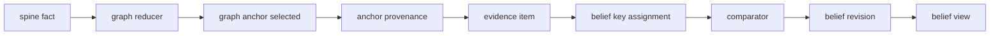
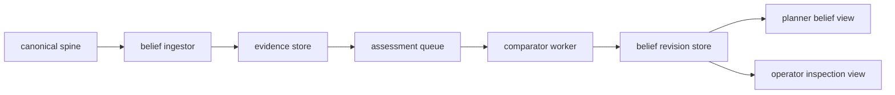
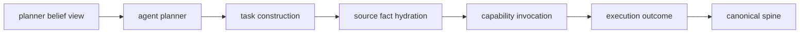

# Fact To Belief

Date: 2026-04-30
Status: active
Scope: transition from spine facts and graph anchors into belief revisions and planner views

## Thesis

A fact is immutable history.
A belief is a settled or provisional claim over that history.

The planner should consume shaped belief or world-model views.
It should not inspect raw spine facts or traversal facts during planning.
Facts become relevant again during task construction, evidence gathering, audit, and explanation.

Fact to belief is a world model concern.
Belief view to action is an agent concern.

This document describes the first bottom-up transition path. It is not the whole long-term belief architecture. Later belief work must also support top-down predictions, latent hypotheses, precision-weighted evidence, observation policy, and regime-conditioned priors.

## Enabling Base

Belief exists because these implemented layers now exist:

- [Completed Events](../../../completed/events/README.md)
  durable spine, runtime-wide sequence, append, replay, idempotent derived facts, and graph attachment fields
- [Completed World State Graph](../../completed/world_state/graph/README.md)
  current anchors, lineage, provenance, traversal indexes, and branch annotated federation
- [Graph Implementation Status](../../completed/world_state/graph/implementation_plan.md)
  implemented `DomainObjectRef`, `EventRelation`, `GraphRuntime`, traversal queries, and graph-readable publishers
- [Spine Graph Completion Review](../../completed/world_state/graph/spine_graph_completion_plan.md)
  explicit closeout that belief and planner-facing views are next scope
- [World Model Graph](../graph/README.md)
  source model where semantic spine facts materialize graph views and future belief facts
- [Execution Domain](../../execution/README.md)
  execution must read current belief and publish success, failure, uncertainty, and gathered evidence

## Record Roles

`SpineFact`

Immutable semantic event with sequence, domain, stream, object refs, relation edges, and payload.

`GraphAnchor`

Current selected surface for a subject and perspective.
An anchor says what is current.
It does not say whether that current value should be trusted.

`EvidenceItem`

Belief-normalized record derived from one or more facts, anchors, or execution outcomes.
It carries subject, predicate, value, polarity, source, sequence range, reliability or precision where available, and provenance.

`BeliefKey`

Stable identity for the question being settled.
The key is the planner-visible unit of belief assessment.
It may include or reference perspective when different agents, branches, or evidence policies can reasonably produce different current views.

`BeliefRevision`

Append-only settlement result for one belief key.
It records comparator or inference method used, input evidence set, posterior summary, uncertainty, status, supersession, and provenance.

`BeliefView`

Planner-facing materialized projection.
It hides raw fact churn and exposes planner-readable settlement state.

`BeliefView` is the first belief microarchitecture boundary.
The world model publishes it.
The agent consumes it.

## Transition

The transition from fact to belief has six stages.

- promotion
  accept a graph or execution event as belief-relevant evidence
- normalization
  turn the event into an `EvidenceItem`
- assignment
  attach evidence to one or more `BeliefKey` values
- assessment
  run the selected comparator or inference method over the evidence set
- revision
  append a `BeliefRevision` and supersede the prior revision if needed
- projection
  update the planner-facing `BeliefView`

This is the minimum path. Hierarchical belief later adds prediction and message flow:

- prediction
  emit expected evidence, lower-level state, or outcome distribution from the current posterior
- comparison
  compare observed evidence with prediction using an appropriate likelihood or residual form
- epistemic escalation
  create an observation opportunity when uncertainty or conflict remains decision-relevant

## Graph Anchor To Belief Revision

The anchor selects the current target.
The evidence item explains why the anchor matters to a belief.
The belief revision records whether the current target is trusted, contradicted, stale, provisional, invalid, or uncertain under competing hypotheses.

## Spine To Belief View

This loop keeps the spine as the durable source.
The belief view is current state derived from replay.
The world model stops at shaped views.

## Belief View To Action

The agent loop may hydrate facts after it selects an action.
That is task construction, not belief settlement.

## Evidence Mapping

Many facts may support one belief.
One fact may also affect many beliefs.

The mapping must therefore be explicit:

- `source_fact_id` links evidence to spine history
- `anchor_id` links evidence to current graph state when available
- `belief_key` links evidence to the assessed question
- `evidence_role` marks support, contradiction, context, calibration, or supersession
- `effective_seq_range` marks which fact window was assessed

Belief graph relation changes over time by appending revisions.
It should not mutate old evidence edges in place.

## Planner Boundary

Planner reads:

- belief status
- posterior summary
- confidence or precision
- uncertainty
- freshness
- contradiction state
- observation-needed state
- assessment state
- provenance summary

Planner does not read:

- raw spine event payloads
- raw graph reducer internals
- transient comparator work state
- unpublished evidence churn

Task construction may hydrate source facts after planning chooses an action.
That keeps planning semantic while allowing execution to build concrete capability inputs.

## Microarchitecture Placement

World model belief owns:

- evidence normalization
- belief key assignment
- comparator scheduling
- belief revision
- belief view projection
- provenance over belief revisions
- uncertainty, precision, and freshness summaries
- observation opportunities tied to belief uncertainty

Agent owns:

- goal policy
- planner decisions
- task construction
- fact hydration for task inputs
- capability invocation
- outcome publication

Spine owns:

- durable fact append
- replay
- subscription
- sequence
- cross-domain refs

## First Slice

Start with one belief family:

- subject is a `DomainObjectRef`
- predicate names the planner question
- perspective is explicit or intentionally defaulted
- evidence comes from graph anchors and execution outcomes
- comparator emits posterior summary, uncertainty, confidence, and status
- belief view exposes settlement state for agent policy

## Read With

- [Belief](README.md)
- [Belief Microarchitecture](microarchitecture.md)
- [Comparator Model](comparator_model.md)
- [Belief Substrate](substrate.md)
- [Graph](../graph/README.md)
- [Execution Domain](../../execution/README.md)
