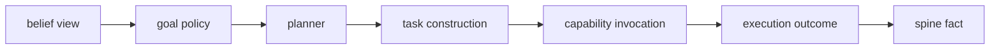

# Belief Microarchitecture

Date: 2026-04-30
Status: active
Scope: microarchitecture boundary for belief inside spine, world model, and agent responsibilities

## Thesis

Belief belongs to the world model microarchitecture.

The world model infers what is credible, uncertain, stale, contradicted, or worth observing.
The agent decides what to do with that view.
The spine carries the durable facts that make both sides replayable.

This split should be enforced in design and public APIs before any binary split is attempted.

## Microarchitecture Roles

`spine`

The spine owns durable fact transport.
It accepts promoted semantic facts, assigns sequence, preserves replay, and carries graph object refs and relation edges.

`world_model/belief`

Belief owns posterior state over the graph.
It consumes spine facts and graph anchors, normalizes evidence, compares hypotheses, revises beliefs, and publishes belief views.

`world_model/causation`

Causation owns mechanism, intervention, effect, and counterfactual semantics.
It may consume belief state, but it should not be collapsed into generic confidence.

`world_model/regime`

Regime owns structural change, run length, and regime identity.
It may condition priors and calibration, but it should not be hidden inside one local comparator or collapsed into generic stale belief handling.

`agent`

The agent owns action.
It consumes planner-facing world model views, interprets goals, builds tasks, invokes capabilities, repairs plans, and emits outcomes back to the spine.

## Boundary Rule

The world model must not decide action.
The agent must not settle belief by reading raw facts during planning.

The allowed bridge is a shaped world-model view. In the first belief slice, that bridge can be `BeliefView`.

During task construction, the agent may hydrate source facts, graph anchors, and evidence records referenced by the chosen belief view.
That hydration is execution preparation, not planning state.

## Research Alignment Rule

The public microarchitecture should not expose one research method as doctrine.

Allowed internal inference styles include:

- exact Bayesian updates where tractable
- comparator-based posterior revisions for typed evidence
- factor or message-passing updates for structured discrete beliefs
- predictive-coding-style residuals only where the conditional model supports them
- approximate variational objectives where exact inference is not practical

The public contract remains belief identity, evidence, revisions, posterior summaries, uncertainty, observation opportunities, and shaped views.

Research methods may broaden internal inference substantially.
That does not mean the first public slice must expose every internal field from predictive coding, active inference, or latent state filtering.
The boundary should stay stable while internal inference grows.

## Belief Objects

Belief records are graph addressable objects.

Recommended refs:

- stable belief
  `DomainObjectRef { domain_id: "world_model", object_kind: "belief", object_id: belief_key_hash }`
- belief revision
  `DomainObjectRef { domain_id: "world_model", object_kind: "belief_revision", object_id: revision_id }`
- evidence item
  `DomainObjectRef { domain_id: "world_model", object_kind: "evidence", object_id: evidence_id }`

`BeliefView` is not the durable object.
It is the current projection over stable belief identity and the latest visible revision.

Belief identity must leave room for perspective. A belief may be globally addressable while its current view is scoped by agent, branch, evidence policy, or decision context.

## Belief Loop

This loop is owned by `world_model/belief`.
It may run continuously and in parallel across belief keys.
It never dispatches tasks.

## Agent Loop

This loop is owned by `agent`, `control`, `task`, `capability`, `provider`, and domain-owned capability homes.
It may hydrate facts after a planner decision, but the planner decision is over belief views.

## API Shape

Belief public API:

- query belief view by belief ref
- query belief views by subject
- query belief views by perspective
- query current belief revision
- query evidence and provenance for a revision
- query observation opportunities for unresolved beliefs
- subscribe to belief view changes
- publish derived belief revision facts through the spine

Belief policy signals are advisory.
They may summarize observation value, uncertainty pressure, or posture preference, but they do not commit the agent to one action.

Agent public API:

- consume belief view changes
- evaluate belief view against goal policy
- request observation when expected information gain justifies it
- request task construction inputs
- dispatch task or capability work
- publish outcome facts to the spine
- request missing evidence when belief is unresolved

Spine public API:

- append semantic fact
- append idempotent derived fact
- replay after sequence
- subscribe after sequence
- resolve fact by record id

## Forbidden Couplings

- Belief directly dispatches tasks
- Agent planner scans raw spine events for belief state
- Task runtime mutates belief records directly
- Provider calls write belief state without spine facts
- CLI becomes the owner of world-model or agent truth
- Belief assessment depends on hidden worker memory
- Causal effect claims are hidden inside confidence fields
- Regime changes silently reset priors without an explicit regime record
- Belief policy hints are treated as action commands

## First Slice Boundary

The first slice should remain in one binary.
It should still behave as if these were separate processes.

The slice should define:

- `BeliefView` as the only planner input
- stable belief refs
- revision refs
- evidence refs
- perspective identity or an explicit perspective placeholder
- posterior, uncertainty, freshness, and observation-needed fields
- belief view subscription or polling contract
- task construction hydration path from belief provenance
- outcome publication back to spine

The slice should explicitly defer:

- full smoothing over hidden past transitions
- global message passing across connected belief families
- regime identity and changepoint authority
- execution posture commitment

## Read With

- [Belief](README.md)
- [Fact To Belief](fact_to_belief.md)
- [Belief Substrate](substrate.md)
- [Comparator Model](comparator_model.md)
- [Microarchitecture Assessment By Domain](../../microarchitecture_assessment_by_domain.md)
- [Execution Substrate](../../execution/substrate.md)
- [Spine Concern](../../spine/README.md)
