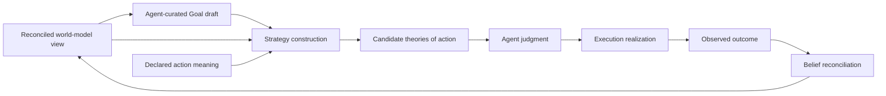

# World Model Strategy

## Thesis

Strategy bridges desired reality and executable action.

A Goal says what an Agent wants to become true. It does not by itself explain how available actions could move the world toward that condition. Strategy supplies that missing theory of action.

Strategy asks:

```text
Given what the Agent wants,
what the world model currently supports,
and what actions have declared meaning,
which courses of action are worth authorizing?
```

The result is one or more concrete candidates that the Agent can judge. Execution receives only the meaning the Agent authorizes.

## Why Strategy exists

Available actions do not explain why they matter to a Goal. A capability may be runnable while being irrelevant, insufficient, too risky, or outside authority.

A reusable Method provides one known decomposition. It does not prove that the Method applies to the current subject, evidence, constraints, or Goal.

Without Strategy, semantic choice leaks into the wrong domain. Execution begins inventing meaning from available mechanics, or domain packages become fixed procedural programs. Strategy keeps semantic choice in the world model while keeping operational realization in Execution.

## Computational center

Strategy answers one bounded construction question:

```text
For this Goal in this exact world-model context,
which approach should the Agent consider authorizing?
```

Its center is a pure, obligation-directed walk from desired settlement toward available atomic action:

```text
Goal
+ exact planner snapshot
+ declared domain action and outcome meaning
+ versioned Capability contract snapshot
+ separately admitted Method snapshot
+ explicit construction policy and authority context
→ eligible candidate approaches
+ typed rejection grounds
```

Strategy begins with the obligations implied by the Goal and its prospective evidence route. It may instantiate an admitted Method or search backward from required results to Capability contracts that can produce them. It then walks each required Capability input until every input is supplied by current context, an existing admissible artifact, or the output of another selected Capability.

PDS supplies the semantic starting vocabulary: maintained conditions, settlement obligations, abstract action and outcome meaning, evidence requirements, governance classifications, and constraints. Capability contracts independently supply the activation-local atomic executable vocabulary. Strategy joins these declarations for one Goal and one exact world-model context without transferring ownership from either source.

The walk is not only artifact matching. At every step Strategy evaluates semantic preconditions against the exact planner projection. A structurally connectable Capability graph is not eligible when its world-state conditions are unsupported, its action meaning does not advance the Goal, or its outcome lacks a valid evidence route.

The result is a ground candidate approach with enough action structure and lineage for Execution to revalidate and compile. Construction is referentially transparent over the supplied snapshots and policy. Internal search indexes, queues, arenas, and memoization do not change that external purity.

## Input ownership

`StrategyProblem` combines canonically separate inputs:

| Input | Owner | Source |
| --- | --- | --- |
| Goal | Agent | current curated commitment |
| planner snapshot | world-model planner | current perspective and branch projection |
| Strategy semantic theory | routed domain owner | exact PDS semantic revision |
| capability snapshot | capability and activation | exact contracts active for one assignment generation |
| Method snapshot | Strategy | separately admitted reusable Strategy knowledge |
| evaluation policy | Agent | construction policy selected for the Goal class |
| authority context | Agent and execution | assignment request, grant lineage, and restrictions |

Search engine identity, traversal bounds, and deterministic seed belong to `StrategySearchRequest` rather than PDS theory.

The implemented `StrategyTheoryPackage` predates this split. It is a compatibility aggregate and not the canonical public PDS contract.

## Capability, Task, and Method

These concepts answer different questions.

### Capability

A Capability is Meld's atomic executable contract. Its published contract declares typed inputs, typed outputs, required bindings, scope, operational effects, and execution behavior.

Strategy must be aware of Capability contracts because they define the atomic construction vocabulary. This awareness arrives through a versioned semantic snapshot. Strategy does not own Capability implementations, invoke them, inspect provider internals, or treat catalog presence as authority.

### Task

A Task is a graph of bound Capability instances whose required artifact inputs and bindings are closed and whose dependency structure can be compiled. A Task answers whether a unit of work is executable.

Strategy constructs the semantic shape that should become one or more Tasks. It selects exact Capability contracts and proves input, semantic binding, and dependency closure against its snapshot. Execution owns permitted runtime binding, authoritative task compilation, live feasibility checks, scheduling, and dispatch.

A candidate approach may lower to one Task, an ordered or data-dependent set of Tasks, or a task-network subgraph. Task boundaries express executable and lifecycle boundaries. They do not by themselves explain why the work advances the Goal.

### Method

A Method is a reusable Strategy solution template. It answers when and why a known Task shape or Task-set shape is an applicable approach to a class of Goals.

A Method therefore contains more meaning than a Task:

- the Goal trigger that makes the Method relevant
- semantic preconditions over world state
- a reusable action and dependency shape
- predicted contribution to the Goal
- prospective outcome and evidence meaning
- cost, risk, preference, and assumption metadata

Instantiating a Method against one ground Goal and one exact planner snapshot produces a candidate. The candidate, not the reusable Method alone, is what the Agent judges.

A successful Strategy construction may be promoted into a cached Method through separate Strategy admission. The Method retains a reusable Task construction template, Capability contract requirements, semantic applicability, and evidence meaning. A ground Method instance records the exact Capability contract identities and bindings selected for one candidate. Execution may separately cache compiled Task records by that exact Method instance and contract identity.

A PDS package may define the stable semantic vocabulary against which a Method is checked. It does not install a Method topology as stewardship meaning.

A compiled Task alone is not a Method because it does not carry Goal applicability or evidence meaning. A Method is not invalidated merely because one compiled realization is unavailable. Strategy may construct another eligible realization from compatible Capability contracts, while the Agent retains authorization authority over the resulting candidate.

## Construction and precondition closure

Strategy closes two different kinds of obligation during the same walk.

### Artifact and compilation closure

For each selected Capability input, Strategy determines whether the required artifact or binding is:

- already supplied by the current context
- available as an existing admissible artifact
- producible by another Capability whose outputs match the contract
- impossible or ambiguous under the available contract snapshot

Producible inputs become new construction obligations. The walk continues until the resulting Capability graph is closed or the candidate is rejected. Execution later verifies schema versions, cardinality, binding validity, scope compatibility, operational effects, and compilation against the live catalog.

### World-state applicability closure

World-state preconditions answer whether a Capability or reusable Method makes sense in the current situation. Strategy evaluates them through the shared three-valued language:

- satisfied conditions discharge the obligation
- unsatisfied conditions reject the approach or introduce an upstream action only when declared action meaning supports changing that condition
- indeterminate conditions may justify an observation approach but never become assumed truth

This distinction is what lets Strategy change the destination rather than merely report a missing input. If `README.md` does not exist, a Method that revises an existing document is semantically inapplicable even if a writer Capability could accept enough synthetic input to run. Strategy may instead construct a create-document approach with different preconditions, Capability inputs, outcome meaning, and evidence route.

Artifact existence should arrive through graph or sensory projection as a ground proposition. A Belief Family supplies maintained-condition, evidence, and comparison meaning such as whether documentation adequately accounts for its subject. Strategy consumes the resulting planner propositions. It does not inspect Belief Family internals or privately decide whether absence, uncertainty, or freshness holds.

Compilation closure proves that selected work can be formed. World-state applicability proves that forming that work is supported here. The prospective evidence route proves why performing it could matter to the Goal. An eligible candidate requires all three.

## Strategy construction walk

```text
Start with the Goal and its settlement obligations.
Derive the required action outcome and prospective evidence route.
Find Capability contracts whose declared outputs can contribute.
For each candidate Capability:
    evaluate world-state preconditions
    bind inputs already supported by current context
    recursively find producers for remaining artifact inputs
    preserve ordering, data flow, assumptions, cost, and lineage
Reject branches with unsupported meaning, open required inputs,
ambiguous bindings, invalid evidence routes, or exceeded bounds.
Return ground candidate Task shapes for Agent judgment.
```

This search may reuse a configured Method as a previously learned branch. It must also be able to construct a novel branch from Capability contracts when no Method applies. Method lookup is an optimization and a source of reusable meaning, not the definition of Strategy.

## Core flow



Strategy sits between Goal drafting and Goal admission. Construction does not admit a Goal. Agent judgment does.

## Authority

The Agent owns Strategy judgment.

Strategy may construct and present a candidate. It may not grant authority to itself, admit its own Goal, declare its own outcome correct, or satisfy the Goal it is pursuing.

Execution owns operational realization. It may validate current feasibility, bind mechanics allowed by the authorization, schedule work, and reject work that is stale or impossible. It may not invent a different semantic approach.

Belief domains own evidence admission, comparison, uncertainty, and reconciled state. Strategy consumes those judgments. It does not reproduce them privately.

Persistence custody does not change any of these authorities.

## Strategy candidates

A candidate is a concrete theory of action for one Goal in one world-model context.

It explains:

- which actions belong
- what each action contributes
- why dependencies exist
- which assumptions remain unresolved
- what evidence or observable change would support success
- which current facts and authority make the candidate eligible

A candidate may instantiate a configured Method or be constructed directly by closing Capability inputs into a novel Task shape. Both paths produce the same ground candidate form for Agent judgment.

## Means and ends

Every selected action must have a defensible role in pursuing the Goal.

Artifact compatibility, graph adjacency, action availability, low cost, or prior use may support a candidate. None is sufficient by itself to establish that the action advances the Goal.

## Evidence and settlement

Strategy plans to settle questions. It does not assert that desired outcomes have already occurred.

For an observational condition, a valid candidate identifies a route by which action may produce evidence that an owning domain can later admit and reconcile. Predicted effects may justify trying an action. They cannot impersonate observation, evidence admission, belief revision, or Goal satisfaction.

The original Goal remains the condition the Agent evaluates after outcomes are reconciled.

## Choice and replay

Candidate generation is reproducible for the same complete search request, engine identity, and explicit seed. Agent judgment may remain nondeterministic.

Once an Agent judgment is settled, it becomes the authority for subsequent action. Replay reuses that exact judgment and selected meaning. It does not regenerate candidates or ask the Agent to choose again.

This separates epistemic freedom from operational reproducibility.

## Relationship to domain theory

Domain theory supplies meaning rather than procedure.

It may describe maintained conditions, observations, evidence meaning, action affordances, outcome meaning, authority needs, and constraints. It should not need to prescribe one fixed workflow, traversal order, provider, retry policy, or task graph.

Strategy interprets this declared meaning against current world-model views. Execution chooses operational realization within the authorized semantic boundary.

## Relationship to shared language

Goals, Methods, Operators, and Compositions provide the current shared representation for desired state and action structure.

An Operator records one semantic action role and the contract requirements a Capability must satisfy in that role. A Composition records the graph of roles, dependencies, and subgoals that forms a candidate Task construction shape. A Method caches a reusable Composition template together with Goal applicability and Strategy meaning.

Strategy uses that language and its Capability contract snapshot to express a concrete candidate with exact Capability contract identities. Execution revalidates those identities, applies only permitted runtime bindings, compiles their Task graphs, and lowers them into the task network. The language does not own Strategy authority, persistence, ranking, or outcome judgment.

## Non-goals

Strategy is not:

- a second belief engine
- an evidence-admission authority
- a Goal lifecycle owner
- an Execution scheduler
- a task-network store
- a workflow language
- a capability implementation
- an authority-granting system
- proof that predicted effects occurred

## Documents

- [Strategy Search](search.md)
  pure problem, position, candidate, result, verification, and algorithm conformance contracts
- [Strategy Boundary Contracts](contracts.md)
  semantic promises between owning domains
- [Docs Freshness Strategy](docs_freshness.md)
  observational maintenance example
- [CVE Freshness Strategy](cve_freshness.md)
  structurally different maintenance example
- [Strategy Implementation Plan](../../../plan/world_model/strategy/README.md)
  delivery-specific requirements and verification

## Read with

- [World Model](../README.md)
- [World Model Agent](../agent/README.md)
- [Belief Reconciliation](../belief/README.md)
- [World Model Planner](../planner/README.md)
- [Execution Planning](../../execution/planning/README.md)
- [Meld Lang](../../meld-lang/README.md)
- [Persistent Domain Stewardship](../../../persistent_domain_stewardship/README.md)
