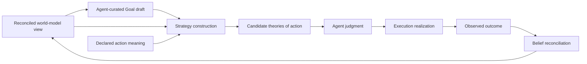

# World Model Strategy

## Thesis

Strategy bridges desired reality and executable action.

A Goal says what an Agent wants to become true. It does not by itself explain how available actions could move the world toward that condition. Strategy supplies that missing theory of action.

Strategy asks:

```text
Given what the Agent wants,
what the world model currently supports,
and what actions have declared meaning,
which courses of action are worth authorizing?
```

The result is one or more concrete candidates that the Agent can judge. Execution receives only the meaning the Agent authorizes.

## Why Strategy exists

Available actions do not explain why they matter to a Goal. A capability may be runnable while being irrelevant, insufficient, too risky, or outside authority.

A reusable Method provides one known decomposition. It does not prove that the Method applies to the current subject, evidence, constraints, or Goal.

Without Strategy, semantic choice leaks into the wrong domain. Execution begins inventing meaning from available mechanics, or domain packages become fixed procedural programs. Strategy keeps semantic choice in the world model while keeping operational realization in Execution.

## Core flow



Strategy sits between Goal drafting and Goal admission. Construction does not admit a Goal. Agent judgment does.

## Authority

The Agent owns Strategy judgment.

Strategy may construct and present a candidate. It may not grant authority to itself, admit its own Goal, declare its own outcome correct, or satisfy the Goal it is pursuing.

Execution owns operational realization. It may validate current feasibility, bind mechanics allowed by the authorization, schedule work, and reject work that is stale or impossible. It may not invent a different semantic approach.

Belief domains own evidence admission, comparison, uncertainty, and reconciled state. Strategy consumes those judgments. It does not reproduce them privately.

Persistence custody does not change any of these authorities.

## Strategy candidates

A candidate is a concrete theory of action for one Goal in one world-model context.

It explains:

- which actions belong
- what each action contributes
- why dependencies exist
- which assumptions remain unresolved
- what evidence or observable change would support success
- which current facts and authority make the candidate eligible

A candidate may instantiate a configured Method into a concrete Composition. This is the only construction shape established by the current design.

## Means and ends

Every selected action must have a defensible role in pursuing the Goal.

Artifact compatibility, graph adjacency, action availability, low cost, or prior use may support a candidate. None is sufficient by itself to establish that the action advances the Goal.

## Evidence and settlement

Strategy plans to settle questions. It does not assert that desired outcomes have already occurred.

For an observational condition, a valid candidate identifies a route by which action may produce evidence that an owning domain can later admit and reconcile. Predicted effects may justify trying an action. They cannot impersonate observation, evidence admission, belief revision, or Goal satisfaction.

The original Goal remains the condition the Agent evaluates after outcomes are reconciled.

## Choice and replay

Candidate generation and Agent judgment may be nondeterministic.

Once an Agent judgment is settled, it becomes the authority for subsequent action. Replay reuses that exact judgment and selected meaning. It does not regenerate candidates or ask the Agent to choose again.

This separates epistemic freedom from operational reproducibility.

## Relationship to domain theory

Domain theory supplies meaning rather than procedure.

It may describe maintained conditions, observations, evidence meaning, action affordances, outcome meaning, authority needs, and constraints. It should not need to prescribe one fixed workflow, traversal order, provider, retry policy, or task graph.

Strategy interprets this declared meaning against current world-model views. Execution chooses operational realization within the authorized semantic boundary.

## Relationship to shared language

Goals, Methods, Operators, and Compositions provide the current shared representation for desired state and action structure.

Strategy uses that language to express a concrete candidate. The language does not own Strategy authority, persistence, ranking, or outcome judgment.

## Non-goals

Strategy is not:

- a second belief engine
- an evidence-admission authority
- a Goal lifecycle owner
- an Execution scheduler
- a task-network store
- a workflow language
- a capability implementation
- an authority-granting system
- proof that predicted effects occurred

## Documents

- [Strategy Boundary Contracts](contracts.md)
  semantic promises between owning domains
- [Docs Freshness Strategy](docs_freshness.md)
  observational maintenance example
- [CVE Freshness Strategy](cve_freshness.md)
  structurally different maintenance example
- [Strategy Implementation Plan](../../../plan/world_model/strategy/README.md)
  delivery-specific requirements and verification

## Read with

- [World Model](../README.md)
- [World Model Agent](../agent/README.md)
- [Belief Reconciliation](../belief/README.md)
- [World Model Planner](../planner/README.md)
- [Execution Planning](../../execution/planning/README.md)
- [Meld Lang](../../meld-lang/README.md)
- [Persistent Domain Stewardship](../../../persistent_domain_stewardship/README.md)
