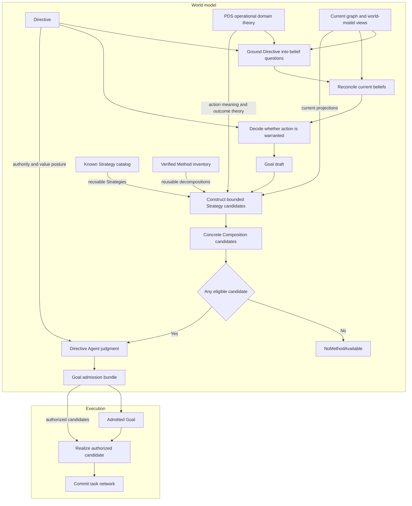

# World Model Strategy

Date: 2026-07-23
Status: active
Scope: Agent-authorized semantic construction of evidence-backed action Compositions

## Thesis

`world_model/strategy` owns the transition from desired reality to an evidence-backed theory of action.

A Directive says what should be maintained. Directive grounding turns that intent into questions about concrete things. Belief Reconciliation answers those questions as far as current evidence allows. When the Agent decides that a belief divergence warrants action, it creates a Goal draft.

Strategy then asks:

```text
Given what we want, what we currently believe, and what actions exist,
which concrete theories of action could satisfy this Goal?
```

It may reuse a known Strategy, instantiate a verified Method, construct a new Composition, or combine those sources. The Agent judges the resulting candidates. Execution sees only an admitted Goal and its authorized candidates.

## End-to-end flow



The center line is the product flow. PDS, current state, known Strategies, and verified Methods are inputs to particular stages. They are not themselves runtime stages.

## Canonical authority split

| Concern | Owns |
|---|---|
| PDS | state-free domain meaning |
| Graph | current objects, relations, lineage, and provenance |
| Belief | evidence admission, assessment, uncertainty, and revision |
| Causation and regime | effect and structural-context views |
| World-model planner projection | action-relevant world-model reads |
| Directive Agent | maintained intent, Goal drafts, value posture, and authorization |
| Strategy | candidate theories of action |
| Execution Planning | operational realization of authorized candidates |
| Task network | committed work and execution state |
| Events | semantic commitments and observed outcomes |

The Directive Agent may explicitly delegate Strategy construction to another Agent. Delegation must preserve the granting Agent, allowed scope, authority, objective, and revocation boundary.

Persistence custody does not confer semantic authority. Another domain may store a Strategy record without gaining authority to construct or approve its meaning.

## Why Strategy exists

A Goal draft states desired reality. It does not contain a causal theory for reaching that reality.

Execution capabilities expose possible operations. Their availability does not establish semantic relevance, evidentiary sufficiency, causal coherence, or authority.

Strategy supplies the missing semantic bridge:

```text
Goal draft
+ current evidence and causal projections
+ reusable Strategies and Methods
+ PDS action affordances
→ concrete candidate Compositions
```

Without this boundary, one of two failures occurs.

Execution begins interpreting domain meaning and becomes a second epistemic authority.

Alternatively, PDS packages prescribe complete workflows and become another procedural runtime language.

Strategy keeps domain meaning epistemic while allowing execution mechanics to remain generic.

## Relationship to PDS

Persistent Domain Stewardship supplies declarative operational domain theory.

It may declare or link:

- objects and relations
- observations and evidence routes
- belief dimensions and comparators
- maintained objectives
- semantic action affordances
- outcome verification
- authority requirements
- governance and value posture

PDS contains no current belief state, live Goal, Strategy decision, generated Composition, task, commitment, or outcome.

Strategy consumes a compiled and activated theory with exact package, profile, assignment, activation, and authority lineage. Strategy does not require one final PDS source schema. A central package, federated facets, or root-composed first proof may supply equivalent typed semantics.

The proposal corpus under [Persistent Domain Stewardship](../../../persistent_domain_stewardship/README.md) remains non-authoritative for PDS schema and lifecycle choices. This Strategy area is authoritative for the runtime boundary between domain theory, Agent judgment, and Execution Planning.

## Relationship to Agent

The Directive Agent owns Strategy judgment.

The Agent:

- grounds Directive-maintained conditions into concrete belief questions over trusted scope
- curates a Goal draft when reconciled belief diverges from the desired state
- supplies perspective and normative posture
- selects the decision context and normative relevance without overriding epistemic verdicts
- authorizes Strategy construction and any delegated Agent
- accepts, rejects, or supersedes the proposed Goal and Strategy decision together
- remains responsible for Goal curation and satisfaction curation

Strategy obligations are not Execution Goals. They are internal semantic nodes explaining why actions and edges belong in a candidate Composition.

Strategy cannot mutate Goal lifecycle. A Goal draft remains world-model curation state until Strategy presents at least one eligible candidate and the Agent authorizes admission. The initial handoff to Execution contains the nonempty authorized candidate inventory with the Goal. Later Goal changes, suspension, satisfaction, and abandonment remain Agent curation decisions submitted through Execution Goal APIs.

## Relationship to world-model planner projection

Strategy is not a second belief engine.

It consumes typed projections owned by graph, belief, causation, regime, and world-model planner. These may include:

- trusted scope projections
- belief revisions and applicability views
- relevance, evidence-admission, and sufficiency verdicts
- observation opportunities
- causal effect summaries
- efficacy and uncertainty projections
- precondition assessments
- regime sensitivity and risk envelopes
- validity horizons and source revisions

Strategy may request a candidate-intervention projection for a proposed Composition. The owning world-model domains remain authoritative for the resulting verdicts.

Strategy must not create private persistent posteriors for correctness, evidence sufficiency, causal effect, efficacy, uncertainty, or information gain.

## Relationship to Execution Planning

Strategy decides semantic approach. Execution Planning decides operational realization.

Strategy may:

- ground an authorized scope into internal obligations
- construct alternative causal Compositions
- select semantic action affordances
- justify dataflow and ordering edges
- require outcome verification
- request typed feasibility and efficacy projections
- present candidate alternatives and exact reuse conditions for Agent authorization

Execution Planning may:

- evaluate pure propositions against the referenced `WorldState`
- validate concrete candidate and Operator preconditions
- bind only Strategy-authorized variables
- reject stale, inapplicable, unavailable, or unauthorized candidates
- resolve operators to current capabilities
- apply exact Strategy-supplied reuse keys
- coordinate resources and other active plans
- schedule independent work concurrently
- lower the chosen Composition
- commit task-network mutations
- publish semantic planning commitments

Execution Planning must not:

- invent a new causal dependency
- redefine a domain objective
- decide that one evidence form substitutes for another
- add semantic work because it interpreted a Directive
- change claimed outcome meaning
- treat task success as Goal satisfaction

Missing or stale semantic proof causes rejection and renewed Strategy construction. It does not authorize Execution to repair the meaning itself.

## Composition and Method

An episode-specific Strategy normally produces a concrete `meld-lang::Composition`.

A `Composition` is a fixed graph for one Strategy decision. Episode object and topology bindings are ground. Any remaining operational binding slot must be explicit in the proposal. Every subgoal step resolves inside that proposal to an exact child Composition or an exact Method revision and bindings. Agent authorization covers the complete resolved candidate, so Execution never searches for novel subgoal meaning.

A `Method` is a reusable cached decomposition template. Strategy may separately propose a generalized Method when its derivation is independent of one episode. Execution owns Method verification, registration, namespace, visibility, revision, and quarantine.

```text
Strategy decision
  → one or more concrete Composition candidates
  → optional reusable Method proposal

Execution Method library
  ← only verified reusable Method revisions
```

One-off Compositions must not enter one undifferentiated global Method library.

## Known Strategy catalog

The names in this area describe different things:

| Name | Meaning |
|---|---|
| Known Strategy catalog | every reusable Strategy currently persisted |
| Available Strategy set | candidates that apply to one Goal draft in one world-model frame |
| Strategy alternative | one candidate with its evidence and justification |
| Composition | the concrete action graph inside that candidate |
| Method | a reusable Composition template verified and stored by Execution |

The known catalog is complete only for persisted reusable knowledge. It does not enumerate every Strategy Meld could construct.

A catalog entry minimally identifies:

```text
Strategy identity and revision
Goal pattern
PDS and authority lineage
reusable Method or Composition template references
prior selection and outcome references
availability posture
```

Execution retains custody of verified Method bodies. Catalog entries refer to exact Method revisions rather than duplicating them.

For one Goal draft, Strategy combines applicable catalog entries with novel episode-specific candidates. An empty catalog does not imply an empty available set.

Selection lineage preserves the catalog entry or novel candidate identity through Strategy decision, planning commitment, and outcome events. This is the minimal foundation for later curation that compares predicted efficacy with observed reality and prefers a previously successful Strategy when it remains applicable. Catalog lookup matches Goal patterns against the untransformed target. Efficacy curation over this lineage is a separable concern layered on the preserved association.

Implementation sequencing, the first-slice scope, and the deferred normative tier live in [Strategy Ground Map](../../../plan/world_model/strategy/ground_map.md).

## Strategy flow

One bounded attempt has four phases:

```text
1. Understand the Goal draft against current world-model evidence.
2. Reuse known Strategies and Methods where they apply, then construct novel candidates as needed.
3. Validate and compare the resulting concrete Compositions.
4. Present eligible candidates to the Agent for judgment and Goal admission.
```

Construction is bounded by candidate count, expansion depth, compute budget, elapsed budget, any model-use budget, or an explicit combination.

## Construction procedure

Strategy construction is defined over the pure planning operations that already govern Execution planning: `unify`, `substitute`, `evaluate`, `validate`, `WorldState::gap`, and `WorldState::apply`. Construction is not a new formalism. It is a bounded regression loop over the existing language.

```text
obligations = per-conjunct decomposition of settlement(goal.target)
              against the referenced WorldState
producers   = verified Methods whose trigger unifies with an obligation
            + affordances whose declared effects unify with an obligation
expansion   = substitute bindings, project effects with apply,
              recurse on unmet preconditions as new obligations
emission    = Composition steps and edges,
              every edge citing the obligation and effect that produced it
bound       = candidate count, expansion depth, compute budget,
              elapsed budget, and any model-use budget
```

Obligation decomposition is per conjunct and indeterminacy-aware. An unsatisfied proposition and an indeterminate proposition are distinct typed obligations, each carrying the subject, rule, and revision that introduced it. A disjunctive target decomposes into alternative obligation sets, one per viable disjunct. Collapsing an indeterminate or disjunctive target into one opaque obligation is not valid decomposition.

Capacity enters construction as typed verdicts, not arithmetic. The owning world-model projection computes per-subject fit verdicts for each declared evidence path shape, and construction consumes those verdicts as ordinary propositions. Construction itself performs no resource aggregation.

Model-backed proposal may replace or seed the producer and expansion steps. The emitted candidate still passes the same deterministic validation, and the recorded generator artifact governs replay.

### Settlement transform

An observational Goal condition cannot be asserted by any honest effect model. No candidate can truthfully project that a correctness score will exceed a threshold before the evaluation exists.

Observationality is a declared property of a belief dimension, owned by the dimension's belief family in the operational domain theory. A dimension is observational when its value is established only by admitted evidence that arrives after action, never by an action's declared effects. Evaluation over produced artifacts and observation of an authoritative external source are both settlement routes. The transform is not inferred from proposition syntax.

The `settlement` transform maps each observational proposition in a Goal target to the proposition that its owning question is settled with admitted evidence bound to the subject revision of the referenced frame. The settling evidence arrives later in time; the binding is to the frame's subject revision, so later subject change invalidates the settlement rather than the settlement claiming to precede its own evidence. Non-observational propositions pass through unchanged. Candidates regress against `settlement(goal.target)`. The untransformed target remains the satisfaction condition owned by Agent curation.

Prospective effects gated on a future admission verdict are assumed discharged during settlement regression. Each such assumption is recorded on the candidate, and a failed admission invalidates exactly the edges that cite it and wakes the Strategy association. This assumption is legitimate for admission gates because they carry declared invalidation and wake paths. It is never legitimate for the Goal threshold itself, because assuming the satisfaction condition would collapse the convergence loop the threshold exists to drive.

A candidate therefore plans to settle questions. It does not assert outcomes. Crossing the configured threshold is a Belief reconciliation result and a later Agent satisfaction decision inside bounded convergence.

### Affordance ground

A semantic action affordance is representable as a standalone `meld-lang::Operator` with declared propositional preconditions and effects, joined to capability contracts through the existing resolution constraints, and carrying artifact meaning and an outcome contract reference.

Methods remain cached reusable decompositions. Affordances are the atomic verbs that novel construction composes. Domain ordering rules are entailed by affordance preconditions rather than authored: an evaluator that requires `Exists` over exact published bytes makes generation precede evaluation in every candidate that regresses through it.

### Construction-time conditionality

Whether work is required is decided at construction time from reconciled belief, not at run time inside a task.

When an artifact already exists and its evidence is admitted, the candidate contains no producing step and the reuse is recorded as Strategy lineage. A capability must not decide whether its own work was necessary by re-reading domain state, because that is an evidence judgment made without epistemic authority. A world change between construction and dispatch is handled through validity dependencies and invalidation.

Two empty-result cases must remain distinct:

| Result | When | Meaning |
|---|---|---|
| `NoMethodAvailable` | before initial Goal admission | Meld cannot connect the desired state to any eligible theory of action |
| Strategy abstention | after Goal admission | the Goal remains valid, but no useful action is available in the current state |

`NoMethodAvailable` is a visible runtime error and the Goal draft stays outside Execution. Abstention makes an active Goal quiescent until relevant state changes.

## Bounded convergence

Strategy participates in an open-ended convergence loop without hot-looping.

```text
observe
→ ground Directive into belief questions
→ reconcile belief
→ curate Goal draft
→ construct bounded Strategy
→ admit Goal with nonempty Strategy inventory
→ realize bounded work
→ observe outcome
→ reconcile again
```

Each Strategy attempt is bounded. Convergence is not limited to one attempt.

A below-threshold outcome may produce a new world-model verdict and a different Strategy decision. An unchanged input frame must not repeatedly generate equivalent work without new eligibility, invalidation, or retry posture.

Ordering between Goals is never declared. Grounding cannot instantiate belief questions over untrusted scope, so a Goal whose questions require evidence from earlier work cannot be drafted until that evidence reconciles. Trusted-scope gating is the only inter-Goal sequencing mechanism. Ordering inside one Goal is explicit in its authorized Composition. Execution orders nothing but the ready front.

## World change and planning commitment

A candidate Composition is counterfactual. Constructing or comparing it does not change world state and does not require a canonical event.

An Agent-authorized Strategy decision is a durable judgment but not yet an operational commitment.

An accepted task-network mutation is a real operational change. Execution must publish a semantic planning commitment through the atomic task-network outbox after acceptance.

```text
candidate Composition
  hypothetical

Strategy decision
  authorized theory of action

accepted task-network mutation
  operational commitment

task outcome
  observed execution result
```

A planning commitment records what Meld decided to attempt. It is not evidence that the intended domain effect occurred.

## Runtime ground

Strategy is constructed over the existing typed planning substrate rather than a new formalism. The construction procedure reuses the shared-language pure operations. Candidate validation generalizes the existing Execution candidate-evaluation regression. Eligibility typing, mechanical no-method reporting, task lineage, data-defined belief families, generic curation, and the generic planner projection are the same primitives this design extends.

The verified primitive inventory, the concept-to-ground map, the known limits of the current planning path, and the remaining construction delta live in [Strategy Ground Map](../../../plan/world_model/strategy/ground_map.md).

## Documents

- [Strategy Requirements](requirements.md)
  normative behavior and boundary requirements
- [Strategy Contracts](contracts.md)
  shared records, lifecycle, lineage, durability, and event handoffs
- [Docs Freshness Strategy](docs_freshness.md)
  authoritative worked example and bottom-up fan-out viability proof
- [CVE Freshness Strategy](cve_freshness.md)
  paired non-documentation worked example proving structurally distinct derivation per STR-075
- [Strategy Ground Map](../../../plan/world_model/strategy/ground_map.md)
  verified primitive inventory and construction delta under the implementation plan
- [Use Case Catalog](../../../use_cases/README.md)
  use-case descriptions, fluid Meld conversions, and required semantics per domain

## Read with

- [World Model Agent](../agent/README.md)
- [Directive Grounding](../agent/directive_grounding.md)
- [World Model Planner](../planner/README.md)
- [World Model Belief](../belief/README.md)
- [Causal Layer](../causation/README.md)
- [Regime Layer](../regime/README.md)
- [Meld Lang](../../meld-lang/README.md)
- [Execution Planning](../../execution/planning/README.md)
- [Planning Pipeline](../../execution/planning/planning_pipeline.md)
- [Task Network](../../execution/task_network.md)
- [Persistent Domain Stewardship](../../../persistent_domain_stewardship/README.md)
