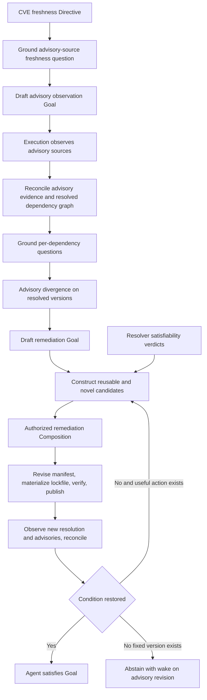

# CVE Freshness Strategy

Date: 2026-07-24
Status: active worked example
Scope: derive correct dependency remediation work from domain theory and current world state

## Objective

The CVE freshness Directive is:

```text
Every dependency in the activated manifest scope resolves to a version
with no admitted advisory at or above the configured severity
and within the configured version-currency policy.
```

This is the non-documentation worked example required by [STR-075](requirements.md). It must derive structurally distinct work from the same schema and construction procedure that derives the docs freshness topology. The axes it exercises are the ones documentation never touches: settlement by acquisition of external evidence rather than evaluation over produced bytes, scoped negative obligations, resolver-verdict feasibility over a constraint graph, and candidate scoping over one shared mutable artifact.

The derivation is falsified if any documentation concept appears: no coverage artifact, no containment obligation, no bottom-up pattern, and no docs-specific Strategy branch may be required.

## Worked flow



Coupled batching is one candidate scope that Strategy may derive inside `BUILD`. It is not declared by the Directive.

## What the domain theory must supply

The dependency stewardship operational domain theory must supply meaning, not procedure.

### Vocabulary and relations

The theory identifies manifest, dependency declaration, version constraint, resolved version, lockfile, advisory, advisory source, severity, fixed release, and verification suite.

It defines relations such as declares, constrains, resolves to, affects, fixed in, and supersedes.

It declares the manifest and lockfile as the canonical shared artifacts of the scope.

### Maintained condition

The theory declares that each dependency in activated scope requires a resolved version with no admitted advisory at or above the configured severity, within the configured currency distance, and covered by a passing verification outcome for the current lockfile revision.

### Advisory theory and the scoped negative

Absence of an advisory is not a fact about the world. It is a fact about admitted evidence.

The maintained condition's negative claim is scoped: no advisory admitted from the declared source set at its admitted source revision affects the resolved version. Three epistemic states remain distinct:

```text
unassessed        no advisory observation covers this resolved version
settled clean     an observation at source revision R found no affecting advisory
settled affected  an admitted advisory affects this resolved version
```

An unassessed dependency is never treated as clean. Removing a source from the admitted set makes questions unassessable rather than settled.

### Evidence semantics

The theory distinguishes three evidence kinds that must never substitute for one another.

Advisory observation evidence settles advisory questions for the exact resolved version set at an exact source revision.

A resolver satisfiability verdict is feasibility evidence over a hypothetical manifest revision. It establishes that a candidate version set can exist. It settles nothing about advisories or behavior.

A verification outcome settles regression questions for the exact lockfile revision it ran against. A passing verification does not establish advisory cleanliness, and advisory cleanliness does not establish that the upgrade preserved behavior.

### Semantic action affordances

The theory exposes unordered action meaning for:

```text
observe advisory sources
resolve the constraint graph for a proposed manifest revision
propose a manifest revision
materialize the lockfile
execute the verification suite
publish the revision
```

Each affordance declares semantic preconditions, predicted effects, artifact meaning, capacity constraints, authority class, and outcome contract. Verification requires a materialized lockfile. Publication requires a verification outcome under the configured acceptance contract. Advisory settlement for a new version requires observation over the newly resolved set.

### Capacity and authority

The theory and activation expose publication authority, verification quota and cost, advisory source credentials, and the resolver as the declared authority for satisfiability verdicts.

The fit-verdict analog of the documentation context bound is the satisfiability verdict: construction consumes typed resolver verdicts over hypothetical revision sets and performs no constraint solving itself.

## What the domain theory must not encode

The Strategy derivation is falsified if its domain-theory source must declare:

```text
one dependency per change
fixed batch size or batch membership
an upgrade-to-latest rule
pull request or review workflow shape
verification retry counts
advisory polling schedule
provider instance
```

Those are candidate realization details or operational policy. They are not the meaning of dependency freshness.

## Grounding the Directive

Grounding begins from the activated manifest scope. It can instantiate an advisory-source freshness question and a lockfile trust question before per-dependency answers exist. Once reconciliation establishes trusted advisory evidence and a trusted resolved graph, grounding applies the maintained condition to each dependency in scope.

For each dependency, it instantiates concrete belief questions such as:

```text
resolved version identity
advisory status against the admitted source set and revision
currency distance from the latest admissible release
verification status of the current lockfile revision
```

Belief Reconciliation assesses those questions from admitted evidence. Unassessed, settled clean, settled affected, stale, and policy-divergent are epistemic results. They are not Strategy topology.

## Discovering action paths

Strategy works backward from each unsettled obligation through semantic affordances and authoritative verdicts.

The rule that remediation requires re-resolution is not separately authored. The verification affordance requires a materialized lockfile, advisory settlement for a new version requires observation over the resolved set, and publication requires a verification outcome. Regressing those preconditions discovers manifest revision, lockfile materialization, verification, and observation in every candidate that reaches publication.

For a dependency with an admitted affecting advisory, candidate paths may include:

```text
direct version bump to a fixed release
coupled batch revision when constraints bind dependencies together
constraint pin or exclusion where governance admits it
vendored patch where a patch affordance is declared and authorized
observation first when advisory or resolution evidence is stale
```

A candidate cannot assert that the new resolved version is clean or that verification will pass. Its terminal steps settle those questions: an advisory observation over the new resolved set and a verification run over the new lockfile revision, each gated on its authoritative admission.

## Why coupled batching becomes viable

Coupled batching follows from constraint coupling and the shared artifact rather than a named batching rule.

### Independent case

Two divergent dependencies with disjoint constraint closures produce independent obligations. Strategy derives separate candidates with no cross-dependency edges. Their planning commitments serialize on the shared manifest through Execution scheduling and frame validity, not through semantic edges. A false coupling edge between independent dependencies is a derivation error.

### Coupled case

When the resolver verdict establishes that bumping dependency A alone is unsatisfiable, or that it forces a version change in dependency B, the two remediations are one theory of action. Strategy derives a single candidate covering both, and the cross-dependency edge cites the satisfiability verdict that justifies it.

```text
advisory on A
+ constraint closure binding A and B
+ resolver verdict: A alone unsatisfiable, A with B satisfiable
+ one canonical lockfile artifact
→ one candidate revising A and B together
```

No batching declaration is needed.

### Why batching is not prescribed

The same theory yields other valid scopes when the world changes.

An isolated dependency with an urgent advisory takes a single direct bump. When both a batch and serial singles are feasible, verification cost and risk rank them: economy is preference, never the feasibility ground. When no fixed release exists and no patch affordance is authorized, no candidate can discharge the obligation at all.

Constraint coupling establishes which scopes are viable. Cost, risk, urgency, and the Agent value posture rank viable scopes. A projected outcome alone dis-prefers a path without excluding it.

## Concrete Strategy walk

The initial world-model frame may establish that advisory evidence is stale. Grounding instantiates the source-freshness question, reconciliation confirms staleness, and curation drafts an observation Goal. Strategy proposes a bounded observation candidate from the observe affordance, the Agent admits it, and Execution publishes fresh advisory evidence at source revision R.

Grounding then instantiates per-dependency questions. Reconciliation settles that dependency X's resolved version is affected by a critical advisory with a fixed release available. Curation drafts a remediation Goal.

Strategy combines applicable known Strategies with novel construction:

```text
direct bump of X          resolver verdict: conflicts with Y's constraint
batch revision of X and Y resolver verdict: satisfiable
exclusion pin of X        rejected: governance denies exclusion authority
vendored patch            rejected: no authorized patch affordance
```

The batch candidate carries a cross-dependency edge citing the satisfiability verdict, terminal advisory observation and verification steps under prospective admission gates, and the manifest revision bound to the current lockfile frame. The Agent authorizes it and admits the Goal. Execution revises the manifest, materializes the lockfile, runs verification, and publishes. Observation settles the new resolved set clean at source revision R plus one, and verification settles passing. Reconciliation restores the maintained condition and Agent satisfaction curation closes the Goal.

A second dependency Z carries an advisory with no fixed release. If its Goal is already admitted, Strategy abstains with typed grounds and registers a wake on advisory revision, and the Goal stays active and quiescent. If bounded construction for a new draft finds no eligible candidate from any source, the result is `NoMethodAvailable` and the draft stays outside Execution. When a fixed release is later published, the wake fires and a bounded attempt constructs the bump candidate.

The runtime remains active after satisfaction. A newly published advisory against a currently clean version reopens remediation work through new evidence and Agent curation.

## Bounded convergence

The example proves a loop rather than one remediation run.

```text
observe advisory sources
→ reconcile advisory evidence and resolved graph
→ ground per-dependency questions
→ reconcile Directive divergence
→ curate Goal draft
→ construct bounded Strategy over resolver verdicts
→ admit Goal with nonempty candidates
→ execute bounded work
→ observe new resolution, advisories, and verification
→ reconcile outcome
→ construct another bounded Strategy when the condition is not restored
```

The acceptance trace must prove all of the following:

1. A first candidate's verification fails and the failure evidence persists across restart.
2. A second Strategy decision cites the failure evidence and selects a different version or path.
3. A clean advisory observation and passing verification restore the condition and Agent satisfaction curation closes the Goal.
4. A no-fixed-version case leaves an active Goal with a quiescent Strategy association, a registered wake, and no repeated equivalent work.
5. A newly published fixed release wakes the association and permits a bounded attempt.
6. A newly published advisory reopens remediation after prior satisfaction.

## Falsification tests

The worked example is credible only if tests can disprove accidental hardcoding.

Required tests include:

- changing the severity threshold changes grounded obligations for the declared reason
- removing an advisory source makes affected questions unassessable and never settles them clean
- introducing a resolver conflict converts two independent candidates into one batch candidate whose cross-dependency edge cites the satisfiability verdict
- removing the conflict removes exactly that edge and restores independent candidates
- revoking publication authority rejects the candidate despite installed capability
- changing the currency policy flips pin and exclusion eligibility for the declared governance reason
- a verification outcome never settles an advisory question and advisory evidence never settles a verification question
- an unassessed dependency is never treated as settled clean
- a no-fixed-version advisory produces `NoMethodAvailable` before admission and typed abstention with a wake registration after admission
- when both batch and serial scopes are feasible, selection is recorded as ranked preference and the feasibility ground is always a typed resolver verdict
- no coverage artifact, containment obligation, or documentation-specific branch appears anywhere in the derivation

## Relationship to docs freshness

The two worked examples share one schema and one construction procedure and derive different topologies from different constraints.

| Axis | Docs freshness | CVE freshness |
|---|---|---|
| Settlement route | evaluation over produced exact bytes | observation of external advisory sources |
| Central claim shape | positive correctness threshold | scoped negative over admitted evidence |
| Topology driver | containment obligations plus bounded context | constraint coupling plus one shared artifact |
| Derived structure | child-before-parent fan-out with coverage artifacts | candidate scoping from independent bumps to coupled batches |
| Compression artifact | settled folder coverage | none |
| Independent world change | source tree drift | advisories arriving while idle |

A schema change required by one example and unused by the other is evidence of over-indexing in either direction and must be justified in both documents.

## Runtime ground

The primitive inventory and construction delta shared with the docs example live in [Strategy Ground Map](../../../plan/world_model/strategy/ground_map.md). Use-case framing, history, and required semantics live in [Use Case Catalog](../../../use_cases/README.md).

## Read with

- [World Model Strategy](README.md)
- [Strategy Requirements](requirements.md)
- [Strategy Contracts](contracts.md)
- [Docs Freshness Strategy](docs_freshness.md)
- [Directive Grounding](../agent/directive_grounding.md)
- [Belief Reconciliation Network](../belief/README.md)
- [Execution Planning](../../execution/planning/README.md)
