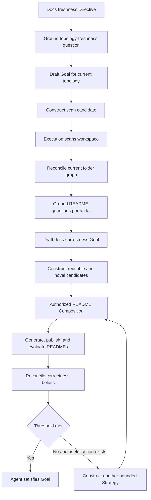

# Docs Freshness Strategy

Date: 2026-07-23
Status: active worked example
Scope: derive correct README work from domain theory and current world state

## Objective

The docs freshness Directive is:

```text
Every folder in the activated scope has a current README
whose correctness meets the configured threshold.
```

The target preserves the useful output shape of the existing docs freshness workflow: README files are produced per folder, work may fan out across independent folders, and semantic context may flow from descendants toward ancestors. Strategy adds stronger correctness and convergence semantics: exact published bytes are evaluated and bounded work may repeat until the active Goal is satisfied or no useful action is currently available.

The Strategy proof must obtain that behavior without placing bottom-up traversal, repeated turns, prompt order, child wiring, or a fixed task network in the Directive or stewardship package.

## Worked flow



Bottom-up fan-out is one candidate topology that Strategy may derive inside `BUILD`. It is not declared by the Directive.

## What the PDS must supply

The docs correctness operational domain theory must supply meaning, not procedure.

### Vocabulary and relations

The theory identifies workspace, folder, source file, README, correctness evaluation, and semantic coverage artifact.

It defines relations such as contains, direct child, documents, located at path, derived from evidence, and covers.

It declares the canonical README location as `README.md` beneath each folder.

### Maintained condition

The theory declares that each material folder in activated scope requires one current README and that the exact published README bytes must meet the configured correctness threshold.

### Correctness theory

Correctness is not the existence of a file.

For a folder README to be correct, it must:

- faithfully represent material direct contents
- represent every material direct child subtree
- support its claims with current admitted evidence
- omit no required folder concern
- satisfy required structure and style dimensions
- pass an evaluator against the exact published bytes

The theory owns threshold, dimensions, materiality, exclusions, evaluation route, evaluator independence, and accepted outcome shape.

### Evidence semantics

The theory distinguishes relevance, admission, projected sufficiency, and settled correctness.

A file or child subtree may be relevant to a README without its raw bytes being admitted or sufficient generation evidence.

The theory distinguishes two artifacts.

A `SourceCoverageSummary` is pre-generation evidence derived from admitted direct material. Under this docs correctness theory it covers only that direct material, may support generation for the same folder, and cannot discharge a transitive child-subtree obligation. It does not prove that the folder README is correct.

A `SettledFolderCoverage` artifact is admitted only after the exact published README bytes meet the relevant correctness and obligation-coverage thresholds and the result is reconciled. A below-threshold result remains outcome evidence, blocks the prospective edge, and does not release parent work. An admitted artifact may summarize one subtree for an ancestor while retaining:

```text
covered subjects
transitive source references
graph revision
obligation coverage
admitted semantic representation reference
semantic representation schema and content digest
freshness
semantic loss
size
producer lineage
```

PDS declares the evidence policy. Belief owns the admission verdict that decides whether a `SettledFolderCoverage` artifact may discharge a subtree-coverage obligation. The Agent selects decision context but cannot override that verdict.

Plain Markdown, a prior README, or a generic `frame_ref` is not automatically a semantic coverage artifact. Exact published README bytes, accepted evaluation results, and provenance may support admission of a new typed coverage artifact. They are not interchangeable with that artifact.

### Semantic action affordances

The theory exposes unordered action meaning for:

```text
observe folder topology
inspect material file content
produce source coverage summary
assemble bounded generation context
generate a README candidate
publish README bytes
evaluate exact published bytes
```

Each affordance declares semantic preconditions, predicted effects, artifact meaning, capacity constraints, authority class, and outcome contract.

The PDS may also import known reusable Methods. It must not require one generated episode to use them.

### Capacity and authority

The theory and activation expose configured context limits, quotas, publication authority, evaluator authority, and independence constraints. Live availability and remaining quota are runtime state supplied through an operational projection.

Context fit is not computed inside construction. The owning world-model projection evaluates, per folder and per declared evidence path shape, whether the assembled evidence fits the configured bound, and publishes the result as a typed fit verdict. Construction consumes fit verdicts as ordinary propositions.

It does not select a traversal strategy.

## What the PDS must not encode

The Strategy derivation is falsified if its PDS source must declare:

```text
bottom-up traversal
leaf-first order
repeated regions
turn sequence
prompt sequence
child frame wiring
retry count
timeout policy
workflow gates
provider instance
```

Those are candidate realization details or operational policy. They are not the meaning of docs correctness.

## Grounding the Directive

Directive grounding begins from the activated root scope. It can instantiate a topology-freshness question before folder membership is trusted. Once reconciliation establishes a current folder graph, grounding applies the maintained condition and PDS belief-family declarations to each material folder.

For each material folder, it instantiates concrete belief questions such as:

```text
README existence
README correctness
README evidence freshness
README direct-content coverage
README child-subtree coverage
```

Belief Reconciliation assesses those questions from admitted evidence. Unknown, missing, stale, below-threshold, and satisfied are epistemic results. They are not Strategy topology.

When the Directive Agent judges a reconciled divergence worth acting on, it constructs a Goal draft. Strategy then derives internal action obligations such as:

```text
README exists at the canonical path
README covers material direct files
README covers every material direct child subtree
README claims use current admitted evidence
exact published bytes have a current correctness evaluation
correctness meets the threshold
```

These are internal Strategy obligations. They are not separately inserted Execution Goals.

The distinction is:

```text
Directive grounding decides which questions must be answerable.
Belief Reconciliation decides what is currently believed.
Goal curation decides which divergence warrants action.
Strategy decides which theory of action can change it.
```

## Discovering action paths

Strategy works backward from each unsettled obligation through semantic affordances and authoritative verdicts.

The rule that correctness requires existence is not separately authored. The evaluator affordance declares an `Exists` precondition over the exact published bytes, so regressing that precondition discovers generation and publication in every candidate that reaches evaluation. The ordering rules the workflow previously encoded by hand are entailed by affordance preconditions.

For a missing README, candidate paths may include:

```text
direct generation from admitted raw evidence
generation from admitted semantic coverage artifacts
hybrid generation from raw direct evidence and child coverage artifacts
reuse of a current README followed by exact-byte evaluation
observation before generation when evidence is missing
```

Artifact compatibility alone does not make an evidentiary path valid. Every existing input used as evidence or obligation discharge must have an admission verdict and projected sufficiency. Ordinary operational artifacts such as candidate bytes use capability and artifact contracts without becoming epistemic evidence.

A future evidence artifact does not yet have an admission verdict. Strategy may use it for obligation discharge only through a prospective artifact contract that names the expected producer, content identity, outcome contract, owning admission authority, and downstream obligation. The evidentiary edge must be gated on a later authoritative admission verdict. Execution waits for that verdict and never decides admission itself.

## Why bottom-up fan-out becomes viable

Bottom-up fan-out follows from the correctness obligations and capacity facts rather than a named traversal rule.

### Leaf case

A leaf folder has no child-subtree obligations.

When its admitted direct evidence fits the context bound, Strategy can construct:

```text
inspect direct material
→ produce source coverage summary
→ generate README
→ publish exact bytes
→ evaluate exact bytes
→ await Belief reconciliation and admission verdict
```

The exact-byte evaluation binds output path, published content digest, folder graph revision, admitted source-evidence set, evaluator revision, score dimensions, threshold, independence posture, and provenance. Any later byte or material source revision invalidates that result.

The terminal step settles the correctness question. The candidate projects settlement of that question with admitted evidence at the referenced revision, never the score itself. Crossing the configured threshold is a Belief reconciliation result and an Agent satisfaction decision inside bounded convergence.

### Parent case

A parent README has one coverage obligation for each material direct child subtree.

When raw descendant evidence exceeds the context bound, the typed fit verdict excludes direct generation and the path is infeasible. An admitted child `SettledFolderCoverage` artifact can discharge the corresponding child obligation within the bound. In that world state the child README generation, publication, exact-byte evaluation, reconciliation, and coverage admission must precede the parent generation step, and bottom-up is a derived necessity.

When capacity permits direct generation but its outcome projection is poor, both paths remain feasible and bottom-up is a ranked preference under the Agent value posture rather than a necessity. The eligibility ground is always a typed capacity or evidence verdict. A projected outcome value alone dis-prefers a path without excluding it.

Sibling child producers do not depend on one another. Strategy preserves them as independent branches. Execution may run those branches concurrently. Parent work becomes eligible after the required child artifacts are admitted.

```text
child A README → evaluate → admit coverage ─┐
                                            ├→ parent bounded context
child B README → evaluate → admit coverage ─┤  → parent README
                                            │  → exact-byte evaluation
admitted direct evidence ───────────────────┘
```

This is a bottom-up fan-out candidate derived from:

```text
recursive folder obligations
+ bounded generation context
+ prospective admission gates for settled folder coverage
+ causal input requirements
```

No bottom-up declaration is needed.

## Why bottom-up is not prescribed

The same theory can yield another valid Composition when the world changes.

If all admitted evidence fits one context and direct generation projects above threshold, Strategy may choose a direct path.

If some child artifacts are current and others are stale, Strategy may choose a hybrid path.

If observation is cheaper than regenerating uncertain branches, Strategy may acquire evidence first.

Correctness semantics establish which alternatives are viable. Dynamic efficacy, critical-path time, resource cost, uncertainty, risk, and the Agent value posture rank viable alternatives.

Cost does not create the dependency topology. It helps choose among topologies that already have semantic support.

## Concrete Strategy walk

The initial world-model frame may establish:

```text
folder topology is stale
README coverage is not yet groundable
```

Directive grounding instantiates a scope-freshness question. Reconciliation establishes that the topology is stale. Goal curation produces a draft requiring a current scope.

Strategy considers any applicable known Strategy and then novel construction from the `observe folder topology` affordance. It can propose a bounded scan Composition even when the known Strategy catalog is empty. Agent authorization admits the Goal with that candidate inventory. Execution scans the scope and publishes topology evidence. Belief Reconciliation settles a new trusted graph revision.

Directive grounding then instantiates README questions over the newly discovered folders. Missing README and unknown correctness revisions reach Goal curation. The Agent produces a docs-correctness Goal draft.

Strategy again combines applicable known Strategies with novel construction. Constrained context and recursive coverage may make settled child coverage necessary. Strategy constructs a concrete Composition with parallel child README branches, exact-byte evaluation, world-model admission waits, and child-to-parent edges gated by the resulting authoritative verdicts.

If bounded construction produces no eligible candidate from either source, Strategy emits `NoMethodAvailable` and the Goal draft does not enter Execution. An empty known catalog alone does not cause this result.

Execution realizes the authorized candidate and commits the task network. Completed work publishes artifacts and outcomes. Reconciliation revises existence, coverage, freshness, and correctness beliefs.

If correctness remains below threshold, the Goal remains active. A later Strategy attempt uses the revised evidence and may refine only the deficient concern, choose another provider path, acquire more evidence, or abstain.

When reconciled correctness crosses the threshold for every grounded folder, Agent satisfaction curation closes the Goal.

## Bounded convergence

The example proves a loop rather than one workflow run.

```text
observe topology
→ reconcile scope
→ ground README belief questions
→ reconcile Directive divergence
→ curate Goal draft
→ construct bounded Strategy
→ admit Goal with nonempty candidates
→ execute bounded work
→ evaluate exact published bytes
→ reconcile outcome
→ construct another bounded Strategy when still below threshold
```

When no useful action is available, Strategy records abstention and the Strategy association becomes quiescent while the Goal remains `Active`. New evidence, authority, capacity, or capability availability may wake it.

The acceptance trace must prove all of the following:

1. The first published attempt evaluates below threshold.
2. Exact outcome evidence and revised beliefs persist across restart.
3. A second Strategy decision cites that revised state and materially changes or refines the candidate.
4. The second attempt produces distinct outcome evidence.
5. Reconciled correctness crosses threshold and Agent satisfaction curation closes the Goal.
6. A no-useful-action case leaves the active Goal with a quiescent Strategy association and no repeated equivalent work.
7. New relevant evidence wakes that association and permits another bounded attempt.
8. Later source drift reopens maintenance work after prior satisfaction.

The runtime remains active after satisfaction. Later filetree drift can reopen docs freshness work through new evidence and Agent curation.

## Relationship to the authored workflow

An authored docs writer workflow is a compatibility Method: one explicitly chosen theory of action whose traversal order, stages, turns, gates, and wiring are fixed in configuration. The Strategy target does not discard that machinery. It separates reusable capabilities and proven operational mechanics from the hardcoded theory of action, and a compatibility Method remains selectable wherever it stays applicable.

The concern-by-concern classification of the authored configuration into domain meaning, candidate realization, and operational policy, together with the parity scope that governs migration, lives in [Strategy Ground Map](../../../plan/world_model/strategy/ground_map.md).

## Falsification tests

The worked example is credible only if tests can disprove accidental hardcoding.

Required tests include:

- deep constrained trees derive child-to-parent dependencies while shallow unconstrained trees permit direct generation
- increasing context capacity can remove semantic-compression edges
- decreasing capacity makes the direct path ineligible unless another admitted path exists
- removing an affordance removes every edge that depends on its effect
- revoking authority rejects the candidate despite installed capability
- changing folder containment changes grounded obligations and candidate topology
- stale or denied child evidence invalidates the exact parent edge that cites it
- one changed descendant invalidates its branch and provenance-dependent ancestors while unrelated siblings remain reusable
- plain Markdown and generic frame references fail subtree-coverage admission
- publication and pre-generation checks never satisfy exact-byte correctness
- exact-byte evaluation identity includes digest, path, graph revision, evidence set, evaluator revision, dimensions, threshold, independence, and provenance
- the first below-threshold attempt persists revised state and a materially refined second Strategy produces new evidence that crosses threshold
- no useful action leaves the Goal active with a quiescent Strategy association and no duplicate work
- new evidence wakes quiescent Strategy and later drift reopens satisfied maintenance work
- the authored docs-writer Method and named traversal strategy may be unavailable while the same domain theory and affordances still derive the candidate topology
- when an alternate domain theory admits a transitive source summary, the child README dependency disappears
- a non-documentation domain derives the same dependency pattern from recursive obligations and bounded evidence

## Runtime ground

The example defines the required architectural outcome in terms of primitives the runtime already exercises: gap extraction, unification, effect projection, structural validation, typed candidate rejection, data-defined belief families, and task lineage. The verified primitive inventory, the concept-to-ground map, and the construction delta this example requires live in [Strategy Ground Map](../../../plan/world_model/strategy/ground_map.md).

## Read with

- [World Model Strategy](README.md)
- [Strategy Requirements](requirements.md)
- [Strategy Contracts](contracts.md)
- [CVE Freshness Strategy](cve_freshness.md)
- [Belief Reconciliation Network](../belief/README.md)
- [Directive Grounding](../agent/directive_grounding.md)
- [Meld Lang Compositions](../../meld-lang/compositions.md)
- [Execution Planning](../../execution/planning/README.md)
- [Persistent Domain Stewardship](../../../persistent_domain_stewardship/README.md)
