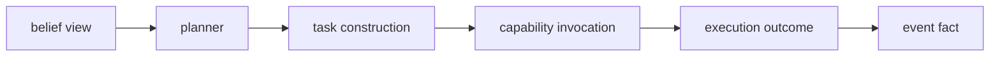

# World Model Belief

Date: 2026-04-21
Status: active
Scope: confidence, revision, contradiction, and settlement inside the world model

## Thesis

`belief` answers whether the current anchor should still be trusted.

Traversal can tell the system what is current.
Belief tells the system whether current is credible enough for planning.

The planner should deal in belief views.
It should reach for facts only when constructing tasks, explaining a decision, or requesting more evidence.

## Boundary

`belief` owns:

- belief keys and belief identity
- evidence attachment to beliefs
- confidence and uncertainty
- contradiction handling
- supersession as belief revision
- calibration from later outcomes
- perspective quality over time
- planner-facing belief views

`graph` owns current anchors, traversal, lineage, and provenance bundles.
`events` owns durable fact order and replay.
`execution` owns planning and side effects.

Belief sits inside the world-model crate.
It publishes `BeliefView` as the boundary object that execution consumes.

## Enabling Features

Belief can now be designed against implemented base features rather than future assumptions.

- [Completed Events](../../../completed/events/README.md)
  canonical event ledger, runtime-wide sequence, durable append, replay, and graph attachment fields
- [Completed World State Graph](../../../completed/world_state/graph/README.md)
  implemented traversal, current anchors, provenance, branch federation, and workflow consumption
- [Graph Implementation Status](../../../completed/world_state/graph/implementation_plan.md)
  delivery evidence for `DomainObjectRef`, `EventRelation`, graph reducers, graph runtime, and traversal queries
- [Spine Graph Completion Review](../../../completed/world_state/graph/spine_graph_completion_plan.md)
  closeout note that belief, curation, sensory promotion, and richer planner views are next scope
- [World Model Graph](../graph/README.md)
  current anchor selection, lineage, provenance, and graph walk
- [Temporal Fact Graph](../graph/temporal_fact_graph.md)
  durable split between semantic facts, materialized graph, and future belief facts
- [Execution Domain](../../execution/README.md)
  requirement that execution read current world model and publish outcomes back into events
- [Execution Substrate](../../execution/substrate.md)
  planning over current belief and publication of evidence-shaped outcomes
- [Task Network](../../execution/control/task_network.md)
  event-owned task state and reducer-owned orchestration state
- [Bayesian Evaluation Example](../../execution/examples/bayesian_evaluation.md)
  existing comparator-shaped evidence scoring design
- [Git Diff Summary Example](../../execution/examples/git_diff_summary.md)
  structured measurement artifact for comparator input
- [AST Change Impact Example](../../execution/examples/ast_change_impact.md)
  structured analysis artifact for comparator input

## Core Loop

Belief is the merge layer above graph traversal.
It ends at belief view publication.

The loop is durable because every input and every revision remains reachable through events.
The agent loop starts after this boundary.

The two loops are coupled only through belief views and event facts.
The world model does not dispatch tasks.
Execution does not settle beliefs by scanning raw facts during planning.

## Active Documents

- [Belief Microarchitecture](microarchitecture.md)
  event, world model, and execution boundaries for belief
- [Fact To Belief](fact_to_belief.md)
  transition from event fact and graph anchor into evidence, belief revision, and planner view
- [Comparator Model](comparator_model.md)
  Bayesian comparators, rule comparators, semantic settlement, and missing comparator policy
- [Belief Substrate](substrate.md)
  event-driven curation runtime, leases, recovery, staleness, and storm handling
- [Curation In Belief](curation.md)
  natural runtime for belief maintenance and materialized belief
- [Knowledge Graph ECS Decision Memo](knowledge_graph_ecs_decision_memo.md)
  hybrid ECS recommendation for curation internals

## First Slice

The first belief slice should not attempt full curation.

It should define:

- `BeliefKey`
- `EvidenceItem`
- `BeliefRevision`
- `BeliefView`
- comparator contracts
- lease based assessment
- replay from events and graph anchors into current belief
- planner query over belief views only

## Read With

- [World Model Domain](../README.md)
- [Belief Microarchitecture](microarchitecture.md)
- [Graph](../graph/README.md)
- [Temporal Fact Graph](../graph/temporal_fact_graph.md)
- [Execution Domain](../../execution/README.md)
- [Execution Substrate](../../execution/substrate.md)
- [Observe Merge Push](../../observe_merge_push.md)
