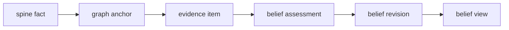
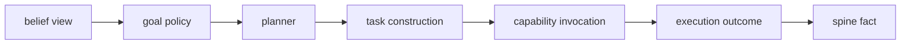

# Belief Microarchitecture

Date: 2026-04-21
Status: active
Scope: microarchitecture boundary for belief inside spine, knowledge graph, and agent responsibilities

## Thesis

Belief belongs to the knowledge graph microarchitecture.

The knowledge graph settles what is credible.
The agent decides what to do with that settled view.
The spine carries the durable facts that make both sides replayable.

This split should be enforced in design and public APIs before any binary split is attempted.

## Microarchitecture Roles

`spine`

The spine owns durable fact transport.
It accepts promoted semantic facts, assigns sequence, preserves replay, and carries graph object refs and relation edges.

`knowledge_graph`

The knowledge graph owns world state settlement.
It consumes spine facts, materializes graph anchors, normalizes evidence, revises beliefs, and publishes belief views.

`agent`

The agent owns action.
It consumes belief views, interprets goals, builds tasks, invokes capabilities, repairs plans, and emits outcomes back to the spine.

## Boundary Rule

The knowledge graph must not decide action.
The agent must not settle belief by reading raw facts during planning.

The allowed bridge is `BeliefView`.

During task construction, the agent may hydrate source facts, graph anchors, and evidence records referenced by the chosen belief view.
That hydration is execution preparation, not planning state.

## Belief Objects

Belief records are graph addressable objects.

Recommended refs:

- stable belief
  `DomainObjectRef { domain_id: "world_state", object_kind: "belief", object_id: belief_key_hash }`
- belief revision
  `DomainObjectRef { domain_id: "world_state", object_kind: "belief_revision", object_id: revision_id }`
- evidence item
  `DomainObjectRef { domain_id: "world_state", object_kind: "evidence", object_id: evidence_id }`

`BeliefView` is not the durable object.
It is the current projection over stable belief identity and the latest visible revision.

## Knowledge Graph Loop

This loop is owned by `world_state`.
It may run continuously and in parallel across belief keys.
It never dispatches tasks.

## Agent Loop

This loop is owned by `agent`, `control`, `task`, `capability`, `provider`, and domain-owned capability homes.
It may hydrate facts after a planner decision, but the planner decision is over belief views.

## API Shape

Knowledge graph public API:

- query belief view by belief ref
- query belief views by subject
- query current belief revision
- query evidence and provenance for a revision
- subscribe to belief view changes
- publish derived belief revision facts through the spine

Agent public API:

- consume belief view changes
- evaluate belief view against goal policy
- request task construction inputs
- dispatch task or capability work
- publish outcome facts to the spine
- request missing evidence when belief is unresolved

Spine public API:

- append semantic fact
- append idempotent derived fact
- replay after sequence
- subscribe after sequence
- resolve fact by record id

## Forbidden Couplings

- KG directly dispatches tasks
- Agent planner scans raw spine events for belief state
- Task runtime mutates belief records directly
- Provider calls write KG state without spine facts
- CLI becomes the owner of KG or agent truth
- Belief assessment depends on hidden worker memory

## First Slice Boundary

The first slice should remain in one binary.
It should still behave as if these were separate processes.

The slice should define:

- `BeliefView` as the only planner input
- stable belief refs
- revision refs
- evidence refs
- belief view subscription or polling contract
- task construction hydration path from belief provenance
- outcome publication back to spine

## Read With

- [Belief](README.md)
- [Fact To Belief](fact_to_belief.md)
- [Belief Substrate](substrate.md)
- [Comparator Model](comparator_model.md)
- [Microarchitecture Assessment By Domain](../../microarchitecture_assessment_by_domain.md)
- [Execution Substrate](../../execution/substrate.md)
- [Spine Concern](../../spine/README.md)
