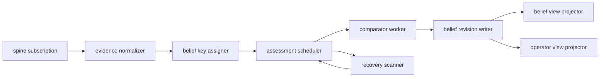

# Belief Substrate

Date: 2026-04-21
Status: active
Scope: event-driven knowledge graph runtime model for belief creation, reconciliation, recovery, and belief view projection

## Thesis

Belief creation and belief reconciliation are event driven.
They are not task orchestration.

The substrate consumes promoted facts, schedules belief assessment, writes belief revisions, and materializes belief views.
It should be parallel where belief keys are independent and serialized where one belief key is under assessment.

This substrate belongs to the knowledge graph microarchitecture.
It does not dispatch tasks.
It publishes views that the agent microarchitecture consumes.

## Runtime Shape

The natural substrate has these parts:

- spine ingestor
- evidence normalizer
- belief key assigner
- assessment scheduler
- comparator workers
- revision writer
- belief view projector
- operator view projector
- recovery scanner

## Partitioning

`BeliefKey` is the scheduling unit.

Events for different belief keys may be assessed in parallel.
Events for the same belief key should be coalesced behind one active lease.

This gives parallel action on the belief set without allowing two workers to settle the same belief from overlapping input windows.

## Leases

Use leases instead of indefinite locks.

An assessment lease records:

- belief key
- assessment epoch
- owner id
- input sequence low
- input sequence high
- lease start time
- lease expiry time
- comparator kind
- status

Lease states:

- queued
- leased
- completed
- expired
- abandoned

If a worker dies, the lease expires.
Another worker can resume from durable evidence and the last settled revision.

## Recovery

Recovery should be replay based.

The recovery scanner should:

- find expired leases
- mark abandoned work
- reschedule dirty belief keys
- compare evidence high water mark to revision high water mark
- rebuild belief views from revisions

No correctness path should depend on hidden worker memory.

## Stale Detection

A belief can be stale even when no comparator is running.

Stale signals include:

- new evidence after the last assessed sequence
- expired semantic settlement
- confidence decay policy
- superseded graph anchor
- failed execution outcome contradicting prior belief
- missing comparator for required evidence

Planner view should expose stale state directly.
Planner can then choose observe, wait, repair, or skip.

## Belief Storms

A belief storm happens when a single belief key receives events faster than assessment can settle them.

The substrate should coalesce storms:

- keep one active lease per belief key
- append incoming evidence normally
- mark `dirty_since_seq` while assessment is active
- debounce expensive comparator work
- assess compacted evidence windows
- publish previous settled view plus pending assessment metadata

Do not spawn unbounded comparator workers for the same belief key.
That would burn tokens, increase contention, and weaken determinism.

## Belief View Contract

The planner-facing belief view should expose:

- belief key
- current revision id
- status
- confidence
- freshness
- contradiction state
- assessment state
- next posture
- provenance summary

The belief view should not expose:

- raw spine payloads
- raw component state
- active lease internals
- unpublished comparator drafts

The agent planner may consume this view.
It must not depend on hidden KG substrate state.

## Status Vocabulary

The first status set should be small:

- settled
- provisional
- stale
- contradicted
- needs observation
- needs assessment
- assessment pending
- invalid

The first settlement hint set should remain knowledge graph oriented:

- trusted
- stale
- unresolved
- contradicted
- provisional
- expired
- missing evidence

The agent may map these hints to actions.
The knowledge graph should not publish action commands.

## Relationship To ECS

The substrate may use ECS concepts internally.
The public contract remains graph-shaped and view-shaped.

This follows [Knowledge Graph ECS Decision Memo](knowledge_graph_ecs_decision_memo.md):

- ECS concepts may help sparse evidence, belief, provenance, and calibration state
- canonical facts remain spine-shaped
- public reads remain shaped belief views
- task and capability remain the deliberate execution substrate

## First Slice

The first substrate slice should prove:

- replay from spine to evidence
- evidence to belief key assignment
- lease acquisition and expiry
- comparator output to revision
- belief view projection
- storm coalescing for one belief key
- recovery after interrupted assessment

## Read With

- [Belief Microarchitecture](microarchitecture.md)
- [Fact To Belief](fact_to_belief.md)
- [Comparator Model](comparator_model.md)
- [Curation In Belief](curation.md)
- [Knowledge Graph ECS Decision Memo](knowledge_graph_ecs_decision_memo.md)
- [Task Network](../../execution/control/task_network.md)
