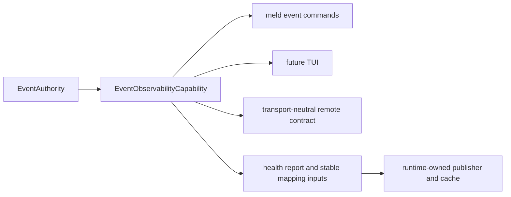

# Event Observability Design

Date: 2026-07-12
Status: implemented; event foundation closed
Scope: observability primitives over the event ledger, one port for every presentation adapter, and the retirement of spine naming from the code

## Intent

The event ledger is the durable, totally ordered record of promoted semantic facts. The authority supplies ledger identity, while records carry sequence, timestamps, and optional structural references. Observability of the cognitive layer is therefore mostly a read problem over data that already exists. Producer-owned concerns may also supply promoted runtime-health facts through the event append capability.

This design defines the read models, the single port they are served through, and the adapter rule that keeps a CLI, a TUI, and a browser dashboard equally thin. It answers three operator questions with different machinery:

- is it alive and flowing — owned by the runtime operator visibility program's status cache and supervisor store; this design feeds it, never replaces it
- is it making progress — events owns watermark, consumer lag, flow rates, and coverage inputs; runtime or producer policy owns stall detection
- why did something happen or fail to happen — owned here: causal traces over object references, relations, and record provenance

## Decision: event names, not spine names

Event is a hardened domain; spine was the design metaphor that named it during gestation. The canonical architecture docs already demoted spine to a historical alias. The code follows:

- Public types rename now, while the surface has no consumers: `SpineWriter` becomes `EventWriter`, `SpineSubscription` becomes `EventSubscription`, `SpineCursor` becomes `EventCursor`. Operator surfaces use `meld event ...`, never `meld spine ...`.
- Prose, test and bench file names, and internal identifiers sweep to ledger language in one dedicated commit.
- Persisted names freeze permanently: the `obs_spine_events`, `obs_spine_meta`, and `obs_spine_record_index` tree names and the `spine::{seq}` source fact id format are on-disk and in-store contracts whose rename would buy migrations for zero functional gain. They carry comments marking them historical.
- The `spine_cursor::` key prefix has never been persisted by any production caller, so it renames to `event_cursor::` now, before first use freezes it.
- Design documents that already landed keep their history unrewritten; new documents use event and ledger language.

## Architecture: one port, many adapters



### The port

`EventObservabilityCapability` is the production read surface for point-in-time queries. Replay and subscription capabilities provide the streaming primitives. `EventAuthorityContract` carries the same authority semantics across a future transport boundary.

```rust
pub trait EventAuthorityContract {
    fn durable_append(&self, request: DurableAppendRequest) -> Result<AppendReceipt, EventAuthorityError>;
    fn best_effort_append(&self, request: BestEffortAppendRequest) -> Result<BestEffortAppendReceipt, EventAuthorityError>;
    fn replay(&self, request: ReplayRequest) -> Result<EventPage, EventAuthorityError>;
    fn subscription_poll(&self, request: SubscriptionPollRequest) -> Result<EventPage, EventAuthorityError>;
    fn watermark(&self, request: WatermarkRequest) -> Result<EventWatermark, EventAuthorityError>;
    fn health(&self, request: HealthRequest) -> Result<EventHealthReport, EventAuthorityError>;
    fn flow(&self, request: FlowRequest) -> Result<EventFlowReport, EventAuthorityError>;
    fn trace(&self, request: TraceRequest) -> Result<EventTraceReport, EventAuthorityError>;
    fn session(&self, request: SessionRequest) -> Result<SessionTimelineReport, EventAuthorityError>;
}
```

Replay and subscription polling share the universal stream shape: identity-bearing cursor in, bounded page plus next cursor and coverage out. Subscription polling blocks until the watermark passes the cursor or the timeout elapses. A CLI tail loop, a TUI render loop, and a server-sent-events stream are the same pagination loop with different sinks.

### The two-backing rule

sled is single process, so the port must be implementable twice and adapters must never know which backing they received:

- In-process backing now: authority-derived observability capability. Serves one-shot CLI commands when no daemon holds the database, and any TUI hosted inside the runtime process.
- Out-of-process backing later: the owning daemon exposes the same port over the IPC or HTTP edge that the process ownership decision already reserves. A browser dashboard server implements the port over that edge; it is adapter work, not redesign.
- Event closure defines transport-neutral requests, responses, durability semantics, identity validation, and a reusable conformance suite proved by a loopback adapter.
- Runtime owns the real process host, IPC framing, reconnects, endpoint lifecycle, authentication, and status cache publication.

Both backings address the same ledger identity.
Changing from direct access to IPC changes transport only and must never switch the product to another event history.
A CLI compatibility database is not an alternate observability authority for a product runtime ledger.

### DTO discipline

Every report is a plain serializable struct with stable field names, free of presentation.
Every report carries the supplied authority's `LedgerIdentity`.
Every bounded result carries its scanned range or an explicit truncation state.

| Report | Contents |
| --- | --- |
| `EventHealthReport` | ledger identity, tip sequence, committed watermark, retained lower boundary, dropped event count, per-consumer lag, trailing append rate, and append-rate coverage |
| `EventFlowReport` | ledger identity, event counts by domain and type, silent domains, flow coverage, and silent-domain coverage |
| `EventTraceReport` | ledger identity, ordered structural causal chain, and trace coverage |
| `SessionTimelineReport` | ledger identity, one session's bounded records, observed timestamps, returned count, and coverage |
| `EventPage` | ledger identity, bounded record batch, identity-bearing next cursor, and coverage |

Every CLI command renders text and `--format json` from day one, so the CLI is already the machine-readable API before any server exists.

### Consumer cursor registry

Consumers report named identity-bearing cursors through one authority-derived registry capability, giving lag enumerability: `lag = committed watermark - consumer cursor` per name. The registry serves observability and is the same consumer registration the compaction design requires for choosing a safe boundary. The graph reducer keeps its domain-owned durable cursor and reports the same progress through its root adapter.

### Boundaries

- meld-events owns structure-level reads: health, paging, and trace walks over object references, relation endpoints, and identity-bearing source-record provenance, all events-owned contracts. It never interprets `event_type` meaning or searches arbitrary payload strings for provenance.
- telemetry owns semantic summaries that interpret event meaning, such as flywheel-stage rollups; it stays downstream.
- views, CLI, TUI, and HTTP adapters own presentation only, per the thin adapter rule.
- The status cache remains operational-only and never authoritative, per the operator visibility program.
- Runtime owns mapping `EventHealthReport` into its status shape and deciding when and where to invoke `RuntimeStatusPublisher`.

## Self-observation

Events durably appends a promoted health fact that a producer presents through the authority append capability.
It does not decide when raw runtime health becomes a semantic fact.

Runtime supplies raw health and restart signals.
A producer-owned runtime-health or sensory concern owns thresholds, hysteresis, process epochs, retry and outbox state, and promotion decisions.
The inclusion rule stays sovereign: gauges, heartbeat chatter, and per-tick samples never enter the ledger.

The existing `SelfObservationWatcher` is a provisional compatibility implementation.
It may be hardened while migration proceeds, but it is not canonical event behavior and does not define event closure.

## Non-Goals

- No external metrics stack. A Prometheus or OTLP exporter would be one more named consumer with a cursor whenever a real need appears; it is never a foundation.
- No metrics in the ledger. Counters and gauges are ephemeral port reads or status cache entries; only promoted semantic health facts are events.
- No second truth channel. Diagnostics that are semantic facts flow through the ledger; the status cache is the sanctioned non-authoritative exception.
- No new persistence. Observability reads existing trees plus the one registry tree; it never becomes a store of record.

## Delivered Slices

Delivered by the [Event Observability PLAN](event_observability_program.md):

1. Rename sweep landing the event naming decision.
2. `EventCursorRegistry` and the port trait with the in-process backing.
3. `EventHealthReport` and `meld event status`.
4. `EventPage` and `meld event tail`.
5. `EventTraceReport` and `meld event trace`, structure-level only.
6. `EventHealthReport` and stable status mapping inputs, with publisher invocation owned entirely by runtime visibility.

The completed [Event Foundation Closeout Program](event_foundation_closeout_program.md) added persisted ledger identity, one authority aggregate, explicit bounded-read coverage, structural record provenance, a transport-neutral authority contract with local and serde loopback conformance, recoverable compatibility migration, and direct product-authority routing.

Runtime remains responsible for publisher cadence, status-cache persistence, daemon hosting, real transport, console and action publication, and the complete semantic flywheel proof.

## Read With

- [Event Spine Overhaul PLAN](event_spine_overhaul_program.md)
- [Spine Compaction Design](spine_compaction_design.md)
- [Runtime Operator Visibility Plan Skeleton](../integration/runtime_operator_visibility_plan_skeleton.md)
- [Events Domain](../../cognitive_architecture/events/README.md)
