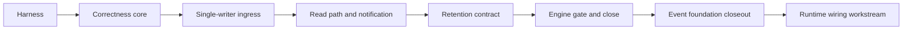

# Event Spine Overhaul PLAN

Date: 2026-07-08
Status: complete
Scope: make meld-events durable, fast, observable, and contract-stable without pre-extending past known requirements
Workflow: complex change workflow deactivated at close per canonical delivery-program skill

## Overview

### Objective

The event spine is the shared clock and durable history for the cognitive flywheel.
The runtime wiring workstream was paused on its ledger mechanics.
The successor event foundation closeout finished authority and product cutover so full runtime wiring can resume.
This program overhauled meld-events so the remaining runtimes consume a strong ledger foundation.

### Outcome

A spine with proven ordering, durability, idempotency, and replay-determinism contracts, replay cost independent of history size, group-commit ingress through one ordered writer, watermark notification instead of wall-clock polling, a retention contract consumers are written against, and a standing test plus bench harness that locks all of it in.

### Commitments

- Fix the confirmed defects: scan-based cursor reads, non-atomic sequence allocation, cursor-advance race, per-event fsync under a global lock.
- Build the testing and benchmarking harness first, so every fix flips a known-red proof and every regression is caught.
- Preserve the contract layer. The envelope, `DomainObjectRef`, `EventRelation`, idempotency keys, and consumer-owned cursors are correct as designed. Everything below them may change.

### Non-Goals

- No multi-spine, partitioning, or distributed sequencing. The single runtime-wide sequence is the product. The inclusion rule — only promoted semantic facts enter events — is the volume control, not sharding.
- No async core. Tokio stays at the provider and workflow edge. The spine core remains synchronous with one ordered writer.
- No pluggable storage-backend abstraction. The event-owned persistence API behind `EventAuthority` is the engine seam; a second implementation is written only if the engine gate decides to migrate.
- No spine-owned consumer cursors. Cursors remain in consumer domain stores per the event runtime requirements.
- No sensory lane store. That is the sensory domain's work. This program only guarantees the spine absorbs promoted facts at cognition rate with headroom.

## Decisions

### Decision 1: spine shape

Single semantic spine, multi-lane ingest.
Raw high-rate lanes never publish directly; only promoted semantic observations enter events.
Cursor reads must be seek-based.
Synchronous ordered core; async is permitted only at ingress edges.
This codifies the multi-domain ledger design as a recorded decision so the cursor-scan discovery never has to be re-made.

### Decision 2: process ownership

sled is single-process.
One owning process opens the product's configured ledger binding.
CLI and product runtime clients must not avoid process ownership by selecting different databases.
When no daemon owns the ledger a short-lived client may open the configured binding directly.
When a daemon owns it every other client uses authority-preserving IPC for append, replay, and observability.
The supervisor lease and ledger identity guard ownership and reject split-brain access.
The ingress writer stays behind a channel so the daemon IPC edge does not require another storage-engine overhaul.

### Decision 3: durability classes

Two producer classes, explicit in the API.
Durable emits return after the event is fsynced or an ack handle resolves; used for execution outcomes, promoted evidence, and derived world-model facts.
Best-effort emits enqueue and return; group commit flushes within a bounded window; used for telemetry, progress, and watch noise.
Today every emit pays fsync while every caller swallows errors; naming the classes resolves that contradiction honestly.

### Decision 4: storage engine stance

Keep sled through the retention phase.
Fix access patterns, measure, then decide at the engine gate with benchmark data.
sled 0.34 maintenance status makes eventual migration likely; choosing the replacement without this program's benchmarks is the over-optimization trap.

## Development Phases

Decisions above are phase zero and land with this PLAN.

### Phase 1: test and bench harness — complete 2026-07-08

Goal: build the harness against the broken implementation so it fails for the right reasons, and record baselines that indict the current mechanics.

Key seams: public `EventStore`, `EventRuntime`, and `GraphRuntime` APIs only. The harness must not add test hooks inside `store.rs`.

Known-red convention: tests that fail on known defects land marked `#[ignore]` with an explicit reason string naming the defect and the phase that fixes it. The tree stays green at every checkpoint; the red evidence is reproducible through `cargo test -- --ignored`.

Tasks:

- [x] concurrency suite: multi-thread append storms assert distinct sequences and zero lost records across bus, direct, and idempotent paths
- [x] determinism suite: same cursor plus unchanged spine yields identical batches on bounded and unbounded reads; interleaved append and replay never skips or duplicates; property tests against an in-memory oracle
- [x] recovery suite: child-process self-invocation harness kills the writer mid-storm, reopens, asserts no torn records, sequence meta at least max persisted plus one, idempotency index consistent
- [x] bench harness micro: append throughput by producer count and flush policy; replay latency versus history size at 10^3 through 10^6; session reads; idle catch-up cost; bytes per event
- [x] bench harness macro: flywheel bench with realistic producer mix and a reducer-shaped consumer measuring append-to-projection-visible latency
- [x] baselines recorded for the current implementation, including the replay-cost-versus-history curve

Exit criteria: suites compile and run green with known-reds ignored and documented; criterion baselines captured and summarized in this PLAN.

### Phase 2: correctness core — complete 2026-07-08

Goal: flip every known-red proof green with surgical diffs.

Key seams: `crates/meld-events/src/events/store.rs`, `crates/meld-world-model/src/world_state/graph/runtime.rs`, `src/runtime/supervisor/entrypoint.rs`.

Tasks:

- [x] seek-based reads: `read_all_events_after*` range from the encoded cursor key; session and legacy readers seek within their prefix
- [x] atomic sequencing: allocation moves inside the existing multi-tree sled transaction; the two-step allocate-then-append public path collapses
- [x] idempotent append lookup: the full-scan repair fallback in `lookup_record_seq` no longer runs on every novel record id; repair happens once at store open with a compat-shim removal note, removing the quadratic idempotent-append cost found while benching
- [x] cursor advance: `catch_up_with_limit` advances only to the highest processed source sequence, never to derived-event sequences
- [x] supervisor lifecycle key width widened past six digits
- [x] recovery probe migrates off `allocate_next_seq` to an appended probe event when the allocate-then-append path collapses, honoring the review waiver noted below
- [x] read-contract documentation matches actual guarantees

Exit criteria: formerly ignored tests un-ignored and green; replay-latency bench flat with respect to history size; full workspace tests green.

### Phase 3: single-writer ingress — complete 2026-07-08

Goal: one ordered writer, honest bus, real backpressure, durable acks.

Key seams: `crates/meld-events/src/events/writer.rs` and `runtime.rs`; `EventAppendSink` and emit signatures preserved for producers.

Tasks:

- [x] writer thread owns sequencing and sled writes behind a bounded channel; seq races become structurally impossible
- [x] group commit with a size bound and natural batching; durable-class emits ack on flush; best-effort emits return on enqueue. Deviation recorded: no time bound exists because natural batching flushes immediately when idle and amortizes under load, which strictly dominates a timer
- [x] direct idempotent path and bus path converge on the writer; the bus, ingestor, and subscription stub are deleted rather than shimmed
- [x] backpressure policy: durable emits block on the bounded queue, best-effort drops are counted with rate-limited warnings and returned as typed backpressure errors; silent drops end. Deviation recorded: counters and the watermark are exposed on `SpineWriter`, `EventRuntime`, and the append port, but the supervisor heartbeat surface needs an `event.append` semantic handle, which belongs to the runtime wiring workstream and is handed off there
- [x] commit watermark published by the writer through a condvar watch primitive that advances before any ack releases its producer; a barrier primitive proves everything enqueued earlier has reached the store
- [x] flush-and-drain on shutdown and drop; CLI one-shot processes never lose acked events, and the durable session-ended emit stays each command's last emission so queue order protects earlier best-effort events even on exit paths that skip drop

Exit criteria: multi-producer bench shows group-commit gain over the per-event-fsync baseline; kill-recovery proves acked events always survive; drop counters exposed with the supervisor surface handed off; event observability and authority follow-on work may proceed.

### Phase 4: read path and notification — complete 2026-07-08

Goal: consumers wake instead of poll; reads stop paying legacy and duplication taxes.

Key seams: new subscription surface in meld-events; `TREE_SESSION_EVENT_INDEX` layout; legacy tree readers; `src/runtime/tooling.rs` tick loop.

Tasks:

- [x] `SpineSubscription`: watermark notification plus bounded replay plus an optional cursor helper consumers embed in their own stores; the spine never persists a consumer position
- [x] supervisor tick wakes on watermark advance with the configured interval as fallback heartbeat
- [x] session index keys carry the sequence and values stay empty, resolved through the spine tree; a one-time open migration slims existing full-value rows
- [x] legacy sunset: one-time open migration moves `obs_events` rows into the spine with the spine winning sequence collisions, then the merge-on-read path is deleted per [Runtime Invariants](../../../governance/runtime_invariants.md); characterization tests stage legacy rows before open and pin normalization semantics; removal notes mark all three surviving migration seams
- [x] encoding decision from bench data: JSON stays. Decode costs about 1.25 microseconds per event, so a full supervisor batch of 256 events decodes in about a third of a millisecond; at cognition-rate volumes that is immaterial and inspectability wins

Exit criteria: consumers block until new events; no session read touches the legacy tree; storage-per-event bench improved or the encoding decision recorded as not worth it.

### Phase 5: retention contract — complete 2026-07-08

Goal: land the contract consumers are written against; defer the compactor until data warrants it.

Key seams: spine meta, replay error surface, graph reducer error handling.

Tasks:

- [x] retained lower boundary tracked in spine meta with monotonic raises; every replay path returns a typed retention-gap error instead of silently skipping
- [x] graph reducer handles the gap explicitly: bounded ticks report a fatal `retention_gap` diagnostic without moving the cursor, and the unbounded CLI path propagates the typed error so a stranded cursor can never look like zero progress
- [x] genesis and snapshot hook: `EventEnvelope::genesis_domain` records rebuilt-from-snapshot at a basis sequence with an idempotent record id
- [x] compaction design doc with an explicit activation trigger, reader quiescence and session-consumer stories, and no compactor implementation

Exit criteria: gap contract tested; consumers handle it; compaction doc exists with a named threshold.

### Phase 6: engine gate and close — complete 2026-07-08

Goal: decide the storage engine with data and close the program.

Tasks:

- [x] rerun the full bench suite; compare fixed sled against one candidate only if sled numbers or maintenance risk justify the spike; record the decision
- [x] document the physical CLI and product database topology differences with behavioral differences named
- [x] update `CRATE.md`, events README, and `assessment.md` to post-overhaul reality
- [x] mark this PLAN complete with gate evidence links

Exit criteria: final PLAN state shows gate pass status for all phases.

### Decision 5: storage engine stays sled, re-evaluated at the compaction trigger

The data does not justify a candidate spike. Post-overhaul sled delivers replay at tip in under a microsecond regardless of history size, twenty thousand durable events per second for a single producer on NVMe with group commit scaling past thirty-five thousand aggregate across eight, and proven crash recovery across hundreds of kill cycles. At cognition-rate volumes the engine is nowhere near the bottleneck. The genuine sled risk is maintenance status and space reclamation, and both matter exactly when compaction activates; the [Spine Compaction Design](spine_compaction_design.md) trigger is therefore also the engine re-evaluation gate. The `EventStore` persistence API remains the internal engine seam behind the event authority. It is not the cross-domain producer or consumer boundary.

### Decision 6: physical layouts may differ, logical event authority may not

Event trees may be colocated with node storage, beliefs, and traversal, or the canonical ledger may be isolated from projection stores so projection rebuilds and world-model experiments cannot endanger canonical history. In the colocated layout graph-derived appends share a database flush with the ledger. In the isolated layout the ledger flushes independently and consumer cursors advance only after consumer-side durability.

The physical distinction does not authorize two canonical histories for one product identity. The earlier interpretation that CLI and product event streams could remain independently writable is superseded. CLI and product adapters must consume one logical event authority and one sequence space.
The selected storage binding is stable across CLI and supervised process shapes. Each process reaches it directly or through the owning process. The colocated and isolated layouts are alternative storage bindings, and moving a product between them requires an explicit migration and write cutover.

The CLI compatibility assembly and product runtime assembly now satisfy this requirement when composed by `meld runtime run`.
The completed [Event Foundation Closeout Program](event_foundation_closeout_program.md) closed correctness, authority, observability, domain-port, and product-cutover work.
Its E5 detail is the completed [Product Event Authority Cutover](../integration/product_event_authority_cutover.md).

## Verification Strategy And Gates

Every checkpoint commit passes the same gate ladder, in order:

1. formatter gate: `cargo fmt --all -- --check` before any test gate, per workflow governance
2. lint gate: `cargo clippy --workspace --all-targets` with no new warnings
3. boundary gate: `scripts/check_domain_boundaries.sh`
4. test gate: `cargo test -p meld-events` plus affected crates; full `cargo test --workspace` at phase exits
5. contract gate: the four contract suites green; known-reds only under the documented ignore convention
6. bench gate at phase exits: criterion run compared against recorded baselines; regressions block the phase close
7. policy gate: docs style scan on changed Markdown; shim removal notes present; breaking changes and changed record shapes reviewed against [Runtime Invariants](../../../governance/runtime_invariants.md)
8. fresh review gate: every checkpoint commit is reviewed by a fresh-context review agent that did not produce the change; the reviewer receives the staged diff and the relevant PLAN phase, and checks correctness, test honesty, commenting policy, semantic unit preservation, shim notes, and domain boundaries; confirmed findings are fixed or explicitly waived with a recorded reason before the commit lands; behavior-changing phases additionally get an adversarial multi-lens review

Evidence for each gate is recorded in the phase completion notes below as work lands.

## Branch And Commit Model

One feature branch `event-spine-overhaul` carries the full plan scope, branched from `runtime-operator-visibility`.
Parallel execution uses disjoint-file agent assignments or short-lived working copies merged back by the integrator.
Each phase task lands as one atomic conventional commit; subjects describe concrete behavior changes, never phase names.
No push without explicit user verification per commit policy.

## Implementation Order Summary

Decisions and this PLAN land first as one design commit.
Harness suites and benches build in parallel, integrate, and record baselines.
Correctness fixes flip the known-reds.
The ingress writer lands as one reviewed unit and unblocks the remaining event foundation work.
Read path tracks parallelize after the writer exists.
Retention contract lands, then the engine gate closes the program.

## Exceptions

- `cargo test -- --ignored` is the sanctioned way to reproduce known-red defect proofs before their fixing phase; ignored tests carry the defect and fixing phase in their reason string.
- Kill-based recovery tests spawn child processes from the test binary; they are skipped under environments that forbid subprocess spawning by honoring `MELD_EVENT_RECOVERY_SKIP`.
- Criterion runs are not part of the default `cargo test` path; bench gates run explicitly at phase exits.

## Phase Completion Notes

### Phase 0

- PLAN and decisions recorded 2026-07-08.
- Domain assessment: [Event Spine Overhaul Assessment By Domain](event_spine_overhaul_domain_assessment.md).
- Baseline evidence: recorded below at the Phase 1 checkpoint.

### Phase 1 — complete 2026-07-08

Gate evidence, in ladder order: `cargo fmt --all -- --check` clean; `cargo clippy -p meld-events --all-targets` zero warnings after fixes; boundary script passed; full `cargo test -p meld-events` green at 58 tests with 3 known-reds ignored; full `cargo test --workspace` green; fresh review agent returned no blockers, one should-fix, three nits; baselines below. Commits `c80e073`, `ae4cf62`, `193297e`.

Known-red inventory, all verified failing on current code via the ignored set: three storm tests in `spine_concurrency.rs`, all attributed to non-atomic sequence allocation. Observed loss: roughly two thirds of 2000 plain concurrent appends, roughly two percent of 2000 idempotent appends, and 20 of 1600 mixed-path events.

Findings discovered by the harness beyond the review's defect list:

- Idempotent appends are quadratic in history: `lookup_record_seq` falls back to a full event-tree scan on every novel record id and the append path performs the lookup twice. A 10000-event flywheel iteration took 45 seconds. Added as a Phase 2 task.
- Crash durability is sound: roughly two hundred kill-reopen cycles produced zero torn records, zero duplicate sequences, and sequence meta never lagged persisted records; the allocator meta write reaches the sled log before its event transaction, so crashes only leave benign gaps. The predicted crash-side red did not materialize; the allocation defect is concurrency-only.
- Concurrent duplicate record ids are already safe through the transactional index re-check and stay green.

Review gate outcome: should-fix applied before baselines — the flywheel latency fixture grew during measurement, inflating the recorded median from 11.7 ms to a corrected 7.16 ms on a stationary copy-per-iteration fixture. Nits applied: bench teardown moved outside timed routines; vacuous-pass caveat documented on no-flush recovery tests. Waived with reason: the recovery probe's use of `allocate_next_seq` stays until Phase 2 collapses that API, where the probe migrates to an appended event; tracked as a Phase 2 task.

Baselines, criterion medians on the development machine, defaults without `MELD_EVENT_BENCH_LARGE`:

| Measurement | Value |
| --- | --- |
| append, flush per event | 15.8 µs per event |
| append, flush per 100 batch | 11.8 µs per event |
| emit_domain_event producer path | 15.9 µs per event |
| multi-producer 2, 4, 8 threads, 1000 events | 11.0, 11.9, 11.9 ms — throughput degrades with threads |
| replay at tip, zero events returned | 1.04 ms at 1k history, 10.9 ms at 10k, 128 ms at 100k — linear in total history |
| replay last ten percent | within ten percent of tip cost; decode dominates |
| idle catch-up, limit 256 at tip | 0.93 ms at 1k, 9.6 ms at 10k, 104 ms at 100k |
| session read after tip, 1k-event session | 0.96 ms |
| bytes per event on disk at 10k events | 1520 |
| flywheel sustained produce-plus-consume, 2000 events | 1.76 s, roughly 1.1 Kelem per second |
| flywheel append-to-projection-visible | 7.16 ms median at 5k history |

The replay-at-tip curve is the headline indictment: reading zero new events costs 128 ms at 100k history, and every supervisor idle tick pays it.

### Phase 3 — complete 2026-07-08

Gate evidence, in ladder order: formatter clean; clippy zero warnings workspace-wide; boundary script passed; meld-events suites green including the new writer, barrier, backpressure, and durable-ack kill tests; repeated full workspace runs green; two-lens adversarial fresh review returned no blockers on either lens; bench evidence below.

What changed: a dedicated writer thread owns all producer appends behind a bounded queue with group commit by natural batching; durable emits ack after fsync while best-effort emits enqueue and return with counted drops; the watermark and barrier primitives landed; `EventBus`, `EventIngestor`, `SharedIngestor`, the subscription stub, and the dead telemetry routing re-exports are deleted; the product append port and all `ProgressRuntime` paths converge on the writer; execution outcome publication is reclassified durable; the CLI barriers its own emissions before post-command graph catch-up.

Breaking change: the `EventBus`, `EventIngestor`, and `SharedIngestor` types, the `events::subscription` module, and the `telemetry::routing` modules are removed. The only consumers were one integration test and dead re-export files, both migrated or deleted in this phase. Recorded per compatibility policy in the writer commit footer.

Review findings and dispositions: the concurrency lens survived every deadlock, shutdown-race, ack-ordering, and stress attack after one fix the harness itself forced, moving the watermark advance ahead of ack release. The semantics lens found the durability-class migration incomplete and it was completed in-phase: `ProgressRuntime` best-effort wrappers now delegate to the true non-blocking path, execution publication moved to the durable path because the world model reduces those events, and the CLI barriers before same-command catch-up. Added on review: a deterministic backpressure drop test, a durable-ack kill-recovery role proving acked sequences always survive, the flush-error ambiguity documented on `append_durable`, barrier-only batches skip the fsync, the boundary doc export list corrected, and the fuzz target renamed to match the writer. Accepted with reasons: a failed flush may leave the watermark lagging until the next successful append batch; multiple writers on one store remain safe through transactional allocation but hold independent watermarks, documented rather than guarded; graph derived events append directly to the store and do not advance the watermark, documented as the consumer-side exception.

Bench evidence: tempdir benches run on tmpfs where fsync is nearly free, so durability numbers were re-measured on the disk-backed filesystem and the caveat is documented in the bench module. On NVMe ext4, per-event durable fsync costs 49.7 µs, a 20k events-per-second ceiling that every producer previously paid serialized; through the writer, 2, 4, and 8 concurrent durable producers sustain 23.0k, 34.0k, and 35.6k events per second aggregate — throughput now rises with producers where the old path degraded — while every append still receives a post-fsync ack, and best-effort producers wait on nothing. On tmpfs the writer adds roughly eight percent over unacked direct appends, the cost of acks when fsync is free.

### Phase 4 — complete 2026-07-08

Gate evidence, in ladder order: formatter clean; clippy zero warnings workspace-wide; boundary script passed; meld-events suites green including three new migration characterization tests; repeated full workspace runs green; adversarial fresh review found one blocker, fixed in-phase before commit; bench evidence below.

What changed: session index values are empty with the sequence in the key tail, resolved through the spine tree, with a one-time open migration slimming existing full-value rows; legacy `obs_events` rows migrate into the spine once at open and the merge-on-read path is deleted; `SpineSubscription` and `SpineCursor` land as the consumer surface; the supervisor tick loop wakes early on watermark advance with the configured interval as fallback heartbeat.

Review blocker, fixed before commit: the first migration draft mapped legacy rows onto the global spine keyspace and skipped sequence collisions. The reviewer proved from git history that legacy sequences were allocated per session and restart at one in every session, so the draft would have silently dropped every legacy session after the first behind a durable flag. The migration now re-sequences every legacy row through fresh global allocation inside one transaction that also carries the sequence metadata and the migration flag, so history is preserved completely, per-session order is kept, and a crash can never leave partial migration state. New characterization tests pin the multi-session and legacy-plus-spine coexistence cases the draft would have broken.

Further dispositions: migrated rows receive migration-time sequences at the spine tip, so consumers with existing durable cursors observe them as new events and incremental replay converges with rebuild-from-zero replay — recorded as the intended semantics. The slim shim note gained its required proof clause and the slim path gained a test. The wake baseline is captured after the tick on purpose and now documents why: a pre-tick baseline would self-wake into a spin because ticks emit telemetry through the writer; events committed during a tick wait for the fallback interval, which matches pre-change latency. The reviewer verified from vendored sled source that multi-tree transaction commits are never partially visible to readers, so the session-index read path needs no torn-state handling. Deviation recorded: the PLAN said eight-byte sequence references in index values; the implementation stores empty values because the key tail already carries the sequence, which is strictly smaller.

Behavior change called out per compatibility policy: rows written into the legacy tree after a store has opened are no longer served by reads. No production writer targets the legacy tree; only tests did, and they now stage rows before open.

Bench evidence: bytes per event on disk fell from 1625 to 1153, twenty-nine percent, from the empty-value index. Replay decode cost is unchanged at roughly 1.25 microseconds per event, which drove the recorded keep-JSON encoding decision.

### Phase 5 — complete 2026-07-08

Gate evidence, in ladder order: formatter clean; clippy zero warnings; boundary script passed; full workspace green at 1414 tests; fresh adversarial review returned no blockers; docs style scan clean on the new compaction doc.

What changed: the retained lower boundary lives in spine meta, defaults to one, and only rises; `check_retention` guards every replay path including the subscription surface; `RetentionGap` is typed in meld-events and mirrored in the root error contract; `genesis_domain` records snapshot bases idempotently; the graph reducer surfaces gaps fatally without cursor movement; the compaction design doc names its activation trigger.

Review dispositions: the reviewer confirmed every gap edge case and every guarded path, then found the unbounded `catch_up` swallowing the fatal report into a zero-progress success — fixed in-phase so CLI callers receive the typed error, with the test extended to pin it. Design doc hardening from review: reader quiescence before boundary raises so a concurrent prune cannot produce a silently gapped batch, raise-and-flush ordering, the session-consumer re-anchoring story, and the genesis determinism plus reserved-suffix sentences. Accepted as nits: the boundary setter is get-then-insert, acceptable while its only callers are tests and a future single supervised compactor. Noted: one pre-existing flake in `current_snapshot_matches_workspace_root_hash`, unrelated to retention, tracked for the closeout phase. Resolved 2026-07-12 after event foundation closure: the test read the event log without the documented `ProgressRuntime::barrier` synchronization after a best-effort scan publication, so the read raced the background append. The repaired test passed one hundred runs, fifty of them under full CPU contention that previously reproduced the failure eight times in thirty runs.

### Phase 6 and program close — 2026-07-08

Gate evidence: formatter clean; clippy zero warnings; boundary script passed; full workspace green; docs style scan clean; closing bench run confirms the recorded picture — replay at tip 0.61 µs at 100k history against 0.47 µs recorded, idle catch-up 0.76 µs against 0.56 µs, flywheel append-to-projection latency 60 µs, flywheel throughput 36.6 ms per 2000 events, eight durable producers at 13.5 ms per 1000, disk at 1153 bytes per event; the sub-microsecond read deltas are run-to-run variance on the development machine and all orders-of-magnitude conclusions stand unchanged.

Program outcome against the overview commitments: zero sequence collisions or lost events under storm, proven by un-ignored contract tests; kill-recovery proves acked durable events always survive; replay is deterministic, gap-typed below retention, and cost-independent of history size — roughly two hundred thousand times faster at tip on a 100k history; group commit reverses the old scaling direction, with eight durable producers sustaining about 1.8 times the single-producer fsync ceiling in aggregate while each still receives a per-event durable ack; drop counters, the watermark, and per-tick replay stats are exposed; envelope and port contracts unchanged for producers except the recorded breaking removals; consumer cursors remain consumer-owned; the harness stands as the regression sentinel with criterion baselines recorded here.

Handoffs and known items: runtime owns the `event.append` supervisor diagnostic surface including any writer queue depth accessor it needs and the remaining runtime handles; the completed event foundation closeout now permits that runtime resumption; consumer registration carries into compaction; the compaction trigger doubles as the sled re-evaluation gate.

The complex change workflow deactivates with this closeout: the scoped work is complete.

### Successor foundation closure — complete 2026-07-12

The [Event Foundation Closeout Program](event_foundation_closeout_program.md) resolved the historical exceptions recorded by this overhaul. One persisted `LedgerIdentity` and one `EventAuthority` now bind every production append, replay, subscription, watermark, cursor registry, and observability capability. Graph-derived and execution appends use authority capabilities, raw writable constructors are sealed from production domains, and direct CLI plus `meld runtime run` share the resolved product binding.

Exact session isolation, cursor linearizability, bounded read coverage, structural provenance, remote conformance, recoverable compatibility migration, and legacy write fencing are now regression-tested. The authority, cursor, concurrency, and recovery suites passed 25 consecutive normal runs and 25 consecutive serial runs. The full workspace all-targets suite passed three consecutive times. Fresh migration, routing, constructor-sealing, recovery, concurrency, architecture, and compatibility reviews were clean.

Closing benchmark deltas against the pre-closeout measurements remained within the ten percent threshold: replay at tip increased 2.5 percent, health increased 0.3 percent, eight durable writers increased 4.2 percent, and idle catch-up, paging, flywheel throughput, flywheel latency, and storage per event improved.

Runtime-owned status publication, cache persistence, daemon hosting, real IPC, console and action publication, promotion policy, and the complete semantic flywheel remain downstream work.

### Phase 2 — complete 2026-07-08

Gate evidence, in ladder order: formatter clean; clippy zero warnings on changed crates; boundary script passed; full crate suites green at 61 tests with the three storm reds un-ignored and passing; full `cargo test --workspace` green at 33 suites; adversarial two-lens fresh review returned no blockers across both lenses; bench comparison below.

What changed: sequence allocation moved inside the multi-tree sled transaction, making concurrent collisions structurally impossible; all cursor reads seek from the encoded key instead of scanning history; the per-lookup index-repair scan became a one-time open repair with sequence-meta self-healing; `allocate_next_seq` left the public API; the traversal cursor pins to the highest processed source sequence; supervisor lifecycle keys widened to sequence width.

Breaking change: `EventStore::allocate_next_seq` is removed. No production caller existed; appends are the only allocation path. Recorded per compatibility policy in the store commit footer.

Review findings and dispositions: both reviewers confirmed the storm reds were genuine and the fix sound. Applied during review: repair derives the maximum sequence from the key so one undecodable record cannot fail store open; backfill skips undecodable records with a warning; the backfill flag is flushed after its repairs so lost repairs cannot strand a durable flag; stale bench comments refreshed per commenting policy; the session cursor filter is restored inside the seek range so prefix-colliding session ids cannot leak stale records to polling consumers. Accepted as nits without change: the cursor at `u64::MAX` boundary is unreachable through allocation; open-time repair is non-transactional but production opens precede workers and sled's file lock prevents cross-process sharing; torn index states created by external writers after open no longer lazily self-heal, which the reworked contract test documents. Pre-existing observation for the ingress phase: pre-sequenced `append_event` remains caller-responsibility semantics and debug builds panic on sequence overflow at `u64::MAX`.

Bench comparison against the recorded baselines, criterion medians:

| Measurement | Baseline | After | Change |
| --- | --- | --- | --- |
| replay at tip, 100k history | 128 ms | 0.47 µs | flat across history sizes |
| idle catch-up limit 256 at tip, 100k | 104 ms | 0.56 µs | flat across history sizes |
| session read after tip | 963 µs | 0.86 µs | seek plus filter |
| flywheel append-to-projection-visible | 7.16 ms | 54 µs | one tick no longer scans history |
| flywheel produce-plus-consume, 2000 events | 1.76 s | 34 ms | quadratic idempotent lookup removed |
| append flush per event | 15.8 µs | 15.0 µs | unchanged, fsync-bound, ingress phase target |
| multi-producer contended appends | 11.0 to 11.9 ms per 1000 | 11.7 to 12.3 ms per 1000 | three to seven percent transactional-allocation cost, accepted for correctness |
| bytes per event on disk | 1520 | 1625 | seven percent, reclaimed by the read path phase seq-ref index |

## Related Documentation

- [Events Assessment](assessment.md)
- [Multi-Domain Event Ledger](../../cognitive_architecture/events/multi_domain_spine.md)
- [Events Crate Boundary](../../cognitive_architecture/events/CRATE.md)
- [Event Runtime Requirements](../integration/event_runtime_requirements.md)
- [World Model Runtime Requirements](../integration/world_model_runtime_requirements.md)
- [Flywheel Runtime Code Assessment](../integration/flywheel_runtime_code_assessment.md)
- [Contribution Policy](../../../governance/contribution_policy.md)
- canonical delivery-program skill
