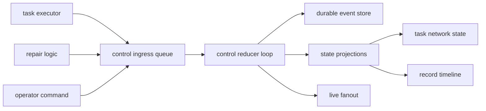

# Event Management Research

Date: 2026-04-05
Status: active
Scope: current event handling, Rust ecosystem patterns, and a recommendation for a single control feedback spine

## Research Question

Can the current telemetry system expand into one unified event loop that serves task execution, future control orchestration, and durable feedback across the application.

## Short Answer

Yes, with one important constraint.

The current telemetry pipeline is a good base for durable ordering and replay, but it is not yet the canonical control event loop.
Today it is mostly an observability transport.
To become the application feedback spine, it needs typed domain events, one reducer owned by control, and a split between durable domain events and diagnostic tracing.

## Current State In This Repo

### What already exists

- `src/telemetry/events.rs` defines a durable envelope with `ts`, `session`, `seq`, `type`, and `data`
- `src/telemetry/routing/bus.rs` already provides an in process bus
- `src/telemetry/routing/ingestor.rs` already gives single writer sequence assignment
- `src/telemetry/sinks/store.rs` already persists ordered events in `sled`
- `src/telemetry/sessions/service.rs` already owns session lifecycle and event emission
- `design/completed/observability/observability_spec.md` already describes replay, ordering, and TUI follow behavior

### What is still split

- `src/task/events.rs` defines a separate `TaskEvent` model
- `src/task/executor.rs` stores those task events in a task local `Vec<TaskEvent>`
- `src/task/runtime.rs` emits workflow telemetry events, but task lifecycle events do not flow into the durable telemetry store
- `src/control/orchestration.rs` emits generation progress directly as telemetry payloads rather than through a typed control event contract

### What this means

There are currently two event systems:

- a durable telemetry stream for progress and observability
- a task local event log for execution state inside `TaskExecutor`

That split is the main design issue.
The telemetry path already has the storage and ordering properties you want.
The task path already has much of the domain vocabulary you want.
They are not yet the same spine.

## Key Finding About The Existing Telemetry Runtime

The current telemetry runtime is close to an event engine, but not yet a fully decoupled event loop.

Why:

- `ProgressRuntime::emit_event` sends into the bus
- it then immediately drains the ingestor
- it then immediately flushes the store

That means the current bus is ordered and durable, but producers still pay the ingest and flush cost on each emission.
This is acceptable for observability and CLI progress.
It is likely too eager for a high volume control loop with task, artifact, retry, and repair traffic.

## Fit With Existing Control Docs

The current control notes already point in the right direction.

- `execution/control/task_network.md` says workers should emit events only
- the same doc says reducers should own state transitions
- the same doc also says task and repair events should use the current telemetry envelope

So the research result does not require a philosophical reset.
It requires an implementation refinement:

- keep the envelope
- add typed control events
- make control own reduction
- stop treating task events as a private side log

## Rust Ecosystem Patterns

The most common Rust pattern for an in process control spine is not one giant framework.
It is a composition:

- one bounded `tokio::sync::mpsc` queue for canonical ingress
- one reducer loop driven by `tokio::select!`
- optional `tokio::sync::broadcast` fanout for listeners
- optional `tokio::sync::watch` channels for latest state and lifecycle flags
- `tracing` for diagnostics, not as business state

### Why `mpsc` is the core fit

`tokio::sync::mpsc` is a multi producer, single consumer queue with backpressure.
That is the exact shape of a canonical reducer loop.

For this repo, producers would be:

- task executors
- queue workers
- repair logic
- workflow compatibility adapters
- operator commands

The single consumer would be:

- one control reducer per task network or runtime instance

This gives deterministic reduction order without forbidding parallel work.

### Why `broadcast` is not the source of truth

`tokio::sync::broadcast` is useful for live fanout to multiple readers.
It is not safe as the canonical source of truth because slow consumers can lag and miss messages.

That makes it a good fit for:

- TUI live views
- debug taps
- metrics adapters

It is a poor fit for:

- authoritative reducer input
- repair decisions
- replay correctness

### Why `watch` is useful but narrow

`tokio::sync::watch` keeps only the latest value.
That makes it useful for:

- shutdown flags
- active state snapshots
- current phase or status

It is not a history stream.
It should complement the event spine, not replace it.

### Why `tokio::select!` matters

`tokio::select!` is the normal Rust way to drive one async control loop from multiple concurrent inputs.
It is a strong fit for:

- event ingress
- cancellation
- timer based retries
- operator commands
- flush checkpoints

### Why `CancellationToken` matters

`tokio_util::sync::CancellationToken` is the cleanest off the shelf primitive for stop and cancel signaling across tasks.
It maps directly to the control concerns in your sketches:

- start
- stop
- retry
- cancel

### Why `tracing` must stay separate

`tracing` models spans and point in time events for diagnostics.
That is valuable, and this repo already uses it.
But tracing data should not become the canonical business event stream.

Reason:

- diagnostic events change more often
- they are subscriber driven
- they are optimized for observability, not replayable control semantics

A unified feedback spine should emit domain events and may also emit tracing events.
Those are related, but they should not be the same contract.

## Event Sourcing And External Broker Options

### Event sourcing crates

Rust has viable event sourcing options such as `cqrs-es` and the official `eventstore` client for EventStoreDB.

These are useful if you need:

- aggregate level event sourcing as the primary persistence model
- external stream storage
- read model projection infrastructure
- cross process consistency boundaries

They are not the best first move here because this repo already has:

- an embedded store
- an event envelope
- replay oriented observability
- single process control ambitions

The lower risk path is to evolve the existing telemetry store into a domain aware event store before adopting a full CQRS stack.

### Distributed brokers

Rust also has mature clients for distributed event backbones such as `async-nats` and `rdkafka`.

Those become relevant when the control spine must cross process or machine boundaries.
For the next phase described here, they are likely premature.
Your diagrams show an in process runtime concern first, not a distributed coordination problem.

## Recommendation

Build one unified in process domain event spine on top of the current telemetry infrastructure.

Do not make the first step a migration to a full event sourcing framework.
Do not make tracing the control protocol.

## Proposed Architecture

### Core shape

### Event layers

Use three layers, not one untyped JSON blob.

#### Layer one

Typed domain events.
Examples:

- `task_requested`
- `task_started`
- `task_progressed`
- `task_succeeded`
- `task_failed`
- `task_blocked`
- `task_artifact_emitted`
- `repair_requested`
- `repair_applied`
- `dispatch_requested`
- `dispatch_started`
- `dispatch_completed`

#### Layer two

Stable durable envelope.
This can remain very close to the current `ProgressEvent` shape.

#### Layer three

Derived projections.
Examples:

- active task set
- blocked task set
- artifact index
- retry eligibility
- repair queue
- task timeline record

### Runtime ownership

Recommended ownership split:

- `control` owns event definitions, reducer rules, and projections
- `task` owns task scoped execution and artifact generation
- `telemetry` owns durable transport, storage, and sink fanout
- `logging` stays diagnostic through `tracing`

This fits the repo domain architecture rule because cross domain interaction stays explicit.

## How The Current Code Could Evolve

### Reuse directly

- keep `sled`
- keep the ordered envelope store
- keep session and sequence handling
- keep TUI and summary sink compatibility

### Change next

- replace task local `Vec<TaskEvent>` as the authoritative log
- introduce a control event enum with serde support
- add a mapper from typed control event to durable envelope payload
- let task runtime emit control events into the shared ingress queue
- let one reducer update task network state and append accepted events durably

### Likely mechanical path

1. Introduce `src/control/events.rs` with typed control events
2. Introduce a control ingress queue backed by bounded `tokio::sync::mpsc`
3. Add one reducer task that accepts typed events and applies projections
4. Persist reduced events through the existing telemetry storage path
5. Convert `TaskExecutor` event emission into queue sends rather than local append only storage
6. Keep compatibility wrappers so current telemetry readers still work

## Can The Current Telemetry System Become The Unified Loop

Yes, if the answer means this:

- telemetry storage remains the durable ordered record
- control gains typed event contracts and reducer ownership
- task events are promoted into the shared stream
- event emission becomes async enough to avoid per event flush cost on the hot path

No, if the answer means this:

- keep emitting untyped JSON payloads directly from every domain
- keep task events private to `TaskExecutor`
- keep observability and control semantics mixed in one flat event name space with no reducer contract

## Recommended First Decisions Before Detailed Design

Decide these early:

1. What is the canonical typed domain event enum for control
2. Is ordering global per runtime or scoped per task network instance
3. Which events are authoritative domain facts versus derived observability summaries
4. Whether durability is required before reducer ack or after reducer ack
5. Whether retry and repair are commands, events, or both

## Practical Recommendation For This Repo

The best next move is a staged unification:

- keep the current telemetry envelope and store
- add typed control events on top
- route task events into the durable spine
- introduce one reducer loop per control runtime
- keep `tracing` for diagnostics only

That gives you a single feedback spine without forcing an early jump to external brokers or a full CQRS framework.

## Sources

### Internal

- [Task Network](../../cognitive_architecture/execution/control/task_network.md)
- [Runtime Model](../../cognitive_architecture/execution/control/runtime/README.md)
- [Observability specification](../observability/observability_spec.md)
- [Telemetry Event Engine Spec](../refactor/telemetry/telemetry_event_engine_spec.md)

### Rust ecosystem

- [`tokio::sync::mpsc`](https://docs.rs/tokio/latest/tokio/sync/mpsc/index.html)
- [`tokio::sync::broadcast`](https://docs.rs/tokio/latest/tokio/sync/broadcast/index.html)
- [`tokio::sync::watch`](https://docs.rs/tokio/latest/tokio/sync/watch/index.html)
- [`tokio::select!`](https://docs.rs/tokio/latest/tokio/macro.select.html)
- [`tokio_util::sync::CancellationToken`](https://docs.rs/tokio-util/latest/tokio_util/sync/struct.CancellationToken.html)
- [`tracing`](https://docs.rs/tracing/latest/tracing/)
- [`cqrs-es`](https://docs.rs/cqrs-es/latest/cqrs_es/)
- [`eventstore`](https://docs.rs/eventstore/latest/eventstore/)
- [`async-nats`](https://docs.rs/async-nats/latest/async_nats/)
- [`rdkafka`](https://docs.rs/rdkafka/latest/rdkafka/)
