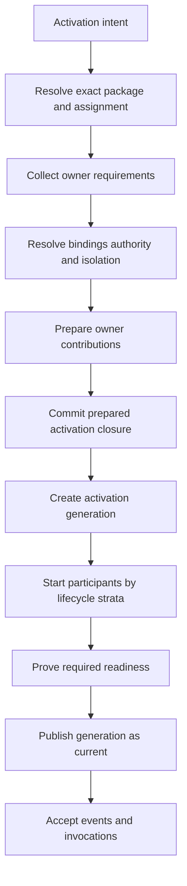
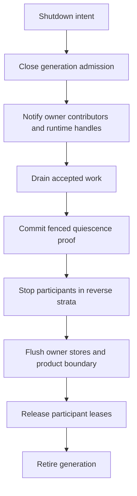

# PDS Activation Lifecycle Fanout Exercise

Date: 2026-08-15
Status: approved lifecycle design companion
Scope: attachment and activation of PDS assignments while the Meld foreground runtime is quiescent, including startup fanout, graceful shutdown, abnormal termination, and recovery

## Purpose

Apply and refine the lifecycle implied by the PDS Router design. The exercise starts with one activation trigger and follows every required domain handoff through preparation, object creation, runtime start, readiness, quiescence, graceful stop, abnormal loss, and restart.

The exercise uses the affected-domain set and ownership findings from the [PDS Router Assessment By Domain](pds_router_domain_assessment.md). It does not rerun that assessment and does not assign new semantic ownership to the router.

The governing lifecycle semantics are [Runtime Lifecycle And Quiescence](../../cognitive_architecture/runtime_lifecycle_and_quiescence.md). This companion applies those canonical principles to PDS activation fanout.

The linked design set is:

- [PDS Router Detailed Design Specification](pds_router_design_spec.md)
- [PDS Router Assessment By Domain](pds_router_domain_assessment.md)
- [PDS Isolation And Runtime Portability](../../persistent_domain_stewardship/isolation_and_runtime_portability.md)
- [Dependency Security PDS Consumer Design Specification](dependency_security_pds_consumer_design_spec.md)
- [Docs Freshness PDS Router Refactor Design Specification](docs_freshness_pds_router_refactor_design_spec.md)

This file carries the detailed PDS lifecycle application. Normative cross-domain lifecycle meaning remains in the canonical quiescence document, while implementation contracts remain in the router and consumer specifications.

## Findings

### Attachment And Activation Are Different Lifecycle Events

Attachment installs inert package meaning. It parses a manifest, routes owner bodies, installs exact owner revisions, and commits a package receipt last. It does not create a running Steward, open a credential, register an invoker, acquire a runtime lease, or begin observation.

Activation realizes one assignment. It resolves exact package meaning, binds authority and physical resources, prepares owner state, creates an activation generation, installs an assignment-local capability surface, starts required participants, and opens admission for new work.

Package attachment can therefore occur while Meld is active, idle, or shutting down, provided the package receipt store is available and installation remains inert. Activation is the operation that needs a lifecycle protocol.

### Current Quiescence Is An Idle Observation

The current foreground runtime marks one pass quiescent when every bounded actor reports `no_work`. A pass with no bound actors is also quiescent. This truthfully distinguishes active idle from a dead process, but it does not establish a durable lifecycle cut.

One quiescent pass does not prove that:

- admission for new work is closed
- no external request remains in flight
- no callback can arrive from a retired generation
- every execution claim is settled or durably suspended
- every domain outbox is drained through a known watermark
- every owner cursor is checkpointed
- every store has flushed the same lifecycle boundary

The lifecycle design therefore uses distinct terms. Existing tick quiescence is **active idle**. **Quiescent** means required participation and wake viability are complete. **Fenced quiescence** is an assignment-scoped durable retirement cut with admission closed.

### Quiescence Is Not Shutdown

Active idle keeps admission open and wakes when new evidence arrives. Fenced quiescence closes admission for a declared scope but may retain enough runtime state to resume the same generation. Shutdown tears down runtime resources, releases leases, and prevents that generation from becoming current again.

```text
active idle
    admission open
    no eligible bounded work in the observed pass

quiescent
    admission open
    no eligible work across required participants
    every wait has a viable wake path including blocked-state escalation

fenced quiescence
    admission closed for an exact scope and generation
    every accepted unit is settled, reconciled, or durably suspended
    resume may be possible under the same generation

shutdown
    generation retired
    runtime resources stopped
    leases released or abandoned
    later activation creates a new activation generation
```

### Hot Activation Needs A Runtime Service

Current product assembly creates a fixed desired runtime set before supervisor startup. The supervisor starts enabled roles in deterministic map order. It does not expose a hot registration path for an assignment-local PDS activation generation.

This means package attachment can fit the current runtime shape, but activation during foreground quiescence cannot be represented only by static startup assembly. A runtime-resident activation service or a dynamic supervisor contract is required.

The narrower first direction is a two-level lifecycle model:

```text
root supervisor
    owns stable product process roles and their leases

PDS activation lifecycle service
    owns assignment-local activation attempts and generation fanout

owner activation contributors
    own domain preparation, domain safe points, and result admission

runtime realization adapters
    own linked, subprocess, sidecar, or remote operational handles
```

This preserves the current statement that supervisor runtime ids identify product roles. The first implementation keeps the root supervisor role-based and places assignment-local lifecycle beneath one stable activation service.

### One Trigger Must Not Become One Distributed Transaction

Owner domains have separate stores and separate truth. The activation coordinator cannot atomically mutate all of them. The router already uses receipt commit last for package visibility. Activation needs the same visibility pattern.

Owner preparation may leave exact idempotent records. No prepared contribution gains live authority until the aggregate generation is published as current. Retry either converges on the same activation attempt or retires it and creates a new generation according to the failure point.

## Domain Ownership Projection

This projection carries the existing assessment forward into lifecycle behavior. It does not create another cross-domain assessment.

| Concern | Owner | Lifecycle responsibility |
| --- | --- | --- |
| exact package meaning | theory | resolve one immutable package receipt and expose owner-scoped refs |
| desired assignment and activation | config and control-plane adapter | select package receipt, principal, subject, authority refs, bindings, and requested lifecycle action |
| package component meaning | each route-owning domain | validate and resolve only its own exact component revisions |
| activation fanout | runtime composition | coordinate prepare, start, readiness, current-generation publication, quiesce, and stop over narrow owner contracts |
| domain activation state | each owner contributor | create idempotent owner records, subscriptions, cursors, and domain safe-point evidence |
| capability availability | each capability-owning domain | bind only exact selected implementations into an activation-local draft |
| capability closure | capability aggregation and runtime composition | reject missing or duplicate exact invokers before live publication |
| effective authority | Agent and execution | revalidate assignment authority at dispatch and close admission during retirement |
| invocation state | execution | own claims, lifecycle epochs, idempotency, unresolved effects, and retry eligibility |
| runtime leases and process health | supervisor and runtime adapter | fence live ownership and report operational lifecycle truth |
| canonical facts and wake | events | preserve admitted domain facts and wake the foreground runtime without owning lifecycle meaning |
| external result admission | destination domain | validate generation, scope, source, evidence class, and completeness before canonical append |
| user presentation | CLI or API adapter | submit one lifecycle intent and render aggregate plus owner diagnostics |
| operational observation | telemetry and runtime reports | expose progress without becoming activation truth |

The router is absent from live fanout after exact package resolution. It does not become a plugin host, supervisor, workflow engine, or cross-domain lifecycle owner.

## Lifecycle Vocabulary

The following states are an exercise vocabulary, not a proposed universal enum. Several may be projections over records owned by different domains.

| State | Meaning |
| --- | --- |
| installed | exact package receipt exists and is resolvable |
| assigned | standing semantic assignment exists but has no live authority by itself |
| preparing | owner requirements, bindings, isolation, and exact implementations are being closed |
| prepared | all owner preparation receipts and activation-local runtime inputs resolve exactly, with admission still closed |
| starting | one activation generation exists and required participants are acquiring leases or proving readiness |
| active | exact activation generation is current and may accept new work under effective authority |
| active idle | latest bounded observation found no eligible work but wake closure is not yet established |
| quiescent | every required participant is represented and every owner wait has a viable wake including blocked-state escalation |
| stalled | standing durable responsibility has a broken participant, operation, eligibility, or wake path |
| quiescing | admission is closed and accepted work is moving toward a durable cut |
| fenced quiescent | the declared scope has exact owner safe points and no unrecorded work remains |
| stopping | resources are being stopped and stores are being flushed |
| stopped | generation is retired and cleanly released |
| interrupted | generation lost runtime continuity without a complete graceful stop |
| failed | activation could not become current and its failure is durably attributable |

An activation may fail while owner preparation records remain. Those records are inert unless referenced by an aggregate prepared activation and a current activation generation.

## Single Trigger Fanout

The activation trigger names an exact assignment, desired activation, expected prior generation, and an idempotency key. It does not contain owner component bodies or a manual sequence of Steward behaviors.



### Phase One — Persist Intent And Fence Retry

Runtime composition persists one activation attempt before owner work begins. The record includes:

- activation id
- proposed activation generation
- assignment id and exact package receipt id
- expected prior current generation
- non-secret binding-set identity
- isolation requirement identity
- request idempotency key
- requested lifecycle action

An exact retry observes the same attempt. A conflicting request for the same assignment fails against the expected prior generation rather than racing by arrival order.

### Phase Two — Resolve Immutable Inputs

Theory resolves the exact package receipt and returns owner-scoped package views. Config resolves the exact assignment and non-secret binding refs. Agent and execution expose the authority inputs needed for later effective-authority evaluation.

This phase precedes owner object creation. A missing receipt, stale assignment, revoked principal grant, or unresolved exact component fails before any runtime handle starts.

### Phase Three — Collect Requirements

Owner activation contributors inspect only their owner-scoped package view and assignment. Independent contributors may calculate requirements in parallel because this phase is read-only.

The coordinator merges no semantics. It verifies structural closure across declared binding ids, selected capability refs, lifecycle dependencies, isolation constraints, and implementation availability. Conflicting isolation requirements fail closed. Declaration order cannot weaken a more restrictive owner requirement.

### Phase Four — Resolve Bindings And Effective Authority

Root binding adapters resolve only the ids declared by each owner. Secret values remain behind owner-scoped handles. Capability selection is intersected with implementation availability, requested assignment authority, principal grants, and runtime restrictions.

This phase may resolve independent owner bindings in parallel. No resolved binding is placed in a shared universal map visible to every contributor.

### Phase Five — Prepare Owner State

Each affected owner creates idempotent, activation-scoped records through its narrow command port. Examples include:

- Agent activation or maintained-condition registration
- domain observation subscriptions and durable cursors
- execution capability selectors and authority-policy refs
- activation-local capability invoker drafts
- external adapter configuration receipts without starting the adapter
- owner result-admission policy refs
- required and optional participant descriptions with readiness, wake, safe-point, and stop contract refs

Preparation follows declared lifecycle dependencies. Independent owners in the same dependency stratum may run in parallel. Every result is an exact owner receipt. Preparation never publishes an invoker into a live assignment catalog.

### Phase Six — Commit Prepared Closure

Runtime composition verifies every required owner receipt, exact invoker, binding identity, isolation realization, and lifecycle dependency. It commits one prepared activation closure last.

The prepared closure includes one exact participant plan. Each participant is identified as a bounded actor, durable operation adapter, or passive source. Required participants must later prove readiness. Optional participants remain explicit and cannot disappear through composition accident.

This is the visibility boundary for a complete preparation, not yet proof that a runtime is live. The distinction is important because process start and remote readiness can fail after semantic and binding closure succeeded.

### Phase Seven — Create Activation Generation And Participant Incarnations

Runtime composition creates one activation-generation record in `starting` state. Runtime realization adapters create participant incarnations against that generation. The supervisor or a narrow participant-lease service grants ownership before any active handle begins work.

Objects created in this phase can include:

- participant incarnation receipts
- process or client handles
- generation-scoped leases
- callback correlation registrations
- source watcher handles
- actor handles over already prepared domain cursors
- an immutable activation-local capability catalog and executor registry

Every object carries assignment id, activation id, activation generation, participant identity, participant incarnation, owner domain, and exact adapter identity where applicable.

An equivalent participant reconstructed after process loss receives a new incarnation under the same activation generation after recovery readiness. Binding, authority, selected implementation, endpoint, credential, or isolation change creates a new activation generation.

### Phase Eight — Start By Lifecycle Strata

Start order follows explicit operational dependencies, not the semantic event network and not declaration order. Dependencies start before consumers. Independent members of a stratum may start in parallel.

For example, a durable event append sink may need to be ready before an observation source can emit. An execution worker may need an immutable capability registry before it can accept claims. These are operational readiness edges. They do not encode that one Steward commands another Steward.

The current supervisor starts a deterministic map sequentially. That is safe as an implementation detail for a fixed actor set, but map order must not become lifecycle meaning.

### Phase Nine — Prove Readiness

A successful constructor or process spawn does not prove readiness. Each required participant reports a generation-scoped readiness result. For a bounded Meld actor, the first truthful bounded-step report is stronger evidence than successful handle creation. For an external adapter, readiness may require authenticated transport, source identity, and owner-specific handshake validation.

Recovery readiness is stricter than constructor readiness. A reconstructed participant reconciles prior claims, durable operations, subscriptions, cursors, and late-delivery lineage while admission remains closed.

Optional degraded components may be allowed only when the owning package component and activation policy explicitly declare them optional. Missing required readiness prevents current-generation publication.

### Phase Ten — Publish Current Generation

After readiness closure, runtime composition atomically advances the assignment current-generation pointer from the expected prior value to the new generation. Only then may new execution claims and external results target the generation as current.

Subscriptions and cursors are prepared before this point so durable events arriving during startup can be replayed. The design must not depend on an empty timing window between readiness and publication.

## Bounded Work And External Programs

A bounded actor step may complete short local work inline. It may not wait indefinitely for a scanner, build, remote service, or callback-based program.

Long-running external work uses two bounded transitions:

```text
dispatch
    persist durable operation
    persist attempt activation generation and participant incarnation
    hand work to the adapter
    return

completion
    receive a polled result or passive delivery
    resolve exact operation attempt and source lineage
    admit through the destination domain
    append canonical event
```

The durable operation key survives retry and participant replacement. Each dispatch receives a new attempt id. PDS lifecycle does not own retry policy or external result meaning.

## Activation While Meld Is Quiescent

The foreground runtime intentionally remains alive through active idle. An activation intent should be a durable wake source, like new evidence, rather than a requirement to restart the process.

Three cases differ:

| Case | Required quiescence scope |
| --- | --- |
| attach a new inert package | none beyond package-store write integrity |
| activate a new independent assignment | no product-wide barrier; generation-local preparation and publication are sufficient |
| replace or deactivate a current assignment | assignment-local fenced quiescence is required before old authority is retired cleanly |

The scope widens only when an owner declares a shared lifecycle dependency or execution identifies overlapping effects that cannot be fenced independently. Shared workspace location alone does not automatically require product-wide shutdown.

The safest replacement sequence is:

```text
prepare new generation with admission closed
close old generation admission
drain old generation to a fenced quiescence proof
start and prove readiness for the new generation
atomically publish the new generation as current
stop and retire the old generation
```

Some preparation and process warmup may overlap with old-generation work because they carry no new authority. Running two mutating generations concurrently is not safe by default. Blue-green overlap requires explicit effect fencing and late-result admission policy from every affected owner.

## Fenced Quiescence Proof

Fenced quiescence is scoped to one assignment, one activation generation, and its exact participant plan. It is a durable aggregate over owner receipts, not a duration of silence or a simultaneous cross-store snapshot.

A clean proof needs all of the following evidence:

- admission fence closed at an exact sequence or lifecycle epoch
- no new claims can be issued under the retired generation
- every required participant is represented by an exact owner lifecycle receipt
- every accepted claim is completed, cancelled before effect, reconciled, or durably suspended as unresolved
- every owner outbox is drained through a recorded watermark or handed to another durable owner
- every required source and projection cursor is checkpointed
- every later callback or external result remains subject to the retiring generation and participant-incarnation admission fence
- every owner safe-point receipt resolves exactly
- every owner receipt identifies its own durable checkpoint and flush evidence

An ambiguous external effect does not need to block process termination forever. It must become a durable unresolved execution state with enough lineage for later reconciliation. Quiescence means there is no unrecorded in-memory obligation, not that every external uncertainty has disappeared.

The aggregate quiescence receipt cites the admission fence, owner safe points, execution unresolved-operation summary, passive-subscription fences, and participant drain receipts. It proves closure of the declared participant set without claiming atomic writes across owner stores. The later retirement receipt adds participant stop and lease-release receipts.

## Graceful Shutdown Fanout

Graceful shutdown begins by closing admission. Stopping handles first would create a window where new authority can be accepted by a runtime that is already losing its ability to complete work.



The expected order is:

1. Persist shutdown intent and close admission for the exact generation.
2. Signal all affected owners and handles without waiting serially where no dependency exists.
3. Continue bounded drain work under existing claims only.
4. Obtain domain safe-point receipts and commit the fenced quiescence proof.
5. Stop operational objects in reverse lifecycle dependency order, parallel within a stratum.
6. Flush owner stores, then flush the product boundary through the final watermark.
7. Write stopped health, release leases, and retire the generation.
8. Preserve every canonical fact, attempt, receipt, and unresolved effect for replay.

The current supervisor has statuses for signaling, waiting for safe point, flushing, timeout, and failure. Its shutdown path currently persists only requested and completed status around a sequential handle loop. Its handle safe point is presently equivalent to the local started flag being false. That is a useful operational placeholder, not a sufficient PDS fenced-quiescence proof.

The configured shutdown grace window also needs an active role in the state transition. On expiry, remaining handles and claims move to abnormal termination handling rather than being reported as cleanly stopped.

## Emergency And Unexpected Shutdown

Emergency shutdown cannot promise drain or a common final flush. It preserves truth by fencing and recovery, not by pretending the graceful protocol completed.

### Coordinated Emergency Stop

When the coordinator is still responsive, it should:

1. Close admission immediately.
2. Persist the generation as interrupted.
3. Cancel only work whose owner can prove that no effect began.
4. Mark ambiguous effects unresolved with exact invocation lineage.
5. Request hard termination through each runtime adapter.
6. Mark unreleased leases abandoned.
7. Flush only when doing so is safe and bounded.

### Process Loss Or Crash

When no final action is possible:

- participant leases expire and cannot establish current ownership
- the last known generation remains interrupted or stale
- current-generation admission is closed during recovery before work resumes
- domain stores reconstruct cursors, claims, outboxes, and admitted facts
- external operational state is treated as recovery evidence, not Meld truth
- late callbacks retain the dead participant incarnation and pass through owner admission policy
- an equivalent reconstruction creates a new participant incarnation under the same activation generation after readiness closes
- changed activation inputs create a new activation generation

The same activation trigger may be retried only when its idempotency and visibility boundary are known. A prepared but never current generation can usually be resumed or safely abandoned. A generation that became current and then lost continuity keeps admission closed while required participant, operation, subscription, and owner checkpoints reconcile. Ambiguous external effects retain their durable operation key.

## Consumer Pressure Exercises

### Dependency Security

Dependency security makes the lifecycle boundary concrete because a scanner or advisory service may outlive one Meld tick.

Preparation can create exact source-policy refs, inventory scope, advisory cursor state, scanner bindings, capability selectors, and result-admission policy. Start can open a subprocess, sidecar client, or remote source watcher. Readiness must prove scanner identity and source identity, not merely process existence.

Graceful quiescence closes new scans, drains or suspends accepted scan claims, checkpoints advisory and workspace observation cursors, and fences callbacks. A late scan result keeps its old generation. The dependency-security domain decides whether it is rejected, admitted as historical evidence, or still valid for a current belief under explicit source-revision rules.

This follows the [Dependency Security PDS Consumer Design Specification](dependency_security_pds_consumer_design_spec.md) and strengthens its runtime requirements without moving scanner semantics into the router.

### Docs Freshness

Docs freshness pressures the local and tightly composed end of the same contract. Preparation can resolve exact docs theory, workspace scope, capability selectors, provider binding when selected, and publication policy. Start creates bounded actor handles over durable package, artifact, publication, and evidence state.

Graceful quiescence closes new docs claims, lets accepted publication work reach an owner safe point, persists artifacts and outboxes, drains canonical events through the required watermark, and checkpoints projection state. A `no_work` tick remains active idle unless admission was first fenced.

This follows the [Docs Freshness PDS Router Refactor Design Specification](docs_freshness_pds_router_refactor_design_spec.md) and gives its compatibility proof a lifecycle dimension: legacy and routed docs activation must converge, wake, quiesce, stop, and recover with equivalent domain results.

## Failure Matrix

| Failure point | Durable residue | Live authority | Required recovery |
| --- | --- | --- | --- |
| before exact resolution | activation intent only | none | correct input or terminate attempt |
| during requirement collection | activation intent and diagnostics | none | exact retry is safe |
| during owner preparation | idempotent owner preparation records | none | retry missing owners or abandon inert records |
| after prepared closure but before start | prepared activation closure | none | resume start or retire prepared generation |
| during participant start | partial participant incarnation receipts and leases | none | stop started participants, release or abandon leases, then retry or replace |
| after readiness but before current publication | ready but non-current generation | none | compare expected prior generation and publish or retire |
| after current publication | active generation and possibly accepted claims | yes | close admission, reconcile accepted work, then resume or replace |
| during graceful drain | quiescing generation and unsettled claims | no new authority | finish, suspend, or time out into interrupted state |
| during store flush | safe-point receipts with uncertain final durability | no new authority | reopen stores, verify watermarks, never infer completion from shutdown status alone |
| after lease release before retired projection | stopped runtime receipts | none | idempotently complete retirement projection |

## Lifecycle Port Shape

The shared contract is a phase protocol over narrow owner ports. Preparation, readiness, wake resolution, safe-point proof, and runtime stop remain separate interfaces. The router specification defines their required shape, while the [canonical lifecycle and quiescence design](../../cognitive_architecture/runtime_lifecycle_and_quiescence.md) defines their meaning.

The activation service owns sequencing and aggregate closure. Each domain owns what readiness, admission fencing, justified waiting, safe point, and stop mean for its participants. No port receives foreign stores or lets root code perform domain work through a generic callback.

This separation is intentional. One universal lifecycle trait would make unrelated domains conform to one operational vocabulary and would turn lifecycle coordination into hidden domain ownership.

## Incorporated Design Resolutions

The design set incorporates these resolutions:

1. Prepared activation closure is distinct from publication of the current activation generation.
2. Current publication uses an expected-prior-generation fence and one atomic assignment pointer.
3. Active idle, quiescent, stalled, fenced quiescent, stopped, and interrupted are distinct states.
4. Owner participation uses narrow preparation, readiness, wake resolution, safe-point, and stop ports.
5. Explicit lifecycle dependencies govern sequencing and parallel fanout. Declaration order has no semantic force.
6. Activation generation fences assignment-wide authority. Participant incarnation identifies one operational ownership lifetime within that generation.
7. Hot activation is coordinated beneath one stable supervised activation service. Root supervision remains role-based.
8. Activation generation and participant incarnation flow through subscriptions, callbacks, capability attempts, runtime receipts, and owner admission receipts.
9. Docs freshness migration includes lifecycle and recovery parity.
10. Dependency security includes scanner readiness, cursor checkpoint, late callback, durable operation, and interrupted recovery proofs.

## Directional Recommendation

Keep `theory::router` unchanged as the inert semantic attachment boundary. Lifecycle remains a runtime composition concern over owner-defined narrow ports.

Treat active idle as the trigger opportunity, not as a safety barrier. A durable activation intent wakes one stable runtime activation service. That service prepares owner state, creates an activation generation, starts participant incarnations in explicit lifecycle strata, proves readiness, and publishes the generation current through one atomic fence.

For retirement, close admission first, prove an assignment-scoped durable quiescence cut, stop in reverse lifecycle order, then release leases. On unexpected loss, preserve interrupted truth, reconcile ambiguous effects, and create new participant incarnations only after recovery readiness closes. Changed authority or activation inputs require a new activation generation.

The selected first topology keeps the root supervisor role-based and places assignment-local lifecycle beneath one stable activation service. Dynamic assignment-scoped root registrations are unnecessary for this contract and would materially redefine the supervisor boundary.

## Falsification Questions

This direction should be revised if any of the following prove true:

- owner safe points cannot be expressed without a global product stop
- activation generation and participant incarnation fencing cannot prevent stale callbacks from current admission
- a runtime activation cannot be made visible through one aggregate current-generation fence
- dynamic PDS runtime health cannot be represented without making every assignment a root supervisor role
- docs freshness and dependency security require fundamentally different lifecycle protocols rather than owner-specific implementations of the same phases
- an independent assignment cannot activate without quiescing unrelated assignments
