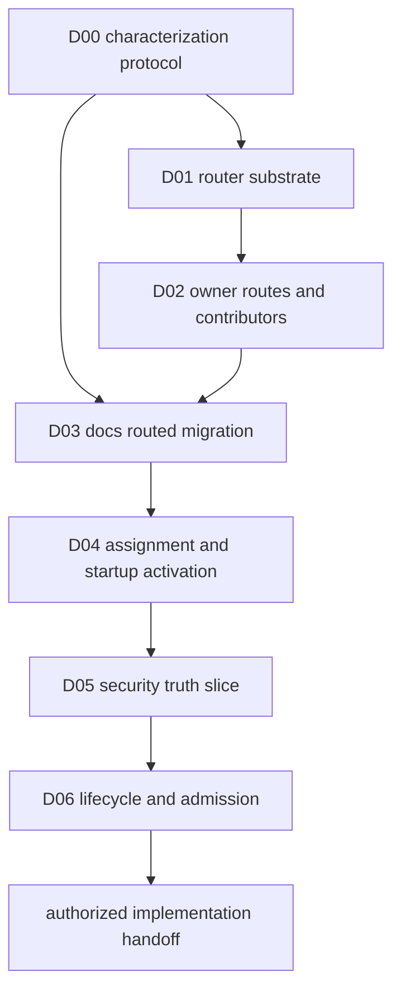

# PDS Authorized Design Delivery Program

Date: 2026-08-16
Status: complete, implementation handoff ready
Scope: delivered implementation-ready designs for authorized PDS workstreams `W00` through `W06`

## Purpose

This program converts the authorized PDS workstreams into a closed set of implementation-facing design packets before code delivery begins.

The program does not implement the workstreams. It settles the contracts, ownership, state transitions, compatibility behavior, failure semantics, code boundaries, and verification obligations that implementation will follow.

The implementation authority remains [PDS Authorized Implementation Workstreams](pds_implementation_workstreams.md). This program supplies its design inputs.

The packet set was completed against the compatibility aggregate. [Canonical Persistent Domain Stewardship](../../cognitive_architecture/persistent_domain_stewardship.md) now supersedes any packet claim that exact capabilities, Methods, Strategy policy, search controls, projection dimensions, or requested authority are PDS semantic theory. Router, activation, lifecycle, and parity conclusions remain valid within that correction.

## Authorization Boundary

Only design needed for `W00` through `W06` belongs in this program.

The program must not design or prepare implementation scaffolding for:

- dependency-security remediation or repository mutation
- a production security scanner, monitor, advisory service, or resolver integration
- full dependency-security completion
- Strategy settlement storage, candidate replay, or candidate reuse
- canonical declaration or customer profile schemas
- stewardship projection, episode coordination, or package upgrade

Those continuations remain governed by [PDS Design-Gated Continuations](pds_design_gated_continuations.md).

## Delivery Outcome

The program delivered seven bounded design packets:

| Packet | Authorized workstream | Accepted design | Status |
| --- | --- | --- | --- |
| `D00` | `W00` | [Docs Characterization Protocol](pds_w00_docs_characterization_protocol.md) | accepted |
| `D01` | `W01` | [Router Substrate Design](pds_w01_router_substrate_design.md) | accepted |
| `D02` | `W02` | [Owner Routes And Contributors Design](pds_w02_owner_routes_and_contributors_design.md) | accepted |
| `D03` | `W03` | [Docs Routed Migration Design](pds_w03_docs_routed_migration_design.md) | accepted |
| `D04` | `W04` | [Assignment And Startup Activation Design](pds_w04_assignment_startup_activation_design.md) | accepted |
| `D05` | `W05` | [Dependency-Security Truth-Slice Design](pds_w05_dependency_security_truth_slice_design.md) | accepted |
| `D06` | `W06` | [Portable Lifecycle And External Admission Design](pds_w06_portable_lifecycle_admission_design.md) | accepted |

Acceptance means an implementer can execute the mapped workstream without inventing cross-domain behavior or reopening an ownership decision.

All packet gates are closed. The next authorized delivery action is implementation workstream `W00`.

## Program Shape

Design may explore the next packet while the prior packet is in review. A packet may not be accepted until every predecessor shown in the graph is accepted.

Code implementation is outside this program. Completion hands the accepted packet set to `W00`, and implementation then follows the dependency order in the authorized implementation plan.

## Source Set And Treatment

The design program reuses existing work. It does not treat broad proposal documents as implementation-ready by default.

| Existing artifact | Treatment in this program |
| --- | --- |
| [PDS Router Detailed Design Specification](pds_router_design_spec.md) | source for `D01`, `D02`, and common assignment contracts |
| [Docs Freshness Router Refactor](docs_freshness_pds_router_refactor_design_spec.md) | source for `D00` and `D03` |
| [PDS Activation Lifecycle Fanout](pds_activation_lifecycle_fanout_exercise.md) | source for `D04` and `D06` |
| [Dependency Security Consumer Design](dependency_security_pds_consumer_design_spec.md) | source material for `D05` and `D06`, narrowed to the authorized subset |
| [PDS Router Assessment By Domain](pds_router_domain_assessment.md) | ownership evidence only |
| [Capability Ownership And Theory Routing Assessment](capability_ownership_and_pds_theory_routing_domain_assessment.md) | owner and adapter evidence only |
| [Runtime Lifecycle And Quiescence](../../cognitive_architecture/runtime_lifecycle_and_quiescence.md) | canonical lifecycle semantics |
| [Persistent Domain Stewardship](../../cognitive_architecture/persistent_domain_stewardship.md) | canonical theory and authority boundary |

Where a source spans several workstreams, the packet must select only the contracts needed by its mapped workstream. It must not carry later behavior forward for convenience.

## Design Packet Contract

Every packet must contain:

- one bounded objective mapped to its workstream
- explicit owner, publisher, consumer, and adapter boundaries
- exact public contracts and identity relationships
- state, persistence, replay, idempotency, and visibility behavior where applicable
- failure, interruption, stale-input, conflict, and late-result behavior where applicable
- compatibility entry points and deletion gates
- domain-first target code regions
- named deterministic tests, integration tests, reopen tests, and static boundary checks
- acceptance and rejection criteria
- explicit non-goals traced to the authorization boundary
- a short decision ledger containing only decisions made by the packet

A packet may retain implementation-local choices when they cannot change public behavior, persistence meaning, ownership, migration safety, or verification truth.

A packet is not acceptable if an implementer must choose a new cross-domain owner, invent a durable identity, decide a migration posture, or infer whether a failure is retryable.

No separate checkpoint, assessment, or narrative status artifact is produced. Design state is recorded in the packet itself.

## D00 — Docs Characterization Protocol

Mapped workstream: `W00`

Primary design owners:

- docs owns semantic parity dimensions
- runtime owns activation and lifecycle observations
- world model owns belief, maintained-condition, Goal, and Strategy observations
- execution owns task, outcome, claim, and effect observations
- compatibility owns legacy seam inventory and deletion conditions

Target artifact:

[PDS W00 Docs Characterization Protocol](pds_w00_docs_characterization_protocol.md)

The packet must settle:

- the exact current package selection and fixed-receipt fixtures
- which identities must remain exact and which incidental fields may vary
- deterministic provider-free scenarios
- provider-backed scenarios that require live evidence
- event, evidence, belief, maintained-condition, Goal, task, outcome, and quiescence comparison points
- reopen and historical-resolution fixtures
- the inventory of compatibility seams and the deletion condition for each
- the machine-readable parity output consumed by `D03` and later implementation

The packet must name the fixture path, invocation, expected semantic products, normalization rule, and failure signal for every scenario.

Accepted when:

- every `W00` task maps to a named fixture or evidence command
- parity does not depend on log prose, wall-clock timing, or unstable serialization order
- live evidence is limited to behavior deterministic fixtures cannot prove
- every compatibility seam has one owner and one observable removal gate

## D01 — Router Substrate Design

Mapped workstream: `W01`

Primary design owner: `theory`

Contract reviewers: init, runtime, persistence, and every initial route-owning domain

Target artifact:

[PDS W01 Router Substrate Design](pds_w01_router_substrate_design.md)

The packet must settle:

- bounded manifest, component envelope, route identity, and structural requirement types
- deterministic package canonicalization and content identity
- route catalog publication and duplicate rejection
- structural validation order before owner writes
- owner dispatch without foreign body decoding
- installation-attempt identity and idempotent retry behavior
- package receipt commit-last visibility
- exact installed-component refs and historical resolution
- package source, receipt, and owner-state storage boundaries
- input size, path containment, duplicate-key, content-hash, and no-code-execution rules
- precise diagnostics for missing routes, incompatible schemas, invalid identities, partial owner installation, and unresolved exact refs

The packet must exclude assignment activation, invoker registration, credentials, runtime process placement, and owner runtime state.

Accepted when:

- the router public API and persisted receipt shapes are exact
- each failure point states whether owner writes may already exist and why they remain invisible
- reinstall and reopen behavior are deterministic
- the router imports no docs or dependency-security body types
- every `W01` exit criterion has a named verification case

## D02 — Owner Routes And Capability Contributors Design

Mapped workstream: `W02`

Primary design owners:

- world-model belief owns belief-family and outcome-mapping routes
- world-model Agent owns curation-rule and maintained-condition routes
- world-model Strategy owns Strategy-theory routes
- execution owns capability-contract and authority-policy routes
- docs owns claim-policy routing
- capability owns deterministic contributor aggregation only

Target artifact:

[PDS W02 Owner Routes And Contributors Design](pds_w02_owner_routes_and_contributors_design.md)

The packet must settle:

- the narrow route-handler command and query contract
- the complete route catalog required by the current docs package
- translation between generic route refs and exact owner revision refs
- owner-local validation, installation, exact resolution, and semantic-link checks
- route publication at product assembly without expression dispatch
- the capability-contributor contract over exact contracts and invoker factories
- deterministic aggregation order and exact conflict handling
- activation-local capability selection boundaries
- optional provider contribution behavior
- proof that unselected capabilities do not enter an activation draft

The packet must include one contract table with each route, owner, accepted body, returned ref, semantic dependencies, and runtime consumer.

Accepted when:

- every current docs theory body has one owner route
- no owner store or body type crosses into router ownership
- capability aggregation has one deterministic conflict rule
- selected contract content identities remain unchanged
- every `W02` exit criterion has a named verification case

## D03 — Docs Routed Migration Design

Mapped workstream: `W03`

Primary design owners: docs and compatibility

Contract reviewers: config, init, runtime, world model, execution, and theory

Target artifact:

[PDS W03 Docs Routed Migration Design](pds_w03_docs_routed_migration_design.md)

The packet must settle:

- the canonical docs package manifest over every current owner revision
- legacy declaration lowering into the canonical package entry
- routed owner-ref resolution into the current runtime image
- docs capability binding through the contributor contract
- new generic receipt writes and historical fixed-receipt reads
- canonical cutover order and rollback behavior before old writes stop
- parity comparison against the `D00` protocol
- direct root installation and registration deletion gates
- versioned compatibility decoding with no new callers
- provider-free deterministic activation after migration

The packet must define each migration state, which reader and writer is canonical in that state, and the evidence required to advance.

Accepted when:

- every parity dimension has a routed comparison
- old receipts remain exactly resolvable
- new writes cannot silently fall back to the fixed receipt
- root config and runtime need no docs component slots or registration calls
- rollback cannot reinterpret a receipt or duplicate owner theory
- every `W03` exit criterion has a named verification case

## D04 — Assignment And Startup Activation Design

Mapped workstream: `W04`

Primary design owners: config and runtime composition

Contract reviewers: capability, Agent, execution, supervisor, and owner contributors

Target artifact:

[PDS W04 Assignment And Startup Activation Design](pds_w04_assignment_startup_activation_design.md)

The packet must settle:

- exact assignment identity and its package, principal, subject, scope, and authority refs
- exact physical activation identity and its binding, implementation, placement, and limit refs
- secret-free configuration and owner-scoped binding handles
- owner requirement collection and prepared activation closure
- activation-local capability and executor catalogs
- startup activation-generation creation and current-generation publication
- readiness requirements before admission opens
- deterministic behavior for several assignments independent of declaration order
- isolation of grants, bindings, invokers, beliefs, Goals, tasks, operations, and failure fate
- failed preparation behavior and cleanup of inert owner records

This packet is startup-only. Hot replacement, graceful retirement, interrupted recovery, passive external delivery, and participant-incarnation replacement belong to `D06`.

Accepted when:

- package, assignment, activation, and activation-generation identity are distinct
- prepared closure exposes no live invoker
- admission opens only after all required startup readiness receipts resolve
- overlapping assignments cannot observe or mutate one another through shared catalogs or bindings
- one failed activation leaves an unrelated assignment healthy
- every `W04` exit criterion has a named verification case

## D05 — Bounded Dependency-Security Truth-Slice Design

Mapped workstream: `W05`

Primary design owner: dependency security

Contract reviewers: workspace, events, world-model belief, Agent, Strategy, execution, and theory

Target artifact:

[PDS W05 Dependency-Security Truth-Slice Design](pds_w05_dependency_security_truth_slice_design.md)

The packet must settle:

- the maintained subject and bounded scope used by the proof
- exact dependency inventory identity and provenance within the fixture
- exact advisory snapshot, source revision, declared coverage, and currency within the fixture
- canonical inventory, advisory, assessment, coverage, and verification products
- distinct unknown, insufficient, clean-within-coverage, violated, stale, and conflicted states
- bounded negative evidence and the precise meaning of clean in the fixture
- local and fake serialized adapter ports over one owner result contract
- dependency-security admission before canonical append
- package, assignment, activation, operation, source, inventory, advisory, and result lineage
- separate coverage and posture belief inputs
- maintained condition, curation rule, Strategy theory, capability contracts, and authority policy installed through owner routes
- source advance as an observation opportunity rather than direct belief mutation

The packet must not define production advisory selection, production ecosystem resolution, remediation feasibility, repository mutation, pull-request behavior, or a persistent security monitor.

Accepted when:

- every clean result is bounded by named inventory, source coverage, source revision, and currency evidence
- transport or adapter success cannot establish posture or resolution
- local and fake serialized paths admit the same canonical product shape
- root, Meld Lang, events, belief, Agent, and planner contracts remain application neutral
- the slice contains no code-change or pull-request effect
- every `W05` exit criterion has a named verification case

## D06 — Portable Lifecycle And External Admission Design

Mapped workstream: `W06`

Primary design owners: runtime composition, supervisor, execution, and destination owner adapters

Contract reviewers: events, telemetry, harness, capability, and dependency security

Target artifact:

[PDS W06 Portable Lifecycle And External Admission Design](pds_w06_portable_lifecycle_admission_design.md)

The packet must settle:

- the stable supervised activation-lifecycle service boundary
- durable activation intent and expected-prior generation fencing
- exact participant plans and lifecycle dependency strata
- readiness, wake, safe-point, stop, and required-status refs
- activation generation, participant incarnation, durable operation, attempt, subscription, and delivery identities
- operation persistence before dispatch and later owner admission
- passive-source ingress without fabricated execution attempts
- active idle, quiescent, stalled, fenced quiescent, stopped, and interrupted projections
- hot activation, replacement, graceful retirement, and interrupted recovery
- ambiguous-effect reconciliation under one stable operation
- late result rejection or classification for retired generations and incarnations
- equivalent local and fake serialized dependency-security realizations
- diagnostics and harness views that observe lifecycle truth without creating it

The packet must include one state-transition table and one failure matrix covering preparation, start, readiness, active work, passive delivery, retirement, crash, reopen, and late callback behavior.

The packet must not select or integrate a production security service.

Accepted when:

- placement does not alter package identity or canonical owner results
- readiness and recovery rules close admission until owner state is reconciled
- every accepted external result is fenced by assignment, generation, incarnation, source, and operation or delivery lineage
- every ambiguous effect has one reconciliation owner and retry rule
- quiescence requires complete participation and viable wake closure
- every `W06` exit criterion has a named verification case

## Delivery Stages

### Stage One — Ground And Attachment

Deliver `D00`, `D01`, and `D02`.

This stage closes the parity protocol, inert package substrate, owner route boundary, and capability contribution contract. It must end with one coherent type and identity vocabulary across the three packets.

### Stage Two — Migration And Startup Realization

Deliver `D03` and `D04`.

This stage closes the docs cutover, compatibility behavior, assignment identity, physical activation, prepared closure, and isolated startup publication. It must not pull hot replacement or external monitor behavior forward from `D06`.

### Stage Three — Bounded Second Consumer And Lifecycle

Deliver `D05` and `D06`.

This stage closes only the bounded dependency-security truth proof and the generic lifecycle behavior exercised by local and fake serialized adapters. It must not claim full dependency-security product design.

### Stage Four — Implementation Handoff

Reconcile the accepted packet set against [PDS Authorized Implementation Workstreams](pds_implementation_workstreams.md).

The handoff must:

- map every implementation task to one accepted design section
- map every exit criterion to one named verification case
- remove or rewrite any implementation task that exceeds its accepted packet
- preserve the implementation dependency order from `W00` through `W06`
- state that implementation stops after `W06`

No separate readiness report is created. The reconciled implementation plan and accepted packet statuses are the handoff record.

Handoff completed on 2026-08-16. Every implementation task and exit criterion now has a stable id and an accepted design trace in [PDS Authorized Implementation Workstreams](pds_implementation_workstreams.md).

## Packet Status And Review

Each packet uses one of these statuses:

| Status | Meaning |
| --- | --- |
| drafting | contracts and decisions are being written |
| owner review | every changed owner is reviewing its boundary |
| integration review | cross-domain identities, failure paths, migration, and verification are being reconciled |
| accepted for authorized implementation | no blocking design decision remains for the mapped workstream |

Review feedback must resolve into the packet as a decision, contract change, acceptance case, rejection case, or explicit non-goal. Commentary that does not change implementation behavior does not become a program artifact.

The following reviewers must agree before acceptance:

- the semantic owner of every new public contract
- every domain that persists or resolves a new exact ref
- every adapter that translates between owner contracts
- the owner of compatibility reads and deletion gates
- the owner of each named verification fixture

## Change Control

A design change remains inside this program only when it is necessary to satisfy an existing `W00` through `W06` task or exit criterion.

If a proposed change introduces a new product behavior, owner, durable identity, external integration, authority path, remediation effect, Strategy reuse path, upper-layer schema, projection, or upgrade mechanism, remove it from the active packet and record it in the appropriate non-authorized design context.

Design acceptance does not expand implementation authorization. A design that reveals required behavior outside `W00` through `W06` must narrow the authorized workstream or return the conflict for an explicit authorization decision.

## Program Completion Condition

This program is complete when:

- `D00` through `D06` are accepted for authorized implementation
- their public contracts use one coherent identity and ownership model
- every authorized implementation task and exit criterion traces to accepted design
- no accepted packet contains behavior reserved for `W07` or later
- the implementation plan still ends with a mandatory stop after `W06`

Completion authorizes no later PDS continuation.

## Completion Record

- `D00` through `D06` are accepted for authorized implementation.
- The implementation plan traces every authorized task and exit criterion to an accepted packet.
- The bounded security slice uses Cargo fixtures, four read-only capabilities, and local plus fake serialized adapters only.
- Lifecycle design selects one stable supervised activation service and preserves owner lifecycle truth.
- The implementation sequence begins at `W00` and retains the mandatory stop after `W06`.
- No design or implementation authority was added for `W07` or later.

## Read With

- [PDS Authorized Implementation Workstreams](pds_implementation_workstreams.md)
- [PDS Design-Gated Continuations](pds_design_gated_continuations.md)
- [Theory Elevation Program](theory_elevation_program.md)
- [PDS Router Detailed Design Specification](pds_router_design_spec.md)
- [Docs Freshness Router Refactor](docs_freshness_pds_router_refactor_design_spec.md)
- [Dependency Security Consumer Design](dependency_security_pds_consumer_design_spec.md)
- [PDS Activation Lifecycle Fanout](pds_activation_lifecycle_fanout_exercise.md)
