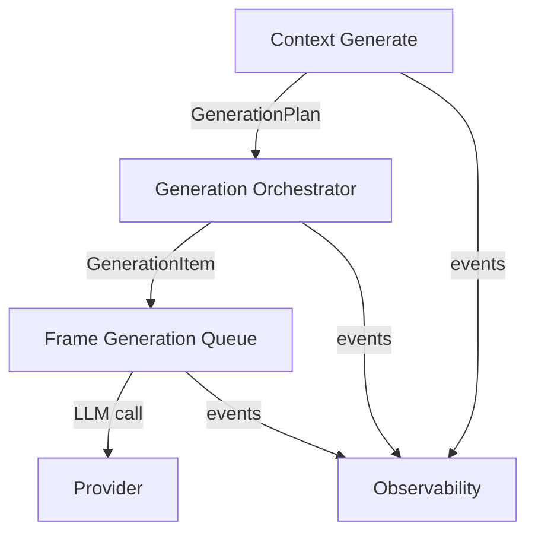

# Context Design (current)

## Overview

This directory contains specifications for the current context and context-generation work: generation pipeline architecture, path based generation, orchestrator behavior, and LLM payload contract. Original context specs live under `design/completed/context/`.

The suite is centered on the three layer generation model, Context Generate, Orchestrator, Queue, and level ordered recursive generation by path with leaf to trunk execution.

---

## CLI Commands

### Context Generation

*   `merkle context generate --path <path> [options]` - Generate context for a node by path (file or directory)
    *   `--agent <agent_id>` - Agent to use for generation
    *   `--provider <provider_name>` - Provider to use for generation
    *   `--frame-type <frame_type>` - Frame type to generate
    *   `--force` - Generate even if head frame exists
    *   `--no-recursive` - Only the given path; no descendants
    *   For directories: level ordered recursive generation deepest first, leaf to trunk
*   `merkle context generate --node <node_id> [options]` - Generate context frame by NodeID
    *   Same agent, provider, frame type, and force options

CLI output includes session ID for correlation with observability events and session files.

---

## Key Concepts

### Generation Pipeline

Three-layer model:

*   **Context Generate** - CLI and entry points; path resolution, subtree collection, level grouping, head checks, plan construction
*   **Orchestrator** - Executes the GenerationPlan level by level, tracks completion, enforces failure policy, emits execution events
*   **Queue** - Frame generation queue; processes requests, performs deduplication, handles retries, calls providers

Requirements flow backward: Queue → Orchestrator → Context Generate. Individual specs conform to the contracts in `generation_pipeline_spec.md`.

### GenerationPlan

Data structure contract between layers. It defines what is submitted for generation, including target nodes, agent, frame type, level ordering, and recursive scope. The pipeline spec defines the contract and the orchestrator consumes it.

### Observability

Observability specs live under `design/observability/`.

---

## Terminology

*   **Context Frame**: Immutable content associated with a node; stored append-only.
*   **NodeID**: Deterministic 32-byte hash identifying a filesystem node.
*   **Frame Type**: Logical label for a frame; defaults to `context-<agent_id>`.
*   **Agent**: Identity with prompts and behavior used for LLM generation (provider-agnostic).
*   **Head**: The latest frame per node and frame type.
*   **GenerationPlan**: Contract data structure describing a generation request across pipeline layers.
*   **Level-ordered**: Recursive generation ordered by depth (deepest first) for directory trees.

---

## Path Resolution

Path-based generation:

1.  Canonicalize path relative to the configured workspace root
2.  Resolve to NodeID via NodeRecord store; fail with appropriate error if not in tree
3.  For directories in recursive mode: build a level ordered plan from deepest level to root
4.  For directories in single node mode: check descendant readiness unless `--force` is set

**Error guidance**: Suggest running `merkle scan` or starting `merkle watch` if the tree is outdated.

---

## Related Documentation

### Pipeline and Architecture

*   [generation\_pipeline\_spec.md](generation_pipeline_spec.md) - Architectural authority for the generation pipeline: three-layer model, GenerationPlan contract, backward-flowing requirements, multi-source concurrency. Other specs conform to this.

### Command and Behavior

*   [context\_generate\_by\_path\_spec.md](context_generate_by_path_spec.md) - `merkle context generate` by path: path vs directory, descendant check, `--force`, `--no-recursive`, level-ordered recursion, CLI output and errors.

### Orchestrator and Queue

*   [generation\_orchestrator\_spec.md](generation_orchestrator_spec.md) - GenerationOrchestrator: plan execution, level ordering, completion tracking, event emission.

### LLM and Payload

*   [llm\_payload\_spec.md](llm_payload_spec.md) - Payload sent to the LLM: node content (file bytes or child context), prompt, optional response template; full response each time; binary-file handling and response-template placement in agent metadata.

### Observability

*   [design/observability/observability\_spec.md](../observability/observability_spec.md) - Event system: ProgressEvent types, EventBus, EventWriter, session lifecycle and pruning.

### Completed Context Specs

*   [design/completed/context/README.md](../completed/context/README.md) - Original context, agent, and provider management specs and CLI.028931

---

## Architecture

### Architecture Diagram

### Diagram Links

*   [context\_generate\_by\_path\_spec.md](context_generate_by_path_spec.md) - Context Generate
*   [generation\_orchestrator\_spec.md](generation_orchestrator_spec.md) - Generation Orchestrator
*   [frame\_generation\_queue\_spec.md](../completed/workflow/frame_generation_queue_spec.md) - Frame Generation Queue
*   [llm\_payload\_spec.md](llm_payload_spec.md) - Provider request payload
*   [design/observability/observability\_spec.md](../observability/observability_spec.md) - Observability system

The current context generation flow:

1.  **Path Resolution**: Canonicalize path, resolve to NodeID, collect directory subtree and group by level.
2.  **Context Generate**: Build a GenerationPlan, emit domain events, and invoke the orchestrator.
3.  **Orchestrator**: Execute the plan in level order, track completion, and emit execution events.
4.  **Queue**: Process requests, deduplicate, call providers, store frames.
5.  **Observability**: EventBus for real time consumers; EventWriter for session files and replay.

All generation goes through the queue. The orchestrator is the only component that submits to the queue for path-based recursive generation and coordinates ordering and events.

---