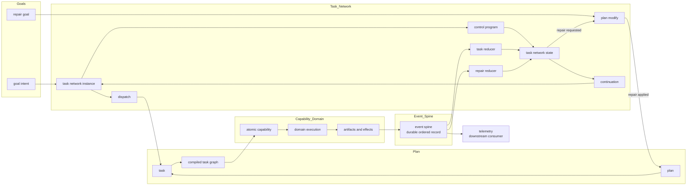

# Control Design

Date: 2026-04-09
Status: active
Scope: control layer design above capability and task compilation, including refactor-phase compatibility orchestration

![[meld/design/control/screenshot-2026-03-28_11-51-02.png]]

## Unified Task Network Architecture

## Thesis

This design set defines the layer above `capability` and `task`.

The key control concern is `task_network`.
`task_network` is the stateful orchestrator over tasks.
It owns dispatch, event reduction, repair state, continuation, and execution through the control program.

The event spine is the durable ordered record for all control-domain facts.
The task network's reducers read from the spine to advance task network state.
Telemetry is a downstream consumer of the spine and does not own domain event semantics.

During the refactor phase, `control` also acts as the honest temporary home for orchestration logic extracted from `context` and legacy workflow execution.
That temporary role is documented in [Interregnum Orchestration](interregnum_orchestration.md).

Capabilities remain atomic domain owned contracts.
Tasks are compiled graphs of chained capabilities.
Plans contain only tasks.

## Layer Boundary

`control` is not a capability catalog.
`control` is not domain execution.
`control` is not the full goals layer.

`control` does own:

- task network dispatch
- task network state
- event reduction over the spine
- continuation
- repair through `plan::modify`
- the control program that sequences task dispatch, branching, and observation waits

## Core Architecture

The architecture is layered:

- `goals`
  - why change is needed
- `control`
  - how tasks are dispatched, observed, reduced, and repaired
- `plan`
  - tasks only
- `task`
  - compiled capability graph
- `capability`
  - atomic executable contract

The most important constraint is state ownership.
Running work emits events into the spine.
Only the task network reducers advance task network state from those events.

## Durable Structure

The durable structure is:

- `interregnum_orchestration.md`
  - refactor-phase orchestration ownership before task execution takes over
- `task_network.md`
  - task network model, events, state ownership, repair, and dispatch
- `events/`
  - canonical event spine design, telemetry refactor path, and multi-domain envelope requirements
- `impact_assessment.md`
  - first observation task; ImpactAssessment as the concrete example of await_observation and branch
- `synthesis/`
  - runtime capability synthesis; CapabilitySynthesisTask, ExternalProcess execution class, and the sled-backed runtime catalog
- `architecture_diagrams.md`
  - the unified architecture diagram and reading notes
- `htn/`
  - hierarchy and lineage
- `program/`
  - control graph model, task dispatch, observation wait, and guard binding semantics
- `runtime/`
  - continuation and resume
- `repair/`
  - repair entry and repair rules

## Core Decisions

- `task_network` is the primary stateful control artifact
- `control` owns refactor-phase compatibility orchestration when orchestration has left `context` but task execution is not ready yet
- `task` is a compiled artifact, not a state owner
- `plan` contains only tasks
- `plan` and graph execution semantics are one coherent control concern
- capability behavior remains atomic and domain owned
- events are the only path from running work back into task network state
- the event spine is the durable ordered record; task network reducers derive all state from it
- telemetry is downstream of the spine and must not own domain event semantics
- the spine envelope carries `domain_id` to support future multi-domain attachment without schema migration
- repair is a control function expressed as `plan::modify`
- the reason for repair belongs to `goals`, not to control

## Compiled Artifacts

The current model assumes these durable artifact families:

- `plan`
- `task`
- task network continuation and state records
- event spine records for `event::task` and `event::repair`, each carrying `domain_id: "task_graph"`

## Read Order

1. [Bootstrap Plan](PLAN.md)
2. [Interregnum Orchestration](interregnum_orchestration.md)
3. [Task Network](task_network.md)
4. [Events Design](events/README.md)
5. [Event Manager Requirements](events/event_manager_requirements.md)
6. [Telemetry Refactor](events/telemetry_refactor.md)
7. [Multi-Domain Spine](events/multi_domain_spine.md)
8. [Impact Assessment](impact_assessment.md)
9. [Synthesis Overview](synthesis/README.md)
10. [External Process Capability](synthesis/external_process_capability.md)
11. [Synthesis Task](synthesis/synthesis_task.md)
12. [Runtime Catalog](synthesis/runtime_catalog.md)
13. [Unified Task Network Diagram](architecture_diagrams.md)
14. [HTN Model](htn/README.md)
15. [HTN Lineage Model](htn/lineage_model.md)
16. [Control Program Model](program/README.md)
17. [Control Graph Model](program/control_graph.md)
18. [Await Observation Semantics](program/await_observation_semantics.md)
19. [Guard Binding Semantics](program/guard_binding_semantics.md)
20. [Runtime Model](runtime/README.md)
21. [Continuation Model](runtime/continuation_model.md)
22. [Repair Model](repair/README.md)
23. [Repair Entry Model](repair/repair_entry.md)

## Read With

1. [Capability And Task Design](../capabilities/README.md)
2. [Domain Architecture](../capabilities/domain_architecture.md)
3. [Task Control Boundary](../capabilities/task_control_boundary.md)
4. [HTN Turing Plan](../htn_turing.md)
5. [Goals](../goals/README.md)

## Reading Notes

- `goals` provides why change is needed
- `control` temporarily houses extracted orchestration during the refactor window
- `task_network` owns dispatch, event reduction, repair state, and continuation
- the event spine is the durable ordered record; reducers are the only path from spine to state
- telemetry consumes the spine downstream and has no correctness role
- `plan` contains only `task`
- `task` encapsulates compiled capability structure
- `capability` remains atomic domain behavior
- events are the only path from running work back into task network state

## Non Goals

- making capabilities stateful orchestrators
- letting tasks mutate task network state directly
- mixing goals and control into one layer
- forcing repair intent to live only inside control
- making telemetry the owner of domain event semantics
