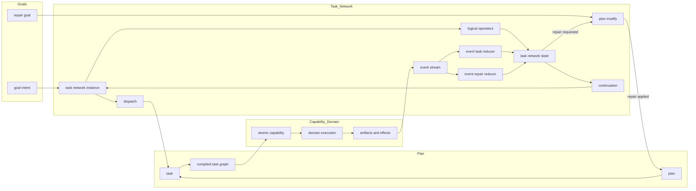

# Unified Task Network Diagram

Date: 2026-03-28
Status: active
Scope: one coherent architecture view for goals, task network, plan, task, capability, and events

## Intent

Collapse the earlier diagram set into one aligned architecture entity.

## Diagram

## Reading Notes

- `goals` answers why plan change is needed
- `task_network` is the sole owner of orchestration state
- `plan` contains only tasks
- `task` is the compiled capability graph unit
- `capability` is the atomic execution contract
- events are emitted by running work and consumed only by task network reducers
- repair enters through goal intent and executes as `plan::modify`
