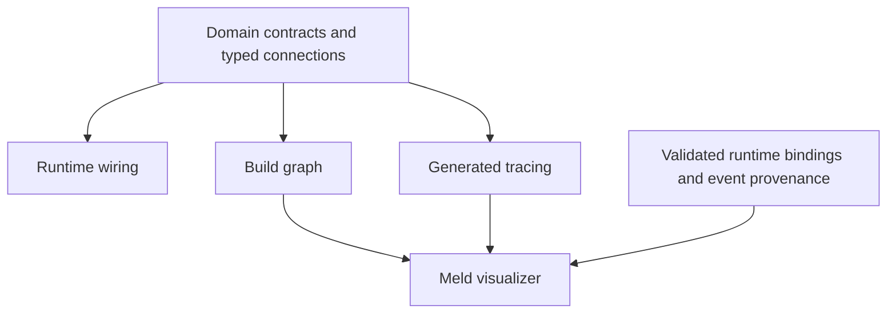

# Compiled Instrumentation and Runtime Graph

Date: 2026-09-10
Status: non-authoritative discovery proposal
Scope: generated tracing coverage and build-associated producer/consumer graph data for a possible Meld visualizer

This document preserves an exploratory idea. It does not establish requirements, change domain ownership, select a macro framework, or authorize implementation. Names and data shapes below are provisional.

## Problem and Working Idea

Handwritten instrumentation creates two pressures: shallow coverage leaves work invisible, while deeper coverage adds repetitive span setup, fields, and context propagation to domain code. Separately maintained architecture diagrams can drift from the runtime they describe.

The working idea is to generate instrumentation and rich graph metadata from the same domain contracts and typed connection declarations that establish runtime wiring. A declaration would create the operational connection and its graph representation together. The visualizer would render that representation and attach runtime evidence through shared stable identities.

## Generated Instrumentation

Rust already supports function instrumentation through `#[tracing::instrument(skip_all)]`. The macro generates span machinery during compilation; span creation, timing, recording, and export still happen at runtime. Generated instrumentation reduces handwritten LOC without eliminating runtime cost.

A custom macro over an `impl` block could instrument eligible methods under one policy, with explicit exclusions and a shared field policy. This could expose internal work without repeating an attribute on every method. Argument capture could default to disabled, with domain-owned identifiers selected explicitly.

Function coverage alone does not establish causal coverage. Spawned tasks, queues, process boundaries, retries, and replay require context propagation at their handoffs. Generated dispatch and transport adapters could carry context and create producer and consumer spans. Batch consumption and multiple causes may require span links instead of a single parent. Retry attempts and replay would need explicit semantics.

Instrumentation at these boundaries would observe existing domain operations. It would not become another event writer, scheduler, or source of domain truth. Internal function spans would complement boundary spans where deeper visibility is useful.

## Graph Data for a Visualizer

The proposed artifact is a versioned graph model serialized as JSON. Mermaid and UML would be projections of that model. The richer source would retain information that a rendered diagram cannot express conveniently.

| Record | Candidate information |
| --- | --- |
| Build | Artifact identity, source revision, target, enabled features, graph schema version |
| Node | Stable identity, domain owner, operation, implementation, source location |
| Port | Direction, contract identity, payload schema or schema reference, contract version |
| Edge | Producer port, consumer port, transport, routing predicate, cardinality |
| Delivery | Declared durability, ordering, acknowledgment, retry policy |
| Instrumentation | Operation identity, span kind, field policy, propagation behavior |
| Evidence | Compiled declaration, validated binding, observed execution, coverage limits |

Edges should distinguish calls, event publication, subscriptions, and lifecycle dependencies. A participant depending on another participant does not by itself prove that one consumes the other's events. Matching payload types also does not prove an operational connection.

Stable operation and edge identities could connect runtime spans to the build graph. Event record references could attach durable causal evidence. The visualizer could show available paths, selected paths, and observed paths without treating those claims as interchangeable.

## Meaning of Correctness per Build

The strongest proposed structural guarantee is that every connection through the generated surface has a corresponding graph edge and compatible endpoint contracts. This requires actual wiring to use that surface. An annotation that merely describes independently written wiring can still drift. Raw bypass paths would need to be inaccessible or rejected by checks for coverage to be enforceable.

A normal procedural macro receives its input tokens. It cannot automatically recover a fully resolved, whole-program producer/consumer graph from arbitrary Rust. Typed composition could make the relevant relationships explicit and emit compiler-checked connections. Whole-graph validation might additionally require a build validation step; distributed declarations do not automatically provide global compile-time checks.

Generated descriptors could be embedded in the compiled artifact and exported through a dedicated inspection path. The exact mechanism is open. The export must represent the same target and feature selection as its associated artifact. A separately compiled exporter with different configuration would weaken the guarantee.

Meld also selects owners and bindings at runtime. Three distinct claims would therefore remain visible:

- The build graph describes compiled operations and permitted connections within its declared coverage.
- An activation snapshot describes validated selections and bindings for a particular runtime generation, including external owner identities.
- Runtime evidence describes observed work, causality, timing, and outcomes within its observation window.

Structural completeness does not prove that a route executes, a consumer makes progress, delivery succeeds, or every span reaches OTel. Sampling, filtering, exporter failures, and incomplete observation remain runtime concerns. Declared delivery policies require implementation evidence before they can be presented as proven behavior.

## Existing Meld Ground

The existing contracts offer possible attachment points rather than an already implemented generator:

- [Activation participant declarations](../../src/theory/activation.rs) carry ownership, dependency, and lifecycle contract references.
- [Participant lifecycle contracts](../../src/runtime/lifecycle/contracts.rs) distinguish declared participants, realizations, incarnations, and structural wake references.
- [Owner registration](../../src/runtime/owners/registration.rs) obtains descriptions from selected executables, while [publication grants](../../src/runtime/owners/events.rs) constrain event routes.
- [Event envelopes and provenance](../../crates/meld-events/src/events.rs) carry domain identity and source-record references. [Observability reports](../../crates/meld-events/src/events/observability.rs) provide presentation-independent flow and causal data.

The possible extension is to connect these existing boundaries through generated descriptors and instrumentation while preserving their current ownership. Whether those contracts expose enough information for complete connection coverage remains an open investigation.

## Open Questions and Non Commitments

The declaration scope is unresolved: function, implementation block, domain port, or composition root may each supply different information. The right balance between deep function instrumentation and boundary instrumentation is also open.

Further questions include how to identify operations across refactors, reject bypass paths, represent runtime routing predicates, associate external owner artifacts with an activation, and preserve causality through retries and durable replay. The artifact export mechanism and division between compiler checks and build validation remain unselected.

This proposal does not commit to instrumenting every function, creating a whole-program call graph, replacing the event ledger, building a visualizer, or adding work to an accepted delivery program.

## Technical References

- [Tracing instrumentation macro](https://docs.rs/tracing/latest/tracing/attr.instrument.html)
- [Async tracing instrumentation](https://docs.rs/tracing/latest/tracing/trait.Instrument.html)
- [Tracing to OpenTelemetry bridge](https://docs.rs/tracing-opentelemetry/latest/tracing_opentelemetry/)
- [Rust procedural macro model](https://doc.rust-lang.org/stable/reference/procedural-macros.html)
- [OpenTelemetry messaging span relationships](https://opentelemetry.io/docs/specs/semconv/messaging/messaging-spans/)
