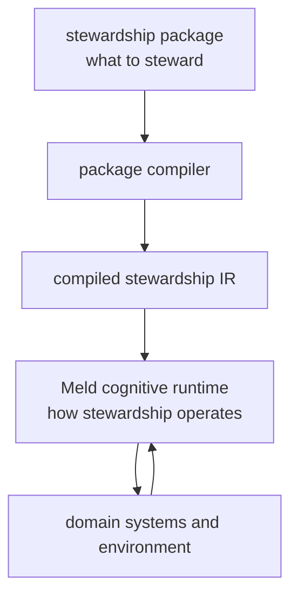

# Persistent Domain Stewardship

Date: 2026-07-13  
Status: proposed  
Scope: declarative application layer for configuring persistent, evidence-grounded stewardship over bounded domains

## Thesis

Meld is not itself a persistent domain steward.

Meld is the runtime that can host persistent domain stewards.

A running steward is the composition of:

```text
Meld cognitive runtime
    + compiled stewardship package
    + stewardship assignment
    + persistent runtime state
```

The cognitive runtime defines **how** observation, temporal integration, belief revision, goal curation, planning, execution, and outcome publication operate.

A stewardship package defines **what** a particular steward understands, watches, values, may change, and uses as evidence of success.



The package is the declarative program.

[`meld-lang`](../cognitive_architecture/meld-lang/README.md) is the shared runtime intermediate representation for propositions, goals, operators, effects, methods, and world state.

Meld is the persistent execution and world-model runtime.

Sensors and capabilities are executable adapters at the domain boundary.

## Why This Module Exists

The cognitive architecture has extensive design for the runtime loop:

```text
observe
→ event history
→ graph and belief
→ perspective and goal curation
→ planning and execution
→ outcome publication
```

It does not yet have one top-level representation that declares:

- the bounded domain being stewarded
- the domain vocabulary and identity rules
- the observations that make the domain visible
- the belief families that interpret those observations
- the standing conditions a steward is responsible for maintaining
- the observations and interventions available to it
- the authority under which it may act
- the evidence that establishes whether an intervention succeeded
- the scenarios that prove the package is safe and coherent

Those concerns currently appear in separate places such as belief-family configuration, Agent directives, workflow profiles, task packages, capability registrations, prompts, and execution policy.

Persistent Domain Stewardship defines the composition layer that turns those fragments into one versioned operational domain theory.

## Location And Naming

This module is a sibling of `cognitive_architecture` rather than a child of it.

That separation is intentional:

- `cognitive_architecture` defines runtime authority and mechanics
- `persistent_domain_stewardship` defines declarative applications loaded into that runtime

The current directory name `cognitive_architecture` is retained in this change to avoid mixing a repository-wide path rename with the new semantic boundary.

A future rename to `cognitive_runtime` is compatible with this design and should be performed as a separate mechanical change after the boundary has stabilized.

## Persistent Domain Steward

A persistent domain steward is an evidence-grounded, policy-bounded controller responsible for maintaining conditions over a domain for an indefinite horizon.

It differs from a workflow because its responsibility survives completion of any individual execution.

It differs from a reconciler because actual state may be incomplete, stale, contradictory, or perspective-dependent.

It differs from a monitor because it can acquire new evidence and initiate bounded interventions.

It differs from a general agent because its domain, mandate, authority, and outcome semantics are explicit.

```text
standing mandate remains active
    ↓
domain evidence changes or becomes stale
    ↓
belief revision
    ↓
act / tolerate / observe / escalate
    ↓
stewardship episode opens
    ↓
goals and task-network work
    ↓
outcome evidence
    ↓
desired region restored or intervention rejected
    ↓
episode closes
    ↓
standing mandate remains active
```

## Qualification

A use case is stewardship-shaped when most of the following are true:

| Property | Requirement |
|---|---|
| Bounded domain | Subjects, relationships, and responsibility can be scoped |
| Persistent mandate | Responsibility remains after one task completes |
| Independent change | The domain changes while the steward is idle |
| Partial observability | Current state must be inferred from evidence |
| Standing objectives | Conditions should remain within acceptable regions |
| Observation choices | Additional evidence can be acquired selectively |
| Intervention choices | More than one response may be available |
| Action economics | Acting and not acting carry variable cost or risk |
| Outcome feedback | Later observations can evaluate intervention effects |
| Bounded authority | Permissions, budgets, approvals, and prohibitions are explicit |
| Temporal continuity | Prior evidence, decisions, and outcomes remain relevant |
| Audit value | Reconstructing why an action occurred matters |

A deterministic controller, workflow, scheduler, optimizer, or ordinary tool call should remain the baseline.

Meld is justified only when the additional world-model, uncertainty, perspective, or adaptive-decision machinery measurably improves the result.

See [Use-Case Decomposition](use_case_decomposition.md).

## Core Terms

### Domain module

Declares the vocabulary of a bounded domain:

- object types
- relation types
- identity rules
- attributes and units
- artifact types
- belief dimensions
- lifecycle and scope semantics

The domain module does not contain live domain data.

### Observation module

Declares how promoted observations become facts, graph mutations, and belief evidence.

It references sensory implementations and connectors. It does not implement raw polling, streaming, or lowering.

### Belief module

Declares epistemic concern families:

- the question being assessed
- admissible evidence
- posterior semantics
- comparator selection
- priors
- freshness and conflict policy
- planner-facing projection

A belief family answers what should be believed. It should not own a steward-specific desired state or action policy.

### Steward charter

Declares a reusable stewardship role:

- perspective and trust profile
- subject scope shape
- standing objectives
- concern bindings
- tolerance and hysteresis
- inaction-cost policy
- authority requirements
- escalation and lifecycle policy

The charter is persistent. Goals generated from it are episodic.

### Stewardship assignment

Binds one charter to:

- a concrete subject scope
- a principal
- a world-model Agent identity
- an effective authority grant
- a compiled package hash

The package is reusable. The assignment is a live runtime object.

### Stewardship objective

A standing responsibility expressed over planner-facing world state.

An objective remains active after satisfaction. A later breach can open another episode.

### Stewardship episode

One divergence-to-restoration lifecycle for an objective.

An episode records:

- triggering belief revisions
- acquired observations
- generated goals
- selected methods
- interventions
- outcomes
- closure reason

### Goal

A transient operational commitment owned by execution.

A goal is not the standing mandate and does not replace the charter.

### Action module

Declares:

- operators
- capability requirements
- known methods and compositions
- observation actions
- intervention actions
- compensating actions
- resource and conflict claims

### Outcome contract

Declares how an action's real effects are verified.

Expected planner effects are predictions. They are not proof that the environment changed.

### Governance module

Declares authority requirements, approval policy, budgets, rate limits, rollback requirements, and prohibitions.

A package can request authority. It cannot grant authority to itself.

## Package Shape

A stewardship bundle is a versioned composition of modules:

```text
StewardshipBundle
├── manifest and imports
├── domain modules
├── observation modules
├── belief modules
├── steward charters
├── action modules
├── outcome contracts
├── governance modules
└── scenario and conformance tests
```

The source bundle is compiled into a canonical, content-addressed representation before it can be loaded.

```text
package source
    ↓ parse and import resolution
symbol and schema validation
    ↓
semantic and authority validation
    ↓
lowering to Meld registries and meld-lang values
    ↓
CompiledStewardshipPackage
    ↓
runtime assignment
```

See [Stewardship Package Model](package_model.md).

## Relationship To Existing Architecture

Persistent Domain Stewardship does not create a new authority domain.

It composes existing authorities:

| PDS declaration | Runtime owner |
|---|---|
| promoted observation bindings | `sensory` and events |
| object and relation vocabulary | graph projection and domain adapters |
| evidence and belief-family definitions | `world_model/belief` |
| perspective and normative evaluation | `world_model/agent` |
| propositions, goals, operators, methods | `meld-lang` |
| goal set, planning, task network, dispatch | `execution` |
| outcome facts and replay | events plus world model |
| authority enforcement | runtime policy below planning |

The world-model Agent remains the owner of perspective and normative judgment.

A steward is a configured running composition around that Agent, not a replacement for it.

## Package Versus Runtime State

A stewardship package must not contain:

- current observations
- graph anchors
- belief revisions
- active goals
- task-network state
- leases
- execution attempts
- approval decisions
- measured outcomes

Those are runtime state.

The package contains types, rules, contracts, templates, and tests used to interpret and operate on runtime state.

## Design Axioms

1. **Packages declare responsibility, not control flow.**  
   Known decompositions may be imported as methods, but the package is not a workflow script.

2. **Standing objectives are distinct from goals.**  
   Objectives persist. Goals are created and retired as the domain diverges and recovers.

3. **Belief is distinct from preference.**  
   Belief families are epistemic. Steward concern bindings are normative.

4. **Expected effects are distinct from verified outcomes.**  
   Planning predictions must be closed by observation contracts.

5. **Authority is distinct from capability.**  
   The existence of a capability does not authorize its use.

6. **The package is declarative; adapters remain executable code.**  
   Sensors, comparators, capabilities, and evaluators are referenced plugins with typed contracts.

7. **Source systems retain domain authority.**  
   Meld canonicalizes event, identity, provenance, belief, and stewardship history; it does not silently replace external systems of record.

8. **Runtime vocabulary is open; package authoring is type-checked.**  
   String-backed runtime identifiers remain possible, but undeclared or incompatible symbols fail package compilation.

9. **Replay binds to exact package semantics.**  
   Beliefs, goals, actions, and outcomes retain the compiled package hash and relevant module versions.

10. **A simpler baseline is mandatory.**  
    A stewardship package is accepted only when the use case cannot be served adequately by a materially simpler mechanism.

## First Slice

The first slice should configure one existing concern end to end without introducing a new planner or executor.

Recommended slice:

```text
domain:
    software workspace subtree

belief:
    content_freshness

charter:
    maintain documentation freshness for selected nodes

objective:
    content_freshness posterior below configured threshold
    with evidence fresher than configured maximum age

known method:
    existing docs-writer behavior

authority:
    may collect evidence and write generated context artifacts
    may create a draft change
    may not merge or publish externally without approval

outcome:
    content artifact exists
    verification passes
    subsequent content_freshness belief enters restore region
```

The current docs-writer workflow can be imported as a known method during migration.

See [Workflow Migration](workflow_migration.md).

## Success Criteria

The design has succeeded when:

- a new steward can be added without adding a domain-specific runtime branch
- several dissimilar steward packages compile to the same runtime contracts
- standing objectives can be inspected independently of active goals
- every autonomous action has an explicit authority grant and outcome contract
- replay identifies the exact package semantics used at each decision
- the existing docs-writer behavior can be expressed as a method inside a stewardship package
- package conformance tests can reject unsafe, unreachable, or semantically incomplete declarations
- game, software, learner, reliability, and portfolio examples do not require changes to the package grammar

## Non-Goals

This module does not define:

- a universal ontology for all domains
- a new event ledger
- a new belief engine
- a new planner
- a new task executor
- a general-purpose workflow language
- an LLM prompt language
- autonomous authority expansion
- a claim that every agentic application is a stewardship application

## Documents

- [Stewardship Package Model](package_model.md)  
  package modules, compiler, canonical representation, runtime objects, validation, versioning, and authority

- [Use-Case Decomposition](use_case_decomposition.md)  
  adversarial qualification, decomposition template, cross-domain extraction, and falsification criteria

- [Workflow Migration](workflow_migration.md)  
  mapping current workflow behavior into stewardship objectives, methods, capabilities, runtime mechanics, and outcomes

- [Software Quality Example](examples/software_quality.md)  
  worked multi-perspective example for performance, persistence, reliability, usability, and documentation stewardship

## Read With

- [Cognitive Architecture](../cognitive_architecture/README.md)
- [Observe Merge Push](../cognitive_architecture/observe_merge_push.md)
- [Sensory](../cognitive_architecture/sensory/README.md)
- [Belief Families](../cognitive_architecture/world_model/belief/belief_families.md)
- [World Model Agent](../cognitive_architecture/world_model/agent/README.md)
- [Goal Curation](../cognitive_architecture/world_model/agent/goal_curation.md)
- [Meld Lang](../cognitive_architecture/meld-lang/README.md)
- [Execution](../cognitive_architecture/execution/README.md)
- [Docs Writer Package](../completed/capabilities/task/docs_writer_package.md)
