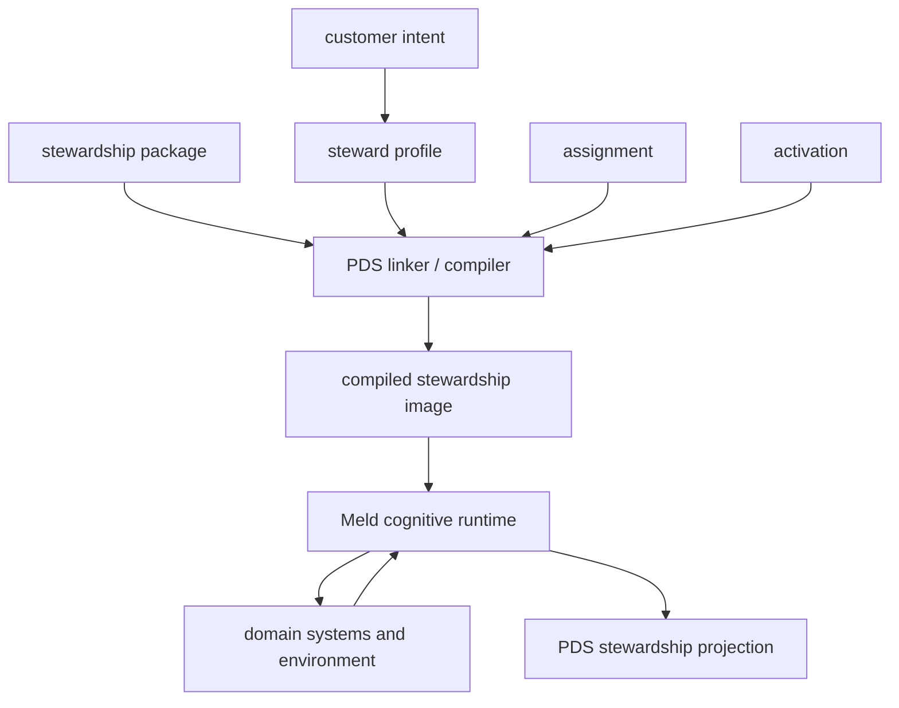

# Persistent Domain Stewardship

Date: 2026-08-18
Status: proposal corpus deferred from reconciliation delivery until runtime soft freeze
Scope: design options for a declarative application layer configuring persistent, evidence-grounded stewardship over bounded domains

> This directory is a proposal corpus rather than an accepted implementation contract. Read [Proposal Status And Decision Semantics](proposal_status.md) and [Proposal Index](proposal_index.md) before interpreting concrete schemas or requirements as final.

> The semantic boundary between PDS and Meld cognition is canonical in [Persistent Domain Stewardship](../cognitive_architecture/persistent_domain_stewardship.md). Proposals in this directory may explore upper-layer syntax and mechanics but may not broaden that boundary.

> Current branch work is governed by [Canonical Flywheel Alignment And Runtime Soft Freeze](../plan/architecture_overhauls/world_model_knowledge_traversal/flywheel_remediation.md). This proposal corpus and its recorded use cases are preserved for subsequent PDS design. They do not select reconciliation work or override the canonical runtime hosting boundary. Concrete proposal schemas remain exploratory.

## Thesis

Meld is not itself a persistent domain steward.

Meld is the runtime that can host persistent domain stewards.

The current working decomposition is:

```text
Meld cognitive runtime
    + stewardship package
    + steward profile
    + stewardship assignment
    + stewardship activation
    + persistent runtime state
```

The cognitive runtime defines **how** observation, temporal integration, belief revision, goal curation, planning, execution, and outcome publication operate.

A stewardship package links the stable operational domain semantics available to a steward family. It does not contain every runtime input used to realize that meaning.

A steward profile exposes a smaller customer-facing surface for intent, scope, sensitivity, autonomy, budget, escalation, and verification.

An assignment binds a profile to a principal, scope, requested authority, and grant lineage.

An activation binds the assignment to sensors, connectors, credentials, providers, capabilities, runtime placement, and quotas.

These layers remain proposed. A first implementation may combine assignment and activation while preserving their conceptual distinction.



[`meld-lang`](../cognitive_architecture/meld-lang/README.md) remains the shared runtime intermediate representation for propositions, goals, operators, effects, methods, and world state.

[World Model Strategy](../cognitive_architecture/world_model/strategy/README.md) is the authoritative runtime boundary for turning a Goal, current graph-shaped projection, complete active Capability catalog, separately admitted Methods, Agent policy, and authority context into candidate Compositions. PDS supplies correctness, evidence, maintained-condition, constraint, outcome-interpretation, and governance meaning to native Meld owners. PDS does not own Capability vocabulary, episode-specific Strategy decisions, generated Compositions, or Task Network state.

[Directive Grounding](../cognitive_architecture/world_model/agent/directive_grounding.md) is the authoritative runtime boundary that applies maintained PDS belief-family declarations to trusted graph scope. PDS declares which questions can exist. Meld grounds those declarations into concrete belief keys and reconciles their answers.

[Runtime Lifecycle And Quiescence](../cognitive_architecture/runtime_lifecycle_and_quiescence.md) is the authoritative lifetime boundary for active idle, quiescence, fencing, participant incarnation, recovery, and shutdown. PDS activation supplies an exact participant plan and coordinates owner ports without moving domain safe-point or wake meaning into the router.

Sensors and capabilities remain executable adapters at domain boundaries.

## Proposal Posture

This module distinguishes:

- **constraints** inherited from Meld's existing architecture;
- **hypotheses** being tested;
- **options** with different tradeoffs;
- **recommendations** based on current evidence;
- **open decisions** requiring experiments;
- **illustrative examples** that do not freeze schemas.

Concrete Rust types, YAML, state machines, and crate layouts are proposed unless explicitly identified as existing contracts.

The current recommendations are:

- treat PDS as a control-plane meta-domain rather than a second cognitive runtime;
- explore federated domain-owned facets instead of assuming one universal PDS schema;
- preserve a small customer-facing profile above the full package model;
- reuse existing cognitive-runtime authorities;
- use workflows as compatibility methods where appropriate;
- preserve documentation freshness as the parity consumer, prove the common attachment path with dependency security, then test one non-software steward;
- preserve portable domain contracts across linked, subprocess, sidecar, remote-service, and persistent-controller activation placements.

See [Proposal Status](proposal_status.md), [Meta-Domain](meta_domain.md), and [Open Decisions](open_decisions.md).

## Why This Module Exists

The cognitive architecture has extensive design and implementation direction for the runtime loop:

```text
observe
→ event history
→ graph and belief
→ perspective and goal curation
→ planning and execution
→ outcome publication
```

It does not yet provide one user-facing application model declaring:

- the bounded domain being stewarded;
- the customer intent and selected profile;
- the domain vocabulary and identity rules;
- observations and projections;
- belief families;
- standing responsibilities;
- observation and intervention possibilities;
- authority and approvals;
- verification and escalation;
- package, assignment, activation, and runtime lineage.

Those concerns currently appear across belief-family configuration, Agent directives, workflow profiles, task packages, capabilities, prompts, physical runtime configuration, and execution policy.

Persistent Domain Stewardship explores the composition layer that can connect them without absorbing their domain authority.

## Location And Naming

This module is a sibling of `cognitive_architecture` rather than a child.

That separation reflects the current hypothesis:

- `cognitive_architecture` defines runtime authorities and mechanics;
- `persistent_domain_stewardship` defines application, profile, linking, activation, and inspection options above those authorities.

A future rename from `cognitive_architecture` to `cognitive_runtime` remains compatible but should be a separate decision and mechanical change.

## Persistent Domain Steward

A persistent domain steward is an evidence-grounded, policy-bounded controller responsible for maintaining conditions over a domain for an indefinite horizon.

It differs from a workflow because responsibility survives completion of one execution.

It differs from a reconciler because state may be incomplete, stale, contradictory, or perspective-dependent.

It differs from a monitor because it may acquire evidence and initiate bounded interventions.

It differs from a general agent because mandate, scope, authority, and outcome semantics are explicit.

```text
standing mandate remains active
    ↓
domain evidence changes or becomes stale
    ↓
belief revision
    ↓
act / tolerate / observe / escalate
    ↓
stewardship episode opens or is projected
    ↓
goals and task-network work
    ↓
outcome evidence
    ↓
desired region restored, tolerated, failed, or escalated
    ↓
episode closes
    ↓
standing mandate remains active
```

Installed maintained-condition meaning and evaluation are Agent-owned. Whether a principal-facing stewardship objective needs only declaration lineage and projection or also needs separate PDS coordination remains open. Episode ownership also remains open.

## Qualification

A use case is stewardship-shaped when most of the following are true:

| Property | Requirement |
|---|---|
| Bounded domain | Subjects, relationships, and responsibility can be scoped |
| Persistent mandate | Responsibility remains after one task completes |
| Independent change | The domain changes while the steward is idle |
| Partial observability | Current state must be inferred from evidence |
| Standing objectives | Conditions should remain within acceptable regions |
| Observation choices | Additional evidence can be acquired selectively |
| Intervention choices | More than one response may be available |
| Action economics | Acting and not acting carry variable cost or risk |
| Outcome feedback | Later observations can evaluate intervention effects |
| Bounded authority | Permissions, budgets, approvals, and prohibitions are explicit |
| Temporal continuity | Prior evidence, decisions, and outcomes remain relevant |
| Audit value | Reconstructing why the steward acted matters |

A deterministic controller, workflow, scheduler, optimizer, or tool call remains the mandatory baseline.

Meld is justified only when world-model, uncertainty, perspective, persistent context, or adaptive-decision machinery measurably improves the result.

See [Use-Case Decomposition](use_case_decomposition.md).

## Abstraction Layers

## Stewardship package

Expert-authored operational domain theory. Depending on the selected meta-domain option, it may be one central schema or a linked set of domain-owned facets.

## Steward profile

Customer-facing declaration of:

```text
steward type
+ scope
+ desired conditions
+ sensitivity
+ autonomy
+ budget
+ escalation
+ verification
```

See [Profile Abstraction](profile_abstraction.md).

## Stewardship assignment

Normative binding of profile, principal, concrete scope, requested authority, grant lineage, and lifecycle.

## Stewardship activation

Physical binding of sensors, connectors, credentials, providers, capability implementations, runtime placement, and operational quotas.

## Compiled stewardship image

Content-addressed linked representation containing resolved package semantics, profile selections, domain facets, activation requirements, and lineage. It does not freeze an activation-local capability catalog, Strategy Method snapshot, construction policy, projection request, search controls, or current authority decision.

## Stewardship projection

User-facing correlation of objective, belief, decision, work, outcome, and verification state. It should not duplicate authoritative domain truth.

## Meta-Domain Options

The proposal compares:

1. a central PDS-owned package schema;
2. federated domain-owned stewardship facets linked by PDS;
3. root `meld` product composition without an independent PDS domain;
4. a rejected PDS runtime-orchestrator model.

The current recommendation is routed domain-owned fragments with one small structural package envelope. Documentation freshness is the existing parity consumer. The bounded dependency-security slice is the authorized next proof, while full second-expression completion remains design-gated.

See [Meta-Domain](meta_domain.md), [Facet Protocol](facet_protocol.md), and [Assessment By Domain](assessment_by_domain.md).

## Relationship To Existing Architecture

PDS does not create new event, world-model, Agent, execution, or capability authority.

| PDS concern | Candidate runtime owner |
|---|---|
| package, profile, assignment, activation, linking | proposed PDS control plane with root adapters |
| promoted observation semantics | source/sensory domain |
| canonical event append and replay | `meld-events` |
| graph projection and state | world-model graph |
| evidence, belief, revisions, projection | world-model belief |
| perspective and normative evaluation | world-model Agent |
| propositions, goals, operators, methods | `meld-lang` |
| semantic candidate construction | world-model Strategy |
| Strategy decision authorization | world-model Agent |
| Goal lifecycle, operational planning, task network, dispatch | execution |
| capability invocation | capability/execution |
| outcome evidence meaning | source/world-model/Agent facets |
| authority grant | external or runtime governance |
| authority enforcement | Agent judgment, Strategy eligibility, Execution resolution and dispatch |
| unified stewardship status | PDS projection over domain truth |

See [Runtime Anchor Map](runtime_anchor_map.md).

## Package Versus Runtime State

A package or compiled image may contain types, rules, contracts, templates, links, presets, and tests.

It should not become the source of truth for:

- current observations;
- graph anchors;
- belief revisions;
- Agent decisions;
- active goals;
- task-network state;
- execution attempts;
- approvals;
- measured outcomes.

Those remain domain-owned runtime state.

## Design Axioms

The following are current proposal constraints or recommendations.

1. **Packages declare responsibility, not procedural control flow.**  
   Known Methods may be admitted separately by Strategy, but the customer profile is not a workflow program.

2. **Standing objectives are distinct from transient goals.**  
   Agent owns installed maintained-condition evaluation. Upper-layer declaration, projection, and any proven coordination state remain separate questions.

3. **Belief is distinct from preference.**  
   Belief families are epistemic; concern bindings are normative.

4. **Expected effects are distinct from verified outcomes.**  
   Task success need not restore a stewardship objective.

5. **Authority is distinct from capability.**  
   An assignment requests authority; it does not grant it.

6. **Adapters remain executable code.**  
   Package or facet declarations reference sensors, comparators, capabilities, and evaluators through typed contracts.

7. **Source systems retain authority.**  
   PDS canonicalizes application identity, linking, activation, lineage, and user projection rather than every domain fact.

8. **Runtime vocabulary may remain open while authoring is validated.**

9. **Replay binds to exact semantics and activation identity.**

10. **A simpler baseline is mandatory.**

11. **PDS is a control plane, not the cognitive data plane.**

12. **Domain integration is optional.**  
    A truthful result may be no PDS integration.

13. **Runtime placement is not semantic authority.**
    Package meaning remains stable across supported placements, while activation states the required binding, sharing, failure, resource, effect, and admission isolation.

14. **External results remain untrusted until owner admission.**
    Transport success, process success, and service callbacks require assignment, activation-generation, operation or delivery, source, and domain validation before they become canonical products.

## Implemented Runtime Antecedent And Next Proof

Documentation freshness is the implemented runtime antecedent and the parity consumer for the proposed router migration.

```text
package:
    software documentation steward

profile:
    selected workspace scope
    balanced sensitivity
    draft or generated-artifact autonomy

assignment:
    repository owner
    workspace subtree
    bounded authority

activation:
    workspace source
    event and world-model stores
    provider and capability bindings
    task network and supervisor

belief:
    content_freshness

strategy:
    installed docs strategy theory

capabilities:
    five exact docs capability contracts

outcome:
    verification evidence updates belief
    Agent evaluates restoration
```

The delivered expression already runs through existing cognitive-runtime contracts without a PDS planner or executor. The authorized next proof is the bounded dependency-security truth and lifecycle slice, whose external source, bounded negative evidence, provider-free behavior, and result-admission needs are deliberately dissimilar from documentation freshness.

Further PDS delivery planning is not authorized while the proposal is reconciled with Meld's native Capability and Task substrate, graph-addressed epistemic substrate, and Agent control loop. See [Current Architecture Overhauls](../plan/README.md).

## Upper-Layer Promotion Criteria

The declaration and profile proposal is ready to become authoritative when:

- documentation freshness migrates through the generic package and activation path with parity;
- dependency security does not require PDS kernel changes;
- customer profiles prove materially simpler than full package source;
- principal-facing objective and episode projection needs are resolved;
- domain ownership remains explicit;
- current authority enforcement remains intact and any upper-layer approval needs are demonstrated;
- package upgrade and exact-hash replay are demonstrated;
- workflow migration value is measured rather than assumed.

See [Evaluation Plan](evaluation_plan.md).

## Non-Goals

This proposal does not currently define:

- a universal ontology;
- a final source language;
- a final crate layout;
- a new event ledger;
- a new belief engine;
- a new planner;
- a new task executor;
- a general-purpose workflow language;
- autonomous authority expansion;
- a requirement that every application be a steward;
- a final answer for principal-facing objective projection, episode coordination, context-projection, or advanced governance ownership.

## Documents

Start with [Proposal Index](proposal_index.md).

- [Proposal Status And Decision Semantics](proposal_status.md)
- [PDS Meta-Domain](meta_domain.md)
- [Historical Proposal Assessment By Domain](assessment_by_domain.md)
- [Persistent Domain Stewardship Architectural Invariants](architectural_invariants.md)
- [PDS Isolation And Runtime Portability](isolation_and_runtime_portability.md)
- [PDS Example Router Corpus](examples/README.md)
- [Theory Router Synthesis Across PDS Examples](examples/theory_router_synthesis.md)
- [Steward Profile Abstraction](profile_abstraction.md)
- [Stewardship Facet Protocol](facet_protocol.md)
- [Stewardship Package Model](package_model.md)
- [Runtime Anchor Map](runtime_anchor_map.md)
- [Candidate Implementation Requirements](candidate_implementation_requirements.md)
- [Use-Case Decomposition](use_case_decomposition.md)
- [Workflow Migration](workflow_migration.md)
- [Open Decisions](open_decisions.md)
- [Evaluation Plan](evaluation_plan.md)
- [Canonical Cognitive Architecture](../cognitive_architecture/README.md)
- [World Model Reconciliation](../plan/architecture_overhauls/world_model_knowledge_traversal/README.md)
- [Software Quality Example](examples/software_quality.md)
- [Software Quality Profile Example](examples/software_quality_profile.md)

## Read With

- [Cognitive Architecture](../cognitive_architecture/README.md)
- [Observe Merge Push](../ideas/observe_merge_push.md)
- [Sensory](../cognitive_architecture/sensory/README.md)
- [Belief Families](../cognitive_architecture/world_model/belief/belief_families.md)
- [World Model Agent](../cognitive_architecture/world_model/agent/README.md)
- [Goal Curation](../cognitive_architecture/world_model/agent/goal_curation.md)
- [Meld Lang](../cognitive_architecture/meld-lang/README.md)
- [Execution](../cognitive_architecture/execution/README.md)
- [Docs Writer Package](../completed/capabilities/task/docs_writer_package.md)
