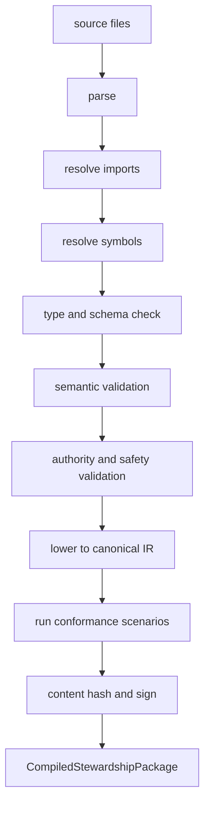

# Stewardship Package Model

Date: 2026-07-14  
Status: proposed  
Scope: declarative source representation, compilation, loading, and lifecycle for persistent domain stewardship packages

## Thesis

A stewardship package is a versioned, declarative operational domain theory.

It tells Meld:

```text
what exists
what can be observed
what can be believed
what should be maintained
what can be done
how results are verified
what authority constrains action
```

It does not tell Meld how to persist events, revise beliefs, schedule tasks, retry work, or execute capabilities. Those are cognitive-runtime responsibilities.

```text
package source
    ↓ compile
CompiledStewardshipPackage
    ↓ bind to scope and principal
StewardshipAssignment
    ↓ run
Meld cognitive runtime
```

The package is the declarative program. `meld-lang` is the shared runtime intermediate representation. Meld is the persistent machine.

## Representation Layers

The design distinguishes three representations.

### Source bundle

Human-authored, modular declarations. The initial source format should be typed YAML or JSON backed by serializable Rust structures.

A custom language is deferred until several dissimilar packages demonstrate repeated authoring problems that schema tooling cannot solve.

### Compiled stewardship package

A canonical, content-addressed representation produced by the package compiler.

It contains:

- resolved imports and symbols
- normalized object, relation, dimension, artifact, and unit declarations
- validated observation and evidence routes
- compiled belief-family registrations
- steward templates and objective templates
- lowered `meld-lang` propositions, operators, effects, and methods
- outcome-verification routes
- authority requirements and governance constraints
- package provenance and conformance-test results

Only compiled packages may be instantiated.

### Runtime state

Live state created after a package is assigned:

- concrete subject scope
- observations and facts
- graph anchors
- evidence and belief revisions
- stewardship episodes
- goals and task-network state
- execution attempts
- approvals
- measured outcomes
- learned cost and value beliefs

Runtime state references the compiled package hash. It is never written back into the immutable package.

## Package Composition

A source bundle is composed from independent modules:

```text
StewardshipBundle
├── manifest and imports
├── domain modules
├── observation modules
├── belief modules
├── steward charters
├── action modules
├── outcome modules
├── governance modules
└── scenario modules
```

Conceptual Rust shape:

```rust
struct StewardshipBundleSpec {
    manifest: PackageManifestSpec,
    imports: Vec<PackageImportSpec>,
    domains: Vec<DomainModuleSpec>,
    observations: Vec<ObservationModuleSpec>,
    beliefs: Vec<BeliefModuleSpec>,
    charters: Vec<StewardCharterSpec>,
    actions: Vec<ActionModuleSpec>,
    outcomes: Vec<OutcomeModuleSpec>,
    governance: Vec<GovernanceModuleSpec>,
    scenarios: Vec<ScenarioModuleSpec>,
}
```

The exact source schema is intentionally not frozen by this document.

## Manifest And Imports

The manifest establishes package identity and compatibility.

```rust
struct PackageManifestSpec {
    package_id: PackageId,
    version: SemanticVersion,
    schema_version: SchemaVersion,
    description: String,
    runtime_compatibility: RuntimeCompatibility,
}
```

Imports are explicit and version-constrained:

```yaml
imports:
  - package: software.core
    version: "^1.2"
  - package: software.git-observations
    version: "1.0.3"
  - package: software.task-capabilities
    version: "^2"
```

Compilation resolves imports to exact content hashes. Floating imports are not permitted at runtime.

A compiled package records:

- source package id and version
- exact imported package hashes
- compiler version
- runtime schema version
- canonical package hash

## Domain Module

The domain module defines declarative vocabulary, not current state.

```rust
struct DomainModuleSpec {
    module_id: ModuleId,
    object_types: Vec<ObjectTypeSpec>,
    relation_types: Vec<RelationTypeSpec>,
    attribute_types: Vec<AttributeTypeSpec>,
    artifact_types: Vec<ArtifactTypeSpec>,
    belief_dimensions: Vec<BeliefDimensionSpec>,
    scope_types: Vec<ScopeTypeSpec>,
}
```

### Object types

An object type declares:

- stable type id
- identity strategy
- optional external system of record
- lifecycle semantics
- allowed attributes
- default security classification

```yaml
object_types:
  - id: software.module
    identity:
      strategy: external_key
      source: workspace.node_id
    lifecycle:
      created_by: sensory.workspace.node_discovered
      retired_by: sensory.workspace.node_removed
```

### Relation types

A relation type declares legal endpoints and temporal behavior.

```yaml
relation_types:
  - id: software.depends_on
    from: software.module
    to: software.module
    cardinality: many_to_many
    temporal: bitemporal
```

The runtime may continue to encode type identifiers as strings. Package compilation supplies type safety over those identifiers.

### Attributes and units

Numeric values require value types and units.

```yaml
attributes:
  - id: performance.latency_p95
    subject: software.service
    value_type: duration
    unit: millisecond
```

A condition comparing milliseconds with bytes must fail compilation.

### Belief dimensions

A dimension declaration defines the value projected into planner-facing state.

```yaml
belief_dimensions:
  - id: test.health
    subject: software.module
    value_type: probability
    semantics: probability_healthy
```

The dimension does not define evidence or inference. Those belong to the belief module.

### Artifact types

Artifact types define typed values exchanged by capabilities and methods.

```yaml
artifact_types:
  - id: software.test_report
    schema: schemas/test_report.v1.json
```

Artifact schemas are part of package compatibility.

## Observation Module

Observation modules bind promoted sensory events to domain semantics.

```rust
struct ObservationModuleSpec {
    module_id: ModuleId,
    required_sensors: Vec<SensorRequirementSpec>,
    event_schemas: Vec<EventSchemaSpec>,
    fact_projections: Vec<FactProjectionSpec>,
    graph_projections: Vec<GraphProjectionSpec>,
    evidence_mappings: Vec<EvidenceMappingSpec>,
}
```

The module does not implement sensor workers. It declares:

- required promoted observation schema
- subject extraction and identity resolution
- fact and graph projection
- belief evidence mapping
- provenance and security propagation
- event-time and freshness semantics

```yaml
observations:
  - id: software.git.file_changed
    requires:
      sensor: sensory.git
      event_schema: git.file_changed.v1

    subject:
      object_type: software.file
      identity_from: payload.path

    graph:
      upsert_anchor: true

    evidence:
      - belief_family: content.freshness
        schema: source_churn.v1
        payload:
          lines_added: $.lines_added
          lines_removed: $.lines_removed
```

Raw high-volume signals remain inside sensory lanes. Packages consume promoted semantic observations.

## Belief Module

Belief modules define epistemic concern families.

```rust
struct BeliefFamilySpec {
    family_id: BeliefFamilyId,
    subject_type: ObjectTypeId,
    dimension: BeliefDimensionId,
    question: String,
    evidence_schemas: Vec<EvidenceSchemaSpec>,
    source_mappings: Vec<EvidenceSourceMappingSpec>,
    comparator: ComparatorBindingSpec,
    prior: PriorSpec,
    freshness: FreshnessPolicySpec,
    conflict: ConflictPolicySpec,
    planner_projection: PlannerProjectionSpec,
}
```

A belief family answers:

```text
What should this perspective currently believe about this subject and dimension?
```

It does not answer:

```text
Does this steward want the state to change?
```

### Epistemic and normative separation

Persistent stewardship requires a boundary between shared belief semantics and steward-specific policy:

```text
BeliefFamilySpec
    epistemic semantics shared by consuming perspectives

StewardConcernBinding
    objective, tolerance, inaction cost, observation policy,
    action classes, and value policy for one charter
```

This permits several stewards to consume the same belief family differently.

```text
api.stability belief
    security steward: low tolerance for uncertainty
    product steward: accepts temporary instability during experiment
    compatibility steward: requires migration evidence before action
```

No belief-family duplication is required.

## Steward Charter

A charter declares a reusable stewardship role.

```rust
struct StewardCharterSpec {
    charter_id: CharterId,
    perspective: PerspectiveProfileSpec,
    scope: ScopeTemplateSpec,
    concerns: Vec<StewardConcernBindingSpec>,
    lifecycle: StewardLifecyclePolicySpec,
    authority_requirements: AuthorityRequirementSpec,
    escalation: EscalationPolicySpec,
}
```

### Perspective

The perspective is lowered into the world-model Agent profile. It declares:

- trust profile
- evidence admissibility
- observation and branch scope
- uncertainty tolerance defaults
- regime sensitivity
- planner-projection requirements

### Scope template

A scope template describes valid assignment parameters.

```yaml
scope:
  root_type: software.workspace
  selector_parameters:
    - name: path_prefix
      value_type: path
```

The assignment supplies concrete values.

### Concern binding

A concern binding connects one belief family to one standing objective.

```rust
struct StewardConcernBindingSpec {
    concern_id: ConcernId,
    belief_family: BeliefFamilyId,
    objective: StewardshipObjectiveSpec,
    act_tolerate_policy: ActToleratePolicySpec,
    observation_policy: ObservationPolicySpec,
    action_classes: Vec<ActionClassId>,
    cost_belief: Option<BeliefFamilyId>,
    value_belief: Option<BeliefFamilyId>,
}
```

### Standing objective

```rust
struct StewardshipObjectiveSpec {
    objective_id: ObjectiveId,
    desired: Proposition,
    breach: Proposition,
    restore: Proposition,
    evidence_freshness: Option<Duration>,
    hysteresis: Option<HysteresisPolicy>,
    stability_window: Option<StabilityWindow>,
    inaction_cost: Option<InactionCostPolicy>,
}
```

`desired`, `breach`, and `restore` lower to `meld-lang::Proposition`.

They may differ:

```text
breach:
    test.health below 0.80

restore:
    test.health above 0.95
    and belief evidence fresher than 1 hour
    and stable for 3 revisions
```

This prevents rapid goal oscillation.

### Directive handling

Free-form directives should not silently create live domain semantics.

Preferred flow:

```text
directive
    ↓
select declared steward template
    ↓
bind scope and parameters
    ↓
validate principal and authority
    ↓
create stewardship assignment
```

If no template satisfies the directive, Meld may open package-authoring or package-synthesis work. It should not immediately register arbitrary belief dimensions, objectives, or action policy from uncompiled prose.

## Stewardship Assignment

A charter is reusable declaration. An assignment binds it to a concrete principal and scope.

```rust
struct StewardshipAssignment {
    assignment_id: AssignmentId,
    package_hash: PackageHash,
    charter_id: CharterId,
    agent_id: AgentId,
    principal: PrincipalRef,
    scope: ScopeBinding,
    effective_authority: EffectiveAuthority,
    lifecycle: AssignmentLifecycle,
}
```

The first slice may use one Agent per assignment. Later designs may allow one Agent to host several assignments when perspective and governance are compatible.

## Stewardship Episode

A standing objective can diverge repeatedly. Each divergence creates an episode.

```rust
struct StewardshipEpisode {
    episode_id: EpisodeId,
    assignment_id: AssignmentId,
    objective_id: ObjectiveId,
    opened_at_seq: u64,
    trigger_refs: Vec<DomainObjectRef>,
    active_goal_ids: Vec<GoalId>,
    status: EpisodeStatus,
    closed_at_seq: Option<u64>,
    closure: Option<EpisodeClosure>,
}
```

Suggested states:

```text
Open
Observing
Acting
Verifying
Restored
Tolerated
Escalated
Abandoned
Failed
```

Episode state is not goal state. One episode may contain several observation goals, failed methods, an approval, and multiple verification windows.

```text
Assignment persists
Objective persists
Episodes recur
Goals come and go
Tasks come and go
```

## Action Module

Action modules define the operational vocabulary available to planning.

```rust
struct ActionModuleSpec {
    module_id: ModuleId,
    operators: Vec<OperatorSpec>,
    methods: Vec<MethodSpec>,
    capability_requirements: Vec<CapabilityRequirementSpec>,
    resource_claims: Vec<ResourceClaimSpec>,
    compensation: Vec<CompensationSpec>,
}
```

### Operators

Operators lower to `meld-lang::Operator` and declare:

- preconditions
- expected effects
- cost estimate or cost-belief reference
- capability-resolution constraints
- required authority class
- observation or intervention classification

### Methods

Methods lower to `meld-lang::Method`.

A method is a reusable decomposition, not the standing stewardship program. Current workflows may be imported as methods during migration.

### Observation actions

Observation is an action when it consumes time, money, compute, user attention, or risk.

Examples:

- run a benchmark
- execute selected tests
- scout a game region
- ask a learner a diagnostic question
- retrieve a filing
- query production traces

Observation actions produce typed evidence artifacts and semantic events.

### Intervention actions

Interventions attempt to change the domain:

- create a patch
- change service capacity
- schedule a lesson
- allocate game-faction resources
- propose or execute a portfolio rebalance

### Compensation

High-impact actions should declare rollback, compensation, safe checkpoints, or escalation requirements. The compiler cannot prove real-world reversibility, but it can require the declaration.

## Outcome Module

Planner effects are predictions. Outcome contracts define how actual effects become evidence.

```rust
struct OutcomeContractSpec {
    outcome_id: OutcomeId,
    action_class: ActionClassId,
    expected_effects: Vec<Effect>,
    verification_observations: Vec<ObservationRequirementSpec>,
    evaluation_window: EvaluationWindowSpec,
    success: Proposition,
    partial_success: Option<Proposition>,
    failure: Proposition,
    harmful: Option<Proposition>,
    evaluator: EvaluatorBindingSpec,
    attribution: AttributionPolicySpec,
}
```

```yaml
outcomes:
  - id: performance.optimization_verified
    action_class: software.optimize_performance

    verification:
      observations:
        - performance.benchmark_completed
        - software.test_run_completed
      window: 30m

    success:
      all:
        - holds: performance.latency_p95
          condition: below_baseline_by
          value: 5%
        - holds: test.health
          condition: above
          value: 0.95

    evaluator:
      independence: different_capability_instance
```

The outcome contract closes the loop:

```text
action completed
    ≠ objective restored

verification observations
    → new evidence
    → belief revision
    → proposition evaluation
    → objective restored, tolerated, or still breached
```

## Governance Module

Governance is enforced independently of planning.

```rust
struct GovernanceModuleSpec {
    module_id: ModuleId,
    authority_classes: Vec<AuthorityClassSpec>,
    approval_policies: Vec<ApprovalPolicySpec>,
    budgets: Vec<BudgetPolicySpec>,
    rate_limits: Vec<RateLimitPolicySpec>,
    prohibitions: Vec<ProhibitionSpec>,
    audit_requirements: Vec<AuditRequirementSpec>,
}
```

Suggested authority classes:

```text
Observe
Recommend
Draft
ExecuteReversible
ExecuteBounded
ExecutePrivileged
Prohibited
```

Effective authority is the intersection of:

```text
package requested authority
∩ assignment principal grant
∩ runtime policy
∩ current regime restrictions
```

A package can never expand authority. The planner filters on authority, and dispatch enforces the same rule again.

## Scenario Module

Scenarios are package-level conformance tests.

```rust
struct ScenarioModuleSpec {
    scenario_id: ScenarioId,
    initial_events: Vec<EventFixture>,
    expected_graph: Vec<GraphExpectation>,
    expected_beliefs: Vec<BeliefExpectation>,
    expected_episodes: Vec<EpisodeExpectation>,
    expected_goals: Vec<GoalExpectation>,
    allowed_actions: Vec<ActionExpectation>,
    forbidden_actions: Vec<ActionExpectation>,
    expected_outcomes: Vec<OutcomeExpectation>,
}
```

Required scenario classes:

- nominal restoration
- no-action tolerance
- insufficient evidence
- contradictory evidence
- stale evidence
- unavailable capability
- denied authority
- failed action
- harmful or regressive outcome
- external restoration
- exact-hash replay
- package upgrade and migration

A package without conformance scenarios should not be production-loadable.

## Package Compiler



Compilation stages:

1. Parse source files.
2. Resolve imports to exact versions and hashes.
3. Construct namespace and symbol tables.
4. Validate object, relation, dimension, artifact, and unit types.
5. Validate event, evidence, and graph-projection routes.
6. Validate belief-family semantics and comparator bindings.
7. Lower objectives, operators, effects, and methods to `meld-lang`.
8. Validate authority, budgets, compensation, and outcome closure.
9. Validate reachability from observations to beliefs to objectives to actions to outcomes.
10. Run scenarios against a deterministic test runtime.
11. Emit canonical IR and package hash.

### Required static failures

Compilation must fail when:

- a referenced symbol is undeclared
- relation endpoints are incompatible
- an evidence mapping targets an incompatible schema
- a dimension receives an invalid value type or unit
- a comparator implementation is unavailable
- an objective references no observable belief
- breach or restore semantics are absent
- no observation or intervention path can affect a required proposition
- a method references unavailable artifact contracts
- an action requires undeclared authority
- an autonomous action has no outcome contract
- an irreversible action has neither approval nor compensation
- an outcome has no verification observation
- package versions are incompatible
- a scenario permits an explicitly prohibited action
- canonical output cannot be reproduced from the same source and imports

### Warnings

The compiler may warn when:

- cost or value beliefs use uncalibrated priors
- a concern has no observation action for resolving uncertainty
- a restore threshold lacks hysteresis
- an attribution window is unusually broad
- a method is reachable only through semantic synthesis
- requested authority is broader than common deployment profiles
- two objectives appear to induce opposing effects

Warnings remain machine-readable and visible through inspection commands.

## Canonical Intermediate Representation

The canonical IR must be:

- deterministic
- schema-versioned
- serializable
- content-addressed
- independent of source-file layout and formatting
- suitable for signing
- inspectable through CLI
- loadable without invoking an LLM

```rust
struct CompiledStewardshipPackage {
    identity: CompiledPackageIdentity,
    domain_registry: CompiledDomainRegistry,
    observation_plan: CompiledObservationPlan,
    belief_registry: CompiledBeliefRegistry,
    steward_templates: Vec<CompiledStewardTemplate>,
    action_registry: CompiledActionRegistry,
    outcome_registry: CompiledOutcomeRegistry,
    governance: CompiledGovernancePlan,
    scenarios: CompiledScenarioIndex,
    provenance: CompilationProvenance,
}
```

The IR may retain source locations for diagnostics, but source location is not part of semantic identity.

## Runtime Registration

Loading a compiled package coordinates registration with existing authorities:

```text
domain registry
    → identity and graph-projection validation

observation plan
    → sensory and event-route registration

belief registry
    → belief-family registry

steward templates
    → assignment service and Agent bootstrap

action registry
    → method library and capability-query metadata

outcome registry
    → event-to-evaluation routes

governance
    → policy enforcement and approval service
```

The package loader does not reimplement those domains.

## Package Upgrade

Package upgrades distinguish:

- additive vocabulary changes
- comparator or prior changes
- objective changes
- authority changes
- method changes
- outcome-semantics changes
- destructive identity or schema changes

A running assignment does not silently follow a mutable package version.

```text
new package compiled
    ↓
compatibility and migration assessment
    ↓
assignment upgrade proposed
    ↓
required approval
    ↓
new package hash bound at a sequence boundary
    ↓
affected subscriptions, beliefs, objectives, and episodes reconciled
```

Historical revisions remain associated with the old package hash.

## Security And Trust

Packages are declarative, but they still control semantics and action selection.

Requirements include:

- signed or trusted package sources
- immutable compiled hashes
- least-privilege capability resolution
- no dynamic code execution in the package parser
- explicit plugin allowlists
- resource budgets
- provenance on prompts and model-backed adapters
- deterministic authority inspection
- denial-safe failure behavior

An LLM may assist package authoring or synthesis. It may not directly mutate a live package without compilation, scenario validation, and authorization.

## Illustrative Source Fragment

This fragment is illustrative, not a finalized schema.

```yaml
package:
  id: software.performance-steward
  version: 0.1.0
  schema_version: 1

imports:
  - package: software.core
    version: "^1"
  - package: software.git-observations
    version: "^1"
  - package: software.benchmark-actions
    version: "^1"

charters:
  - id: module-performance
    perspective:
      trust_profile: measured-benchmarks

    scope:
      root_type: software.module
      parameters:
        - module_ref

    concerns:
      - id: maintain-latency
        belief_family: performance.health

        objective:
          breach:
            holds:
              subject: $module_ref
              dimension: performance.health
              condition:
                below: 0.75

          restore:
            all:
              - holds:
                  subject: $module_ref
                  dimension: performance.health
                  condition:
                    above: 0.90
              - holds:
                  subject: $module_ref
                  dimension: performance.evidence_freshness
                  condition:
                    below_duration: 24h

          stability_window:
            revisions: 3

        actions:
          - performance.run_benchmark
          - performance.profile
          - performance.optimize

    authority:
      autonomous:
        - performance.run_benchmark
        - performance.profile
        - git.create_branch
        - pull_request.open_draft

      approval_required:
        - pull_request.merge
        - deployment.production
```

## Suggested Code Routing

The design does not require immediate crate extraction.

A likely eventual split is:

```text
meld-steward-spec
    source schemas and canonical package IR

meld-steward-compiler
    imports, symbol resolution, validation, lowering, hashing

meld
    package loading, assignment lifecycle, CLI, and runtime wiring
```

The first slice may live in root `meld` until the package model stabilizes.

Neither package crate should own event, belief, Agent, planning, task, or capability runtime authority.

## Inspectability Surface

Illustrative commands:

```text
meld stewardship package validate <path>
meld stewardship package compile <path>
meld stewardship package inspect <package>
meld stewardship assignment create <template> --scope <binding>
meld stewardship assignment inspect <assignment>
meld stewardship episode list <assignment>
meld stewardship episode explain <episode>
```

Inspection should show:

- exact package and import hashes
- requested and effective authority
- registered domain symbols
- observation and evidence routes
- belief families
- standing objectives
- open episodes and active goals
- selected methods
- outcome status
- compilation warnings

## Non-Goals

The package model is not:

- a universal domain ontology
- a graph-query language
- an arbitrary programming language
- a replacement for sensor or capability implementations
- a place to store live beliefs or tasks
- a direct authority grant
- a prompt-orchestration format
- a mechanism for bypassing `meld-lang`
- a requirement that every domain use Bayesian inference
