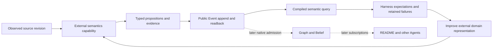

# Codebase semantics experiment

Status: active, exploratory. First slice: Tree-sitter to existing Meld propositions.

First slice result: bounded representation feasibility accepted. Thirteen source cases and public transport/lifecycle checks pass all 66 assertions with zero model calls. Existing `meld-lang` is sufficient for this selected syntax relationship. Native semantic admission, currentness, sensing and multi-agent consumption remain the next questions.

## Reason for the experiment

The README candidate proved a native maintenance loop and showed that explicit obligations and selected CPU verification can make Luna-low useful. Its consumers still interpret source for a single purpose. This experiment asks whether independently maintained code knowledge can become a shared input for documentation, architecture and other domain products.

The near-term outcome is narrower: establish whether Tree-sitter observations can be expressed as useful, grounded `meld-lang` propositions, carried through public Events and queried without rereading source. A serialized prose summary is insufficient. A successful Event append is transport evidence, not native belief or Agent satisfaction.

The larger hypothesis is that one source interpretation can support several independently authored judgments, remain current after changes and reduce repeated interpretation. Capability composition and persistent knowledge are the engineering motivation. No metaphysical claim, biological experiment or spontaneous intelligence is required for acceptance.

## Current ground and decisions

The accepted README evidence is in [qualification](../../../../../meld-readme/QUALIFICATION.md) and the [Gmail transfer](../../../../../meld-readme/projects/gmail-operator/README.md). The older research assessment of `fefe7b89` predates that acceptance. The 199-document corpus remains authored exploration, not installed maintenance coverage.

`meld-lang` already supplies typed objects, `Related`, `Holds`, compositions, unification and pure world-state evaluation. Owner publications supply provenance, revision scope, withdrawal and completeness. Agent subscriptions consume belief streams. These are foundations, not proof of the proposed cross-PDS path.

The current watcher contains Merkle rebuilding and legacy contextframe behavior. It is not automatically the canonical sensory route for this experiment. Reusing or replacing it requires an explicit caller and retirement account. The first probe takes explicit snapshots and leaves watcher integration for the next slice.

Keep the language small, pure and domain-neutral. Try existing terms before proposing extensions. Record a concrete unrepresentable relationship, its consumer and its evaluation semantics before changing the language. Domain predicate names, Rust interpretation and README relevance belong in external WADs.

## Hypotheses and outcomes

| Hypothesis | Observable evidence | Failure that matters |
| --- | --- | --- |
| Existing propositions can represent selected source relationships | Typed language roundtrip and CPU queries over Event-readback data | Meaning survives only in opaque prose or consumers must reparse source |
| Syntax can ground a useful first abstraction | Function, branch, condition and return relationships cite exact source spans | A syntactic negation becomes an unjustified null or behavioral claim |
| Revisions can distinguish changed meaning from changed bytes | Formatting preserves selected semantic identity; guard change alters it | Every byte change requires a new semantic interpretation |
| Unknown knowledge remains unknown | Malformed, unsupported or unavailable source cannot answer a negative factual query | Missing evidence becomes a false statement |
| Shared semantics can later support independent products | README and another PDS reuse the same admitted observation | Consumers repeat the original analysis or need a bespoke coordinator |

The first four hypotheses are the current slice. The fifth remains backlog until Event-to-owner admission and native belief projection have been exercised.

## Runtime, harness and WAD loop



Harness commands accept explicitly built executables, isolate workspace and product state, retain exact inputs and command outputs, and measure results. They never import domain implementation to fabricate a verdict, write Graph state or substitute a harness success for native satisfaction. Model calls are unnecessary for the first deterministic slice. When semantic model work becomes necessary, retain Luna-low as the experimental constraint.

The experimental domain lives at `~/meld-code-semantics`, independently of Meld and `meld-readme`. Its first executable is a local, non-publishable domain crate consuming the existing `meld-lang` and Event contracts. This is the bounded implementation of the user-authorized separate code-semantics domain, not a new core runtime component.

```text
meld-code-semantics/
├── README.md
├── ACTIVE_SLICE.md
├── Cargo.toml
├── src/
│   ├── main.rs
│   └── semantics/
│       ├── capture.rs
│       ├── extract.rs
│       └── query.rs
├── experiments/                 fixtures and independent expected outcomes
└── evidence/                    concise reports, not runtime stores
```

## Domain accounting

The domain universe is the four workspace crates and root domain directories. The affected set is external semantics, Events, language, workspace sensing and Eval. README is a future consumer. Runtime assembly, Agent, Curation, Belief, Strategy and Execution participate later and are retained in this slice. Existing store/tree infrastructure, provider, config, telemetry, context, metadata, prompt context, workflow, capability, task, branches, session, initialization, control/serve, theory, nonce, code-change and CLI adapters have no behavior change in the first slice.

| Concern | Existing seam | Disposition and write scope | Required evidence |
| --- | --- | --- | --- |
| Domain capture and interpretation | External executable boundary | New in `meld-code-semantics` | Exact revisions, syntax evidence, bounded grammar |
| Language representation and evaluation | `Proposition`, `WorldState`, `evaluate` | Retain in core; consume in domain | Typed query behavior and explicit gaps |
| Durable external authorship | `event append`, `event tail` | Retain | Exact readback, retry and restart |
| Harness execution | Public compiled-command journeys | Extend Eval with external domain command capture | Explicit binaries, failures retained, no private store access |
| Filesystem sensing | Watcher and Merkle snapshot paths | Retain; integration deferred | Initial/change/delete and missed-event recovery in a later slice |
| Semantic admission and belief | Owner publication, Curation and mapping contracts | Retain; integration deferred | Completeness and dependency invalidation must precede consumers |
| Multi-agent consumption | Native belief subscriptions | Retain; coordination deferred | Two independent consumers and one shared source basis |

An external Event carries a producer observation. It does not install executable code, promote itself to truth or authorize effects. Initial capture, changed capture and missing-path capture describe a selected snapshot. They do not yet implement durable reconciliation, deletion authorization or a live subscription.

## Boundaries and circuit breaker

Maturity is exploratory. Existing README acceptance must remain intact. No runtime-state writes under a target workspace. No new native planner, scheduler, Graph writer, evidence authority or private success path. No general source-language framework, new default background service, live executable replacement or automatic corpus rollout.

Missing syntax coverage is a domain gap. A harness visibility failure is an observability gap. A need for new generic language evaluation semantics must be demonstrated and reviewed as a bounded extension. Stop to reassess if progress requires competing native authorities or unsupported facts becoming accepted belief. The known long-call lease/drain concern remains open and is outside this CPU-only slice.

## Delivery and authorization

The user authorized repository cleanup and pushes, experiment design, fresh working branches and implementation with commits at natural checkpoints. Private `JerkyTreats/meld-eval` creation was separately confirmed. This satisfies the local push confirmation rule for these requested checkpoints. No release, tag, crates.io publication, release-capable workflow dispatch or merge to a release branch is authorized.

Meld, Eval and README start `feat/codebase-semantics` from their pushed checkpoints. Gmail's accepted README branch is pushed and remains outside implementation scope. Historical fixtures retain their recovered bytes, including existing whitespace, in a separate preservation commit.

The [active slice](../../../../../meld-code-semantics/ACTIVE_SLICE.md) owns detailed proof and staged reviews. After its closeout, the next work is native owner publication and currentness, then sensing, then README subscription and a second consumer. These are outcome backlog, not a frozen future implementation plan. Continued delivery is authorized by the user's request, subject to the circuit breaker and demonstrated scope.

If applied, this commit records the purpose, bounded hypotheses, domain boundaries and first representation experiment without extending the core language.

## First checkpoint reconciliation

The independent domain now supplies compiled `observe` and `query` commands. Eval supplies generic `artifact` capture. The final [slice evidence](../../../../../meld-code-semantics/ACTIVE_SLICE.md) establishes typed relationships, query without source access, semantic identity across formatting, changed-operand discrimination, uncertainty, exact Event retry/readback, restart and native shutdown. It does not install a semantics Agent or promote snapshots into Graph or Belief. The accepted native README product is unchanged.

Logical review, Style Assurance and bounded Gate Acceptance pass. No new core language variant or runtime source change was necessary. Registry dependencies are fixed by the external crate lockfile, and native and external executable hashes are retained. The next active implementation contract will address owner admission and scope currentness before watcher integration. The broader shared-semantics hypothesis remains exploratory.
