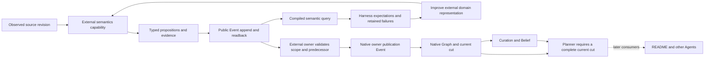

# Codebase semantics experiment

Status: active delivery, exploratory. Current slice: Agent WAD selection through native initialization.

First slice result: bounded representation feasibility accepted. Thirteen source cases and public transport/lifecycle checks pass all 66 assertions with zero model calls. Existing `meld-lang` is sufficient for this selected syntax relationship. The next slice has now exercised native admission and currentness. Sensing and multi-agent consumption remain open.

## Reason for the experiment

The README candidate proved a native maintenance loop and showed that explicit obligations and selected CPU verification can make Luna-low useful. Its consumers still interpret source for a single purpose. This experiment asks whether independently maintained code knowledge can become a shared input for documentation, architecture and other domain products.

The near-term outcome is narrower: establish whether Tree-sitter observations can be expressed as useful, grounded `meld-lang` propositions, carried through public Events and queried without rereading source. A serialized prose summary is insufficient. A successful Event append is transport evidence, not native belief or Agent satisfaction.

The larger hypothesis is that one source interpretation can support several independently authored judgments, remain current after changes and reduce repeated interpretation. Capability composition and persistent knowledge are the engineering motivation. No metaphysical claim, biological experiment or spontaneous intelligence is required for acceptance.

## Current ground and decisions

The accepted README evidence is in [qualification](../../../../../meld-readme/QUALIFICATION.md) and the [Gmail transfer](../../../../../meld-readme/projects/gmail-operator/README.md). The older research assessment of `fefe7b89` predates that acceptance. The 199-document corpus remains authored exploration, not installed maintenance coverage.

`meld-lang` already supplies typed objects, `Related`, `Holds`, compositions, unification and pure world-state evaluation. Owner publications supply provenance, revision scope, withdrawal and completeness. Agent subscriptions consume belief streams. These are foundations, not proof of the proposed cross-PDS path.

The current watcher contains Merkle rebuilding and legacy contextframe behavior. It is not automatically the canonical sensory route for this experiment. Reusing or replacing it requires an explicit caller and retirement account. The first probe takes explicit snapshots and leaves watcher integration for the next slice.

Keep the language small, pure and domain-neutral. Try existing terms before proposing extensions. Record a concrete unrepresentable relationship, its consumer and its evaluation semantics before changing the language. Domain predicate names, Rust interpretation and README relevance belong in external WADs.

## Hypotheses and outcomes

| Hypothesis | Observable evidence | Failure that matters |
| --- | --- | --- |
| Existing propositions can represent selected source relationships | Typed language roundtrip and CPU queries over Event-readback data | Meaning survives only in opaque prose or consumers must reparse source |
| Syntax can ground a useful first abstraction | Function, branch, condition and return relationships cite exact source spans | A syntactic negation becomes an unjustified null or behavioral claim |
| Revisions can distinguish changed meaning from changed bytes | Formatting preserves selected semantic identity; guard change alters it | Every byte change requires a new semantic interpretation |
| Unknown knowledge remains unknown | Malformed, unsupported or unavailable source cannot answer a negative factual query | Missing evidence becomes a false statement |
| Shared semantics can later support independent products | README and another PDS reuse the same admitted observation | Consumers repeat the original analysis or need a bespoke coordinator |

The first four hypotheses were the representation slice. The current admission slice tests whether those observations remain safely usable across replacement and uncertainty. The fifth hypothesis remains backlog.

## Runtime, harness and WAD loop



Harness commands accept explicitly built executables, isolate workspace and product state, retain exact inputs and command outputs, and measure results. They never import domain implementation to fabricate a verdict, write Graph state or substitute a harness success for native satisfaction. Model calls are unnecessary for the first deterministic slice. When semantic model work becomes necessary, retain Luna-low as the experimental constraint.

The experimental domain lives at `~/meld-code-semantics`, independently of Meld and `meld-readme`. Its first executable is a local, non-publishable domain crate consuming the existing `meld-lang` and Event contracts. This is the bounded implementation of the user-authorized separate code-semantics domain, not a new core runtime component.

```text
meld-code-semantics/
├── README.md
├── ACTIVE_SLICE.md
├── Cargo.toml
├── src/
│   ├── main.rs
│   ├── owner.rs
│   ├── owner/                   intake, publication, tick and lifecycle
│   └── semantics/
│       ├── capture.rs
│       ├── extract.rs
│       └── query.rs
├── theory/                      native PDS components and selected source standard
├── tools/build.py               compile package from explicit owner executable
├── experiments/                 fixtures and independent expected outcomes
└── evidence/                    concise reports, not runtime stores
```

## Domain accounting

The domain universe is the four workspace crates and root domain directories. The affected set is external semantics, Events, language, workspace sensing and Eval. README is a future consumer. Runtime assembly, Agent, Curation, Belief, Strategy and Execution participate later and are retained in this slice. Existing store/tree infrastructure, provider, config, telemetry, context, metadata, prompt context, workflow, capability, task, branches, session, initialization, control/serve, theory, nonce, code-change and CLI adapters have no behavior change in the first slice.

| Concern | Existing seam | Disposition and write scope | Required evidence |
| --- | --- | --- | --- |
| Domain capture and interpretation | External executable boundary | New in `meld-code-semantics` | Exact revisions, syntax evidence, bounded grammar |
| Language representation and evaluation | `Proposition`, `WorldState`, `evaluate` | Retain in core; consume in domain | Typed query behavior and explicit gaps |
| Durable external authorship | `event append`, `event tail` | Retain | Exact readback, retry and restart |
| Harness execution | Public compiled-command journeys | Extend Eval with external domain command capture | Explicit binaries, failures retained, no private store access |
| Filesystem sensing | Watcher and Merkle snapshot paths | Retain; integration deferred | Initial/change/delete and missed-event recovery in a later slice |
| Semantic admission and belief | Owner publication, Curation and mapping contracts | Retain; integration deferred | Completeness and dependency invalidation must precede consumers |
| Multi-agent consumption | Native belief subscriptions | Retain; coordination deferred | Two independent consumers and one shared source basis |

An external Event carries a producer observation. It does not install executable code, promote itself to truth or authorize effects. Initial capture, changed capture and missing-path capture describe a selected snapshot. They do not yet implement durable reconciliation, deletion authorization or a live subscription.

## Boundaries and circuit breaker

Maturity is exploratory. Existing README acceptance must remain intact. No runtime-state writes under a target workspace. No new native planner, scheduler, Graph writer, evidence authority or private success path. No general source-language framework, new default background service, live executable replacement or automatic corpus rollout.

Missing syntax coverage is a domain gap. A harness visibility failure is an observability gap. A need for new generic language evaluation semantics must be demonstrated and reviewed as a bounded extension. Stop to reassess if progress requires competing native authorities or unsupported facts becoming accepted belief. The known long-call lease/drain concern remains open and is outside this CPU-only slice.

## Delivery and authorization

The user authorized repository cleanup and pushes, experiment design, fresh working branches and implementation with commits at natural checkpoints. Private `JerkyTreats/meld-eval` creation was separately confirmed. This satisfies the local push confirmation rule for these requested checkpoints. No release, tag, crates.io publication, release-capable workflow dispatch or merge to a release branch is authorized.

Meld, Eval and README start `feat/codebase-semantics` from their pushed checkpoints. Gmail's accepted README branch is pushed and remains outside implementation scope. Historical fixtures retain their recovered bytes, including existing whitespace, in a separate preservation commit.

The [active slice](../../../../../meld-code-semantics/ACTIVE_SLICE.md) owns detailed proof and staged reviews. After its closeout, the next work is native owner publication and currentness, then sensing, then README subscription and a second consumer. These are outcome backlog, not a frozen future implementation plan. Continued delivery is authorized by the user's request, subject to the circuit breaker and demonstrated scope.

If applied, this commit records the purpose, bounded hypotheses, domain boundaries and first representation experiment without extending the core language.

## First checkpoint reconciliation

The independent domain now supplies compiled `observe` and `query` commands. Eval supplies generic `artifact` capture. The final [slice evidence](../../../../../meld-code-semantics/evidence/representation-v1/CLOSEOUT.md) establishes typed relationships, query without source access, semantic identity across formatting, changed-operand discrimination, uncertainty, exact Event retry/readback, restart and native shutdown. It does not install a semantics Agent or promote snapshots into Graph or Belief. The accepted native README product is unchanged.

Logical review, Style Assurance and bounded Gate Acceptance pass. No new core language variant or runtime source change was necessary. Registry dependencies are fixed by the external crate lockfile, and native and external executable hashes are retained. The next active implementation contract will address owner admission and scope currentness before watcher integration. The broader shared-semantics hypothesis remains exploratory.

## Native admission checkpoint

The external code-semantics owner now admits explicit snapshot contributions through Events. Its source standard, Tree-sitter interpretation, predecessor validation, duplicate handling, deletion confirmation and publication vocabulary remain outside Meld. Native Graph selects current scoped publications, Curation derives evidence, Belief retains judgments and the planner requires a complete current cut before it judges addressed work.

The source path is observed initially, replaced, queried with a changed operand, made unsupported, made malformed, made unreadable, restored, made unavailable and explicitly withdrawn. Stale predecessors, stale snapshots, false deletion and deletion with a missing parent are rejected. Exact Event retries and restart preserve the admitted revision. Live and offline Graph reads agree. No provider calls or executable capabilities are needed.

Three generic runtime gaps required bounded corrections. Prepared receipt resolution incorrectly required a nonempty executable catalog even though native package installation accepted observation-only theory. Empty exact catalogs are now valid; Strategy references still require exact installed contracts. The active `graph-owner-walk` command now forwards to its running store owner and accepts all owner-scope coordinates instead of attempting a second store lock or forcing null branch and perspective fields.

A stronger restart-during-uncertainty control exposed a separate concurrency bug: external Agent intake could change the lifecycle snapshot while it was being authored. The owner correctly refused that snapshot, but the supervisor terminated the entire run. Failed idle receipts now become recorded retryable tick issues, clear old waits and cannot establish idleness. Startup, safe-point and shutdown proof requirements remain strict. The probe also checks runtime failure Events, because a completed drain does not establish a successful runtime run.

A failed intermediate harness assertion treated historical `Satisfied` judgments as current. Public reconciliation and actor reports disproved that interpretation: the addressed request remains incomplete and the planner refuses `IncompleteTraversal`. The probe now tests request completion or a native refusal alongside the current Graph cut. Retaining historical Belief is not itself a currentness failure. Future consumers must preserve that cut requirement; raw belief subscriptions alone have not been qualified.

The current [active slice](../../../../../meld-code-semantics/ACTIVE_SLICE.md) records final candidate evidence and reviews. The final admission journey passes 62 checks; the earlier representation journey passes all 66 checks with the final binaries. The narrow native admission experiment is the checkpoint, not a completed sensory service or cross-Agent README product. No language extension, second Graph writer, planner or domain-specific runtime component was introduced.

## Automatic sensing activation

Native admission is accepted and pushed at Meld `a62e3776` and external domain `f3a2600`. The user explicitly authorized continued delivery and checkpoint pushes. The next observable gap is source changes entering Events without an explicit observation command.

The [active slice](../../../../../meld-code-semantics/ACTIVE_SLICE.md) uses the existing native observation participant to sample one configured Rust file, author contribution Events and reuse admission. This keeps domain policy external and native Graph authoritative. The separate legacy `meld watch` path retains its callers and Merkle behavior. Repository-wide Merkle sensing and downstream README materiality remain later outcomes. No new scheduler, service or language variant is planned.

## Automatic sensing checkpoint

The opt-in external source standard now causes native observation ticks to capture changes and submit durable contribution Events. Admission, Graph, Curation and addressed Agent judgment use the existing path. The [sensing evidence](../../../../../meld-code-semantics/evidence/sensing-v1/report.json) passes 88 checks, including initial absence and creation, formatting identity, changed operands, malformed source, unreadable paths, outside symlinks, missing parent, confirmed deletion, restoration, unchanged-event quietness and changes while stopped. Explicit admission retains 62 checks and representation retains 66.

No Meld runtime source edit was required. The owner retains one pending envelope in its existing atomic state until replay consumes it. Sampling is one selected file per native tick, with no OS watcher or repository-wide Merkle claim. Native judgment still establishes scope usability. The next gap is a downstream product consuming current code relationships to choose and verify a document update.

## Shared semantics consumer circuit breaker

Automatic sensing is committed and pushed at domain `bdb3a1d` and Meld ledger `945870db`. The next intended product behavior is two independently governed Agents: code-semantics maintains source knowledge, and README uses current relationships to decide and verify document changes. That experiment cannot currently be entered through the public product path.

The [harness boundary report](../../../../../meld-code-semantics/evidence/multi-agent-boundary/report.json) changes only the accepted package's Agent topology and its exact component digest. A second Agent position using the same supported theory is enough for `meld world init` to fail: the physical binding supplies one Agent. This is a confirmed public-command failure, with no model calls. The report does not pretend that two-Agent execution occurred.

Three implementation facts explain why this needs architectural reassessment rather than removing that guard. [Physical binding](../../../../src/config/stewardship/binding.rs) stores one Agent and one selected theory package. [World initialization](../../../../src/init/world/tooling.rs) binds one position; [genesis](../../../../src/init/world/pipeline.rs) resolves one maintained-condition revision before iterating positions. [Runtime assembly](../../../../src/runtime/assembly.rs) constructs standing Curation and Agent reconciliation from one composed binding's Agent. Product topology and assignment records can describe collections, but this execution path does not yet realize independent per-Agent contracts.

The external [owner callback contract](../../../../src/runtime/owners/contracts.rs) also lacks a native Graph read. That is likely a bounded public API extension by itself. It does not resolve Agent composition. Reading publication Events in README and choosing the current revision there would introduce a second currentness authority, violating this experiment's boundary.

### Bounded domain assessment

The domain universe remains the root source domains and workspace crates recorded earlier. The concern is independent Agent composition and current semantic consumption. No type-system, model, source-extraction or language expansion is involved.

| Domain or domain set | Needed relationship | Current ground and consequence |
| --- | --- | --- |
| Config and assignment | own physical Agent bindings | One Agent in `PhysicalBinding`; assignment records already support position collections |
| Theory and initialization | own position-to-contract preparation and genesis | Topology collections exist; public binding and maintained-condition selection remain singular |
| Runtime | own native scheduling and realization | External owners can participate, but native Agent/Curation factories select one composed Agent |
| World-model Agent, Curation and Belief | consume each Agent's selected theory and current evidence | Existing native authorities retained; independent prepared contexts require assessment |
| World-state Graph and branches query | publish and read current cuts | Native cut exists and is publicly inspectable; retain currentness authority |
| Events | publish and consume durable observations | Existing transport is sufficient; retain unchanged |
| External code-semantics | publish current source knowledge | Automatic sensing accepted; no producer change required by cardinality failure |
| External README | consume code relationships and own materiality and prose | Existing capture reads source files; semantic consumer is not implemented |
| Eval and harness | observe composed public behavior | Existing generic capture records the boundary failure; domain probe owns the scenario |
| CLI, API and serve | adapter | Existing product and read commands remain adapters to native authorities |
| Execution, capability and task | consume selected repair plans | Retain native effect authority; future per-Agent routing must be checked before implementation |
| Workspace, tree, ignore and Merkle traversal | none for composition | Selected-source sensing already proved; repository-wide sensing remains separate |
| Provider, context and prompt context | none for cardinality | No model reasoning occurs in this boundary probe |
| Store, heads, session, nonce and concurrency | none selected for change | Persistence and isolation are retained dependencies; no second store or scheduler proposed |
| Code change, metadata, telemetry, logging, workflow, views, types and error | none selected for change | No direct ownership of the observed initialization rejection |
| `meld-lang` | none | Existing syntax propositions remain sufficient for this selected experiment |

Affected behavioral owners are assignment/config, product preparation/genesis, runtime composition and the future external README consumer. Graph, Events, language and Execution remain canonical dependencies. Likely write scope cannot be frozen honestly until per-Agent binding and theory selection are reconciled. The one-level decomposition is binding, contract resolution, genesis, actor realization and current-cut access; no implementation is authorized by this assessment alone.

### Circuit-breaker disposition

The user's standing circuit breaker applies because achieving independent domain Agents now crosses physical assignment, Agent genesis, native actor realization and theory ownership. Consumer delivery stops before changing those responsibilities. This is not evidence that shared semantic knowledge is useless or that the existing flywheel fails. It is evidence that the intended multi-Agent runtime path has not been delivered.

The recommended reassessment is a minimal native two-Agent composition with explicit position bindings and per-Agent theory, sharing existing Graph and Event authorities. Prove both Agents' independent current-cut judgments through the harness before adding README repair or model calls. A native read callback can then expose current semantic data to external domain logic. Do not combine the domains into one owner or add an external coordinator to manufacture the missing behavior.

Accepted sensing, admission and representation results remain valid. The [active record](../../../../../meld-code-semantics/ACTIVE_SLICE.md) is assessment-only and blocked. This diagnostic checkpoint may be committed and pushed under the user's explicit instruction. No release or broader runtime redesign is authorized by the checkpoint.

## One-to-many design reassessment

The user accepted the one-Agent proof as the initial baseline and requested a dependency matrix for one-to-many delivery. The [dependency design](multi_agent_dependency_matrix.md) separates package composition, per-position theory and bindings, Agent genesis, scoped runtime instances, owner grants, native current-cut consumption and README effects. It recommends one product runtime with two independently authored PDSs as the first proof, preserving shared Event and Graph authorities.

This is design work across the circuit breaker, not resumed runtime implementation. The matrix names three observable checkpoints: independent CPU Agents, shared semantic consumption, then Luna-low README maintenance. Exact migration and retirement scope must be frozen before the first implementation slice.

## Architecture acceptance and resumed delivery

The user accepted the one-to-many architecture, clarified a reusable WAD per Agent role as the initial model, and authorized implementation through the harness with minimum architecture. The circuit breaker is resolved for the accepted scope. The [active contract](../../../../../meld-code-semantics/ACTIVE_SLICE.md) first proves exact WAD selection inside a composition, then delivery continues to independent native Agent instances and shared semantic consumption. Checkpoint commits and pushes remain authorized. No release actions are authorized.

## Exact WAD selection checkpoint

A position can select `package_id` within the composition's exact imported receipt set. Root topology selection excludes imported standalone topologies from active selection. Genesis, prepared runtime theory, Curation and capability-owner reconstruction use the same selected WAD closure. The [harness report](../../../../../meld-code-semantics/evidence/package-selection-v1/report.json) passes 12 checks with colliding component names, native requests, restart and ambiguity rejection; the existing automatic sensing journey passes 88 checks. No Event, Graph, language or scheduler authority changed.

The first failed journey revealed one remaining whole-compilation owner reconstruction path during capability activation. It was corrected before acceptance. Rust source callers constructing `ProductAgentPositionV1` must add its optional `package_id` field; existing serialized WADs preserve their identities. The next authorized work is binding and realizing multiple native Agent instances through this selection path.


## Explicit native Agent genesis checkpoint

Public staged initialization accepts an explicit position-to-Agent map, validates complete topology coverage and registers each Agent from its selected exact WAD. Native Curation scope uses the addressed Agent identity rather than the aggregate membership hash. The [16-check harness report](../../../../../meld-code-semantics/evidence/multi-agent-genesis-v1/report.json) proves independent intentions and subscriptions, stable producer scope across fresh static compositions, repeated initialization and process reopening. The existing sensing journey remains green at 88 checks.

The harness also found that read-only inspection after genesis required executable Curation preparation. Missing preparation now leaves that factory unresolved with a diagnostic while the Agent remains inspectable. Existing genesis lineage correctly refuses reassignment. The scope comparison uses fresh static compositions; live membership migration remains deferred and no retained Agent is silently rebound. Explicit collections cannot publish executable activation until scoped runtime instances are implemented. The next authorized dependency is factory-instance identity and native runtime realization.


## Named native runtime instances checkpoint

The product topology and declaration now carry `participant_bindings`, keyed by the declared participant ID and selecting a reusable factory plus Agent position. The runtime realizes Agent, Curation, Belief and evidence factories under those instance names. Actor lifecycle, reports and Belief step sequence follow the realized identity. Graph, Event authority and lifecycle storage retain their existing contracts.

The [named-instance sensing proof](../../../../../meld-code-semantics/evidence/native-instances-v1/report.json) passes 91 checks, including planner refusal, restoration, restart and reports under all four instance names. The unqualified journey passes 89 and explicit genesis passes 16 on the same binary. The harness gained an explicit journey-completed check and corrected action pagination to use `more` rather than cursor presence.

An initial placement of factory metadata inside lifecycle participant records exposed positional binary storage and hashing constraints. That implementation and its attempted codec changes were removed. Product-owned wiring is the smaller boundary. The next authorized work binds separate native Agent contexts to these factories; this checkpoint does not claim multiple running Agents or README consumption.


## Independent native Agents over one source

The public composition now binds and runs two native Agent contexts through the existing supervisor. Each position selects its own WAD, Curation, Belief dimension and intention. A position may select the position supplying its native observation scope. One external code-semantics publisher supplies both. The [33-check journey](../../../../../meld-code-semantics/evidence/two-agents-v1/report.json) proves independently addressed requests, deletion divergence, incomplete-source refusal, recovery of a withheld request, stable genesis after restart, separate Curation output scopes and one unchanged source publisher. No model calls occurred.

The harness exposed a native Curation boundary error: multiple rules sharing source coverage published into the same owner replacement scope. Curation now retains independent Agent/rule/source output scopes, and exports its exact source/output cut selection to Planner assembly. Result lineage, current evidence and Strategy returns use that contract. Request-specific source scopes also remain distinct. Earlier installed rules preserve their exact historical output boundary through a characterized reader. This adds no Graph writer, domain vocabulary, scheduler or store.

Startup and retirement hydrate the same per-position context. Historical singleton recovery reuses its live task network. Unprepared composition exposes no executable dispatch slot. The [named single-Agent regression](../../../../../meld-code-semantics/evidence/two-agents-v1/named-sensing-regression.json) passes 91 checks; the unqualified journey passes 89 and staged genesis passes 17. Integration verification and composed acceptance are recorded in the [slice closeout](../../../../../meld-code-semantics/evidence/two-agents-v1/CLOSEOUT.md).

This is the independent CPU-Agent checkpoint. The consumer judges whether a supported live source exists; it does not yet maintain README prose or consume code relationships through an external Graph callback. Multiple positions with executable capabilities, and multiple instances of the same external owner, are explicitly refused pending their accepted dependencies. Live membership and retained genesis reassignment remain deferred. Delivery continues toward an external README semantic consumer, then scoped README effects and Luna-low qualification.


## README consumption of native code facts

The separate README WAD now reads named source scopes through the native owner callback. Product preparation resolves the producer position; the callback freezes the current Event watermark, native Graph cut and bounded traversal. README selects syntax relations, retains source provenance and verifies an explicit Boolean assertion without opening code files. Its derived observation still enters through Events and its own Agent/Curation path.

The [35-check journey](../../../../../meld-readme/evidence/shared-semantics-v1/report.json) proves formatting equivalence, changed-meaning contradiction, correction, incomplete-source refusal, deletion as unknown, producer/consumer divergence, recovery and restart. No model calls or actor errors were observed. The source producer remains unchanged. The [closeout](../../../../../meld-readme/evidence/shared-semantics-v1/CLOSEOUT.md) records API impact, migration corrections and focused verification.

This completes shared CPU semantic consumption. The next authorized dependency is one scoped README effect path alongside the CPU-only producer, followed by Luna-low drafting and source-change fencing during repair. General prose and transitive derived-source validity remain unqualified. Neither a second Graph authority nor domain policy in Meld is authorized by this checkpoint.


## Scoped repair and source-freshness circuit breaker

One effectful Agent can now bind the existing native Task admission, dispatch and publication participants alongside CPU-only Agents. The selected writer supplies dispatch routes, grants and the task network; historical recovery reuses that network. The singleton path uses the same context selection. Multiple effectful positions remain refused. The native owner read callback now delegates to existing catch-up-aware Graph queries, since Task startup Events otherwise caused perpetual projection lag inside an invocation.

The [ordinary Luna-low repair journey](../../../../../meld-readme/evidence/semantic-repair-v1/report.json) passes 37 checks with two provider calls. The [CPU regression](../../../../../meld-readme/evidence/semantic-cpu-regression-v2/report.json) passes 37 without a provider. Wording generation and factual comparison remain separate: Luna drafts and edits; README-owned CPU logic verifies the explicit native Boolean. This is a bounded section experiment, not general serious-README qualification.

The [source-drift probe](../../../../../meld-readme/evidence/source-drift-v1/report.json) triggers the user's architectural circuit breaker. A guard was removed during a 42-second real draft. Meld wrote the guard-present assertion before the source observer could contribute the change. Task success at Event 36 preceded changed-source contribution at Event 38 and publication at Event 41. Graph remained consistent with committed Events; the missing guarantee is freshness against the physical producer while synchronous execution blocks sensing.

The [boundary analysis](../../../../../meld-readme/evidence/source-drift-v1/ANALYSIS.md) records the Event timeline, implemented dispatch path and reassessment. Active slice `shared-semantic-repair-10` is blocked and assessment-only. The ordinary repair proof remains valid, but the complete repair gate is rejected. Implementation stops before adding an input-freshness protocol, changing scheduling or moving source inspection into README. The user's standing checkpoint commit/push authorization preserves this candidate and failure evidence; it does not waive the failed requirement or authorize a release.
