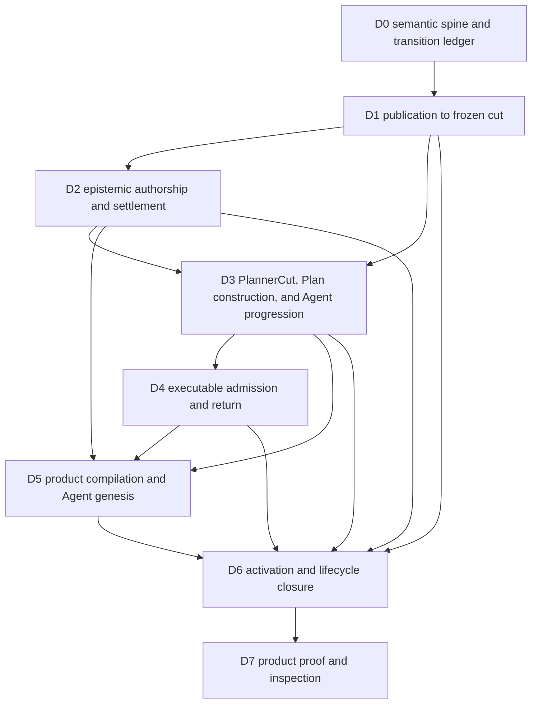

# Detailed Design Workstream Framing

Date: 2026-08-21

Status: design-phase sequencing frame, detailed contracts and implementation not authorized

## Actual Problem

The approved architecture now has enough semantic clarity to enter detailed design, but its most important behavior crosses several independently owned domains. A locally complete Graph, Curation, Strategy, Agent, Execution, PDS, or runtime specification could still leave the product unable to complete one durable reconciliation loop.

The design phase therefore needs to be organized around end-to-end owner transitions rather than around isolated crates or a single central runtime. The workstream map must preserve the difference between semantic dependency order, runtime event flow, and later implementation order.

## Thesis

Detailed design should close one owner-to-owner vertical at a time, in the order needed to make the next vertical meaningful.

Shared identity, lineage, traversal cuts, and visibility milestones come first. Knowledge publication and epistemic authorship come before complete reasoning-cut assembly and heterogeneous Plan construction. Plan construction and Agent progression come before executable admission. Native owner contracts come before PDS compilation and activation-wide lifecycle closure.

This is a specification order. It does not authorize implementation slices, migrations, or source changes.

## Concern And Scope

The direct concern is how to divide World Model Reconciliation into major detailed-design workstreams while preserving one continuous path from product declaration through observation, cognition, realization, reassessment, and safe retirement.

In scope are workstream boundaries, contract dependencies, ordering constraints, code-evidence readiness, cross-workstream consistency checks, explicit fixed seams, and the product scenarios used to pressure each design.

Out of scope are Rust types, field lists, storage schemas, API signatures, migration packets, implementation commits, estimates, and release sequencing.

## Code Evidence Readiness

The required code-evidence ground maps already exist. No new broad ground-map pass is required before detailed design begins.

| Evidence surface | Existing ground | Readiness for detailed design |
| --- | --- | --- |
| complete current flow | [Current Code Ground Map](current_code_groundmap.md) | ready and neutral about future architecture |
| root product and composition domains | [Root Meld entity assessment](impact_assessment/entity_assessments/root_meld.md) | ready with all thirty-seven exported domains covered |
| world-model and shared language | [World-model and language entity assessment](impact_assessment/entity_assessments/world_model_and_lang.md) | ready with missing Curation recorded as a target boundary rather than implemented fact |
| Execution and Events | [Execution and Events entity assessment](impact_assessment/entity_assessments/execution_and_events.md) | ready with Goal Set impact kept conditional and Events reuse established |
| cross-crate impact synthesis | [Impact assessment](impact_assessment/impact_assessment.md) | ready with runtime path, behavior change, and likely write scope separated |
| productization boundary | [PDS design framing](pds_boundary_assessment/pds_design_framing_after_world_model_reconciliation.md) | ready for contract framing while customer syntax and Agent topology remain open |
| initialization and runtime connectivity | [Runtime, initialization, and lifecycle assessment](runtime_initialization_lifecycle/runtime_initialization_lifecycle_assessment.md) | ready with sixteen producer-consumer handoffs and lifecycle gaps traced |

The 2026-08-21 freshness check found no domain drift against those maps. Root still exports the same thirty-seven domains. `meld-world-model` still exposes Agent, Belief, Planner, Strategy, Waiting, and World State, with Curation still absent. Execution and Events still expose the same assessed domain sets.

Every detailed design should cite the relevant existing ground map and revalidate only its touched public seams. A broad reassessment is needed only if a top-level domain appears, ownership moves, or implementation evidence invalidates a frozen affected set.

## Regenerated Package Sweep

The current workspace ownership universe remains:

```text
meld
meld-events
meld-execution
meld-lang
meld-world-model
```

| Package | Needed relationship | Current relationship | Evidence completeness | Follow-up posture |
| --- | --- | --- | --- | --- |
| `meld` | `adapter`, `publish`, and lifecycle `own` | product observations, theory routing, initialization, composition, and owner adapters | `partial` | design owner-correct connections without moving semantics into root |
| `meld-events` | `publish` | neutral durable append, replay, provenance, cursors, and graph attachments | `complete` | reuse unchanged as carrier |
| `meld-execution` | `consume` | accepts one executable authorization shape and realizes durable Task work | `partial` at intake | design producer-neutral Task admission while preserving Execution semantics |
| `meld-lang` | `publish` | supplies permissive Goal and executable vocabulary | `complete` | reuse unchanged |
| `meld-world-model` | `own` | owns current graph, Belief, Planner, Agent, and executable-only Strategy behavior | `partial` | primary detailed-design concentration |

The frozen affected package set is all five packages because each is on the complete design path. That does not make all five implementation write scope.

## Affected Domain Decomposition

| Domain concern | Owner | Current ground | Required relationship | Change posture | Boundary risk |
| --- | --- | --- | --- | --- | --- |
| product declaration and theory linking | PDS through root theory and config | exact packages, routes, receipts, assignment, and activation identities | compile principal intent into plural owner-installed revisions | `extend existing` plus new product model | PDS becomes a central ontology or live cognition engine |
| owner observation | workspace, docs, dependency security, and later sensory owners | several owner Events exist, but product publication is uneven | publish addressable observations and exact source positions | `extend existing` | adapters become authorities for product meaning |
| durable carriage | Events | append and replay authority already satisfy the neutral carrier role | carry owner records without semantic interpretation | `reuse unchanged` | Event envelopes become domain grammar |
| graph materialization and traversal | World State Graph | Event-backed projection and bounded reads exist with narrow admission and lossy relation returns | preserve owner publications, occurrence provenance, immutable cuts, and bounded discovery | `extend existing` | Traversal becomes a truth engine or universal currentness policy |
| epistemic authorship | canonical Curation domain | absent | realize standing and planned bounded Epistemic Operations and publish typed results | `new local behavior` | Curation absorbs Belief, Strategy, or foreign-owner meaning |
| evidence settlement | Belief | durable evidence, revisions, views, and Agent delivery exist | consume only installed mappings and expose exact visibility milestones | `extend connectivity` with core semantics reused | graph reachability becomes admitted belief |
| immutable reasoning context | Planner | current projection loses relation topology | publish one bounded relation-rich frozen cut | `extend existing` | Planner constructs Plans or becomes a universal DTO |
| Plan construction | Strategy | pure bounded executable-only candidate search exists | construct and verify heterogeneous immutable Plan revisions | `extend existing` | Strategy executes products or owns durable progression |
| Plan authority and progression | Agent | Goal authority and one executable handoff exist | authorize Plan revisions, progress eligible products, and reconcile from admitted change | `extend existing` | root runtime or Execution takes cognitive authority |
| executable admission and realization | Execution | durable Goal Set and Task Network exist | accept complete Goal-attributed Tasks through admission identity | `extend intake`, reuse realization | Execution revalidates world-model reasoning or sees the full Plan |
| activation closure | root lifecycle and owner participants | strong local actors and disconnected activation records exist | bind exact generation, readiness, waits, wakes, fencing, recovery, drain, and retirement | `extend existing` | lifecycle order becomes semantic orchestration |
| evidence projection | harness, CLI, serve, and telemetry | current one-candidate and actor views exist | report owner truth and end-to-end lineage | `adapter only` | projections become source truth |

## Major Detailed-Design Workstreams

### D0 Semantic Spine And Transition Ledger

This workstream fixes the terms every later specification must share without creating a universal schema. It frames identity and lineage across product revision, package receipt, assignment, activation generation, Agent, Goal, Plan revision, Plan product, Execution admission, Epistemic Operation, Event position, graph cut, belief revision, and participant incarnation.

It also defines the vocabulary for visibility milestones. Durable Event append, graph materialization, belief revision, Agent acceptance, executable admission, and terminal owner result must remain distinct positions.

This workstream is first because later contracts cannot state idempotency, supersession, dependency satisfaction, restart, or retirement coherently without these distinctions.

### D1 Owner Publication To Frozen Traversal Cut

This vertical begins with owner-shaped observations and ends with an immutable, occurrence-rich cut suitable for Curation and Planner consumers.

```text
owner observation
-> Event append
-> graph admission
-> occurrence-preserving materialization
-> typed hydration
-> immutable TraversalCut
```

It frames publication participation, object and occurrence identity, scope, currentness ownership, source completeness, cut completeness, bounded traversal, and hydration responsibility. Workspace and docs freshness supply the primary proof. Dependency security supplies the dissimilarity check.

This workstream depends on D0. It must complete before Curation, Belief, or Planner can bind replayable reasoning to exact graph knowledge. It does not assemble the complete `PlannerCut` required by Strategy.

### D2 Epistemic Authorship And Settlement Loop

This vertical begins with standing Agent authority or an authorized Plan product and ends when the resulting epistemic position becomes visible to the correct downstream owner.

```text
Agent authority
-> bounded Epistemic Operation
-> Curation lifecycle
-> Curation Event publication
-> graph visibility
-> optional Belief admission
-> Agent visibility
```

It must cover standing and planned entrances without creating two Curation authorities. It frames constructible operation declarations, bounded input, expected entities, perspective scope, terminal result meaning, publication, supersession, replay, and the exact milestone a dependent Plan edge may require.

This workstream depends on D1. It publishes the Curation contract catalog that Strategy may later ground without inventing Curation meaning.

### D3 PlannerCut Assembly, Heterogeneous Plan Construction, And Agent Progression

This vertical begins with exact source revisions and a Goal, assembles the immutable `PlannerCut`, and ends with durable Agent decisions about one Plan revision and its eligible products.

```text
TraversalCut plus Belief, Causation, Regime, directive, and Capability catalog revisions
-> immutable PlannerCut
-> Goal plus frozen PlannerCut
-> Strategy construction and verification
-> immutable Plan revision
-> Agent authorization
-> durable product eligibility
-> Curation or Execution handoff
-> reassessment and successor revision
```

It frames exact reasoning-cut assembly, desired conditions, complete Tasks, bounded Epistemic Operations, causal dependencies, Plan identity and lineage, reconstruction, product eligibility, authorization granularity, supersession, and the boundary between Strategy construction and Agent progression.

This workstream depends on D1 and the operation, settlement, and visibility portions of D2. It must prove that graph, Belief, Causation, Regime, directive context, Capability catalog, scope, authority, and projection policy revisions compose into one exact cut before Strategy consumes it. It must also settle executable product identity and cardinality before the Execution intake workstream can finish.

### D4 Executable Admission And Observation Return

This vertical begins with one Agent-authorized complete Task and ends with owner-shaped outcomes re-entering reconciliation.

```text
eligible complete Task
-> producer-neutral Execution admission
-> Execution planning
-> Task Network realization
-> outcome Event
-> owner observation and evidence mapping
-> Agent reassessment
```

It frames admission identity distinct from Goal and Task identity, several Tasks per Goal, shared operational work, authority and freshness checks owned by Execution, result attribution, and the removal of world-model premise reconstruction from executable lowering.

This workstream depends on D3. Task, Task Network, Capability realization, and Event semantics remain fixed unless direct contract evidence proves a narrow seam change.

### D5 Product Compilation And Agent Genesis

This vertical begins with principal intent and ends with exact inert material ready for activation.

```text
principal declaration
-> product profile
-> semantic package linking
-> owner validation and installation
-> exact receipt
-> assignment
-> Agent genesis plan
```

It frames plural owner-routed compilation, principal declaration, product profile, assignment, exact lineage, maintained-condition installation, Curation and Strategy theory installation, Capability requirement separation, authority request and grant lineage, upgrade identity, and Agent topology representation.

This workstream follows D2 through D4 because PDS must compile to native owner contracts that already have stable meanings. It must not freeze incomplete runtime contracts into a package schema.

### D6 Activation Generation And Lifecycle Closure

This vertical begins with an exact prepared product and ends with a safely current or safely retired activation generation.

```text
prepared assignment and participant plan
-> owner preparation
-> Agent genesis
-> participant realization with admission closed
-> readiness closure
-> current generation
-> owner work and durable waits
-> fence, drain, safe points, and retirement
```

It frames the single activation authority, participant plan parity, owner readiness, producer-consumer cursor positions, structural waits and wakes, participant incarnation, restart, late delivery, admission fencing, unresolved external effects, reverse structural drain, and retirement evidence.

This workstream follows D5 and the native owner workstreams because lifecycle can verify only named owner products and structural transitions. It cannot invent readiness or safe-point meaning on their behalf.

### D7 Product Proof And Inspection

This final framing vertical proves that the specifications form one product rather than a collection of locally plausible contracts.

Docs freshness is the primary end-to-end proof because it must close both the already-correct path and the change-then-verify path. Dependency security is the dissimilarity proof because it pressures owner observation, epistemic assessment, executable intervention, negative obligations, and evidence admission differently.

The proof traces must cover fresh activation, epistemic-only closure, mixed Curation and Task progression, process loss after every durable handoff, lagged consumers, missed wake, reconstruction under the same generation, generation replacement, late results, and fenced retirement.

Inspection remains a projection over exact owner records. It does not become a new authority.

## Order Of Operations



The diagram shows specification dependency, not runtime scheduling. Docs freshness and dependency security should pressure every workstream as it is drafted, then run as integrated proofs in D7. They should not be deferred until all contracts appear complete.

D1 and the independent owner-publication parts of D5 may be researched in parallel after D0. D2 needs the D1 cut and publication boundary. D3 needs the D2 constructible-operation and settlement boundaries, then closes full `PlannerCut` assembly before Strategy construction. D4 needs the D3 executable product and cardinality decisions. D5 should freeze only after its native compilation targets are stable. D6 then binds the exact participants and handoffs established by D1 through D5.

## Cross-Workstream Consistency Account

Every detailed design packet should answer the same small set of cross-boundary questions.

| Question | Why it crosses workstreams |
| --- | --- |
| what exact identity is created | prevents Goal, Plan, Task, admission, operation, and generation identity from collapsing |
| which owner grants authority | prevents package selection, Agent judgment, and Execution enforcement from becoming one field |
| what durable commit establishes the producer position | makes restart reasoning independent of call-stack success |
| which consumer position proves visibility | prevents Event append from masquerading as graph, Belief, or Agent completion |
| what idempotency and supersession rule applies | keeps replay and reconstruction from duplicating semantic work |
| what wakes the consumer | distinguishes live waiting from periodic hope |
| what activation fence applies | prevents late work from crossing generation boundaries silently |
| what safe point permits retirement | preserves unresolved epistemic and external effects |
| which semantic owner validates meaning | keeps adapters, lifecycle, Events, and Traversal structurally neutral |
| which product proof exercises the seam | keeps the design tied to an end-to-end behavior rather than an isolated type |

The answers belong in owner-specific contracts. The table is a review account, not a demand for one shared runtime record.

## Runtime, Behavior-Change, And Write Scopes

The complete runtime path includes PDS, root initialization and composition, product observation owners, Events, Traversal, Belief, Planner, Curation, Strategy, Agent, Execution, Capability realization, runtime lifecycle, and inspection adapters.

The proven behavior-change set is narrower. It includes owner publication completeness, Traversal occurrence fidelity and cut identity, Curation, graph-driven Belief eligibility, Planner frozen cuts, Strategy Plan construction, Agent Plan progression, Execution admission, PDS compilation targets, and activation lifecycle closure.

Likely implementation writes are intentionally not frozen in this document. Existing impact evidence places their concentration in world-model, root product publication, initialization, runtime composition, selected Execution intake, and evidence adapters. Detailed design may refine that view without treating every runtime participant as write scope.

## Explicit Non-Integration Decisions

Legacy Workflow is not a workstream or compatibility target for the canonical Plan.

Events does not gain Curation, Belief, Strategy, PDS, or lifecycle grammar.

`meld-lang` does not gain heterogeneous Plan or Epistemic Operation ownership.

Task Network does not coordinate dependencies between Tasks and Epistemic Operations.

Traversal does not settle truth, infer absence from missing edges, or own universal currentness.

Belief does not admit every graph-reachable product as evidence.

PDS does not participate in each live cognitive transition.

Root runtime and lifecycle do not sequence semantic work.

Harness, CLI, serve, and telemetry do not become authoritative product state.

## Design Maturity And Starting Point

Graph, Belief, Causation, Regime, and Planner already have substantial canonical specifications. Their workstreams should reconcile and extend those contracts only where the end-to-end seam requires it.

Curation, Strategy Plan, Agent progression, Execution admission, PDS compilation, and activation lifecycle have strong architectural boundaries but thinner detailed contracts. Those are the main specification-growth areas.

The first drafting operation should therefore be D0 followed by D1. D0 should remain a bounded seam ledger rather than a universal model. D1 then provides the first complete vertical and the stable `TraversalCut` contract needed by every later cognitive workstream. Complete `PlannerCut` assembly remains in D3 after D2 establishes settlement products and visibility.

## Evidence Confidence And Unresolved Framing Questions

Confidence is high that the existing ground maps are sufficient, the semantic spine plus seven vertical workstreams cover the full canonical flow, and the dependency order protects the sacred seams.

The main unresolved framing questions are the owner of neutral frozen-cut assembly, Agent authorization granularity, the exact visibility milestone for each Plan dependency class, Agent topology under one product, and whether activation lifecycle extends one current record family or reconciles several into a new aggregate authority.

Those questions belong inside D1, D3, D5, and D6 respectively. They do not block beginning the detailed design phase, and they should not be answered globally before their owning vertical is specified.
