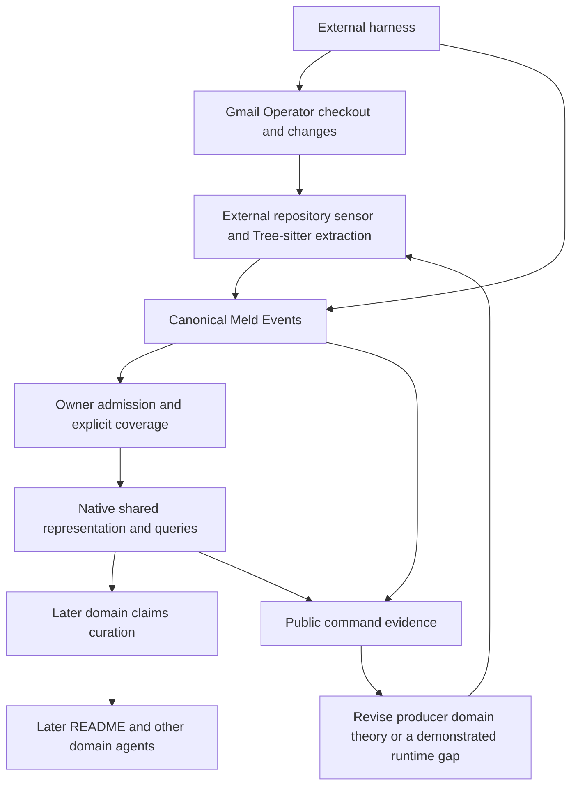

# Go wide from repository Events to shared meaning

Date: 2026-09-12. Lifecycle: open. Repository Event ingestion is implemented and qualified under the [completed active slice](event_up_go_wide_active_slice.md). Branch: `feat/event-up-go-wide` in Meld, Meld Codebase Semantics, Meld README and Meld Eval. This ledger owns the exercise. The user authorized event ingestion and checkpoint commits and pushes. Native language adequacy and claims curation remain subsequent boundaries.

## Reason and outcome

The [previous experiment](strategy_planning_experiment.md) is closed by explicit user acceptance. It proves a bounded Tree-sitter-to-knowledge path, native recursive Strategy construction and autonomous reconciliation when a tracked semantic assertion changes. It does not prove repository-wide observation, a generally coherent representation of code, automatic generation of README claims or whole-document maintenance.

The next exercise deliberately goes wide and moves upward from Events. Use Gmail Operator as a real repository of manageable size. Establish broad sensory coverage and native ingestion before deciding whether `meld-lang` can express the resulting relationships coherently. Only then reconsider the README PDS around claims curation. The exact-assertion Boolean bridge is a regression fixture, not the abstraction to multiply across the repository.

The desired direction is reusable, continuously reconciled repository knowledge from which domain agents can derive and maintain their own claims. This phase measures the foundation for that direction. Success at a lower boundary is not acceptance of a higher one.

## Starting evidence

All four predecessor branches are checkpointed and pushed. The new branches start from these closure commits:

| Repository | Closure commit | Role |
| --- | --- | --- |
| Meld | `e5caafc8` | Native Events, language, Graph, Agent, Strategy and Execution |
| Meld README | `9641385` | Existing authored-obligation consumer and regression evidence |
| Meld Codebase Semantics | `4ae6f35` | External syntax extraction, interpretation and observation |
| Meld Eval | `62e79d0` | Public-command capture and isolated experiment journeys |

The initial read-only Gmail Operator inventory is commit `91b646611245c5c1c6b9f099b1b6db465070d938` on `feat/readme-pds-maintenance`, with a clean worktree. There are 31 tracked files: 12 Python files totaling 992 lines, 13 YAML files, one Markdown file, one TOML file, one text file, one `.example` file and two extensionless files. These counts establish scale and language diversity, not parser coverage. Gmail Operator is the subject repository; this transition does not alter it.

The current producer selects one Rust path and a narrow leading-guard shape. It recaptures that file on native ticks, with no repository Merkle tree or parse cache. README reads admitted Graph objects and verifies a manually authored mapping to two exact assertion strings. Those limitations are part of the starting evidence and must not be hidden behind a repository-wide success label.

## Move upward through three evidence boundaries

| Boundary | Outcome to establish | Evidence that permits moving upward |
| --- | --- | --- |
| Repository observation through Events | Tree-sitter observations across the whole inventoried repository reach Meld through the canonical Event interface | Exact source revision and grammar attribution, explicit accounting for every path, declared parser coverage and gaps, retained relationships, public ingest/readback, repeat/restart behavior and changed/added/deleted source journeys |
| Native semantic representation | The repository's actual structures and relationships can be expressed and queried coherently using existing Meld language and owner contracts, or expose precisely recorded gaps | Representative cross-file and local relationships with stable identity, support and uncertainty; meaningful public queries from admitted knowledge; explicit distinction between syntax observations and semantic inference; changed-basis reconciliation |
| Claims curation and README orientation | Domain-owned curation derives relevant supported claims and connects them to document meaning instead of relying on manually paired assertion strings | A later authored design grounded in the previous boundaries; evidence for claim selection, support, materiality and prose correspondence before replacement of the current README policy |

Whole-repository coverage means an explicit account of the complete selected checkout, not just a successful parse of one function in each file. Every tracked path is included or classified with a visible reason. Python and YAML are both material parts of the initial inventory. Grammar selection, treatment of documentation/configuration and exclusions must be stated before a full-coverage claim. A file omitted from semantic interpretation remains visible as omitted or unsupported; it cannot silently disappear from completeness.

Tree-sitter coverage is not proof of type resolution, reference binding, executable behavior or prose entailment. A language-adequacy judgment must test whether the representation preserves the distinctions needed by useful queries and updates. Merely wrapping a syntax dump in opaque JSON does not establish native semantic coherence. Conversely, this phase does not require every parser node to become an independent long-lived Fact or every raw source byte to enter Graph.

A complete repository scan is a baseline. The Event boundary must also handle subsequent changes, creation, deletion, duplicate delivery and restart without losing provenance or silently retaining superseded knowledge. The first proof uses a finite change sequence so eventual convergence is observable. Rapid-change action-cost policy and settling delays remain deferred.

## Ownership and development loop

| Responsibility | Disposition for this phase | Boundary |
| --- | --- | --- |
| Repository scope, grammars, syntax interpretation and observation | extend in external Codebase Semantics | Own code meaning and observed coverage outside Meld core |
| Event append, durable identity and replay | retain first | Improve generic runtime contracts only when a whole-repository command journey demonstrates a missing capability |
| `meld-lang` values and native Graph contracts | assess, then extend only if demonstrated | Preserve their existing focused responsibilities; record a concrete construct/query failure before proposing a language change |
| Harness and public inspection | extend | Capture actual ingestion, native reads and lifecycle behavior; no private-store injection or fabricated admission |
| Current README PDS | retain as regression evidence, defer redesign | Do not broaden exact-string assertions to stand in for a claims curator |
| Agent and Strategy | retain | Continuous reconciliation remains Agent-owned, with episodic pure Strategy search over admitted material evidence |

The runtime–harness–domain authorship loop remains canonical. Author bounded observations and interpretation in the external domain, build explicitly, drive ordinary Meld commands, inspect exact native evidence, and revise the smallest responsible boundary. Native state stays outside the subject checkout. Use isolated copies for source-mutation journeys. External authorship enters through Events; the exercise does not open Graph to direct external writes.

Stale intermediate effects remain compatible with continuous reconciliation. The relevant test is whether subsequently admitted material evidence changes the Agent's understanding and work, preserving causal history and eventually aligning the represented condition. There is no universal freshness gate, requirement to pause every action during conversion, or newly selected scheduler.

## First implementation decision and limits

The first assessment selected an external repository observer using existing native ticks and the Event outbox. Gmail Operator's 31-path baseline yields 26 parsed Python/YAML/TOML files and five explicit grammar exclusions, with 12,184 syntax nodes. Per-file Events fit the existing command payload boundary; a final scan manifest links source revisions, retained file Events and the previous scan. The [closeout](../../../../../meld-code-semantics/evidence/repository-events-v1/CLOSEOUT.md) records 137 passing repository checks and 89 passing single-file regression checks, with zero model calls and no runtime source changes. A language overhaul or claims-curator implementation is not selected at this checkpoint.

Record difficulties as measured gaps: affected source examples, failed public command or query, the information lost or ambiguous, and the responsible domain. The user expects nontrivial challenges but their presence is not presumed. Avoid a speculative universal ontology or an exhaustive advance implementation plan.

A deeper architectural circuit breaker requires evidence that the canonical Event/native-knowledge/reconciliation path cannot carry the required behavior without a competing semantic authority or a major redesign. Unsupported grammar, missing domain rules or a thin public API gap are ordinary experimental findings. New stores, coordinators, Graph writers or broad core-language changes require explicit reassessment; do not invent them to make a fixture pass.

The foundation is exploratory. Closure of the previous experiment does not promote repository coverage or claim derivation to production maturity. The bounded repository Event slice is qualified. No language-adequacy verdict or README replacement is claimed.

The next boundary is native representation of observed repository relationships, grounded in the captured syntax and its explicit coverage limits.
