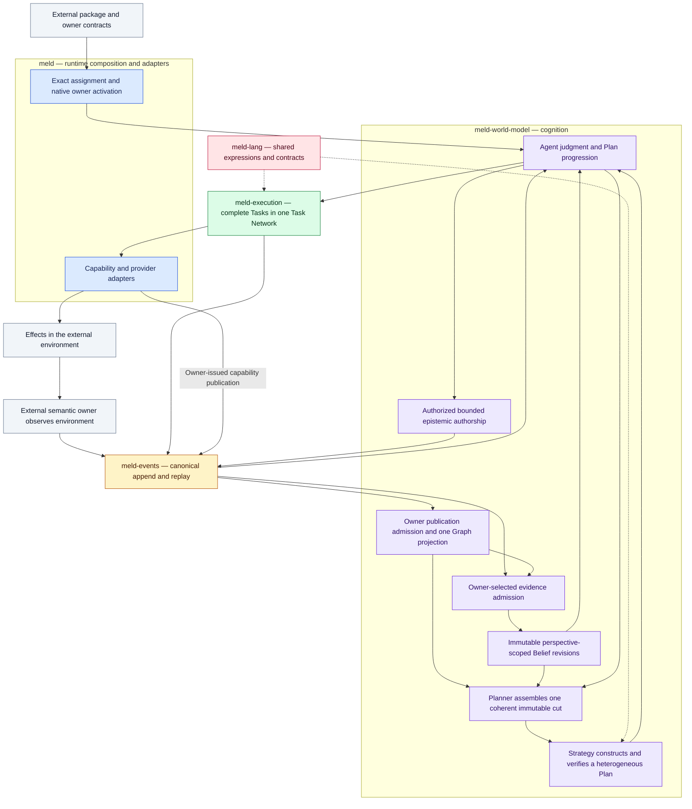
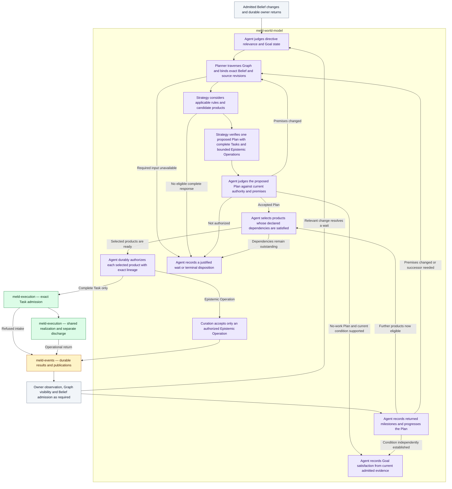

# Canonical Flywheel Alignment And Runtime Soft Freeze

Date: 2026-09-08

Baseline: `e1666ffa4449cc68881a282c00e90a7e363dd63b` on `design/world-model-reconciliation`.

State: R3/P0 is accepted by fresh bounded neutral review at `b5daadcc`. The four matrix commits are pushed. R4 is active. Its V03 exact import integration is implemented and neutrally accepted through ordinary preparation, nonce progression and reopen. External-owner cutover, remaining correctness work and soft freeze remain open.

## Authority And Supersession

This document is the sole current reconciliation-branch issue register, severity order, remediation sequence, and soft-freeze acceptance definition. The user requested this consolidation after the current-snapshot architecture audit and explicitly prioritized one working architectural flywheel over product cleanup.

It supersedes the delivery, prioritization, pickup, and branch-completion authority of every earlier assessment, plan, ledger, recovery amendment, review, and acceptance record in this reconciliation directory and its descendants. In particular, the former delivery ledgers, `reconciliation_outcome_audit.md`, and `reconciliation_acceptance.md` are supporting history, not competing directions. Old authorizations and next-task instructions embedded in those records are historical. Their valid observations and exact artifacts remain evidence; supersession does not rewrite them as failures.

[Runtime Invariants](../../../../governance/runtime_invariants.md), [Contribution Policy](../../../../governance/contribution_policy.md), and repository domain rules remain governing policy. [Cognitive Architecture](../../../cognitive_architecture/README.md) remains the evergreen ownership specification. This plan owns current scope, explicit interpretations, implementation gaps, and acceptance; it does not replace evergreen domain specifications with a delivery ledger.

The separate [PDS proposal corpus](../../../persistent_domain_stewardship/README.md) and recorded use cases remain future product-design input. They do not select current branch work. Older proposal restrictions that disagree with canonical PDS and Strategy ownership do not override the latter.

## Objective And Scope

Meld must have one canonical loop from owner observation through Events, knowledge admission, Belief, Agent judgment, Planner traversal, Strategy construction, authorized work, and returned owner evidence. That loop must make observable progress through ordinary runtime entrypoints without a product coordinator or test arranging its internal turns.

The desired branch outcome is a soft-frozen cognitive runtime on which PDS design and recorded use cases can be developed without repeatedly repairing core ownership and connectivity. Soft freeze means the public domain contracts and canonical paths are established and exercised. It permits ordinary bug fixes and deliberate additive capabilities; it does not promise an immutable implementation or complete cognition.

The user's scope constraints are preserved:

- There is only one flywheel, and it must turn.
- Architectural alignment takes precedence over product-policy cleanup.
- Causation and Regime remain deferred because they are not required for the initial flywheel.
- The final architecture must have single canonical implementations working end to end against the local Qwen Coder Next implementation.
- Full PDS redesign and expansion into the recorded use cases follow runtime soft freeze.

Removing a competing authority is part of its architectural replacement. It cannot be assigned to the later cleanup phase. Unrelated policy details, dormant nonauthoritative support, and source-quality corrections can be completed in that phase. All known runtime invariant violations in this register require closure before final soft freeze; optional product generality does not.

## Intended Flywheel

Colors identify crate ownership: blue is root `meld`, purple is `meld-world-model`, amber is `meld-events`, green is `meld-execution`, and rose is `meld-lang`. Slate marks external packages and the environment. Labels and crate groups carry the same meaning without relying on color. Dashed lines show shared contract use; meld-lang is not a scheduled actor. The diagram shows intended ownership after product extraction; today's compiled Docs and Security implementations are the V01 gap.

This is a dependency graph, not a supervisor script requiring actors to run in the illustrated order. Events is the common durable transport. Source observations, Curation products, and Execution outcomes have different owners and admission rules. Graph discovery is not automatically evidence; an Event append is not automatically a Belief revision.

### Agent Judgment, Strategy, And Authorized Task Selection

Strategy selects and constructs the semantic work proposed in a Plan. Agent judges that proposal and selects eligible products for authorization. Execution decides how admitted Tasks are realized. These are separate decisions even though Agent, Planner, and Strategy live in the same crate.

The slate nodes summarize cross-owner inputs and return processing already expanded in the main diagram. Agent consumes operational returns directly when that milestone is sufficient, and waits for Graph or Belief admission when the Plan requires semantic evidence. An already-satisfied condition follows a no-work Plan through Agent judgment to satisfaction; it does not require a dummy Task or Epistemic Operation. Products awaiting prerequisites remain in the Plan. Agent does not edit a Task to make it eligible, and Execution does not receive the heterogeneous Plan or Strategy's private proof. A changed semantic choice goes back through Strategy to a successor Plan with completed history preserved.

### Ownership And Handoffs

| Step | Canonical owner and product | Receiving responsibility | Evidence needed to cross the boundary |
| --- | --- | --- | --- |
| 1. Establish purpose | Package assignment supplies exact theory, directive, principal, perspective, owner routes, and participant selection | Native Agent genesis and runtime activation | Exact revisions and owner preparation, not root-generated product policy |
| 2. Observe | Source owner supplies an observation or withdrawal with scope, currentness, provenance, and semantic revision | Events retains the intact owner product | Owner-issued publication and append authority |
| 3. Materialize facts | Graph admits opt-in owner objects and relation occurrences through one projection | All graph queries and Planner use the same corpus | Owner revision, occurrence identity, scope, and durable event position |
| 4. Admit evidence | Belief ingestion applies installed owner mappings to eligible products and discovered qualified material | Belief settles the selected question | Explicit mapping, producer authority, currentness, and supporting or opposing evidence |
| 5. Settle knowledge | Belief emits an immutable revision for a perspective-scoped question | Agent judges relevance and maintained conditions | Revision identity, uncertainty, lineage, and invalidation basis |
| 6. Freeze context | Planner traverses the common graph and selects exact relevant source and Belief revisions | Strategy receives one coherent immutable problem | Explicit required sources, scope, source basis, and honest refusal or bounded incompleteness |
| 7. Construct | Strategy searches and verifies complete Tasks and bounded Epistemic Operations with dependencies | Agent judges and authorizes exact products | Grounding, closure, dependency coherence, explanation, and frozen context |
| 8a. Author knowledge | Curation executes an authorized bounded Epistemic Operation | Events, Graph, and then selected Belief admission | Durable result and publication visibility are distinct; expected entities do not assert physical existence |
| 8b. Realize work | Execution admits complete Tasks and realizes compatible work in one Task Network | Capability owners perform effects and Execution returns attributed outcomes | Exact Task and authority, output lineage, independent admission discharge |
| 9. Observe returns | Semantic owner observes the resulting environment and evaluates its product under selected theory | Events restarts knowledge admission; Agent also consumes operational returns | Execution success does not substitute for domain verification |
| 10. Reconcile | Agent accepts returned milestones, obtains fresh context, preserves completed history, and requests successors | Eligible remaining work progresses or a Goal disposition is recorded | Current evidence and authority, no duplicate realization from replay, explicit satisfaction contract |

Facts here are owner assertions retained and projected through Events and Graph. They do not require a second generic fact writer or resurrection of the legacy claim engine. Owner stores and their derived graph projections may coexist, but the source of each semantic decision must be named and unique.

### Necessary Interpretations

1. **Unknown is a valid knowledge state.** No current evidence must not silently mean false, true, or complete. An admitted unknown Belief revision or an explicitly optional unavailable source can support a bounded observation or epistemic Plan. A required unavailable owner causes an explicit wait tied to that owner.
2. **Bootstrap cannot depend on its own result.** Constructing an Epistemic Operation must not require the publication that operation will create. Initial observations and assignment-authorized bounded Curation can establish initial knowledge. A standing Curation rule is owned authorized epistemic work, not a second product planner. It does not choose executable repairs.
3. **Plans are genuinely heterogeneous.** An initial Plan can contain only epistemic work. Mixed Plans can have local dependencies such as `E1 -> T1 -> E2 -> T2`. Dependencies follow the selected products, not a global before-or-after switch.
4. **A cut is a coherent selection, not a fabricated success token.** Required graph evidence and Belief evidence must agree with their selected source basis and scope. Sources beyond or inconsistent with that basis cannot be silently mixed. Exact source revisions are retained. A global transaction across all owner databases is not required; incompatible selections must be rejected or retried before authorization.
5. **Premise changes return to Agent and Strategy.** Execution may retry or share operational work but cannot revise the semantic obligation. New evidence invalidates affected unexecuted assumptions, preserves completed history, and produces a successor when necessary.
6. **Returns have separate milestones.** Intake acceptance, operational completion, Curation result, Graph visibility, Belief settlement, and Goal satisfaction cannot be collapsed into a single success flag. A rejected or uncertain result still returns durably and can enable a different response.
7. **Progress does not depend on callbacks.** A bounded fair supervisor drives native owners. Each pending durable transition is either runnable, waiting on an identified owner or external input, or terminal. A callback can wake processing but cannot be the sole record of work. No product-specific ordered driver is required.
8. **Progress is conditional, not magical termination.** Under unchanged relevant inputs, available owners and capabilities, a constructible finite Plan, and eventual external responses, the loop must reach the selected condition or an explicit justified terminal outcome. Impossible Goals and unavailable providers may remain honestly blocked. Stable satisfaction must become idle, and a relevant change must wake reconciliation.
9. **Deferred knowledge is explicitly absent.** Initial projection policy does not require Causation or Regime sources. Their absence cannot be filled with fictitious complete revisions or universal causal confidence. Declared capability effects and product verification suffice for the initial bounded loop; ordering evidence does not establish causal inference.
10. **Runtime linkage is real.** Existing product semantics may be retained during core repair, but before soft freeze new package-owned semantics must be connectable without recompiling Meld. Native generic algorithms remain allowed. Renaming Docs and Security modules or moving them to linked crates in the same fixed binary does not meet this condition.

### Design Validation Verdict

The bounded intended architecture passes the ownership, bootstrap, information-flow, return-path, and conditional-progress checks below with the explicit interpretations above. There is no demonstrated need for rollback, a second runtime, Causation, or Regime to make this architecture work. This is a design feasibility judgment, not a runtime conformance pass or a formal termination proof.

| Check | Validation result | Why the specified architecture can work | Current implementation limit |
| --- | --- | --- | --- |
| Unique authority | Pass in design | Events transports; owners decide; Graph projects; Belief settles; Strategy constructs; Agent authorizes; Execution realizes | Multiple graph corpora, embedded product construction, and retained alternate paths remain |
| Bootstrap | Pass with explicit unknown and noncircular prerequisites | Observation and bounded epistemic work can precede physical repair | Ordinary Strategy construction requires Tasks; full bootstrap proof is missing |
| Immutable coherent context | Pass | Source revisions and qualified traversal establish a stable construction problem; currentness is rechecked before authorization | Native Planner still consults legacy anchors and compatibility cuts remain exported |
| Product closure | Pass | Independently complete Tasks and bounded Epistemic Operations permit local dependency evaluation | Global epistemic placement and duplicated aggregate Task bodies narrow the implementation |
| Return closure | Pass | Both work paths return durably; semantic verification re-enters evidence admission | Retained proofs cover selected paths, not the complete canonical caller surface |
| Conditional progress | Pass | Fair bounded steps, durable pending work, and owner-resolvable waits permit work to resume without a bespoke coordinator | Some composition tests manually step owners; final ordinary-entrypoint proof must cover the full matrix |
| Stable idle and changed knowledge | Pass | Distinct currentness, history, and Goal disposition prevent repeated completed work while admitting successors | Narrow Docs, Security, and nonce evidence is retained; remediated paths require renewed proof |
| Later Causation and Regime | Pass as an architectural extension | New owner revisions can use existing publication, evidence, invalidation, and projection seams | Algorithmic simplicity is not established; a new ledger or planner would violate the intended extension |

Canonical evidence: [Events](../../../cognitive_architecture/events/README.md), [Graph requirements](../../../cognitive_architecture/world_model/graph/requirements.md), [Belief](../../../cognitive_architecture/world_model/belief/README.md), [Planner](../../../cognitive_architecture/world_model/planner/README.md), [Strategy contracts](../../../cognitive_architecture/world_model/strategy/contracts.md), [Strategy construction](../../../cognitive_architecture/world_model/strategy/search.md), [Agent progression](../../../cognitive_architecture/world_model/agent/plan_progression.md), [Curation](../../../cognitive_architecture/world_model/curation/README.md), and [Execution planning](../../../cognitive_architecture/execution/planning/README.md).

### Worked Closure Check

Consider a bounded source directory whose required documentation has not yet been established. These are logical transitions over the intended contracts, not a newly executed demonstration.

1. The source owner publishes revision `S1`. Graph admits its observed objects. The selected evidence policy can establish an unknown or missing-documentation question without pretending a README exists.
2. Agent obtains a cut over `S1` and that admitted knowledge. Strategy selects bounded operation `E1` to establish the documentation requirement where the installed theory calls for it. Construction requires the known source scope, not `E1`'s future result. Agent authorizes it.
3. Curation publishes requirement revision `C1` through Events. Graph exposes it. Evidence admission relates the requirement to the actual observation, and Belief publishes `B1`, expressing the mismatch. `C1` alone cannot establish physical documentation or satisfaction.
4. Agent receives the relevant revision and asks Planner for cut `K1`. Strategy constructs a complete repair Task `T1` and the selected confirmation dependency. Agent authorizes `T1`; Execution lowers it without decomposing the Goal. Its provider capability uses local Qwen and performs the authorized effect.
5. Execution publishes its attributed return. The source or semantic owner independently publishes `S2` for the resulting state. Selected Curation and evidence mapping produce a Belief successor `B2`. Neither the provider response nor the successful Task is sufficient to replace `B2`.
6. Agent reconciles the declared milestones against fresh cut `K2`, preserves completed `T1`, and records satisfaction only when the selected condition is supported. If verification is negative, Strategy selects another eligible response or reports an explicit unresolved outcome. It does not repeat `T1` solely because another Event arrived.
7. Reopening the same state retains the history and requires no new model call or effect. A relevant later source revision `S3` invalidates affected premises and resumes the same loop through a new cut and successor.

The same closure works with Curation-only work or additional locally dependent Tasks. The missing implementation features are construction generality and canonical connectivity, not an absent Causation or Regime engine.

For a later Causation or Regime feature, the integration check is similarly bounded: its owning domain publishes exact revisions through Events, relevant mappings and projection policy select them, a changed revision invalidates the affected cut, and Agent asks the same Strategy implementation for a successor. The feature may add domain algorithms and owned storage; it must not add another spine, evidence-settlement authority, or execution planner. This validates an extension location, not the scientific adequacy or implementation cost of those future algorithms.

## Severity-Ordered Issue Register

`P0` blocks a single fully turning architectural loop. `P1` blocks freezing that runtime as a usable host for external product semantics. `P2` is dedicated cleanup, policy correctness, or a declared product capability limit. Priority measures dependency on soft freeze, not the rhetorical severity of the original audit. Confirmed retained interfaces are distinguished from observed live failures.

The `V` identifiers preserve the original audit's 18 findings. `G01` is the integrated proof obligation exposed by this planning review, not a newly reproduced production failure. Ownership-preserving store projections are not automatically competing authorities.

### Full Removal Means Full Removal

When a disposition retires a path or implementation, it must be fully removed from completed source in the same commit candidate that establishes its replacement. This includes obsolete public APIs, exports, constructors, registrations, selectors, writers, coordinators, recovery entrypoints, and tests or fixtures whose only purpose is to keep that implementation callable. Disconnecting one caller, disabling a registration, renaming a module, or retaining a second API for possible future use does not complete retirement.

Historical durable data may require a small owned decoder or migration reader. That exception preserves readable evidence, not the retired implementation or a parallel decision API. Record its concrete data need and removal condition. A deliberately retained forwarding API must call the sole canonical owner and be identified as retained, never counted as a fully removed API. Remove unused competing APIs rather than manufacturing forwarding surfaces for hypothetical callers.

| Priority | ID | Snapshot finding and consequence | Disposition and completion slice |
| --- | --- | --- | --- |
| P0 | V06 | Owner publications and older fact/relation indexes feed different live graph APIs; Graph still interprets foreign event schemas | R1 migrates callers to canonical publication and queries, then fully removes the retired traversal APIs, implementations, foreign-semantic extraction, and registrations |
| P0 | V09 | Ordinary Strategy construction requires Tasks and imposes all-to-all global epistemic placement | R2 supports epistemic-only and locally interleaved products in one constructor and verifier; fully removes superseded global-placement-only construction and validation paths |
| P0 | V10 | First matching settlement rule hides later constructible alternatives and makes order implicit policy | R2 searches applicable alternatives or implements explicit installed ordering semantics; fully removes the superseded implicit first-match decision path |
| P0 | V11 | Plan duplicates complete Tasks' composition and contracts as a persisted compatibility aggregate | R2 fully removes the competing persisted aggregate and its semantic consumers; retain intact Tasks and derive presentation-only views |
| P0 | G01 | Native narrow proofs do not establish canonical ordinary-entrypoint progress across bootstrap, mixed Plans, sharing, refusal, changes, and restart | R3 establishes this before product expansion; R6 repeats affected proof against the final freeze candidate |
| P0 for live portions | V07, V08 | Context reads mix Graph and legacy heads; single-shot Context generation remains an independent planner and queue | R1 fully removes superseded head selection and fallback paths while retaining the named Context owner store. R3 fully removes the alternate generation planner, queue, coordinator, and competing mutation APIs |
| P0 retirement obligation | V15 | Public legacy claim writers and synthetic complete Planner cuts remain, although no production caller of the old reducer or cut constructor was established | R1 fully removes superseded writer/reducer APIs, fake-cut constructors, exports, and exclusive support in the Graph and Planner cutover |
| P1 | V01 | Docs and Security semantics, route registration, bindings, and actors are compiled into Meld | R4 moves product behavior behind the runtime-loaded owner boundary and fully removes the core product implementations and fixed dispatch |
| P1 | V02 | Root authors a one-position product topology and rejects overlapping target declarations; singular receipt loading narrows generic declarations | R4 consumes installed topology and scoped assignments, then fully removes superseded hardcoded topology construction and singular decision APIs |
| P1 | V03 | Import validation succeeds independently of the component closure used for activation | Source-fixed and neutrally accepted in the R4 exact import increment below. Compilation, preparation and reopen consume one exact transitive receipt closure |
| P1 | V14 | Existing generic capabilities remain implemented but are excluded from the canonical product inventory | R4 exposes required reusable primitives; implementations selected for retirement and their public APIs must be fully removed |
| P1 for runtime boundary | V16 | Placement and declared operational requirements affect activation identity but have no production enforcement | R4 implements the selected external placement and rejects unsupported declarations; no general sandbox program |
| P1 and P2 | V18 | Product domains depend on assembly internals; API contains owned mutation logic | R4 removes product-to-root implementation coupling; R1 or R3 moves logic needed for their replacements; R5 closes remaining adapter/style defects |
| P2 | V04 | Compiled README grammar defines assertion-bearing content, skips non-title headings, and reinterprets retained observations | R5 makes extraction a selected versioned product mechanism outside core; exact prior interpretation remains recoverable. Include the parent/child source-path evidence mismatch demonstrated by the matrix proof |
| P2 | V05 | Security coverage flags are forced true and the verification-selection flag is inert | R5 makes policy claims truthful in the external owner; either honor supported choices or express a fixed contract without fictional options |
| P2 | V12 | Nondefault compatibility paths can persist runtime state beneath the target workspace | R5 routes all runtime-state paths through external-root validation; this remains a mandatory invariant fix |
| P2 | V13 | CLI binds a Belief API to a different database; no current production hydration caller was found | R5 retains only a demonstrated supported reader through canonical Belief; otherwise fully removes the disconnected API and its storage binding |
| P2 | V17 | Compiled capture limits make some selected Docs scopes unassessable; gaps are reported honestly | R5 makes scope limits explicit product capability constraints or adds a complete selected capture path. Universal repository coverage is deferred product work |

### Source Evidence For The Register

| IDs | Direct source and interpretation |
| --- | --- |
| V01, V14 | [Capability inventory](../../../../src/capability.rs), [installation routes](../../../../src/init/world/routes.rs), and [runtime factory](../../../../src/runtime/assembly.rs), especially `activate_exact_capabilities` and `RuntimeSemanticHandleFactory::for_descriptor` |
| V02, V03 | [Product declaration](../../../../src/init/world/product.rs), [target selection](../../../../src/config/stewardship/binding.rs), [component compilation](../../../../src/theory/product.rs), [exact import resolver](../../../../src/theory/resolution.rs), and `receipt_from_components` in [runtime theory](../../../../src/runtime/theory.rs) |
| V04, V17 | `extract_claims` in [claim validation](../../../../src/docs/claim_validation.rs), [observation](../../../../src/docs/observation.rs), and [claim observation](../../../../src/docs/claim_observation.rs) |
| V05 | [Security policy](../../../../src/dependency_security/policy.rs), [assessment](../../../../src/dependency_security/assessment.rs), and [verification](../../../../src/dependency_security/verification.rs) |
| V06, V07 | [Graph reducer](../../../../crates/meld-world-model/src/world_state/graph/reducer.rs), [Graph store](../../../../crates/meld-world-model/src/world_state/graph/store.rs), [source intent extraction](../../../../crates/meld-world-model/src/world_state/graph/source_intent.rs), [Graph queries](../../../../crates/meld-world-model/src/world_state/graph/query.rs), [branch commands](../../../../src/branches/tooling.rs), and [Context heads](../../../../src/context/head.rs) |
| V08 | [Context generation](../../../../src/context/generation/run.rs), [generation orchestration](../../../../src/context/generation/orchestration.rs), [Control coordinator](../../../../src/control/orchestration.rs), and [embedded initialization defaults](../../../../src/init.rs) |
| V09, V10, V11 | [Strategy search](../../../../crates/meld-world-model/src/strategy/search.rs), [verification](../../../../crates/meld-world-model/src/strategy/verification.rs), [contracts](../../../../crates/meld-world-model/src/strategy/contracts.rs), and [registry](../../../../crates/meld-world-model/src/strategy/registry.rs) |
| V12, V13 | [Storage resolution](../../../../src/config/workspace/storage_paths.rs), [CLI assembly](../../../../src/cli/runtime_assembly.rs), [native storage](../../../../src/runtime/storage.rs), and [Belief read port](../../../../src/execution/ports.rs) |
| V15 | [Legacy world-state store](../../../../crates/meld-world-model/src/world_state/store.rs), [legacy exports](../../../../crates/meld-world-model/src/world_state.rs), and `assemble_compatibility_projection_cut` in [Planner query](../../../../crates/meld-world-model/src/planner/query.rs) |
| V16, V18 | [Activation declaration](../../../../src/config/stewardship/activation.rs), [Docs runtime](../../../../src/docs/runtime.rs), [Security runtime](../../../../src/dependency_security/runtime.rs), and [Context API](../../../../src/api.rs) |
| G01 | [Agent actor](../../../../crates/meld-world-model/src/agent/actor.rs), [bounded supervisor adaptation](../../../../src/runtime/supervisor/stepping.rs), and [native reconciliation tests](../../../../src/runtime/assembly/tests/reconciliation_requests.rs). Test-controlled owner stepping is useful boundary evidence but cannot replace the ordinary-loop proof |

The planning review additionally confirmed that `PlannerQuery::assemble_current` still reads legacy current anchors to construct graph scope after obtaining owner-publication traversal. R1 must remove that mixed-corpus dependency as well as the public branch query split. The existing primary derived-evidence currentness check is useful and should be retained.

## Domain Scope And Responsibility Dispositions

The prior audit covered every root domain and the four crates. This plan narrows implementation scope by responsibility rather than treating every participant as a rewrite target.

| Domain group | Flywheel relationship | Change posture and major concerns |
| --- | --- | --- |
| Events and meld-events | Own durable append, replay, identity, and consumer positions | Reuse canonical authority; change only a demonstrated missing handoff. No new spine or generic fact engine |
| Graph and world-state | Own publication admission, queries, scope, and cuts | Replace split traversal and legacy semantic extraction; retire superseded writers and synthetic compatibility |
| Belief and evidence ingestion | Own mapping, settlement, invalidation, and revision-bound queries | Reuse native actors; extend only missing initial-unknown or return/currentness connectivity demonstrated by R3 |
| Planner | Own immutable context assembly | Replace remaining legacy-anchor dependency; preserve selected source coherence and typed refusal |
| Strategy | Own construction, ranking, verification, and successor semantics | Extend heterogeneous construction and explicit rule selection; replace duplicate aggregate representation |
| Agent | Own subscription, judgment, authorization, history, and progression | Reuse durable native actor; extend only missing local-dependency, bootstrap, or returned-result behavior |
| Curation | Own bounded authorship, result publication, and idempotency | Reuse owner contracts; ensure initial and interleaved operations use the same authorized path |
| Execution, Task admission, Task Network, meld-execution | Own complete-Task intake, sharing, dispatch, and attributed return | Reuse canonical implementation; no Strategy proof or world-model search crosses into Execution |
| Runtime, configuration, initialization, Theory, Capability | Own structural activation, physical binding, exact installation, and native execution contracts | Replace product dispatch with manifest-driven owner linkage; resolve imports and declare supported placement |
| Docs, Dependency Security, Nonce, Code Change | Publish semantic or mechanism products and perform selected effects | Retain the narrow working proofs; move product semantics outside core; reuse neutral mechanisms where appropriate |
| Context, heads, API, Control, Workflow | Own Context products or adapt historical entrypoints | Name one Context writer and publication route; remove alternate orchestration, preserve legitimate read contracts, thin API |
| Provider, prompt context, metadata | Supply inference and exact artifacts through owner contracts | Reuse local provider client and provenance; remove compiled product prompting and expose needed primitives |
| Workspace, branches, Merkle traversal, tree, store, ignore | Own physical observations and storage or consume Graph | Migrate live traversal consumers and validate runtime-state paths; preserve filesystem mechanisms |
| CLI, serve, views | Adapter and inspection entrypoints | Route supported operations to canonical owners; disclose retired mutation commands |
| Session, telemetry, logging, concurrency | Operational participation only | Reuse unchanged unless a direct integration defect is established; no separate semantic completion authority |
| Harness, error, shared types, compatibility exports | Supporting or adapter role | Update affected fixtures and retirement support; none for new runtime behavior |
| meld-lang | Shared expression and contract primitives | Reuse; no Docs, Security, Causation, or Regime policy added to the language |

Runtime participation therefore spans more domains than behavior change. Likely write scope concentrates on Graph and Planner queries, Strategy construction and contracts, affected Agent handoffs, root composition, package activation, Context adapters, and product extraction. Events, native Execution sharing, and settled Belief mechanisms are not presumptive redesign targets.

| Responsibility | Mode | Current route and state | Canonical successor and final disposition | Required proof |
| --- | --- | --- | --- | --- |
| Event history | retain | Product Event authority, owner routes, durable cursors | Existing Events authority retained | All loop transitions reference the same authority and exact lineage |
| Traversal and Planner graph basis | replace | Dual Graph indexes, old neighbors/walk, owner traversal, native Planner legacy anchor reads | Owner-publication Graph is the shared corpus; delete old semantic extraction and nonforwarding query paths | Equivalent supported queries observe the same owner revisions and withdrawals; Planner uses those same publications |
| Context head authorship | move | `ContextApi` mutates `HeadIndex`, emits events, and falls back between stores | Context owns one explicit mutation contract and source store; Graph is derived owner publication. API delegates. Retain source records only as named owner state or justified migration input | Writes, history, reads, and replay agree; no recurring migration backfill or unpositioned fallback decides currentness |
| Legacy claims and fake cuts | replace | Exported claim mutation/reducer and nil-ledger compatibility cut constructors | Delete superseded decision APIs and exclusive support. A proven historical decoder may remain read-only | Search registrations, exports, writers, recovery, tests, and fuzz support; no fabricated complete native cuts |
| Plan construction | extend | Capability-driven search with global epistemic placement | One Strategy constructor and verifier for finite heterogeneous products | Epistemic-only and mixed local dependencies; complete Tasks remain intact |
| Aggregate Plan body | replace | Stored flattened Task steps and contracts | Derive any presentation aggregate from intact Tasks; delete competing persisted truth | Semantic identity, serialization, and consumers follow one representation |
| Agent progression and owner returns | extend | Existing Agent actor, Curation ports, Execution admission and returns | Same native owners with complete durable local-dependency progression | Normal supervisor reaches fresh judgment, preserves history, and wakes on relevant change |
| Alternate generation | replace | Context generation planner, queue, Control executor, embedded default agents | Supported work enters Agent reconciliation and complete-Task execution; otherwise retire the mutation command with explicit migration guidance. Retain frame reading | No alternate planner or coordinator remains callable through CLI, API, queue, exports, or initialization |
| Product implementation linkage | move | Fixed Docs/Security contributors, policies, route catalog, concrete runtime factories | Exact runtime-loaded package owners with structural native adapters; delete fixed product constructors and root semantic bindings | One unchanged core binary can activate and revise an external product through ordinary installation |
| Product topology and imports | replace | Root-created topology and top-level-only compilation | Installed declarations and exact transitive receipts drive scoped assignments and participants | Two independently identified assignments can share a workspace without ambiguous ownership or receipt collapse |
| Product semantic policy | move | Compiled Docs grammar and Security policy choices | External versioned owner mechanisms and truthful selected policy | Package variation changes intended judgments without core recompilation |
| Residual API and storage | move | Thick API, compatibility Belief DB, unchecked nondefault paths | Domain-owned mutation, canonical readers, external runtime roots | No hidden alternate state or workspace runtime persistence |

No replacement row authorizes a second temporary writer or coordinator. Persistent migration must use demonstrated record families and preserve meaningful lineage. New public old-contract callers are rejected. If a historical reader remains, its owner, stored-data evidence, and removal condition are recorded here at implementation closeout.

## Targeted Remediation Sequence

The sequence expresses outcome dependencies, not frozen implementation packets. R1 through R6 name useful checkpoints; they do not mandate six commits, a fixed file list, or a prescribed order for every edit. Within authorized scope, implementors may combine or split work where that produces a more coherent candidate, update this plan with the reason, and carry the relevant outcome and retirement evidence forward. Existing valid product proofs remain regression evidence throughout. Changing implementation means does not require resurrecting an old delivery gate; changing the requested outcome, ownership, or authorized scope requires an explicit decision.

### R1 — One Knowledge Path From Events To Planner

Outcome: every supported graph consumer and native Planner sees the same admitted owner corpus and coherent source basis.

Reuse owner publication contracts, the Event ledger, `TraversalStore`, bounded traversal, and native Planner assembly. Publish required Workspace, Context, and Execution material through explicit owner contracts. Replace old branch neighbors/walk and native Planner anchor reads with canonical queries. Establish Context-owned mutation and currentness, with Graph as its derived read substrate. Remove superseded legacy claim writers, synthetic Planner cuts, foreign-schema extraction, and exclusive tests or fixtures.

Persistent disposition: preserve Events and meaningful owner source records. Rebuild derived projections from owner publications where history permits. Where old records require conversion, use a bounded migration into the canonical authority with exact idempotency and lineage; do not keep two active projection writers. Explicitly report records that cannot be reconstructed rather than manufacturing provenance.

Acceptance: the same owner relation and its withdrawal are visible consistently through supported neighbor, multi-hop, Planner, and operator queries. Belief selected for a cut agrees with the declared current source basis. Missing, withdrawn, or incomplete required owner evidence cannot produce a complete cut. Replay and reopen reproduce the same current meaning. Run the nonce diagnostic as the base end-to-end regression of this cutover and retain the existing narrow Docs and Security proofs.

Owned write scope: Graph admission/store/query and owner publication adapters, Planner query, branch adapters, Context mutation/head publication, and the affected compatibility/export/storage initialization paths. Events and Belief changes require a demonstrated boundary gap, not convenience.

### R2 — Complete Strategy Products And Local Dependencies

Depends on R1. Outcome: the same Strategy implementation can construct an epistemic-only response and an interleaved heterogeneous response from a frozen cut.

Replace global epistemic placement as the constructor's semantic limit. Select relevant bounded operations and complete Tasks, build local dependency edges, and verify their closure. Consider applicable settlement alternatives under explicit selection semantics. Remove the persisted flattened Task aggregate and migrate consumers to intact Tasks. Preserve exact predecessors and completed work in successor construction.

Acceptance: initial unknown knowledge can select an authorized bounded epistemic response without a dummy Task; a finite `E1 -> T1 -> E2 -> T2` Plan progresses according to its declared milestones; independent work is not serialized by unrelated epistemic operations; a later valid rule is not silently excluded; equal frozen inputs retain deterministic identities. No full causal inference or unconstrained general planner is introduced.

Owned write scope: Strategy contracts/search/verification/registry, its immediate Agent product consumers, and affected serialization or read-only migration. Execution receives complete Tasks through its existing admission boundary.

### R3 — Prove The Ordinary Flywheel Turns

Depends on R1 and R2. Outcome: ordinary activation and runtime requests drive the complete shared loop without manual actor stepping or synthetic owner returns.

Exercise bootstrap, changed evidence, authorized epistemic work, complete Tasks, fresh observation, Belief reassessment, successor construction, and independent Goal disposition. Correct only demonstrated missing producer-consumer transitions, wake conditions, durable pending work, or currentness checks in native owners. Preserve one supervisor with structural scheduling rather than introduce a product coordinator.

Retire the old Context generation planner and queue path in this slice. Where no supported package-backed equivalent is ready, explicitly reject the old mutation entrypoint and provide migration guidance; do not silently retain its coordinator or falsely claim feature parity. Historical Workflow inspection and Context frame reading may remain.

Acceptance: this is the P0 flywheel checkpoint. Both the durable nonce diagnostic in F11 and real local `qwen3-coder-next` reconciliation in F2 are required, together with relevant F1, F3, F5, F6, F7, and F8 outcomes. Retain the existing shared-work mechanism proof during this checkpoint; the final independent-Agent version of F4 follows R4's assignment correction and must pass in R6. The accepted P0 Interaction And Least-Enforcement Assessment below is part of this checkpoint. Some boundary fault cases may use deterministic harnesses, but nonce and the principal Qwen success, stable-idle, changed-source, and reopen proofs use the normal executable and ordinary scheduling. A failed run must identify the actual waiting or terminal owner boundary. No provider callback alone completes a Goal. R6 renews the final integrated evidence; it is not the first time Qwen enters acceptance.

Owned write scope: demonstrated gaps in Agent, evidence/Belief, Curation, Execution return adapters, supervisor scheduling, and old generation retirement. Existing product implementations remain temporary clients until R4; R3 is not permission to expand them.

### R4 — Make The Runtime A Host For External Owners

Depends on R3. Outcome: an unchanged Meld executable hosts package-owned semantics and independently scoped assignments without compiled Docs/Security dispatch.

Use one minimal serialized local owner placement, consistent with the existing `SerializedLocal` activation concept. It connects a package-owned executable to native contracts; it is not a new semantic service, generic virtual machine, or PDS runtime. Existing placement data is currently unimplemented, so this is an explicit implementation expansion to be realized only after runtime implementation is authorized.

The boundary must carry exact package and implementation identity, declared owner routes and capability contracts, assignment-scoped bindings, existing work and result products, stable invocation identity, and native lifecycle or wake evidence. Owner payload meaning stays outside core. The adapter validates framing, authority, revisions, and contract identity; it cannot select Docs or Security meaning. Durable publications enter the existing Events authority through granted routes, never through a second ledger. Core owns Task admission and operational scheduling; external owners own their semantic observations and judgments.

Agree the concrete serialization, capability invocation, observation publication, and lifecycle mapping as one coherent boundary before implementing it. Revise implementation details when evidence warrants while preserving the owner contract and outcome. Reuse existing payload types and owner contracts wherever possible. A missing transport implementation does not justify a universal plugin protocol or giving external packages unrestricted access to all physical bindings. Unsupported placement or isolation declarations must be rejected honestly.

Move Docs and Security semantic implementations into external package-owned deliverables. Replace root-created product topology with installed declarations, close exact imports during preparation, and remove singular receipt assumptions that prevent independently scoped same-workspace assignments. Register required generic capabilities through the canonical inventory; delete unused superseded implementations rather than leave misleading public availability.

Acceptance: record the core binary hash, then install and revise external semantics without changing that hash. Exercise an imported package component and two separately attributed assignments addressing one workspace. Invalid or unavailable selected contracts fail preparation explicitly. No concrete Docs/Security policy, actor, prompt, or semantic route selection remains in root composition. Product examples may ship in the repository but are not compiled into core as applications.

This slice establishes the runtime seam needed for later PDS overhaul. It does not finalize the customer-facing PDS language, a package marketplace, remote transport, hot migration of arbitrary Agent histories, or every recorded use case.

#### Concrete External Owner Boundary — Implementation Design

The selected boundary is a local child process with bidirectional, versioned JSON messages over private standard input and output. Standard error carries diagnostics. A prepared owner connection has one declared executable digest, exact installed package receipts, scoped bindings, an external owner-state directory, and one native participant identity. It serializes work on that owner instance. Core does not launch a second Agent, Strategy, Curation scheduler, or Event authority inside the child.

The process describes its exact semantic routes, capability implementation offers, observation participant contracts, and required binding names. Preparation compares those descriptions with the selected installed declarations and records the executable digest. A changed executable or semantic selection requires a new prepared identity. An opaque product configuration is interpreted and validated by that owner. Physical paths and credentials are resolved only for explicitly granted bindings. The executable and its dependencies remain external deliverables; Docs and Security cannot be dependencies or modules of the core binary.

The connection serves the existing responsibilities below. These are transport mappings for current domain contracts, rather than another product orchestration language.

| Existing responsibility | Serialized mapping | Authority retained |
|---|---|---|
| Theory owner validation, installation, exact verification, and semantic links | Exact route and component bytes or exact revision reference; existing owner diagnostics and revision products return | Owner process interprets and persists its semantic revisions; Theory router retains package receipts and structural closure |
| Capability preparation, recovery, and invocation | Exact contract and implementation references, granted binding values, existing complete invocation payload, and stable invocation identity; recovery returns proven prior output, absence, or owner failure under the original Event lineage; invocation returns the existing capability result | Agent authorizes the Task; Execution admits and dispatches; owner executes only that invocation |
| Observation participant step | Existing lease and generation scope with bounded work request; existing worker report and native lifecycle evidence return | Supervisor schedules one bounded step; owner observes and judges its own source |
| Durable owner publication and replay needed by the owner | Child requests through its granted Event append and bounded replay ports; native receipts and ledger-qualified cursors return | The parent Event authority remains the only ledger writer; Graph consumes its ordinary admitted publications |
| Provider work | Owner submits its semantic request through the selected provider binding; normal provider result and lineage return | Existing provider execution remains the one operational provider implementation; no provider credential or alternate executor is baked into product policy |
| Readiness, wake, safe point, stop, and release | Existing native participant context and owner evidence cross the connection with the exact incarnation | Core checks structural fencing; the owner reports durable semantic positions and waits |

Core binds callbacks to the outstanding native operation and its granted ports. Observation has participant authority for its declared source observation and provider work, without Task effect authority. Invocation has the exact Execution-authorized capability and effect scope. Recovery has read and explicitly granted recovery publication rights under original durable lineage, while the current host must prove its authority to recover that work. Predecessor drain reconstructs its historical incarnation through the existing lifecycle recovery contract. Each callback also retains the prepared owner, declared Event routes, and scoped identity. A child cannot choose another owner's Event identity or bypass Task invocation authority. Durable owner state and outbox recovery remain owned by the external implementation. Lost replies do not authorize a new invocation identity or fabricated completion. The parent has no semantic success shortcut for process exit or successful transport.

The first host supports one in-flight request per owner connection and separate-process placement. Declared unsupported network isolation or concurrency must fail preparation. No sandbox claim is made by process separation alone. Operational bounds are explicit host configuration, not compiled Docs or Security meaning. Process termination and loss of transport report the actual unavailable owner boundary; they cannot satisfy a Goal.

Installed product declarations provide the Agent topology and participant selections. Exact imports contribute to the same verified compilation closure. Independent assignment identity remains separate from workspace identity. The first host uses independent assignment-scoped observation participants and mutable owner stores, even when assignments address one workspace. Participant runtime and lease IDs are stable for the assignment and declared participant role. Exact executable, bindings, policy revision, and mutable-state identity distinguish prepared owner instances underneath that stable operational identity. Revision replacement reconstructs the predecessor from its exact historical preparation and executable through the existing supervisor retirement path, then drains and releases that lease before acquiring it for the successor. It cannot substitute the new executable while reconstructing the predecessor. Publications retain their declared assignment scope. Physical observer sharing is deferred; native Execution may still share eligible admitted work through its existing exact-work contract. A workspace path alone never merges semantic judgments. No first selected receipt, source-owner string switch, or root-created Docs/Security participant list survives the completed replacement.

Installation uses an inert owner connection before any activation exists. It receives the executable identity, owner-only revision-store location, and exact route requests, with no operational Event publication or Task authority. Immutable revisions persist by their exact owner identity independently of any activation, so preparing a successor cannot erase revisions required by predecessor recovery. Runtime preparation connects those exact revisions to a separate assignment-scoped mutable state location and native participant identity. Installation and runtime connections serialize access to the same physical revision store, or the runtime receives immutable revision material from the installation owner; they never open one sled database in competing processes.

The cutover does not hand the shared core theory database to the child. A bounded migration reader exports only explicitly selected legacy owner tree records as opaque bytes from the parent's already-open store. The package-owned importer validates its old revision and observation formats, retains their original identities and publication positions in its new external stores, and returns a verified import receipt before preparation may select them. The selected package declares the migration tree names and expected format; the physical grant names the allowed source trees. Core contains no Docs or Security tree-name switch or semantic decoder. The old records become inert history and acquire no continuing writer. Missing or incompatible historical state is an explicit preparation refusal, never a silent fresh observation or completed-work replay.

Neutral review found the installation bootstrap, capability recovery transition, callback authority distinction, and assignment ownership insufficiently explicit in the initial draft. The refinements above address those concrete boundaries. Neutral review accepts these four refinements at design level and the lifecycle contract extraction as behavior-preserving. The additional stable lease identity clarification preserves the existing predecessor retirement path. Host implementation and semantic extraction remain open. It is not a claim that R4 is implemented or accepted. The extraction must move semantic routes, policy stores, observation actors, and capability bodies together; moving only invokers would leave V01 unresolved.

### R5 — Dedicated Cleanup And Invariant Correctness

Depends on R4. Outcome: remaining audit findings have truthful implemented behavior or explicit non-runtime product limits, with no competing authority left from earlier slices.

Complete the versioned Docs extraction and Security policy corrections in external owners. Resolve the disconnected Belief interface. Enforce external storage for every runtime-state path. Make capture limits and unsupported activation declarations explicit. Finish thin adapters, stale comments, public exports, and obsolete supporting surfaces. Preserve useful historical readers only with an evidence-backed contract and removal condition.

Acceptance: every V01 through V18 entry has an exact disposition and supporting source or executable evidence. A product limitation such as bounded Docs scope may remain only as an explicit supported-scope contract; it cannot masquerade as complete coverage or a runtime semantic constant. No active runtime invariant violation is waived merely because a demo succeeds.

### R6 — Final Local-Model Proof And Soft Freeze

Depends on R1 through R5. Outcome: one exact final source and core binary satisfy the canonical path, extension boundary, and evidence matrix.

Run the affected proof matrix against the final candidate and the verified local Qwen model. Record source, binary, package, provider, and owner product identities together. Run relevant domain tests and established static checks, and one final workspace regression run for the integrated freeze candidate. Preserve meaningful failures and limits. Do not turn repeated testing or a large test count into a substitute for caller-retirement evidence.

Only after final acceptance may this document record `soft-frozen`. Subsequent PDS and use-case design can depend on the stable contracts. A proposed feature that requires another Event spine, graph authority, Strategy planner, Agent coordinator, or Task Network reopens the architectural boundary instead of introducing a hidden workaround.

## P0 Acceptance — Nonce And Local Qwen

P0 includes Qwen in the loop. A real `qwen3-coder-next` request through the normal provider path must contribute to an authorized Task, an actual bounded effect, returned semantic verification, fresh Belief, and separate Agent Goal judgment. A healthy model endpoint, a direct chat request, or a fixture-generated verdict does not establish that path. Keep Strategy and Agent deterministic where their existing contracts are deterministic; this requirement does not turn either domain into an LLM or require model-generated Plans.

Nonce is the durable base runtime diagnostic. It exercises the same native subsystems as ordinary work while keeping its own effect deterministic and independent of a provider or target workspace. Its maintained condition is satisfied only after an epoch-specific expectation leads through Strategy, Agent authorization, Execution, nonce publication, Graph visibility, planned confirmation, Belief settlement, and Agent acceptance. The nonce capability itself remains a neutral publisher; diagnostic meaning stays in the installed Startup theory and native returned evidence.

The diagnostic account must bind the activation and admission epoch, expected nonce, Plan and authorization, Task admission and return, Event identity and position, Graph visibility, confirmation result, Belief revision, and Goal disposition. It must report the first missing transition when incomplete. Exact replay must not create another effect, and a predecessor epoch's successful nonce must not satisfy a successor epoch. Where a new activation requires a new nonce, retain both histories and distinguish them explicitly. Existing [nonce ownership](../../../../src/nonce.rs) and [startup-account tests](../../../../src/runtime/assembly/tests/startup_account.rs) provide the base to retain and strengthen through the canonical cutover.

| Evidence at P0 | Confidence it supplies | Remaining proof needed |
| --- | --- | --- |
| Ordinary nonce round trip | The exercised core owners connect and complete one attributed epoch-specific circuit | Inference, meaningful product judgment, and richer Strategy alternatives |
| Nonce visibility wait, replay, and successor epoch | Durable progress survives the relevant boundary and distinguishes old evidence from current evidence | Other product effects and their own verification contracts |
| Ordinary local-Qwen reconciliation | Actual inference and semantic returns participate in the same complete flywheel | Initial epistemic-only and mixed local dependencies where the selected scenario does not exercise them |
| Focused construction and progression cases | Epistemic-only work, mixed dependencies, applicable alternatives, refusal, changed premises, and sharing behave under their native contracts | External hosting and independent same-target assignment proof remain P1 outcomes |
| Source retirement review | A successful demonstration is using the sole canonical implementation | Operational success alone cannot provide this evidence |

These are complementary observations, not a universal health certification. Nonce should remain available as an ordinary runtime-level diagnostic after P0, with durable inspection of the observed boundaries. Its success gives useful subsystem confidence for that circuit and epoch. It does not automatically gate all product activation, certify every capability or external system, or replace local-Qwen acceptance. An incomplete diagnostic reports what is missing rather than inventing a global healthy or unhealthy verdict.

P0 acceptance requires the canonical paths and fully removed competing implementations, a passing nonce round trip, a passing real-Qwen round trip, and the focused proof needed for the P0 construction and progression outcomes. Reuse a scenario when it proves several outcomes. Do not multiply scenarios or repeat model calls merely to fill a matrix.

## Executable Proof Matrix

| Proof | Observable requirement | Required evidence and forbidden substitution |
| --- | --- | --- |
| F1. Bootstrap and epistemic-only | Initial unknown or missing knowledge leads to bounded epistemic work where theory permits, then a fresh Belief and Agent judgment | Real assignment, authorized operation, Events publication, Graph visibility, Belief revision. No dummy Task, invented belief, or circular required result |
| F2. Local-Qwen repair | An already-correct bounded README produces no unnecessary effect; an actual source change causes model-backed repair and separate verification | Ordinary executable and scheduler, actual local inference provenance, before/after content, exact owner return and Goal disposition. No test-seeded semantic verdict |
| F3. Mixed dependency Plan | `E1 -> T1 -> E2 -> T2` progresses without exposing the full Plan to Execution | Exact Plan products and milestones; second Task remains ineligible until its own prerequisite is admitted |
| F4. Shared realization | Two independently authorized compatible Tasks share operational work while retaining separate returns | Distinct authorization and admission identities, shared invocation identity, independent discharge and Goal judgments. One Agent with two request keys alone is insufficient evidence for independent Agent isolation |
| F5. Changed knowledge | Relevant source, advisory, withdrawal, or interpretation change creates fresh knowledge and a successor when needed | New owner and Belief revisions, changed cut, preserved completed history, no stale first admission. Merely appending an unrelated Event must not repeat settled work |
| F6. Refused or failed work | Rejected intake, failed execution, negative confirmation, and uncertain semantic return remain distinguishable | Durable typed owner outcomes and an explained successor, wait, or terminal disposition. No substring classifier or success from transport acceptance |
| F7. Visibility and reopen | Published-but-not-yet-visible work does not authorize a dependent effect; normal reopen resumes durable pending work | Exact publication position, required Graph visibility, consumed return, preserved effect identity. Selected boundary interruption tests supplement an ordinary executable reopen |
| F8. Stable idle and wake | Settled work becomes idle without new inference or duplicate effect; a relevant change wakes it | Stable owner revisions and invocation counts, then observable fresh reconciliation. Startup or maintenance success is not Goal satisfaction |
| F9. External owner substitution | A package-owned semantic change and an imported component activate with the same core binary | Core hash unchanged, exact selected package/implementation revisions, changed intended decision, scoped bindings and participants. Rebuilding a differently named core crate fails this proof |
| F10. Independent same-target assignments | Distinct assignments share one target without collapsing identity or authority | Separate Agent and directive identities, source scopes, authorization and histories; shared operational work only when Execution permits |
| F11. Canonical queries and nonce | Base P0 runtime diagnostic completes its durable circuit; supported queries agree; first and successor epochs are distinct and independently satisfied | Normal executable, one Event authority and publication corpus, exact expectation-to-disposition account, epoch-specific Graph and Belief evidence, replay and first-missing-transition inspection. A predecessor nonce cannot satisfy a new epoch |
| F12. Retirement and invariant closure | No in-scope caller reaches superseded decisions; runtime state remains external | Source inspection of entrypoints, registration, exports, writers, stores, recovery, compatibility, tests and fuzz support, plus path validation. Tests on successor libraries alone do not pass |

The primary local-model demonstration is F2 and its changed-source, stable-idle, and reopen continuations, required at P0 and renewed for the final affected paths. Nonce remains provider-independent and is also required at P0. Fault injection and relevant contract edge cases may use controlled adapters, clearly labeled; they do not substitute for real local-Qwen execution through the final package boundary.

## P0 Interaction And Least-Enforcement Assessment

Assessment source: `4a092b606efb4aa1a6b308929773c999fe2a52bf`. This section maps the fixed P0 outcome to current contracts, guard responsibilities and regression evidence. The user accepted its bounded pass as a required R3/P0 checkpoint after neutral assessment and authorized execution. Adoption does not establish a passing runtime verdict. The assessment itself was read-only, with only this canonical document changed. No tests or model calls were repeated for that assessment. Prior gate results remain bounded by their recorded source and evidence.

### Scope And Assessment Method

The unit is a semantic handoff and the meaning that must survive it, including movement from live work into history. The matrix varies absence, multiplicity, material input changes and accepted milestones only where they change that handoff's meaning. It is not a cross-product of contracts, all lifecycle states, fault classes and products.

The domain universe comes from current root and world-model module exports and the canonical cognitive architecture. Direct P0 participants are semantic source owners, Events, Graph and Traversal, Curation, Belief, Planner, Strategy, Agent and Execution. Docs, Security and nonce instantiate source and effect ownership; Workspace, Context and Code Change retain their existing source or capability roles without new product obligations. Theory, capability inventory, runtime activation, lifecycle, configuration and external storage supply already-required scope and operational authority. Provider forwards authorized inference. CLI, branches and harness are adapters or observers. Language supplies shared contracts. Session, telemetry, logging, metadata, tree and store machinery do not acquire independent semantic decisions or new matrix dimensions. Causation, Regime, generalized infrastructure failure, external-owner substitution and independent same-target assignment expansion are excluded from this fixed P0 assessment. F9 and F10 remain R4/R6 work; F4 retains the existing shared-realization proof at P0.

The affected concerns are source publication, evidence admission, scoped interpretation, current-cut assembly, Plan construction, local product progression, realization and accepted return. These are runtime participants, not a declared write scope. No new production behavior change or removable guard is assumed merely because a domain appears in a row. Discovery is bounded to the named P0 paths and adjacent public contracts; neutral reviewers receive separate cognitive and return-boundary lanes rather than another repository-wide audit.

The governing [producer and receiver rule](../../../cognitive_architecture/README.md) assigns semantic proof to the producer. Receivers check transport and protect their own state, authority, effects, idempotency, concurrency and storage. [Runtime Invariants](../../../../governance/runtime_invariants.md) remain mandatory. Least enforcement means the narrowest owning boundary sufficient to protect those obligations. It does not mean trusting arbitrary decoded bytes, losing exact identity or omitting current authorization checks.

An unmapped guard has no accepted justification from this assessment yet. Trace its local obligation and callers before disposition. An existing guard cannot manufacture a new requirement to justify itself, and an incomplete P0 matrix cannot authorize deletion elsewhere. A repeated check is redundant only when it protects the same obligation under the same facts without an intervening trust, state or authority change. Invoking the producer's canonical verifier is distinct from a consumer implementing another semantic verifier.

### Interaction Contract Matrix

| Row and P0 link | Producer-owned product and guarantee | Consumer-owned mandatory obligation | Valid states that must remain possible |
| --- | --- | --- | --- |
| M01 — F11/F12 | Source owner publishes exact scoped semantic material; Events preserves its durable identity and position | Graph admits only declared owner publications and maintains its own projection and cursor | Unrelated Events produce no Graph knowledge; multiple independent publications retain their identities |
| M02 — F1 | Belief answers an exact accepted question as unassessed, pending, stale or committed; Curation owns authorized epistemic products | Planner preserves the selected question; Agent authorizes permitted acquisition; Belief admits its evidence | Zero committed revisions can lead to observation; missing acceptance is not unknown; one empty question cannot starve another runnable question |
| M03 — F1/F5/F7 | Graph and Belief provide exact native revisions, scopes and provenance | Planner owns coherent selection, required-source completeness and current-cut identity | Several declared Belief dimensions are valid; conflicting positions for one selection are not; unrelated transport progress need not change work inputs |
| M04 — F1/F3 | Strategy constructs and verifies products under installed rules and selected means | Agent owns current authority, selected Plan identity and product eligibility | Satisfied Goal with zero work; epistemic-only work with zero Tasks; several applicable rules; several independent or locally dependent Tasks |
| M05 — F3/F5 | Strategy retains complete Task products and their qualified historical contribution | Agent consumes owner milestones, retains causal history and authorizes only eligible unfinished products | Completed route-bearing Task with a remaining Task; completion order follows local dependencies; no forced reexecution to keep evidence visible |
| M06 — F3/F6/F7 | Curation and Execution return their own typed outcomes and positions; Graph reports visibility | Agent enforces the milestone actually required by the dependent product | Terminal, durably published and visible are distinct; publication may precede visibility; failure cannot satisfy a required success or visibility milestone, but may prompt another authorized response |
| M07 — F4 | Execution shares compatible admitted work and returns Goal-attributed outcomes | Execution preserves separate admissions and discharges; each Agent retains authorization attribution and accepts its own returned milestones | Several Tasks may share one realization without collapsing their separate returns; no independent-assignment generality is inferred |
| M08 — F2/F5/F6/F8 | Semantic owners publish fresh judgments and material-input identities; Provider preserves completion or failure meaning | Belief and Agent accept current qualified evidence; Strategy distinguishes changed work from own-result churn | Same input can settle to no work; source change or external deletion can reopen work; failed or negative confirmation does not become satisfaction |
| M09 — F7/F11 | Native owners retain epoch-qualified publication and recovery positions | Agent and runtime preserve the exact expected diagnostic and accepted milestones | Reopen resumes pending visibility without a duplicate effect for the same nonce identity; predecessor nonce success cannot satisfy a successor epoch |

### Regression Traceability Matrix

Each row names evidence rather than a count of tests. Contract coverage proves the focused owner behavior. Native harness coverage composes real owners but may supply controlled ports or arrange initial state. Historical executable evidence is credited only to its recorded binary. None alone establishes complete current-candidate P0 acceptance.

| Row | Named current regression anchors | Evidence assessment and remaining limit |
| --- | --- | --- |
| M01 | [world_model_queries.rs](../../../../crates/meld-world-model/tests/world_model_queries.rs): `facade_and_native_planner_share_owner_publication_currentness`, `raw_foreign_event_hints_cannot_create_owner_knowledge` | Public-runtime query and admission coverage. Ordinary nonce supplies complementary circuit evidence |
| M02 | [projection.rs](../../../../crates/meld-world-model/src/planner/projection.rs): `acquisition_admits_only_the_exact_unanswered_question_and_keeps_source_requirements`; [belief_selection.rs](../../../../crates/meld-world-model/tests/belief_selection.rs): `evidence_required_waiters_do_not_starve_admitted_evidence_at_budget_one`; [epistemic_bootstrap.rs](../../../../src/runtime/assembly/tests/epistemic_bootstrap.rs): `native_unassessed_question_authorizes_observation_before_first_belief` | Explicit absence and plurality coverage, plus native bootstrap. Principal ordinary executable bootstrap remains part of G01 |
| M03 | [projection.rs](../../../../crates/meld-world-model/src/planner/projection.rs): `undeclared_and_conflicting_belief_positions_refuse`, `transport_progress_changes_the_cut_but_not_the_product_source_basis` | Contract coverage for coherent selection and noise separation. Does not prove arbitrary imported or multi-assignment composition |
| M04 | [Strategy tests](../../../../crates/meld-world-model/src/strategy/tests.rs): `satisfied_goal_constructs_no_work_without_a_capability_or_settlement_recipe`, `unknown_goal_selects_only_authorized_epistemic_products_without_dummy_tasks`, `applicable_rule_alternatives_use_the_same_ranking_and_exact_rule_verification`, `heterogeneous_products_have_local_dependencies_and_no_unrelated_serialization` | Positive zero/many construction and exact-rule verification coverage. A nonempty-Task gate would contradict supported products |
| M05 | [Strategy tests](../../../../crates/meld-world-model/src/strategy/tests.rs): `successor_retains_evidence_route_from_completed_task`; [Agent actor tests](../../../../crates/meld-world-model/src/agent/actor.rs): `mixed_local_products_progress_through_agent_authorization_and_successor_cuts` | The reversed-order regression failed before correction and now covers subject and input-basis negatives. Mixed progression still uses controlled ports and manual steps; ordinary runtime composition remains unproved |
| M06 | [prerequisite.rs](../../../../src/runtime/assembly/tests/prerequisite.rs): `failed_prerequisite_publication_does_not_enable_dependent_work`, `prerequisite_result_cannot_authorize_task_before_publication_and_graph_visibility`; [Strategy tests](../../../../crates/meld-world-model/src/strategy/tests.rs): `confirmation_uses_only_the_required_return_closure` | Native visibility/refusal and focused dependency-closure coverage. These are mandatory distinctions, not redundant success guards |
| M07 | [assembly.rs](../../../../src/runtime/assembly.rs): `native_agent_constructs_shared_tasks_and_accepts_separate_returns_before_confirmation`, `native_docs_drafting_shares_one_provider_invocation_for_two_admitted_tasks` | Existing native sharing coverage retained for P0. Independent Agent isolation and same-target assignment proof remain deferred as already specified |
| M08 | [failed_work.rs](../../../../src/runtime/assembly/tests/failed_work.rs): `docs_changed_knowledge_during_confirmation_can_repeat_the_repair`, `docs_target_deleted_during_confirmation_can_repeat_the_repair`; [security_native_mitigation.rs](../../../../src/runtime/assembly/tests/security_native_mitigation.rs): `native_agent_reconciles_repeated_mitigations_with_independent_verification`; [Strategy tests](../../../../crates/meld-world-model/src/strategy/tests.rs): `repetition_requires_complete_comparable_owner_inputs`, `current_negative_confirmation_does_not_repeat_its_own_effect_publication` | Native repair and confirmation evidence plus narrow repetition checks. Actual Qwen evidence predates the current source and retains the initial no-change failure; renewed F2 proof remains required |
| M09 | [startup_account.rs](../../../../src/runtime/assembly/tests/startup_account.rs): `startup_reopens_committed_nonce_before_graph_consumption`; [prerequisite.rs](../../../../src/runtime/assembly/tests/prerequisite.rs): `closed_epoch_absorbs_prerequisite_visibility_without_reopening_task_authority`; retained R3 executable nonce accounts above | Native reopen and late-return coverage plus historical executable epochs. Renew the relevant ordinary diagnostic against the P0 candidate; do not expand into a universal lifecycle matrix |

### Enforcement Disposition Matrix

These are concrete representative decision points on the assessed path, not an exhaustive inventory of every conditional. No blanket guard-removal claim follows from this table.

| Site and affected rows | Mandatory owner obligation | Restriction to avoid | Current disposition |
| --- | --- | --- | --- |
| [Belief question state](../../../../crates/meld-world-model/src/belief/query.rs), M02 | Belief must distinguish accepted unanswered questions from stale, pending or unavailable interpretation | Requiring a first revision before acquisition, or treating any query failure as unknown | Retain the distinctions and canonical query; no removal justified |
| [Planner source assembly](../../../../crates/meld-world-model/src/planner/projection.rs), M02/M03 | Planner owns exact scope, selected dimensions and coherent source positions | Treating all multiplicity as duplication or weakening required-source completeness to accept missing data | Retain declared multi-Belief handling and exact-position checks; no broad uniqueness purge |
| [Strategy verifier](../../../../crates/meld-world-model/src/strategy/verification.rs), M04/M05 | Strategy owns product closure and prospective contribution | Requiring every Plan to contain Tasks or every contributing Task to remain live | Historical route omission is already corrected. Preserve satisfied and epistemic-only cases; root and neutral inspection established no additional defect |
| [Qualified completed history](../../../../crates/meld-world-model/src/strategy/search.rs), M05/M08 | Strategy owns relevance of accepted historical products to the current subject and inputs | Counting stale or foreign history, or reauthorizing completed work solely to preserve its contribution | Retain the shared history filter used by settlement and route support |
| [Agent progression](../../../../crates/meld-world-model/src/agent/actor.rs), M04/M06/M09 | Agent owns current authorization and the selected dependency milestone | Reproving private Strategy search, or imposing visibility on a dependency whose contract requires only another milestone | Retain local currentness and milestone acceptance. A call to Strategy-owned verification is not itself duplicate semantic ownership |
| [Agent Goal disposition](../../../../crates/meld-world-model/src/agent/actor.rs), M04/M08 | Agent owns satisfaction under the current cut and admitted Goal evidence | Treating Task completion or declared effects as sufficient satisfaction | Retain fresh-cut assembly and Goal evidence evaluation at disposition; these protect a different transition from Task authorization |
| [Owner work-input basis](../../../../src/docs/input_basis.rs) and [Security current condition](../../../../src/dependency_security/condition.rs), M08 | Product owners distinguish material inputs, coverage and actual authored effects | Treating every publication as new input, or treating missing verification as clean | Retain owner interpretation; generic Strategy consumes opaque basis identity and does not decode product semantics |
| [Docs publication return](../../../../src/docs/publication_return.rs) and [Security observation](../../../../src/dependency_security/returns.rs), M08/M09 | Owners protect their own effect scope, durable receipts and acknowledged observation causes | Treating an operational outcome as a semantic judgment, or replaying already accepted effects | Retain owner validation and recovery. Reading another owner's published outcome does not transfer semantic ownership |
| [Execution admission](../../../../crates/meld-execution/src/task_admission/admission.rs) and [output reader](../../../../crates/meld-execution/src/task_network/publication/observation.rs), M06/M07 | Execution owns live generation, admission, offer identity, executable wiring, effect authority and exact returned publication | Importing Strategy's private candidate proof into execution, or treating a plausible foreign position as an accepted return | Retain local protections. Unique artifact-type input matching is a current contract limit; no valid P0 rejection was demonstrated |
| [Events proof construction](../../../../crates/meld-events/src/events/authority.rs), M01/M06/M09 | Events owns exact committed record and ledger-qualified position | Treating an append callback or process success as durable semantic completion | Retain native proof checks. A downstream scope or authority check protects a different obligation |

### Effort Versus Correctness

Effort is relative scope, not a time estimate. Small means documentation or an existing focused fixture. Medium means composing existing native paths and ordinary executable evidence. Large means changing ownership, public contracts or runtime hosting. Runtime discovery can revise an estimate; no speculative fix is included as if already needed.

| Proposed action | Effort | Correctness and progress benefit | Recommendation |
| --- | --- | --- | --- |
| Add this bounded owner-obligation and regression map to the R3 review | Small | Makes valid absence, multiplicity and historical contribution visible; avoids another full-code review | Adopt as a focused acceptance pass, with review of changed or contradicted rows only |
| Exercise M02/M04/M05/M06/M09 together through ordinary nonce and installed theory | Medium, with native gaps unknown | Highest remaining architectural value: proves the composed loop progresses without controlled test ports arranging its turns | Prioritize within existing G01; reuse one circuit across applicable rows |
| Renew M08 and F2 against actual local Qwen, including retained no-change failure, repair, idle and reopen | Medium and provider-dependent | Proves semantic execution and returned evidence on the candidate; deterministic nonce cannot substitute | Retain the existing P0 requirement and bounded inference configuration |
| Consolidate or remove a concretely unjustified P0 guard | Small only when local and equivalent; medium when contracts or state intervene | Can restore valid progress and reduce duplicated enforcement; no benefit is established merely by reducing conditionals | Change only after tracing its obligation and callers. Reuse the applicable positive and refusal regressions; no deletion quota |
| Enumerate every contract/lifecycle/failure combination or remove every unmapped guard | Large and unbounded | Expands review without demonstrating the fixed P0 outcome and may remove mandatory protection | Exclude |
| Complete external-owner extraction, imported closure and independent assignments | Large architectural work | Necessary for the later runtime-host outcome, but does not replace G01 proof | Keep in R4; this assessment does not reorder it ahead of P0 or close V01 |

### Neutral Assessment And Injection Recommendation

Two fresh neutral reviewers independently assessed cognitive handoffs and returned-evidence boundaries against the recorded source, then checked the draft matrices against their findings. Each lane was limited to six inspection batches and ten source items plus governing documents. Neither reviewer changed code, ran tests or independently replayed retained executable artifacts. Prior endorsements were context to verify, not an instruction to accept.

Both lanes found no new demonstrated P0-blocking source defect and no inspected guard established as unjustified. This is a bounded source finding, not architectural acceptance. They agreed that current-source ordinary-runtime evidence remains insufficient for R3: the strongest mixed Agent test uses controlled Curation and Execution ports, manual steps and explicit Planner change; native reopen and prerequisite tests compose real owners but arrange the relevant state. Earlier executable success cannot establish current-candidate closure.

The cognitive review confirmed that satisfied empty Plans, epistemic-only Plans and qualified completed route-bearing Tasks are supported. It also confirmed that Agent checks at authorization and final Goal disposition protect different state transitions. The return review confirmed the distinction between operational completion, durable publication, Graph visibility and independent semantic verification. It found no reason to expand Security into another P0 model proof or demand every return-cardinality combination. Execution's unique artifact-type slot matching is a contract limitation without a demonstrated invalid P0 refusal, not a proven removable guard.

The accepted addition to R3 acceptance is: for the fixed P0 interactions above, semantic products retain their meaning through publication, selection, completion and return; each assessed enforcement point has a producer-owned semantic or consumer-owned local obligation; the permitted zero, plural and historical cases can progress; current ordinary nonce and Qwen evidence cover the existing executable obligations. A guard without an established obligation is a correction candidate after its callers are traced. Existing policy obligations remain binding even when they have no separate scenario row.

Use one attributable ordinary-runtime nonce account across as many existing P0 obligations as it actually exercises: initial acquisition, mixed progression, completed historical contribution, fresh Graph and Belief cuts, remaining-product authorization, independent Goal disposition and reopen without duplicate effects. Extend the canonical diagnostic only where a concrete missing transition prevents that proof; do not create another coordinator. Reuse focused refusal tests for late return and failed prerequisites. Renew the actual-Qwen Docs sequence for already-correct input, changed-source repair, independent verification, idle and reopen. Explain or correct the retained initial no-change failure against its actual scenario. A successful later repair does not erase that failure.

This is one bounded pass within the existing natural checkpoint. It does not require a new gate hierarchy, guard registry, universal abstraction metric, additional model permutations or a test for every check. Review a correction and its affected interactions when new evidence warrants it. Stop when the named P0 obligations and existing evidence requirements are satisfied; do not reopen unrelated domains for reassurance.

Semantic concentration is a useful interpretation of these obligations: discard transport churn while preserving source identity, uncertainty, coverage and inspectable evidence. It does not require event frequency to decrease monotonically, nor does it establish general adaptive Agent drill-down. The Tesla-valve metaphor describes preferred authority flow and resistance to semantic shortcuts; fresh evidence must remain able to revise belief and renew legitimate work. Neither metaphor creates another acceptance dimension.

Authorization at matrix start: adopted by the user within R3/G01. Execute the ordinary-runtime diagnostic and renewed Qwen evidence, making source corrections only for demonstrated contract or progression failures. The user authorized implementation and smaller commits on the current branch, with a report when ready for gate acceptance. This authorization does not mark the gate passed or authorize a push. P0 and soft freeze remain open.

Commit cadence: commit this accepted assessment first, then each coherent, validated correction or diagnostic increment as it completes. Gate acceptance remains a separate judgment over the composed candidate. Do not batch unrelated fixes into another overhaul commit or require every commit to claim full P0 closure.

### Accepted Matrix Pass — Execution Before Neutral Gate

The first ordinary planned-observation nonce run exposed a G01 defect at M02/M06. Initial Agent acquisition completed, nonce execution published, and Planner then refused the successor because current Curation evidence was absent. The future confirmation result had become a prerequisite for selecting confirmation. The bounded native reproduction failed at the same owner boundary.

Planner now preserves an exact pending-derived-evidence requirement when installed acquisition policy permits the question. Prior Belief lineage remains inspectable without projecting settled confidence. Strategy can select observation or confirmation, but its constructor and verifier reject executable products under that pending requirement. No owner proof, authorization check or alternative coordinator was added. Existing missing-owner, scope, interpretation and committed-evidence checks remain.

The native regression `planned_nonce_observation_progresses_from_acquisition_through_confirmation` now proves one initial epistemic authorization, one nonce Task and one confirmation, with the two Curation publications on opposite sides of the nonce Event and separate Goal satisfaction. It checks that the Task receives neither unassessed nor pending premises, while confirmation retains the prior Belief lineage. The Strategy regression also rejects executable work under pending evidence and accepts an installed observation alternative. The complete world-model suite passes 233 tests and examples; world-model all-target Clippy passes without warnings. The initial failed reproduction remains alongside the passing evidence in `/home/jerkytreats/.local/state/meld-flywheel-remediation/matrix-gate-20260909T023335Z`.

The Startup account now accepts standing or Agent-planned initial assessment, distinguished from confirmation by its source cut before the nonce Event. Its JSON position is renamed from `standing_assessment` to `initial_assessment`; consumers must use the new name. All 12 Startup regressions and the planned-acquisition account regression pass. Ordinary executable renewal completes initial acquisition, nonce execution, confirmation and Goal satisfaction in two distinct epochs, with all 19 account positions available. Exact historical inspection retains each closed epoch and its own nonce. The actual-Qwen run uses the original source and README content in one directory; its no-change, changed-source repair, stable-idle and reopen assertions pass. The earlier nested fixture omitted a selected root README. A complete nested rerun then exposed a separate product limitation: the parent evidence partition rejected qualified source paths present only through child documentation. Both failures remain evidence, and the bounded single-directory proof does not certify that nested behavior.

The runtime candidate is `0a2a32cc0804a0609c100b8fb84b4e6b38866df6`, following requirement commit `c2aa0c77` and progression correction `57168461`. Its executable SHA-256 is `1e1b1dcbabc67e007057e1567ae4e56542118f6a2b6e58ae39e03197d0ce1c25`. The evidence root above retains the source manifest, artifact hashes, failed reproduction, native tests and executable accounts. Nonce evidence is under `/home/jerkytreats/.local/state/meld-flywheel-remediation/matrix-nonce-20260909T023607Z`; Qwen evidence is under `/home/jerkytreats/.local/state/meld-flywheel-remediation/matrix-qwen-20260909T023102Z`. Runtime state and proof workspaces remain external to this repository.

| Matrix rows | Current candidate evidence | Scope retained for gate review |
| --- | --- | --- |
| M01–M03 | Ordinary nonce initial acquisition, exact Graph and Belief cuts, native pending-evidence regression and public Planner query suite | Pending derived evidence is explicit; missing owners and inconsistent selections still refuse |
| M04–M05 | Each nonce epoch retains Epistemic, Direct, Confirmation and Satisfied Plans, two epistemic authorizations, one Task and historical contribution; Strategy regressions cover plural products and completed route-bearing Tasks | Ordinary nonce proves `E1 -> T1 -> E2`. The larger `E1 -> T1 -> E2 -> T2` case retains focused construction and controlled Agent progression coverage, as permitted by fixed P0; no broader executable claim |
| M06 | Both actual nonce circuits reach accepted confirmation and independent satisfaction; three native prerequisite cases pass | Terminality, publication, visibility and closed-authority return remain separate |
| M07 | Native shared-Task and shared-provider tests both pass on the candidate | Independent same-target assignments remain R4/R6 work |
| M08 | Original supplied README bytes remain unchanged initially; source changes from `8000` to `9000`; native owner evidence then supports a separate confirmation Plan and Satisfied Goal | Bounded single-directory Docs proof only. Four initial owner inference records grow to twelve through repair and remain identical through idle and reopen; three Task-provider requests accompany the repair |
| M09 | Two ordinary epochs contain two distinct nonce Events, one per nonce identity; both live accounts show all 19 positions available; historical accounts preserve nonce, confirmation, Belief and satisfaction | Closed historical generations correctly report `generation_current` as missing; predecessor evidence never satisfies the successor |

The actual-Qwen full sequence used the corrected Planner runtime before the read-only Startup account change. Compared with the final executable, the only changed production file is `src/harness/startup.rs`; the other changed files are tests and Startup documentation. A final-candidate ordinary Docs reopen also passes with unchanged bytes, modification time, Task-provider request count and semantic inference records. This is complementary evidence over an explicitly identified change surface, not a claim that every observation used the same binary. R6 still requires the final integrated freeze candidate.

The meaningful least-enforcement correction was to apply current-derived-evidence requirements to settled interpretation and executable work, while allowing installed epistemic acquisition to obtain that evidence. It added one explicit pending product to the existing cut and reused the same owners, stores, scheduler and verifier. No guard-removal quota, new coordinator or alternative runtime path was introduced. The focused refusal test preserves the same executable preconditions and checks that pending evidence is the sole rejection reason.

Readiness: ready for one bounded neutral R3/G01 gate acceptance review. This is the implementation readiness report requested by the user, not a self-awarded gate verdict. The complete world-model run passed 233 tests and examples. Twenty-five focused root regressions passed across Startup, initial acquisition, prerequisite visibility, failed-work recovery, Security mitigation and interruption, and shared execution. The Security bundle exceeded its 180-second command budget after the repeated-mitigation test passed; its unfinished interruption test then passed separately. The failed command remains retained. A final strengthened Strategy test passes with pending evidence as the sole refusal reason. Formatting and diff checks pass; world-model all-target Clippy is clean, and root all-target Clippy retains the same 79 existing `result_large_err` sites with no new sites or suppression.

Review the composed candidate against the existing matrix and P0 evidence scopes above. No additional model permutations, full contract cross-product, blanket guard inventory or recursive reviews are required. P0/G01 remains open until that review returns its verdict. R4 external-owner hosting, nested Docs correctness, independent assignments, Causation and Regime have not been pulled into this checkpoint. No push has been performed. The last follow-up changes only the focused refusal regression and this evidence account; production source remains the runtime candidate named above.

## P0 Gate Acceptance And R4 Continuation

The user requested `Push, proceed with implementation`. The four matrix commits through `b5daadcc28466ed6f6e65cfdbbd80f379e904f1b` were pushed to the current branch. A fresh read-only neutral reviewer, `p0_gate_review`, assessed that exact candidate against R3, the accepted interaction matrix, applicable invariants and retained executable artifacts. Logical review passed, style obligations were satisfied and the bounded R3/P0 gate was accepted. All 22 recorded artifact hashes matched. The runtime manifest differs from HEAD only in the strengthened Strategy test; the full Qwen sequence differs from final runtime production source only in the read-only Startup account change. The existing final-binary reopen covers that difference. No concrete blocking finding was established.

This closes G01 for the fixed P0 scope. Ordinary nonce proves `E1 -> T1 -> E2`; the larger chain retains controlled regression coverage. Nested Docs correctness, independent same-target assignments, external semantics and final integrated freeze proof remain outside this verdict. Historical readiness statements above describe the candidate before this review.

The next atomic R4 increment addresses V03. Theory extends its existing exact receipt resolution into one de-duplicated transitive closure, reused by compilation, initialization and historical preparation reconstruction. Initialization consumes imported observation, source and capability components. Runtime reopens the exact compiled closure without selecting newer import heads. Root-only compilation and resolution paths are replaced in this increment, with no alternate compiler or resolver retained.

The affected behavior owners are Theory resolution and compilation, initialization preparation and runtime exact reconstruction. Capability, Agent, Curation and the product owners consume the same native products unchanged. Write scope is those three integration surfaces and their focused tests. The broader domain map above remains applicable; this changes no semantic ownership. This is a first working import integration with durable preparation identities, so direct ordinary-entrypoint proof and reopen evidence are mandatory. No new store, process protocol, scheduler or migration writer is needed.

Required evidence is an imported component used by ordinary initialization and native nonce progression, exact reopen despite a changed import head, shared transitive imports included once, and explicit refusal for missing or mismatched imports. Existing no-import compilation identities must remain stable. Old incomplete imported compilations cannot silently acquire extra components on reopen; explicit re-preparation is required. External Docs and Security hosting remains the subsequent R4 cutover, not a claim of this increment. User authorization permits coherent atomic commits and continued implementation; the current push authorization has been exercised.

### R4 Exact Import Increment — Accepted

Theory now resolves one transitive receipt closure for the installer consumer, product compiler and runtime reconstruction. Exact receipt identity deduplicates a shared dependency; each import edge still validates its declared package identity. Owner route verification uses that closure without taking ownership of component meaning. Initialization derives observation selection, source participation and policy/capability bindings from imported components as well as the declared root. Reopen reconstructs the exact declared roots and compares the full compilation with its retained identity. The root-only compiler path and unused nested imported-package representation are removed.

The neutral reviewer `p0_gate_review` accepted logical correctness, ownership/style and this bounded commit outcome against source manifest SHA-256 `57b82ac48a95f75162e0fcc9e2b06026d322b52754b562e908c3a4b9e8eaca7a`. Executable SHA-256 is `b0118c09ba89728776d8cfe81cd1f568aa1368532c82eceb264440ad7b1e55fc`. All 39 retained artifact hashes matched. The evidence root is `/home/jerkytreats/.local/state/meld-flywheel-remediation/r4-import-gate-20260909T034241Z`; final ordinary executable evidence is `/home/jerkytreats/.local/state/meld-flywheel-remediation/r4-import-nonce-20260909T034308Z`.

The final executable initializes Startup through a diamond-shaped import set, despite a newer dependency head, and completes two distinct nonce epochs with all 19 account positions available. The native CLI regression separately changes the dependency head after preparation, reopens the exact preparation and reaches Goal satisfaction. Focused closure tests retain shared-import, missing-import and mismatched-package cases. Forty-three tests pass across Theory, initialization and the relevant CLI paths. All-target Clippy and the final build pass; Clippy retains the same 79 existing `result_large_err` sites, with no new warning kind or suppression. Pre-fix and final no-import initialization produce the identical compilation identity `4c825df78047f9ff77dafb871f389dff306ed44c29d8d1b6230abfea0768dad6`.

The pre-fix executable failure remains under `r4-import-nonce-20260909T033657Z`: imported observation family selection failed at initialization. Two intermediate proof-driver failures remain under `r4-import-nonce-20260909T033851Z` and `r4-import-nonce-20260909T033934Z`. Those setups attempted to replace only a dependency head through a command that also recompiles the selected product, or changed the selected product while its prior runtime was prepared. They did not constitute a passing import proof. The corrected ordinary driver advances the dependency head before preparing the wrapper product; the native regression covers a dependency-only head change after preparation. All paths above use the same external evidence parent directory.

Breaking API impact: `ProductCompilationReceiptV1::compile` now requires the package store, product declaration composition accepts the resolved package, and `ResolvedPdsPackage` exposes `receipt_closure` in place of the nested import tree. Incomplete historical imported compilations must be explicitly re-prepared; reopening cannot silently add owner components to their original identity. That refusal is supported by reconstruction source inspection, without a dedicated persisted historical fixture. No-import identities remain unchanged. Existing ambiguous no-source package selection still requires an explicit package source; installed topology and assignment selection remain V02 work.

If applied, this commit makes exact imported semantics participate in ordinary runtime preparation and nonce progression, removes the disconnected root-only selection behavior, and records P0 acceptance. V03 is source-fixed. This does not close external-owner hosting or R4 as a whole. The next R4 outcome remains ordinary external owner installation, invocation and observation, package-owned Docs/Security semantics, independently scoped assignments and complete retirement of their compiled core authorities. No new Qwen inference was required for this structural import correction; the integrated external-owner and freeze proofs remain required.

## Evidence Baseline And Current Validation Status

The prior audit's tracked source inventory contained 618 Rust files and 213,645 lines including tests. No tracked `mod.rs` files were found. The worktree was clean at the baseline. The implementation contains real native owner participation, durable Agent progression, complete-Task admission, shared operational work, and exact package receipts. Those are retained foundations, not candidates for wholesale replacement.

The [retained minimum-flywheel result](evidence/minimum_flywheel_2026_09_08/result.json) names tested source `0ee564c615ecb237170a14ebfa17c40f14435977`. The difference from that source to this baseline is documentation and evidence, not runtime code. All 12 referenced artifact hashes were checked during the audit. The result reports 188 focused passing tests and established static checks, real Qwen-backed bounded Docs repair, controlled native CVE mitigation, and actual CLI nonce epochs. It explicitly does not report another full workspace run after the final source change.

Fresh read-only model control status at `2026-09-08T14:43:08.369397Z` reported selected and served model `qwen3-coder-next`, public alias `local`, context size `262144`, state `active`, readiness `true`, no transition and no reported error. This establishes service availability at that time. It is not fresh inference evidence or acceptance of the remediated runtime. Recheck the served model at every final proof session; do not silently substitute another model.

The planning review inspected the canonical domain contracts, native Planner assembly, Agent currentness and return handling, bounded supervisor adaptation, and representative native composition proof. Native Agent code already consumes prior returns, observes authority, requests successor Plans, and rechecks the cut before satisfaction. Some tests deliberately drive owner steps and use a simulated provider. These facts support feasibility and identify proof gaps; they do not establish F1 through F12 for this snapshot.

Judgments at the initial planning baseline:

- Intended bounded architecture: passes the integrated design review with the explicit interpretations in this document.
- Current source architectural conformance: fails the issue register; not soft-freeze eligible.
- Retained product demonstrations: credited within their recorded scope.
- Remediation implementation: authorized and in progress. R1 knowledge-path changes have source and regression evidence below; R2 construction and progression changes have scoped source review and regression evidence. Final local-model proof has not run on the remediated candidate.
- Delivery design: outcome checkpoints guide implementation and review; concrete candidate boundaries and retirement scope are agreed as the work develops.

### Implementation Record — 2026-09-08

Before the fresh commit gate, the work was uncommitted on `design/world-model-reconciliation`, based on `e1666ffa4449cc68881a282c00e90a7e363dd63b`. This is an implementation checkpoint record, not final freeze acceptance.

R1 replaces the alternate knowledge path. Graph now replays admitted owner publications into one corpus and has no append port, derived-event outbox, legacy claim reducer, anchor writer, or foreign-domain schema extractor. Supported branch queries and native Planner consume the canonical cuts and traversal results. Old neighbors, walk, and anchor mutation APIs and their exclusive fixtures are removed. Historical evidence references remain named provenance; diagnostics explicitly mark unavailable historical or foreign sources instead of fabricating Graph records.

Context now owns its head source and mutation implementation under `src/context`. Construction transfers ownership of the source; public head inspection cannot mutate it. Persistent source and revision identities distinguish independent stores, withdrawal, and reselection. Context persists the source and publishes its exact revision through the bound durable Event authority. Telemetry session lifetime cannot suppress publication. Startup replays that same source without a second loader or writer in Watch. Missing active frame content is an explicit refusal, not a complete publication.

Belief admits curated evidence through its canonical assignment path. Required families without evidence do not consume the runnable selection budget. Prior-only permission remains explicit and cannot create Graph accessibility. Historical family wire names and content hashes remain stable through a characterized reader.

Neutral R1 review identified and corrected evidence starvation, historical family identity loss, Context source collisions, mutable head exposure, and telemetry-dependent publication. Review corrections were tied to the knowledge-path outcome. R1 tests include canonical withdrawal and historical cuts, Event identity and late-owner replay, same-target Context source isolation, budget-one evidence admission, historical family reopening, and owner publication diagnostics.

Recorded verification:

- Root library regression: `cargo test -p meld --lib -- --test-threads=1`, 662 passed. This includes native nonce, startup visibility and successor epochs, Docs and Security returns, shared work, and restart cases. This run exercised the R1 build before subsequent R2 changes.
- World-model crate tests and documentation examples: all passed under `cargo test -p meld-world-model -- --test-threads=1` for the R1 candidate.
- Context owner tests: six workspace-isolation cases and both canonical publication cases passed, including writes after clearing telemetry context.
- Canonical Graph fuzz target: offline compilation passed after migration to owner-publication replay.
- Earlier broad parallel regression exposed transient sled close-and-reopen lock failures and obsolete anchor expectations. The serial root and world-model runs passed after semantic fixture migration. These results do not justify inventing another runtime recovery layer.

R2 removes persisted Plan-level copies of Task composition and contract lists from newly constructed Plans. Construction ranks applicable settlement rules together and records the exact selected rule. Verified historical Plan and theory readers preserve original identities while refusing altered duplicate projections or mixed old and new ordering directives. New rules express local Task and epistemic dependencies, and exact Curation revisions are resolved through the Curation owner contract.

Initial unknown knowledge can select an observation-only Plan and install without dummy capabilities. Completed Tasks remain historical prerequisites instead of appearing in successor executable work. Required product closure drops unused preparation before validating its dependencies. A missing return excludes only candidates that need that operation; independent alternatives remain constructible. Confirmation and satisfaction follow the selected rule and required return closure, rather than every matching alternative or a global cross-product ordering.

Neutral R2 review accepted the final source disposition after correcting installation, alternative progression, selected-route satisfaction, and confirmation-closure gaps. The focused Strategy suite passes 35 cases after native regression corrected conditional ordering and source-sensitive repetition. The composed Agent fixture drives `E1 -> T1 -> fresh cut -> E2 -> T2` and verifies separate authorization and retained history. Another Agent fixture admits an independent alternative after a pending operation over unchanged semantic input. These fixtures use controlled owner ports and are not the ordinary executable P0 proof.

R3 has removed the old Context generation planner, queue, executor, coordinator, submission adapters, and unused queue schemas. The old Generate and Regenerate CLI entrypoints explicitly report retirement and the absent replacement package. Context generation mechanisms remain bounded capabilities inside authorized Tasks. Watch retains workspace observation and basic metadata publication. Execution projection now lives in its owning Execution domain, with no remaining generic Control module. Exclusive queue and generation-parity tests were removed with their authorities; ordinary Context read, mutation, historical Workflow inspection, and retirement checks remain. The integration suite passes 347 tests with three explicitly ignored external-fixture cases.

The R3 executable nonce run completed two separately attributed epochs with distinct nonce identities and retained Event, Graph, Curation, Belief, and Agent satisfaction evidence. Runtime state and the diagnostic target are external to the repository, and the nonexistent workspace remains absent. Offline exact-epoch accounts report the closed generation as no longer current while preserving available Goal satisfaction and its evidence. These nonce observations do not yet pass the complete R3 checkpoint. Exact retained accounts and source manifests are under the external evidence root `~/.local/state/meld-flywheel-remediation/r3-nonce-20260908T182030Z`.

R3 native regression exposed two meaningful translation gaps. Historical Task ordering now means an edge when both Tasks are selected, while required local producers retain strict closure. Security explicitly permits reassessment when the `dependency-security` source owner changes. Current confirmation suppresses repetition caused by a Task’s own result publication. A new advisory still requires its own assessment and distinct post-mutation verification. The native regression run passed 34 cases and failed one obsolete aggregate count; Task-attributed verification of its corrected expectation passed. The eight new returns belong to one current four-step assessment before mutation and a separate four-step verification afterward. Stronger sequence attribution was included in the subsequent integrated native regression described below.

Native initial acquisition now carries a Belief-owned unassessed answer for an exact durably accepted question. Installed observation-only Strategy permits this answer without inventing a Belief revision or dropping the required Graph and source positions. Pending assessment, stale committed interpretation, and unavailable acceptance are distinct refusals. Epoch assembly rebinds the question through the validated prepared observation. Planned-only Curation uses the existing actor and durable intake. A native supervisor test with a Required family reaches one epistemic-only authorization, Curation publication, first Belief revision, and independent satisfied Goal. Neutral review identified the epoch-binding and stale-revision omissions; both are corrected. All 110 world-model library tests pass serially, as do the native initial-acquisition and successor-epoch binding tests.

The failed Qwen reopen exposed a partial-startup lease leak. Startup now records exact lease acquisitions immediately, retains started handles before readiness writes can fail, and unwinds this attempt through native safe points and release. Preflight detects a live predecessor before activation preparation can interrupt it. Two native tests pass for late readiness failure followed by immediate retry, and for preservation of a contended predecessor. Neutral source review found no remaining blocker in ordinary serialized startup. It did not establish overlapping recovery against one shared assembly.

While the shared provider was unavailable, independent R5 invariant work closed the configured storage-path bypass. Product state, custom node stores, frames, and artifacts now share one external-root resolver. The 14 path cases pass, including relative customization, target-contained absolute paths, legacy-path refusal, parent escape, and symlink resolution. This source change does not move any existing runtime data.

The disconnected Context Belief hydration API and its compatibility-database binding are removed. Its only callers were three integration fixtures that directly seeded projected views in that separate database; those exclusive fixtures are retired with the API. Explicitly supplied Context bundle decoding, classification, historical wire shape, and bounded capability consumption remain. No replacement live reader is claimed. The canonical Planner and Belief question path continue to own live interpretation.

Actual local `qwen3-coder-next` participated in the ordinary Docs runtime. The supplied already-correct README was rewritten, so the initial no-change assertion failed and remains retained. A subsequent named request against the runtime’s accepted content completed without changing README bytes or adding provider requests. After a real source change from `8000` to `9000`, the provider returned HTTP 500 and the bounded run timed out before reconciliation completed. Meld retained the unresolved observation and refused stale owner evidence. Read-only provider diagnosis found the single model slot still generating an unbounded response after the caller timed out. Proxy read timeouts explain the HTTP 500 responses. The user explicitly authorized restarting the current Qwen service. The service restarted on the same model with 262144 context. The isolated proof profile now selects a 2048-token generation limit. The resumed ordinary runtime completed changed-source repair to `9000`, then retained identical README bytes and modification time through stable idle and reopen. Provider request count remained 27 across repaired, idle, and reopened snapshots. The exact recovery executable SHA-256 is `1bd57ea05626fea37d5ddc09547ea1ceee334212a791d59a420a8872b1d3d1e3`; its retained source manifest identifies the candidate. This successful proof includes startup cleanup, but predates the later owner-input repetition correction. It does not erase the initial no-change failure or establish final-candidate P0 acceptance. Evidence is retained under `~/.local/state/meld-flywheel-remediation/r3-qwen-20260908T182753Z`; credentials are outside the repository and are not evidence artifacts.

The integrated native regression passed 86 cases and exposed one real changed-input repetition failure. Blanket effect suppression prevented Docs from repairing again after a source change and target deletion during confirmation. Whole owner revision changes were also unsuitable because judgment and publication change those revisions. Owners now publish an optional opaque work-input basis through the canonical Graph receipt. Strategy requires a complete selected-owner basis and comparable versioned identities before allowing completed effects to repeat. Historical or missing bases are not evidence of change. Docs compares captured source and target inputs against newly proven own writes and atomically consumes those receipt positions with its capture. Security normalizes material inventory and advisory inputs independently of acquisition time and derived products. Both native source-change and target-only deletion cases now pass. Neutral review found that no-op publication receipts could mask an external change; only actual changed outputs now explain an authored transition. Both focused owner-input tests and all 111 world-model library tests pass, including missing and historical basis refusal and intact Graph transport. The native repeated Security mitigation and independent verification case passes. Bounded neutral review accepted the no-op correction and confirmed that the current native scheduler serializes observation and Task execution, preserving capture and receipt ordering. This ordering must remain explicit in external hosting.

R4 has a local executable connection scaffold and moved native owner lifecycle contracts out of assembly internals. Four connection and routing tests pass for exact executable retention and replacement without rebuilding the host, callback refusal without an operational grant, refusal of mismatched replies, and external policy installation followed by exact reopen through the canonical Theory router. External route registration delegates opaque validation, installation, exact revision verification, and semantic link checks through the existing Theory handler contract. This is not yet wired into ordinary product configuration, runtime grants, observation, or invocation. Docs and Security remain compiled product domains, so no external-hosting acceptance is claimed.

The native Events append and replay capabilities now support the selected callback transport through the existing Events contract. Local and remote paths share exact committed-record proof validation; opaque proof construction stays inside Events. Native batch append remains one batch. All 190 Events tests and documentation examples pass with `test-support`, including callback-backed proof, idempotence, foreign-ledger refusal, batch publication, and reopen. The owner server retains callback handles across commands while the parent supplies a fresh operation grant. Read-only recovery cannot append. Neutral review accepted the proof boundary and identified an overly broad owner/session publishing grant; the grant now additionally requires exact declared event-type and stream pairs and rejects an entire batch before delegation if any member is outside scope. Production resolution of these pairs from installed packages and native assignment or effect scope remains part of host integration.

Provider completion now returns provider-owned configuration provenance with the response, without credentials or a usable provider client crossing into the semantic owner. Docs uses this bounded port for drafting and judgment, retaining the prior configuration identity calculation; all 77 Docs tests pass. The callback adapter binds provider selection, Agent, permitted frame types, and native execution context. Six owner connection and adapter tests pass, including retained Event capabilities under changing command grants and provider context preservation. Bounded neutral review found no additional blocker in these adapter paths after the Event route correction. The native nonce reopen case and all four native Docs failure and changed-input recovery cases also pass with the extended Events capabilities and provider port. All-target root checks pass without warnings. These are adapter proofs, not an external Docs or Security runtime acceptance claim. Native operation wiring, semantic extraction, exact assignment composition, migration, and lifecycle closure remain open.

At this implementation checkpoint, R3 through R6 remained open. Compiled product semantics, package hosting, activation composition, remaining invariant corrections, final-candidate real local-Qwen proof, and the final unchanged-core extension demonstration were not complete. Subsequent P0 acceptance is recorded above; no soft freeze is claimed.

## Outcome Checkpoints And Neutral Review

Implementation begins with the knowledge-path outcome in R1. The R labels identify the intended dependency order and natural opportunities to present a coherent commit candidate. A candidate may span adjacent outcomes when that avoids an artificial split. No candidate may claim a replacement complete while leaving its competing implementation available.

| Natural checkpoint | Neutral review question |
| --- | --- |
| R1 knowledge-path cutover | Do real readers and Planner now consume one owner corpus, with the replaced APIs and implementations fully removed? |
| R2 Plan-product closure | Does the one Strategy path construct and verify the required heterogeneous work without dummy Tasks, hidden rule exclusion, or duplicated Task truth? |
| R3 P0 flywheel acceptance | Do nonce and actual local Qwen prove the ordinary durable round trip, with the necessary construction, return, changed-knowledge, and retirement evidence? |
| R4 runtime hosting | Can external semantics and scoped assignments operate without rebuilding core or introducing a competing runtime? |
| R5 correctness closure | Are the remaining concrete invariant and policy findings resolved without expanding into speculative hardening? |
| R6 soft freeze | Does the exact final candidate support the stable canonical runtime and external product seam on which the next use cases can depend? |

Review is neutral and outcome-bound. A reviewer must not be the author of the candidate or merely repeat its author's self-assessment. Provide the current overall objective, the specific checkpoint outcome, candidate identity and diff, applicable invariants, relevant issue rows, and direct evidence. Prior acceptance conclusions and implementation narrative are context to verify, not instructions to endorse. Review the candidate in the spirit of one turning flywheel and a stable runtime host.

Reviewers must connect a blocking finding to a concrete checkpoint outcome or applicable invariant and identify the affected path and consequence. They should detect work that satisfies an old checklist while missing the current outcome. They should also accept a simpler implementation that achieves the current outcome without matching this plan's suggested file layout or intermediate steps. Record unrelated cleanup for its proper checkpoint unless it invalidates the current candidate. Future Causation, Regime, universal failure handling, extra protocols, and hypothetical disaster scenarios are not new gate requirements.

Logical correctness, ownership/style, and end-to-end composition remain review concerns, but they can be covered in one neutral candidate review with a compact recorded judgment. There is no required chain of separate reviewers, frozen delivery packets, repeated approval receipts, or fixed number of correction cycles. Review corrections that affect the outcome; do not repeatedly rerun unrelated checks. New contradictory evidence remains actionable. If a checkpoint description proves mistaken, correct it explicitly against the overall outcome rather than forcing the implementation to preserve the mistake.

For each natural commit candidate, record what changed, the outcome proved, full-removal evidence, the neutral review disposition, and any concrete remaining limitation here. The disposition is ready for commit, needs correction, or evidence insufficient for the named outcome. A favorable review does not itself commit, push, or expand user authorization. Commit only when requested under repository policy. This user-directed outcome model supersedes any stricter delivery-skill procedure or historical gate script for this initiative; active repository invariants remain unchanged.

Maturity: first-slice posture for the canonical runtime host, despite several working narrow product demonstrations. Confidence is high in the ownership model and the directly traced defects; integrated generality and external owner linkage remain unproved. Existing durable histories set the obligation floor: no fabricated provenance, accidental second writer, or undisclosed loss of meaningful history.

Existing seams to reuse are the current Event authority, owner publication schema, Graph admission and bounded query contracts, Planner current assembly, native Belief revision queries, and Context owner products. This plan does not authorize a replacement database, new Event protocol, generalized fact service, or speculative multi-runtime infrastructure.

Implementation notes and evidence remain in this document. Add supporting artifacts only when they preserve independently useful evidence, such as an exact nonce account or actual provider result. Documentation volume, test count, and procedural compliance do not establish architectural completion.

The user subsequently instructed: `Proceed with implementation of flywheel remediation`. This authorizes implementation of the outcome-led remediation plan, necessary tests and local-model validation, and neutral review at natural candidate checkpoints. Work begins with R1 and proceeds according to outcome dependencies. The user subsequently requested a fresh neutral review as the commit gate and authorized committing and pushing the current branch once that gate clears. Deployment and model switching are not implied.

Tripwires: an additional semantic authority; an external-owner design that requires rebuilding core for each product; unexplained persistence loss; required Causation or Regime for initial progress; tests becoming the only driver of the loop; or a replacement with no meaningful retirement. Each invalidates the affected completion claim and returns the concrete design boundary for correction.

## Fresh Neutral Commit Gate — 2026-09-08

The user requested a fresh neutral review of the combined candidate and authorized committing and pushing `design/world-model-reconciliation` once that gate clears. This gate judges R1 and R2 source cutovers, R3 bootstrap, startup and repetition corrections with generation retirement, R4 native transport foundations, and the R5 storage and disconnected-reader fixes. It does not close R3 P0 acceptance, V01 external semantics, G01 integrated proof, or soft freeze.

Four fresh read-only reviewers received bounded ownership lanes, the overall flywheel outcome, the current diff against `e1666ffa4449cc68881a282c00e90a7e363dd63b`, and repository invariants. They had no inherited implementation conversation. Earlier endorsements were explicitly excluded as evidence. Each traced changed source, real callers and relevant tests, then reviewed only its corrections. Root authored corrections and runs combined verification.

| Review lane | Independent finding | Correction and source disposition |
| --- | --- | --- |
| Knowledge, Belief, Planner, Curation and Context | No blocking defect; stale comments described Graph-dependent Belief assessment | Comments now describe admitted evidence and family policy. Clear. V1/V2 head decoding followed by V3 publication lacks a dedicated fixture and remains an evidence limit, with no demonstrated decoder failure |
| Strategy, Agent, complete Tasks and owner input basis | P2: verification rejected the remaining heterogeneous Task when the route-bearing Task completed first | The reversed-order regression failed before correction. Route support and settlement now share one accepted-history filter for completion, subject and material inputs. Completed work stays historical. Source correction accepted; positive and negative qualification tests are included |
| External owner connection, Events and Provider forwarding | P2: callbacks collapsed authentication, missing-model, missing-provider and HTTP rejection errors into `ConfigError`, changing Docs batch retry behavior | Provider-owned typed failures preserve categories, raw messages and HTTP status inside the returned product. Transport diagnostics remain separate. Source correction accepted; callback parity tests pass |
| Runtime lifecycle, generation retirement, storage and adapters | P2: CI retained the deleted generation-parity fixture as a successful zero-test option; example config advertised its removed queue. P3: stale ownership comments | Removed both exclusive supporting surfaces and corrected the comments. Clear |

The first parallel workspace run passed 648 root tests and failed two unchanged Agent command tests while process-wide XDG and HOME values changed concurrently. It stopped before later workspace targets. A subsequent parallel world-model run passed the new Strategy regressions but encountered a transient Sled reopen lock in an existing Belief persistence test. Both failures remain retained, with serial verification required below. Neither is recorded as a product success or silently discarded.

Clippy comparison against an isolated copy of the original snapshot found exactly the same 158 `result_large_err` diagnostics at the same 79 source sites in both candidates. These include duplicate library and test compilation diagnostics. New warnings were corrected. The strict global `-D warnings` check therefore remains blocked by existing cleanup, rather than establishing a clean global lint baseline. No blanket lint suppression or diagnostic contract redesign was added to pass this gate.

The retained evidence root is `~/.local/state/meld-flywheel-remediation/neutral-gate-20260908T210504Z`. Its final runtime and test source manifest has SHA-256 `9a47371d5c80bf41edb1881ebeb61e41ebe9eb07a452a6c52936c665f9402fc4`. The broad serial run started before the last lint-only edits and negative test extensions. Final all-target compilation, the full serial world-model suite, owner callback parity and native initial-acquisition checks validate that remaining change surface. The running broad-regression executable is retained separately. This is proportionate combined evidence, not a claim that every check ran against identical executable bytes.

The broad serial run passed all 651 root tests and four binary tests. Integration then exposed an obsolete expectation that a configured legacy store inside the workspace would migrate automatically. The fixture now proves successful migration from the configured external store and explicit refusal of the old in-workspace store, including failed status and absent binding and cutover marker. The runtime reviewer independently accepted this correction. No product source changed.

The corrected verification covers 1,867 passing tests and documentation examples with three existing external-fixture integration tests ignored: 651 root library, four binary, 345 integration, ten other root tests, 232 world-model, 622 Events, Execution and language, and three root documentation examples. This total counts each suite once, excluding repeated focused runs. The original failed commands remain retained; no single uninterrupted all-workspace command is claimed. All-target compilation, Graph fuzz-target compilation, formatting and diff checks pass. Clippy has no new diagnostic sites relative to the baseline described above. Benchmarks were compiled, not measured. Actual Qwen was not rerun in this commit gate.

Final disposition: ready for commit. Logical correctness and ownership, style within the changed surface, and composition of the declared increment are accepted after neutral correction verification and the recorded tests. No review finding remains open for this increment. The retained decoding evidence limit and existing lint baseline do not establish final architectural completeness. The user has authorized committing and pushing this accepted candidate on the current branch; Git history records that publication.

This increment intentionally removes old Generate and Regenerate execution, Context generation queue and coordinator APIs, alternate Graph claim and anchor writers, old traversal APIs, and disconnected live Context Belief hydration. A replacement generation package is not yet available. Runtime state paths inside the workspace are refused; existing data is not silently moved. Retained historical readers preserve named wire contracts, not callable retired writers. These breaking changes belong in the commit message.

If applied, this commit establishes one owner-publication knowledge path and complete-Task progression, removes competing generation and claim authorities, corrects demonstrated startup and repetition failures, and adds native transport foundations for future external owners. It does not make Docs or Security external or declare P0 acceptance.

### Next Natural Workstream Assessment

The next outcome should be R3 and G01 ordinary-runtime acceptance. The strongest mixed progression proof still uses controlled ports, and the retained successful local-Qwen executable predates later input-basis and transport changes. The fresh review exposed an ordering hole in exactly this progression. Completing the visible round trip has higher value than extending more disconnected hosting code.

Use the existing durable nonce diagnostic and installed theory to demonstrate initial acquisition and locally dependent epistemic and Task progression through ordinary activation and scheduling. Trace accepted milestones, independent owner returns, fresh Graph and Belief cuts, remaining Task authorization and independent Goal disposition. Preserve completed work through reopen and relevant input change; a retained success cannot satisfy a new diagnostic epoch. Manual actor stepping and seeded semantic verdicts cannot substitute for the principal executable proof. Existing bounded native refusal and interruption cases remain supporting evidence.

Renew the ordinary Docs proof against actual local `qwen3-coder-next` with bounded generation, identifying the executable and selected model. Require the recorded no-unnecessary-effect, changed-source repair, independent verification, idle and reopen outcomes. Explain or correct the retained initial no-change failure rather than replacing it with an easier assertion. Correct demonstrated missing flywheel transitions or owned semantic defects required for this outcome. Do not introduce a diagnostic coordinator or second decision path.

After this natural P0 checkpoint clears, finish one coherent R4 external-owner cutover: ordinary installation and invocation, native lifecycle and callback grants, exact imported closure and independent assignments, package-owned Docs and Security semantics, and full removal of the corresponding core implementations. The unchanged-core substitution proof belongs to that cutover. The transport foundation alone does not establish it. Remaining policy and source cleanup follows its declared invariant scope. Causation and Regime remain deferred.

This is the requested next-workstream assessment. It does not report that work as started or accepted in this review turn.

## Decisions And Final Reconciliation

| Decision | Basis and effect |
| --- | --- |
| One current document | User request replaces competing reconciliation plans; this file owns issues, sequence, current status, and acceptance |
| Architecture before cleanup | P0 establishes the loop; P1 establishes host stability; P2 completes remaining correctness before final freeze |
| Preserve the working foundation | Source and retained native evidence support targeted cutovers rather than rollback |
| Separate feasibility from acceptance | The intended loop is coherent; the current implementation does not meet its complete canonical contract |
| Defer Causation and Regime | Their future algorithms use owner publication, exact revisions, invalidation, and Planner inputs. They must not require a second flywheel; their implementation effort is not promised to be trivial |
| Defer full PDS design | R4 establishes only the required runtime hosting seam; product syntax, experience, and recorded-use-case expansion follow freeze |
| Keep retirement with replacement | Later cleanup does not permit two active implementations of an already replaced responsibility |
| Fully remove retired implementations | Removal includes competing APIs, exports, registrations, writers, coordinators, recovery entrypoints, and exclusive support; disconnection is insufficient |
| Review outcomes neutrally | Natural commit checkpoints serve the current flywheel objective; implementors and reviewers must not overfit frozen delivery steps or add reliability theater |
| Require both nonce and Qwen at P0 | Nonce is the durable runtime diagnostic; real local inference supplies complementary semantic execution evidence before P0 acceptance |
| Preserve evidence, supersede conclusions | Old demonstrations remain valid within scope; old branch-completion and theory-separation conclusions do not override this issue register |

Completion record: the combined implementation increment and its commit effect are accepted at the fresh neutral gate above. R3/P0 is now accepted at `b5daadcc` by the subsequent bounded matrix gate. R4 is active; R5 and R6 remain open. No full-program acceptance is claimed. Soft freeze requires closure of the issue register, successful final integrated proof, and one canonical implementation of each responsibility through the ordinary runtime.
