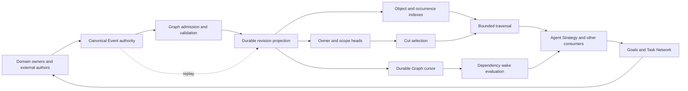

# Graph architecture after the engine spike

Status: proposed architecture, grounded in the isolated `graph-engine-fit-v1` comparison. The spike authorizes evidence and recommendations; it does not authorize adopting a storage replacement. Evergreen cognitive architecture remains unchanged pending acceptance.

## The problem and recommendation

Meld currently makes an immutable semantic product expensive again whenever a reader needs it. Graph admission is incremental, but revision selection and traversal reconstruct retained publication history on reads. Adding history therefore taxes unrelated consumers and repeated planner work. The engine spike shows that this is primarily a projection and access-pattern problem.

Prefer a maintained, versioned read projection on the existing Sled engine as the next implementation candidate. Do not write a database. The indexed prototype delegates durability, storage, indexing primitives and atomic batches to an existing engine; Meld owns the application keys and semantic contracts it would own with SQLite too. Keep the SQLite result as a credible alternative with concrete costs, not as a rejected category of technology.

Neither prototype is ready for production adoption. Native crash recovery is blocked by a predecessor runtime lease, and the spike retains full historical publication bodies beside its indexes. The first blocks durability qualification through the product; the second makes storage growth explicit rather than solved.

The [evidence closeout](../../../../../meld-eval/evidence/graph-engine-fit-v1/CLOSEOUT.md) contains command receipts, executable identities, repeated measurements, trace coverage and calibration failures. It is the authority for exact numbers. The [spike design](graph_engine_spike.md) defines the hypotheses and bounded comparison.

## What the evidence means

Both indexed arms remove history-driven query reconstruction while preserving the exercised Event-to-publication meaning. Indexed Sled is the smaller and faster adapter in this workload. SQLite supplies atomic index transactions and declarative secondary indexes, but still carries Meld's cut selection rules, breadth-first traversal, explicit occurrence records and the original Sled publication history. It has not demonstrated a reduction in total system maintenance here.

This does not establish that Sled is the best general Graph engine, that SQLite cannot outperform this adapter, or that a dedicated graph database cannot represent Meld. The SQLite arm issues per-address queries through the existing traversal algorithm. Batching or moving traversal into SQL would be another design with its own ordering, bounds and provenance obligations. This bounded spike deliberately did not become that implementation project.

The end-to-end journey improves much less than the history-sensitive query. It includes sensory scheduling, owner execution, Event transport, command serialization and harness observation. Removing one amplified read cost does not eliminate those costs. There are no model calls in this exercise and no new qualification of README quality.

## A Graph that is performant by default

Graph should transform admitted Events into a reusable, revision-aware query projection. Each owner remains responsible for meaning. Graph remains responsible for admission contracts, retained revision identity, source provenance, query bounds and the correctness of the projection cursor.

The three boxes beneath the projection are one Graph authority. They are derived views and metadata, not new semantic authors. Engine-specific code stays behind Graph's domain contract. There is no permanent runtime backend selector proposed by this spike.

| Concern | Work on admission or change | Work on read | Remaining obligation |
| --- | --- | --- | --- |
| Publication validity | Validate canonical identity, owner route, hints and coverage before exposing a revision | Trust an explicitly validated projection record; detect storage or schema failures | Specify validation across replay and migration; do not merely delete integrity checks |
| Current owner revision | Maintain owner, full scope, Event position and source-route lookup | Select an eligible head at the requested cut | A newer incomplete revision must not masquerade as an older complete one |
| Traversal | Maintain object addresses and both relation directions | Decode visited rows, preserve deterministic paths and explicit truncation | Bound preparation and hydration work as well as returned results |
| Historical reads | Retain immutable revision membership and provenance | Resolve the exact retained cut | Define retention and expiry for long-lived planner and external cuts |
| Wake and planner inputs | Record changed owner revisions and existing Event dependency positions | Reuse stable inputs when their dependencies have not changed | Do not change the meaning of freshness or suppress necessary reconciliation |
| Recovery | Make indexed data durable before advertising its cursor | Open a consistent generation and replay from the canonical Event authority | Prove crash and migration boundaries through native commands |
| Observability | Count admission, indexed rows and bytes, durable cursor movement and replay work | Count head lookups, visited rows, decoded bytes and query time | Preserve causal coverage and distinguish trace cost from production timing |

The performance contract should first be about scaling. An unchanged small query should not decode unrelated retained publication bodies. A graph status or currentness check should not silently reconstruct the graph. Traversal preparation should not require the entire selected world before respecting a small bound. These are useful acceptance conditions without inventing a production latency SLO. The local timing envelope is evidence, not a promised fleet-wide latency budget.

## Representation and retention

The current publications are full immutable snapshots. The prototypes additionally store each revision's objects and relations as queryable rows. Indexed Sled stores relation payloads twice for the two directions; SQLite stores a relation body once with two secondary indexes. Both also retain the complete publication body in Sled. The measured storage increase is the cost of that literal prototype design, not an unavoidable cost of indexing.

A successor should separate canonical publication identity, revision membership, immutable payload storage and adjacency keys. Unchanged payloads may be reused internally without changing an owner's full-publication contract. An adjacency entry should normally reference an occurrence body rather than copy it. A small head lookup should not decode an entire completeness membership list simply to discover which revision is current.

Do not discard full publication storage until the replacement can reconstruct or retrieve the intact product with proven provenance and recovery behavior. Event retention and Graph retention are related contracts, not interchangeable defaults. An Event consumer cursor says how far projection has advanced; it does not prove that an old external cut or in-flight plan no longer needs a revision. If a requested cut expires, return an explicit unavailable or expired result instead of treating missing retained data as qualified absence.

Content reuse and retention need not become a custom page manager, WAL, optimizer or transaction system. Use the storage engine for those responsibilities. If the application projection requires those facilities to be reinvented, reassess the engine instead of expanding the bespoke subsystem.

## Maintenance and engine fit

| Responsibility | Indexed Sled arm | SQLite arm | What remains Meld's responsibility |
| --- | --- | --- | --- |
| Storage and indexing primitives | Existing Sled tree, ordered keys and atomic batch | SQLite tables, secondary indexes, WAL and transactions | Schema and access paths tied to native queries |
| Semantic mapping | Hashed structured owner scopes and object addresses | Serialized structured addresses and explicit relation records | Opaque identifiers, occurrence multiplicity, qualifications and source Event meaning |
| Historical cut | Immutable rows selected by explicit Event position | Immutable rows selected by explicit Event position | Durable cut semantics beyond a process-local database snapshot |
| Traversal | Existing deterministic traversal with indexed reads | Same traversal with per-address SQL reads | Ordering, path lineage, bounds and typed absence |
| Recovery and migration | Derived index initialization plus existing Sled cursor ordering | SQLite index plus Sled history and cursor ordering | Versioned rebuild, cursor visibility and native lifecycle integration |
| Additional dependencies | None | rusqlite 0.40.2 and bundled SQLite 3.53.2 | Dependency updates and platform build qualification |
| Operating surface | Existing process and store | Existing process plus another database file and WAL | Diagnostics, backups, retention and support documentation |

Sled is itself an external database, already used by Meld. Choosing a small application projection does not mean owning its page manager or transaction engine. It also does not remove upstream maintenance risk: the [Sled repository](https://github.com/spacejam/sled) currently describes an in-progress rewrite and warns that its README differs from the main branch. This spike uses the locked 0.34.7 release; it does not qualify that release's long-term support. SQLite's maturity remains a reason to consider it independently of these query timings. Migrating only Graph would still leave the existing Sled dependencies in Events and other runtime stores. The near-term projection recommendation is therefore stronger than the long-term engine recommendation.

The private index modules are 207 lines for Sled and 266 for SQLite after formatting. Both remove 121 lines from the old traversal materialization path and introduce 56 lines that call the index. Counts describe this prototype boundary only; they are not an estimate of lifetime maintenance. SQLite's native transaction and index facilities are valuable, but this adapter still has two persistent stores to reconcile. A production design that places all Graph-derived state in SQLite could change that account and would need a new migration and recovery proof.

SQLite's signed integer sequence storage also rejects positions outside its supported integer range rather than silently wrapping. The current native Event position is unsigned. The exercised range is small; full-range representation is an unresolved mapping obligation. Neither arm qualifies large multi-owner workloads, temporal reasoning, branch retention, concurrent readers under heavy writes, graph compaction or arbitrary domain growth.

## Recovery is the immediate qualification gap

Every crash probe stops the configured process, then asks the native runtime to start again with the failpoint disabled. At both requested persistence boundaries, all three arms are refused because the previous instance still holds the `code-semantics.observation` lease for approximately 15 minutes. The failure occurs before the new runtime can establish readiness and demonstrate replay convergence.

This is a shared lifecycle flaw in the exercised recovery journey. It does not prove data loss, successful replay or a defect specific to either engine. The probes leave the stores intact and record the failed native command. They do not patch lease records, rewrite Graph cursors or bypass the runtime to manufacture a pass.

The next recovery slice should establish how a dead local owner can be fenced and its work reconciled through existing runtime authority. A restart must not steal work from a still-valid live owner. Durable instance identity, local ownership evidence and the existing lease protocol should determine takeover; do not replace that analysis with a shorter arbitrary timeout. Then rerun both crash boundaries and an exact retained cut through the normal commands. Power-loss durability, index rebuild interruption and migration remain separate tests.

## Proposed delivery boundary

First resolve and qualify native crash recovery. Then make one indexed projection the canonical Graph read path, with an explicit schema generation and a bounded migration from retained Events or validated publications. Retire repeated full-history reads from revision selection and traversal in that completed change. Preserve intact publication retrieval for existing consumers until its replacement has parity evidence.

Within that delivery, measure currentness and wake checks as consumers of the same projection, remove redundant query-local decodes where evidence warrants it, and account for payload duplication. Do not expand into a general query language or change domain publications merely to make a benchmark smaller. Follow with retention design before claiming unbounded continuous operation.

Acceptance should include native Event admission, byte-exact publication correspondence, cross-run input accounting, incomplete supersession, distinct qualified occurrences, retained cuts during change and after restart, crash replay, explicit expiry behavior when retention is introduced, and history-versus-live-size measurements. Keep the same command-first harness. The engine choice remains revisitable when a demonstrated contract or workload exceeds the small indexed projection.

The architecture circuit breaker was not triggered by an inability to represent Meld's semantics in either candidate. The recovery gate did prevent production qualification. That distinction supports completing this evidence spike while keeping adoption blocked on a concrete runtime gap.
